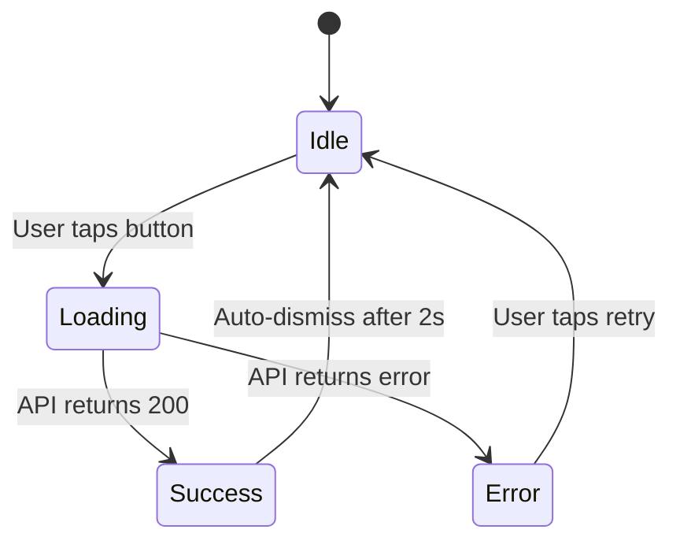

# Interaction Design Specification

## Purpose

Create precise, unambiguous interaction design documentation that enables engineers to implement designs pixel-perfectly without back-and-forth clarifications.

## Core Principles

1. **Precision over brevity** — Better to over-specify than leave room for interpretation
2. **States, not just screens** — Document every possible state and transition
3. **Edge cases upfront** — Identify and resolve edge cases during design, not during QA
4. **Platform-specific details** — iOS and Android have different interaction paradigms

## Specification Components

### 1. Component State Matrix

Document all possible states and their visual/interaction properties:

```
| State | Visual | Interaction | Accessibility | Transition |
|-------|--------|-------------|---------------|------------|
| Default | [description] | [behavior] | [VoiceOver label] | [from/to states] |
| Focused | [description] | [behavior] | [VoiceOver label] | [animation spec] |
| Pressed | [description] | [behavior] | [VoiceOver label] | [animation spec] |
| Loading | [description] | [behavior] | [VoiceOver label] | [animation spec] |
| Success | [description] | [behavior] | [VoiceOver label] | [animation spec] |
| Error | [description] | [behavior] | [VoiceOver label] | [animation spec] |
| Disabled | [description] | [behavior] | [VoiceOver label] | [animation spec] |
```

### 2. Gesture Vocabulary

Define all supported gestures with platform-specific behavior:

**iOS Gestures:**

- Tap: [action, haptic feedback, animation]
- Long press: [duration threshold, action, haptic feedback]
- Swipe: [direction, threshold, action, animation]
- Pan: [continuous feedback, snap points, completion threshold]
- Pinch: [scale limits, anchor point, haptic feedback]

**Android Gestures:**

- Tap: [action, ripple effect, haptic feedback]
- Long press: [duration threshold, action, haptic feedback]
- Swipe: [direction, threshold, action, animation]
- Drag: [continuous feedback, snap points, completion threshold]
- Pinch: [scale limits, anchor point, haptic feedback]

### 3. Animation Specifications

```
Animation: [Name]
Trigger: [User action or system event]
Duration: [milliseconds]
Curve: iOS [ease-in-out] / Android [Material standard]
Properties: [opacity, scale, position, rotation]
Haptic: [light/medium/heavy impact, success/warning/error notification]
```

### 4. Responsive Breakpoints

Define behavior across device sizes:

**iOS:**

- iPhone SE (320pt width): [layout adjustments]
- iPhone Standard (390pt width): [layout adjustments]
- iPhone Plus/Max (428pt width): [layout adjustments]
- iPad (768pt+ width): [layout adjustments]

**Android:**

- Compact (< 600dp): [layout adjustments]
- Medium (600-840dp): [layout adjustments]
- Expanded (> 840dp): [layout adjustments]

### 5. Edge Case Matrix

Document all edge cases and their handling:

```
| Scenario | Behavior | Fallback | Error Message |
|----------|----------|----------|---------------|
| Empty state | [UI treatment] | [action] | [message] |
| Loading failure | [UI treatment] | [retry action] | [message] |
| Network offline | [UI treatment] | [cached data] | [message] |
| Data too long | [truncation/scroll] | [expansion] | [message] |
| Permission denied | [UI treatment] | [settings link] | [message] |
```

## Deliverable Formats

### ASCII Wireframes (Rapid Iteration)

```
┌─────────────────────────────────┐
│  ← Back          Title      ⋮   │
├─────────────────────────────────┤
│                                 │
│  [Image Placeholder]            │
│  320x180                        │
│                                 │
│  Headline Text                  │
│  Body text goes here with       │
│  multiple lines...              │
│                                 │
│  ┌───────────────────────────┐ │
│  │   Primary Action Button   │ │
│  └───────────────────────────┘ │
│                                 │
│  Secondary Action Link          │
│                                 │
└─────────────────────────────────┘

Interactions:
- Tap image → full screen view
- Tap primary button → [action]
- Swipe left → next item
```

### Mid-Fidelity Flow Diagrams

Use Mermaid or similar for state flows:



### High-Fidelity Specifications

Figma frames with annotations:

- Dimensions (width, height, padding, margins)
- Typography (font, size, weight, line height, letter spacing)
- Colors (hex codes, semantic tokens)
- Spacing (exact pixel/point values)
- Shadows/elevation (iOS: shadow blur/offset; Android: elevation dp)
- Corner radius (exact values)
- Tap targets (minimum 44x44pt iOS, 48x48dp Android)

## Quality Checklist

- [ ] All states documented (default, focused, pressed, loading, success, error, disabled)
- [ ] All gestures specified with platform-specific behavior
- [ ] All animations defined (duration, curve, properties, haptics)
- [ ] Responsive breakpoints documented
- [ ] Edge cases identified and resolved
- [ ] Accessibility annotations (VoiceOver/TalkBack labels, Dynamic Type, contrast)
- [ ] Implementation notes for engineers

## Anti-Patterns

- **Ambiguous specs** — "Make it feel smooth" is not a spec; "200ms ease-out opacity transition" is
- **Missing states** — Don't forget loading, error, empty, and disabled states
- **Platform ignorance** — iOS and Android have different interaction patterns; respect them
- **Edge case blindness** — Don't assume happy path; document failures, empty states, and edge cases
