# Automated Recruitment Pipeline

## Overview

The Automated Recruitment Pipeline is a **nine-stage, fully automated talent acquisition system**. It replaces manual gate approvals with a rule-engine-driven workflow that executes end-to-end without human intervention at intermediate stages. Chief Officers configure competency bars, compensation bands, assessment parameters, and sourcing channels **once per quarter**. The system then runs autonomously: sourcing → screening → interviewing → vetting → background → offer → onboarding.

Leadership involvement is **outcome-only**. A single **HIRING OUTCOME REPORT** is delivered at Stage 9 for final review and approval. No manual approvals occur at Stages 1–8.

This pipeline is benchmarked against the hiring standards of **Google, Apple, Meta, Stripe, and Netflix**. The elite talent bar is non-negotiable.

---

## Elite Talent Bar — Universal Standards

All candidates must meet the following baseline. These standards are encoded as automated assessment thresholds.

| Standard                       | Threshold                                   | Auto-Reject If                        |
| ------------------------------ | ------------------------------------------- | ------------------------------------- |
| **Vetting Score**              | ≥ 4 on at least 4 of 5 dimensions (20-pt)   | < 4 on 3+ dimensions                  |
| **Red Flag Scan**              | PASS (zero flags)                           | Any single flag triggered             |
| **Role-Family Competency**     | ≥ 80th percentile on automated assessment   | < 60th percentile                     |
| **Leadership Signal**          | ≥ 4 for supervisor roles; ≥ 3 for IC roles  | Below threshold for assigned tier     |
| **Impact at Scale**            | ≥ 4 for all roles                           | < 4                                   |
| **Craft Depth**                | ≥ 4 for all roles                           | < 4                                   |
| **Tenure Stability**           | ≥ 18 months average across last 3 roles     | < 12 months at 2+ consecutive roles   |
| **Technical Interview**        | ≥ Strong Hire signal from simulated panel   | No Hire or Weak Hire                  |
| **System Design / Case Study** | ≥ 4/5 on solution quality + trade-off depth | < 3/5                                 |
| **Behavioral / Culture Add**   | ≥ 4/5 on structured behavioral assessment   | < 3/5 or any values misalignment flag |

**Auto-reject is final.** No human override. The system does not surface auto-rejected candidates to leadership.

---

## Defect Severity System (R0–R3)

Applied to recruitment process defects — not candidate defects. A recruitment defect is a failure in the pipeline's execution (e.g., assessment malfunction, data inconsistency, compliance gap).

| Level | Definition                                            | Action                            |
| ----- | ----------------------------------------------------- | --------------------------------- |
| R0    | Legal/compliance violation, discriminatory assessment | Non-negotiable halt + remediation |
| R1    | Assessment scoring error, candidate data corruption   | Non-negotiable halt + remediation |
| R2    | Notification delay, minor scheduling conflict         | CHRO decides auto-fix or escalate |
| R3    | Cosmetic report formatting, non-blocking metadata gap | Logged for next quarterly review  |

**Authority rule:** R0/R1 defects trigger automatic pipeline pause and CHRO escalation. R2/R3 defects are logged and auto-resolved where possible; unresolved R2 defects are included in the Stage 9 HIRING OUTCOME REPORT.

---

## Quarterly Configuration Cycle

Chief Officers review and update automation parameters **once per calendar quarter**. Changes take effect at the start of the next quarter. Mid-quarter changes require CHRO approval and affect only new pipeline entries (in-flight candidates complete under current rules).

### Configuration Owners

| Chief Officer | Configures                                                                                          |
| ------------- | --------------------------------------------------------------------------------------------------- |
| **CHRO**      | Role-family templates, sourcing channel priorities, compensation band ranges, diversity targets     |
| **CTO**       | Engineering competency assessments, technical interview rubrics, system design problem sets         |
| **CPO**       | Product management case studies, product sense assessment criteria, JTBD alignment rubrics          |
| **CDO**       | Design portfolio evaluation rubrics, design challenge parameters, accessibility assessment criteria |
| **CSO**       | Security clearance requirements, background check depth, data privacy compliance rules              |
| **CIO**       | Assessment platform integrity rules, data pipeline monitoring thresholds, audit trail retention     |
| **CTO-L**     | Translation/localization competency assessments, language proficiency benchmarks                    |

### Configuration Artifacts

| Artifact                   | Owner | Description                                                                                  |
| -------------------------- | ----- | -------------------------------------------------------------------------------------------- |
| `competency-bars.md`       | All   | Per-role-family minimum thresholds for each assessment dimension                             |
| `compensation-bands.md`    | CHRO  | Salary, equity, bonus ranges by role family and seniority level                              |
| `sourcing-channels.md`     | CHRO  | Prioritized list of sourcing channels with quality weights and budget allocation             |
| `role-family-templates/`   | CHRO  | One template per role family (engineering, product, design, data, translation, business)     |
| `assessment-parameters.md` | All   | Scoring weights, pass/fail thresholds, auto-reject triggers per assessment type              |
| `benchmark-calibration.md` | CHRO  | Mapping of internal assessment scores to external benchmarks (Google L5, Meta E5, Stripe L4) |
| `exception-rules.md`       | CHRO  | Definition of R0/R1 escalation triggers, edge case handling rules                            |

### Quarterly Review Process

| Week | Activity                                                        | Owner  |
| ---- | --------------------------------------------------------------- | ------ |
| Q-4  | CIO pulls pipeline performance data (yield rates, time-to-hire) | CIO    |
| Q-3  | Each Chief Officer proposes parameter changes                   | All    |
| Q-2  | CHRO consolidates proposals, resolves conflicts                 | CHRO   |
| Q-1  | CHRO publishes updated configuration package                    | CHRO   |
| Q-0  | New configuration activates; in-flight candidates unaffected    | System |

---

## Contractor Access Governance (System-Enforced)

Contractors are a distinct risk profile with automated access rules enforced by the system. These rules apply to all contractor engagements and are non-negotiable.

| Rule                      | Requirement                                                                                                            | System Enforcement                                                                                                                                                      |
| ------------------------- | ---------------------------------------------------------------------------------------------------------------------- | ----------------------------------------------------------------------------------------------------------------------------------------------------------------------- |
| **No L3 for Contractors** | No contractor may be classified as L3 Restricted. L3 roles require FTE status.                                         | System auto-rejects any contractor intake request with L3 clearance requirement. Exception requires CSO + CTO co-approval via R1 escalation.                            |
| **L2 Minimum Clearance**  | Contractors always receive L2 (Elevated) minimum clearance regardless of role scope.                                   | System auto-assigns L2 clearance at Stage 1 PSD generation for any contractor-tagged role. Cannot be downgraded without CSO written approval.                           |
| **Time-Bound Access**     | All contractor access is time-bound with an auto-revocation date set at intake.                                        | System sets auto-revocation date = contract end date + 7 days. IT systems enforce automatic deprovisioning. Manual extension requires CSO + Hiring Manager re-approval. |
| **Weekly Access Review**  | All contractor access to code repositories, production environments, and security tools is logged and reviewed weekly. | System generates weekly access review report for CSO office. Anomalies auto-flagged as R0 defects. Review log archived in audit trail.                                  |
| **COI Declaration**       | All contractors undergo automated conflict-of-interest declaration at Stage 6.                                         | System administers COI assessment concurrently with vetting gate. CSO-configured rules determine Acceptable / Acceptable with Mitigations / Disqualifying.              |
| **Immediate Revocation**  | All contractor access revoked within 24 hours of contract termination. Access audit within 48 hours.                   | System triggers immediate access revocation upon contract end date or early termination notice. CSO receives audit completion confirmation within 48 hours.             |

**Contractor classification:** At Stage 1, the system auto-classifies a role as contractor or FTE based on the intake request. Contractor-tagged roles follow the above rules automatically. Reclassification from contractor to FTE (or vice versa) requires CHRO approval and resets the SLA clock.

**Contractor hiring pipeline:** Contractors follow the same automated pipeline stages as FTE candidates. The only differences are: (1) clearance level auto-set to L2 minimum, (2) time-bound access provisioning at Stage 8, and (3) no 90-day G4 security posture review — instead, a contract-end access audit is triggered automatically.

---

## System Architecture

### Core Components

| Component                    | Purpose                                                                      | Technology Pattern                      |
| ---------------------------- | ---------------------------------------------------------------------------- | --------------------------------------- |
| **Rule Engine**              | Evaluates candidate data against configured rules at every stage             | Decision table + weighted scoring       |
| **Assessment Automation**    | Executes technical interviews, case studies, portfolio reviews, coding tests | AI-simulated panels + automated graders |
| **Sourcing Agent Network**   | Continuously scans prioritized channels for candidate signals                | Multi-source aggregation + ranking      |
| **Notification System**      | Sends status updates to candidates and internal stakeholders                 | Event-driven, async                     |
| **Audit Trail**              | Immutable log of every decision, score, and state transition                 | Append-only, cryptographically signed   |
| **Exception Handler**        | Detects R0/R1 defects, pauses pipeline, escalates to CHRO                    | Rule-based + anomaly detection          |
| **Background Check Service** | Automated verification of employment, education, criminal, references        | Third-party API integration             |
| **Offer Generator**          | Compiles compensation package based on bands, seniority, and market data     | Template + parameter injection          |

### Data Flow

```
Sourcing Agent Network → Candidate Profile → Screening Assessment → Interview Simulation → Vetting Gate → Background Check → Offer Generation → Onboarding Trigger
```

Every transition is logged. Every score is stored with the rule version that produced it. The audit trail is immutable and retrievable per candidate.

### Monitoring & Alerting

| Metric                        | Threshold                    | Alert Target     |
| ----------------------------- | ---------------------------- | ---------------- |
| Assessment processing time    | > 48 hours per stage         | CIO              |
| Scoring anomaly rate          | > 5% deviation from baseline | CIO + CHRO       |
| Candidate drop-off rate       | > 15% at any single stage    | CHRO             |
| R0/R1 defect count            | Any                          | CHRO (immediate) |
| Sourcing channel yield        | < 1% pass rate for 30 days   | CHRO             |
| Background check failure rate | > 10% of offers extended     | CSO + CHRO       |

---

## Internal Users Definition & Dashboard Access Control

"Internal Users" refers to any person with authenticated access to the recruitment platform. Access is granted based on organizational position, not individual name, ensuring continuity through role transitions. The system enforces role-based access control (RBAC) automatically.

### Internal User Access Matrix

| Internal User Category   | Org Chart Positions Mapped                                                           | Platform Role Mapping  | Data Scope                                                                                                                 | Dashboard View                                                                                                   |
| ------------------------ | ------------------------------------------------------------------------------------ | ---------------------- | -------------------------------------------------------------------------------------------------------------------------- | ---------------------------------------------------------------------------------------------------------------- |
| **C-Suite Executives**   | CTO, CPO, CDO, CSO, CIO, CTO-L                                                       | Executive Viewer       | Read-only on all requisitions; write on their configuration domain only                                                    | Executive summary: open roles, time-to-fill trends, elite bar pass rate, diversity metrics                       |
| **Department Heads**     | Head of R&D, Head of Design, Head of Product, Head of Security, Head of Localization | Department Owner       | Read/write on their department's requisitions; read on cross-department requisitions affecting their team                  | Department pipeline: roles by stage, candidate counts, SLA status, hiring forecasts                              |
| **CHRO Office**          | CHRO, HR Operations                                                                  | Platform Administrator | Full read/write on all recruitment data; infrastructure settings delegated to CIO                                          | Full pipeline view: all roles, all candidates, analytics, rejection code distributions, exceptions               |
| **Interview Panelists**  | N/A — AI panels replace human assessors in the automated pipeline                    | Assessor               | Not applicable                                                                                                             | Not applicable                                                                                                   |
| **Onboarding Personnel** | Onboarding Lead, Buddy, IT Provisioning                                              | Onboarding Coordinator | Read on hired candidate's PSD and onboarding checklist; write on onboarding checklist items                                | Onboarding dashboard: equipment status, account readiness, Day 1 schedule                                        |
| **CSO Office**           | CSO, Security Analysts                                                               | Security Auditor       | Read access on all security clearance data; write on clearance decisions, background check results, and COI determinations | Security dashboard: clearance statuses, COI declarations, access audit results, R0 defect log                    |
| **CIO Office**           | CIO, Platform Engineers                                                              | Infrastructure Auditor | Full read on platform audit logs; write on infrastructure settings, access control policies, and data governance rules     | Infrastructure dashboard: system health, assessment processing times, scoring anomaly rates, audit log integrity |
| **Candidates**           | External applicants and internal transfer candidates                                 | Candidate Portal User  | Read access on their own application status and submitted materials only; no access to internal notes or scores            | Candidate portal: application status, next steps, communication history                                          |

**Access provisioning:** Granted automatically upon role assignment in the org chart; revoked within 24 hours of role change or departure. The CIO Office maintains the access provisioning automation; the CHRO Office validates access accuracy quarterly.

**Dashboard access is read-only by default.** Write access is granted only to the configuration domain each Chief Officer owns per the Quarterly Configuration Cycle table. Cross-domain write access requires CHRO approval.

---

## Automated Stage Execution

### Stage 1: Role Intake → Position Specification

> **Responsible Producer:** System (configured by CHRO + role-requesting department head)
> **Artifacts In:** Role intake request (title, role family, seniority, team, justification)
> **Artifacts Out:** Position Specification Document (PSD)

**Execution:**

1. Department head submits role intake request through the system.
2. System validates request against quarterly headcount plan and org structure.
3. System auto-generates Position Specification Document (PSD) from the appropriate role-family template:
   - Required competencies with weights
   - Minimum seniority level
   - Compensation band (from quarterly configuration)
   - Sourcing channel priorities
   - Assessment battery (specific tests, interviews, case studies)
   - Success criteria for the role (90-day, 6-month, 12-month milestones)
4. System publishes PSD to the Sourcing Agent Network.

**Auto-Validation Rules:**

- [ ] Role exists in quarterly headcount plan
- [ ] Compensation band is within configured range
- [ ] Assessment battery matches role-family template
- [ ] No duplicate open positions for same role + team

**Gate Criteria:**

- [ ] PSD generated and validated
- [ ] Role published to sourcing network
- [ ] Audit log entry created

**No human approval required.** System proceeds to Stage 2 automatically.

---

### Stage 2: Sourcing → Candidate Pipeline

> **Responsible Producer:** Sourcing Agent Network
> **Artifacts In:** Position Specification Document
> **Artifacts Out:** Ranked candidate shortlist (top 50 per open role)

**Execution:**

1. Sourcing Agent Network scans all configured channels simultaneously:
   - Professional networks (LinkedIn, GitHub, Dribbble, Kaggle)
   - Conference speaker lists and publication databases
   - Referral intake portal
   - University alumni networks (target schools only, per CHRO config)
   - Competitor talent mapping (Google, Apple, Meta, Stripe, Netflix — ongoing watchlist)
2. Each candidate receives an initial **Sourcing Score** based on:
   - Role-family match (skills, experience, seniority signals)
   - Impact indicators (publications, open-source contributions, product launches, patents)
   - Tenure stability (average tenure at recent roles)
   - Sourcing channel quality weight (per quarterly config)
3. System ranks candidates and selects top 50 for Stage 3.

**Top-Tier Benchmarking — Sourcing:**

| Practice                          | Source Company | Encoding                                                                                    |
| --------------------------------- | -------------- | ------------------------------------------------------------------------------------------- |
| Competitor talent watchlist       | Google         | Automated monitoring of target companies' org charts via public data; alerts on departures  |
| Referral quality weighting        | Meta           | Referrals scored 1.5× multiplier if referrer is top-quartile performer                      |
| Open-source signal detection      | Stripe         | GitHub commit frequency, project star count, maintainer status factored into Sourcing Score |
| Conference speaker prioritization | Apple          | Speakers at top-tier conferences (WWDC, Google I/O, F8) receive priority screening          |
| Passive candidate engagement      | Netflix        | System sends personalized outreach to top-20 passive candidates before active sourcing      |

**Auto-Reject at Sourcing:**

- Candidates with < 12 months at 2+ consecutive roles (flagged, not yet rejected — full review at Stage 5)
- Candidates whose public profiles show no evidence of impact beyond their immediate team

**Gate Criteria:**

- [ ] Top 50 candidates ranked and scored
- [ ] Each candidate has a complete sourced profile
- [ ] Audit log entry created

**No human approval required.** System proceeds to Stage 3 automatically.

---

### Stage 3: Automated Screening → Assessment Battery Assignment

> **Responsible Producer:** System (Rule Engine)
> **Artifacts In:** Ranked candidate shortlist
> **Artifacts Out:** Screening results + assigned assessment battery per candidate

**Execution:**

1. System runs **Automated Screening Assessment** on all 50 candidates:
   - Resume parsing and competency extraction (NLP-based, validated against role-family template)
   - Public signal aggregation (GitHub, publications, patents, talks, awards)
   - Initial **Craft Depth** estimate based on technical artifacts
2. Candidates scoring below the **60th percentile** on the screening assessment are auto-rejected.
3. Remaining candidates are assigned a role-specific **Assessment Battery**:
   - **Engineering:** Coding challenge (2 problems, 90 min), system design prompt (async, 48-hour window), technical deep-dive interview (simulated panel)
   - **Product:** Product case study (async, 48-hour window), product sense interview (simulated), metrics/analytical reasoning test
   - **Design:** Portfolio review (automated rubric scoring), 3-phase design challenge (phased delivery over 144 hours total — see § Design Challenge — 3-Phase Assessment), design critique interview (simulated)
   - **Data/ML:** Statistical reasoning test, ML system design prompt, data pipeline challenge
   - **Translation:** Translation quality test (BLEU/TER scoring), localization engineering challenge, style guide compliance test
   - **Security:** OWASP MASVS competency exam (60 min), threat modeling exercise (90 min), vulnerability identification (45 min), incident response scenario (30 min) — see § Security Role Assessment (CSO)
   - **Business:** Case study analysis, financial modeling test, strategic reasoning interview

**Gate Criteria:**

- [ ] All 50 candidates screened
- [ ] Auto-rejected candidates logged with reason
- [ ] Assessment batteries assigned to passing candidates
- [ ] Audit log entry created

**No human approval required.** System proceeds to Stage 4 automatically.

---

### Stage 4: Interview Simulation → Scored Assessments

> **Responsible Producer:** Assessment Automation Engine
> **Artifacts In:** Assigned assessment batteries
> **Artifacts Out:** Scored assessment results per candidate

**Execution:**

1. **Technical / Case Study Assessments (Automated):**
   - Coding challenges: Executed in sandboxed environment, graded by automated test suite + complexity analysis
   - System design: Evaluated by AI panel against rubric (scalability, trade-offs, completeness, clarity)
   - Product case studies: Evaluated against structured rubric (user insight, prioritization, metrics, execution plan)
   - Design challenges: Evaluated via 3-phase assessment (see § Design Challenge — 3-Phase Assessment). Phase 1 (problem framing + research plan, 30% weight), Phase 2 (design exploration + rationale, 30% weight), Phase 3 (final deliverable + IDS-conformance output, 40% weight). Each phase has explicit pass thresholds and auto-reject conditions.

2. **Simulated Panel Interviews (AI-driven):**
   - Each candidate undergoes a 45-minute simulated interview with an AI panel configured to role-family standards
   - Panel asks signal questions from the Interview Simulation Protocol
   - Responses are scored across all five vetting dimensions (Impact at Scale, Craft Depth, Leadership Signal, Standards Signal, Red Flag Scan)
   - Panel generates a written assessment summary

3. **Behavioral / Culture Add Assessment:**
   - Structured behavioral interview using STAR method
   - Scored against company values framework (configured quarterly by CHRO)
   - Any values misalignment flag triggers manual review at Stage 9 (not auto-reject — edge case)

**Scoring Integration:**

All assessment scores feed into the candidate's **Composite Score**:

| Assessment Component       | Weight (Engineering) | Weight (Product) | Weight (Design)   |
| -------------------------- | -------------------- | ---------------- | ----------------- |
| Design Challenge — Phase 1 | —                    | —                | 7.5% (30% of 25%) |
| Design Challenge — Phase 2 | —                    | —                | 7.5% (30% of 25%) |
| Design Challenge — Phase 3 | —                    | —                | 10% (40% of 25%)  |
| Simulated Panel Interview  | 30%                  | 30%              | 30%               |
| Behavioral / Culture Add   | 15%                  | 20%              | 20%               |
| Portfolio / Public Signals | 25%                  | 25%              | 25%               |

Candidates with a Composite Score below the **80th percentile** are auto-rejected.

**Top-Tier Benchmarking — Assessment:**

| Practice                              | Source Company | Encoding                                                                                       |
| ------------------------------------- | -------------- | ---------------------------------------------------------------------------------------------- |
| No brain teasers, real work samples   | Google         | All assessments use realistic job tasks, not abstract puzzles                                  |
| Structured interviews, same questions | Apple          | Every candidate receives identical signal questions; scoring rubric is fixed per role          |
| Work sample over pedigree             | Stripe         | Sourcing Score is discounted if assessment scores are low; school/brand name carries no weight |
| Bar raiser program                    | Amazon         | One simulated panelist is configured as "Bar Raiser" with veto authority on auto-advance       |
| Debrief within 24 hours               | Meta           | All assessment scores are finalized within 24 hours of completion; no score drift              |

**Gate Criteria:**

- [ ] All assigned assessments completed
- [ ] Composite Scores calculated
- [ ] Candidates below 80th percentile auto-rejected with reason logged
- [ ] Audit log entry created

**No human approval required.** System proceeds to Stage 5 automatically.

---

### Stage 5: Elite Vetting Gate → Pass/Fail Decision

> **Responsible Producer:** System (Elite Vetting Gate — `vet-candidate.md`)
> **Artifacts In:** Scored assessment results, candidate profiles
> **Artifacts Out:** Vetting result (PASS/FAIL) per candidate

**Execution:**

1. System applies the **Elite Candidate Vetting Gate** to every remaining candidate:

| Dimension         | Auto-Scored From                                   | Pass Threshold                 |
| ----------------- | -------------------------------------------------- | ------------------------------ |
| Impact at Scale   | Assessment responses, public signals, track record | ≥ 4/5                          |
| Craft Depth       | Technical assessment depth, portfolio quality      | ≥ 4/5                          |
| Leadership Signal | Behavioral interview, reference signals            | ≥ 4/5 (supervisor), ≥ 3/5 (IC) |
| Standards Signal  | Code quality, design critique, case rigor          | ≥ 4/5                          |
| Red Flag Scan     | Automated checks (see below)                       | PASS (zero flags)              |

2. **Red Flag Scan — Automated Checks:**

| Red Flag                                       | Detection Method                                        |
| ---------------------------------------------- | ------------------------------------------------------- |
| Job tenure < 12 months at 2+ consecutive roles | Employment history cross-reference                      |
| Impact claims not attributable to candidate    | Cross-reference with public records, team size data     |
| Title inflation                                | Compare claimed title vs. team size/scope evidence      |
| Vague answers to specific questions            | NLP analysis of interview responses (specificity score) |
| Speaks only about team, never personal drive   | NLP analysis of interview responses (agency detection)  |

3. **Pass Criteria:** ≥ 4 on at least 4 of 5 dimensions AND Red Flag Scan = PASS.

4. Candidates who fail are **auto-rejected**. The system logs the exact failure reason.

5. Candidates who pass advance to Stage 6.

**Gate Criteria:**

- [ ] All remaining candidates vetted
- [ ] Vetting scores recorded per candidate
- [ ] Failed candidates auto-rejected with specific reason logged
- [ ] Audit log entry created

**No human approval required for automated pipeline stages.** System proceeds to Stage 6 automatically for L0 roles and non-design role families. For L1+ design roles, system triggers ASG-02 Design Leadership Review before Stage 6.

---

### Design Challenge — 3-Phase Assessment (Design Role Family)

The design challenge is a **multi-phase, weighted assessment** replacing the previous single-deliverable model. Each phase evaluates distinct competencies and carries explicit weight. Candidates must complete all three phases sequentially; failure to submit any phase results in auto-rejection.

#### Phase 1: Problem Framing + Research Plan (24 hours, 30% weight)

| Criterion                  | Description                                                                                            | Pass Threshold |
| -------------------------- | ------------------------------------------------------------------------------------------------------ | -------------- |
| **Problem Deconstruction** | Candidate accurately identifies the core user problem, constraints, and success metrics from the brief | ≥ 4/5          |
| **Research Plan Quality**  | Proposed research methodology is appropriate, feasible, and addresses key unknowns                     | ≥ 4/5          |
| **Assumption Mapping**     | All implicit assumptions are surfaced and prioritized by risk                                          | ≥ 3/5          |
| **Scope Discipline**       | Candidate resists solutioneering; stays in problem space                                               | ≥ 4/5          |

**Deliverables:** Problem statement (≤ 200 words), assumption map (≥ 5 assumptions), research plan (≤ 2 pages), success metric definitions (≥ 3).

**Auto-reject:** Candidate jumps directly to visual solutions without problem framing; research plan is generic/template-driven with no problem-specific adaptation.

#### Phase 2: Design Exploration + Rationale (48 hours from Phase 1 submission, 30% weight)

| Criterion                  | Description                                                                                       | Pass Threshold                      |
| -------------------------- | ------------------------------------------------------------------------------------------------- | ----------------------------------- |
| **Alternative Generation** | Candidate produces ≥ 2 distinct design approaches with clear trade-off analysis                   | ≥ 2 alternatives, each scored ≥ 3/5 |
| **Design Rationale**       | Each alternative is justified with user evidence, platform conventions, and business constraints  | ≥ 4/5                               |
| **Progressive Fidelity**   | Exploration moves from low-fidelity structure to mid-fidelity interaction; not skipping to pixels | ≥ 4/5                               |
| **Edge Case Awareness**    | Candidate identifies and designs for ≥ 3 non-happy-path scenarios                                 | ≥ 3 scenarios addressed             |

**Deliverables:** ≥ 2 design alternatives with annotations, trade-off matrix, rationale narrative (≤ 500 words per alternative), edge case matrix.

**Auto-reject:** Candidate produces only one alternative; no rationale provided; alternatives are superficial variations of the same approach.

#### Phase 3: Final Deliverable + IDS-Conformance Output (72 hours from Phase 2 submission, 40% weight)

| Criterion                          | Description                                                                                                                                  | Pass Threshold |
| ---------------------------------- | -------------------------------------------------------------------------------------------------------------------------------------------- | -------------- |
| **Visual Craft**                   | Pixel-level precision, consistent design token usage, typographic hierarchy, spacing system                                                  | ≥ 4/5          |
| **Platform Convention Compliance** | iOS HIG / Android Material Design conventions respected where applicable                                                                     | ≥ 4/5          |
| **Accessibility (WCAG 2.1 AA)**    | Color contrast ≥ 4.5:1, touch targets ≥ 44dp, screen reader labels, focus order logical                                                      | ≥ 4/5          |
| **Interaction Logic**              | State transitions, error states, loading states, empty states all specified                                                                  | ≥ 4/5          |
| **IDS-Conformance Output**         | Deliverable includes component specifications, state diagrams, gesture vocabulary, and responsive breakpoint annotations matching IDS format | ≥ 4/5          |

**Deliverables:** High-fidelity mockups (all key screens), IDS-conformance spec document (component specs, state diagrams, edge case matrix, responsive breakpoints, accessibility annotations), design token mapping.

**Auto-reject:** Accessibility violations (contrast < 3:1 on any text); missing error/empty/loading states; no IDS-conformance annotations; platform convention violations that would confuse users.

#### Scoring Integration

Phase scores are weighted and combined into the **Design Challenge Composite Score**:

| Phase                       | Weight   | Minimum Pass | Auto-Reject Condition                             |
| --------------------------- | -------- | ------------ | ------------------------------------------------- |
| Phase 1: Problem Framing    | 30%      | ≥ 3.5/5      | < 2.5/5 on any single criterion                   |
| Phase 2: Design Exploration | 30%      | ≥ 3.5/5      | < 2 alternatives OR < 2.5/5 on rationale          |
| Phase 3: Final Deliverable  | 40%      | ≥ 3.5/5      | Any accessibility violation OR missing IDS output |
| **Composite**               | **100%** | **≥ 3.5/5**  | **< 3.0/5 overall**                               |

The Design Challenge Composite Score replaces the "Technical / Case Study" line item in the role-family Composite Score table (25% weight for Design roles).

**Previous model (deprecated):** Single 72-hour deliverable weighted at effectively 100% of case study score. This model failed to evaluate problem-framing rigor, penalized exploration, and rewarded candidates who rushed to pixels without research discipline. The 3-phase model ensures sequential competency validation — a candidate who produces polished final work but cannot frame a problem or explore alternatives is rejected.

---

### ASG-02: Design Leadership Review (R1 Exception Trigger)

**Placement:** Between Stage 5 (Elite Vetting Gate) and Stage 6 (Background Verification).

**Trigger Condition:** This review is **mandatory for all L1+ design roles** (Senior Designer, Staff Designer, Principal Designer, Design Lead, Head of Design, CDO). It is **waived for L0 design roles** (Junior Designer, Design Intern).

**Rationale:** Automated assessment cannot evaluate the qualitative dimensions of design leadership — problem framing maturity, design rationale articulation, craft trajectory, and the ability to think in real time under ambiguity. These require human expert evaluation by a practicing design leader.

#### Review Structure (75 minutes, time-boxed)

| Component                    | Duration | Evaluator                                  | Focus Areas                                                                                                                                                                                   |
| ---------------------------- | -------- | ------------------------------------------ | --------------------------------------------------------------------------------------------------------------------------------------------------------------------------------------------- |
| **Portfolio Deep-Dive**      | 30 min   | CDO (or Head of Design if CDO unavailable) | Problem framing quality, design rationale depth, craft trajectory across projects, impact measurement, iteration discipline                                                                   |
| **Live Whiteboard Exercise** | 30 min   | CDO (or Head of Design)                    | Real-time problem-solving process, ambiguity tolerance, stakeholder communication, trade-off articulation, systems thinking                                                                   |
| **Craft Critique**           | 15 min   | CDO (or Head of Design)                    | Pixel-level critique of a real product screen (provided at session start), identification of interaction flaws, accessibility gaps, platform convention violations, and improvement proposals |

#### Portfolio Deep-Dive (30 min)

| Dimension                | Evaluation Criteria                                                                                                   | Pass Threshold |
| ------------------------ | --------------------------------------------------------------------------------------------------------------------- | -------------- |
| **Problem Framing**      | Candidate articulates the problem before the solution; identifies constraints, user needs, and success metrics        | ≥ 4/5          |
| **Design Rationale**     | Every design decision is justified with evidence (research, data, platform convention, or strategic constraint)       | ≥ 4/5          |
| **Craft Trajectory**     | Evidence of skill growth across projects; increasing scope, complexity, and impact over time                          | ≥ 4/5          |
| **Impact Measurement**   | Candidate connects design work to measurable outcomes (retention, conversion, NPS, engagement)                        | ≥ 3/5          |
| **Iteration Discipline** | Candidate demonstrates willingness to kill own ideas based on evidence; shows iteration cycles, not just final states | ≥ 4/5          |

#### Live Whiteboard Exercise (30 min)

The candidate receives an ambiguous problem statement (e.g., _"Design a way for users to manage shared subscriptions across a household on mobile"_). No solution is prescribed. The evaluator observes:

| Dimension                     | What to Observe                                                                             | Pass Threshold |
| ----------------------------- | ------------------------------------------------------------------------------------------- | -------------- |
| **Problem Structuring**       | Frameworks used, assumptions surfaced, questions asked before solutioning                   | ≥ 4/5          |
| **Ambiguity Tolerance**       | Comfort with incomplete information; ability to proceed without perfect data                | ≥ 4/5          |
| **Stakeholder Communication** | Ability to explain design reasoning to non-design audience; handles pushback constructively | ≥ 3/5          |
| **Trade-off Articulation**    | Explicitly names trade-offs (speed vs. quality, user need vs. business constraint)          | ≥ 4/5          |
| **Systems Thinking**          | Considers downstream implications, edge cases, platform conventions, and accessibility      | ≥ 4/5          |

**Whiteboard Exercise Protocol:**

1. **Minutes 0–5:** Candidate reads brief, asks clarifying questions. Evaluator answers only factual questions; does not provide direction.
2. **Minutes 5–25:** Candidate works the problem on whiteboard (physical or digital). Evaluator observes silently, taking notes on process (not outcome).
3. **Minutes 25–30:** Evaluator introduces one constraint (e.g., _"Engineering says this can only be done in 2 weeks"_). Candidate must adapt.
4. **Minutes 30:** Evaluator stops exercise. Scores are recorded independently.

#### Craft Critique (15 min)

Candidate is shown a real product screen (not from the candidate's own work) and asked to critique it at pixel level.

| Dimension                | Evaluation Criteria                                                      | Pass Threshold |
| ------------------------ | ------------------------------------------------------------------------ | -------------- |
| **Visual Precision**     | Identifies spacing, alignment, typographic, and color issues             | ≥ 3/5          |
| **Interaction Logic**    | Identifies state gaps, gesture conflicts, navigation ambiguities         | ≥ 3/5          |
| **Accessibility**        | Identifies contrast, touch target, screen reader, and focus order issues | ≥ 3/5          |
| **Platform Conventions** | Identifies violations of iOS HIG or Android Material Design              | ≥ 3/5          |
| **Improvement Quality**  | Proposed improvements are specific, actionable, and user-justified       | ≥ 4/5          |

**Screen Selection:** The evaluator selects a screen from a shipping product known to have subtle design issues (not obvious errors). Screens are rotated quarterly to prevent candidate prep. The screen must include: at least one accessibility violation, one platform convention deviation, one interaction state gap, and one visual precision issue.

#### Outcome and Audit Trail

| Outcome  | Criteria                                                       | Action                                 |
| -------- | -------------------------------------------------------------- | -------------------------------------- |
| **Pass** | ≥ 4/5 on ≥ 4 of 5 dimensions per component; no dimension < 3/5 | Candidate advances to Stage 6          |
| **Fail** | < 4/5 on 2+ dimensions in any component; any dimension < 3/5   | Candidate auto-rejected; reason logged |

**Dimension scores are logged to the immutable audit trail** with the following format:

| Field                                | Example Value                   |
| ------------------------------------ | ------------------------------- |
| Timestamp                            | 2026-04-09T14:32:00Z            |
| Review Type                          | ASG-02_DESIGN_LEADERSHIP_REVIEW |
| Candidate ID                         | CAND-2026-0847                  |
| Role Applied For                     | Senior Mobile Designer (L2)     |
| Evaluator                            | Yuki Tanaka-Chen (CDO)          |
| Portfolio: Problem Framing           | 4/5                             |
| Portfolio: Design Rationale          | 5/5                             |
| Portfolio: Craft Trajectory          | 4/5                             |
| Portfolio: Impact Measurement        | 3/5                             |
| Portfolio: Iteration Discipline      | 4/5                             |
| Whiteboard: Problem Structuring      | 4/5                             |
| Whiteboard: Ambiguity Tolerance      | 5/5                             |
| Whiteboard: Stakeholder Comm         | 3/5                             |
| Whiteboard: Trade-off Articulation   | 4/5                             |
| Whiteboard: Systems Thinking         | 4/5                             |
| Craft Critique: Visual Precision     | 4/5                             |
| Craft Critique: Interaction Logic    | 3/5                             |
| Craft Critique: Accessibility        | 4/5                             |
| Craft Critique: Platform Conventions | 4/5                             |
| Craft Critique: Improvement Quality  | 5/5                             |
| Overall Outcome                      | PASS                            |
| Evaluator Signature                  | ed25519:y1x2w3...               |

**L0 Waiver:** For L0 design roles (Junior Designer, Design Intern), this review is **automatically waived**. The automated portfolio rubric (Stage 4) and vetting gate (Stage 5) are sufficient. The system skips this review and proceeds directly to Stage 6.

**Scheduling:** The system auto-schedules the review within 5 business days of Stage 5 PASS. If CDO is unavailable, Head of Design is the designated delegate. If neither is available within 5 business days, the review is held (R2 defect) and included in the Stage 9 report.

**Exception Classification:** This review is classified as an **R1 exception trigger** — if the review cannot be completed (evaluator unavailable after 10 business days, candidate non-responsive), the pipeline pauses for that candidate and CHRO is notified. The review cannot be substituted with automated assessment.

---

### Design Team Composition Analysis (Culture Add Assessment)

**Placement:** Integrated into Stage 4 (Interview Simulation) for design role candidates.

**Purpose:** Evaluate candidates not just on individual competency but on their contribution to the **overall design team composition**. A strong candidate who duplicates existing team strengths is less valuable than a strong candidate who fills a critical gap. This ensures hiring decisions expand collective capability rather than replicate it.

**Conducted By:** Head of Design (L0–L2 roles) or CDO (L3+ roles). Automated team composition mapping is performed by the system; human scoring is applied by the design leader.

#### Current Team Strength Mapping

The system maintains a **Design Team Skills Inventory** updated quarterly by the CDO:

| Competency Area              | Definition                                                                                               | Current Team Coverage                |
| ---------------------------- | -------------------------------------------------------------------------------------------------------- | ------------------------------------ |
| **Visual Design**            | Typography, color theory, composition, brand consistency, iconography, visual hierarchy                  | Assessed per team member (1–5 scale) |
| **Interaction Design**       | Flow architecture, gesture vocabularies, state management, micro-interactions, navigation patterns       | Assessed per team member (1–5 scale) |
| **User Research**            | Usability testing, interview facilitation, survey design, data synthesis, JTBD mapping                   | Assessed per team member (1–5 scale) |
| **Design Systems**           | Component architecture, design tokens, documentation, cross-platform consistency, contribution workflows | Assessed per team member (1–5 scale) |
| **Accessibility**            | WCAG 2.1 AA/AAA, assistive technology testing, inclusive design patterns, cognitive accessibility        | Assessed per team member (1–5 scale) |
| **Motion Design**            | Animation principles, prototyping, transition design, performance-aware motion, Lottie/After Effects     | Assessed per team member (1–5 scale) |
| **UX Copy / Content Design** | Microcopy, tone of voice, localization awareness, content strategy, information architecture             | Assessed per team member (1–5 scale) |

#### Gap Identification

The system computes team-level gaps from the Skills Inventory:

| Gap Type          | Definition                                                                  | System Action                                                                                                           |
| ----------------- | --------------------------------------------------------------------------- | ----------------------------------------------------------------------------------------------------------------------- |
| **Critical Gap**  | Competency area where no team member scores ≥ 3/5                           | Flagged for priority hiring; candidates with demonstrated strength in this area receive +15% bonus to Culture Add score |
| **Moderate Gap**  | Competency area where team average is < 3.5/5                               | Flagged for development; candidates with demonstrated strength receive +8% bonus                                        |
| **Saturation**    | Competency area where ≥ 3 team members score ≥ 4/5                          | No bonus applied; candidates evaluated on other dimensions                                                              |
| **Emerging Need** | Competency area flagged by CDO as strategically important in next 12 months | Candidates with demonstrated strength receive +10% bonus                                                                |

#### Candidate Scoring on Gap-Filling

| Dimension                    | Evaluation Method                                                                                                                          | Weight |
| ---------------------------- | ------------------------------------------------------------------------------------------------------------------------------------------ | ------ |
| **Gap-Filling Strength**     | Candidate's demonstrated competency in team's critical/moderate gaps (assessed via portfolio, challenge, and interview evidence)           | 40%    |
| **Perspective Diversity**    | Evidence of non-traditional background, cross-domain expertise, or unique problem-solving approach that expands team's collective thinking | 30%    |
| **Collaboration Multiplier** | Evidence of elevating others' work (mentorship, critique culture, design ops contribution, cross-functional collaboration)                 | 20%    |
| **Growth Trajectory**        | Evidence of skill expansion into adjacent competencies; candidate's learning velocity and adaptability                                     | 10%    |

| Score Range | Interpretation                                                                                                                   |
| ----------- | -------------------------------------------------------------------------------------------------------------------------------- |
| ≥ 4.5/5     | Exceptional culture add — candidate fills critical gaps and brings unique perspective                                            |
| 3.5–4.4/5   | Strong culture add — candidate meaningfully expands team capabilities                                                            |
| 2.5–3.4/5   | Neutral culture add — candidate neither fills gaps nor duplicates strengths excessively                                          |
| < 2.5/5     | Culture redundancy — candidate duplicates existing strengths without filling gaps; auto-reject if no other dimension compensates |

**Perspective Diversity Scoring Criteria:**

| Signal                                                                            | Positive Indicator                                                                | Not Scored (Anti-Bias)                           |
| --------------------------------------------------------------------------------- | --------------------------------------------------------------------------------- | ------------------------------------------------ |
| Cross-industry experience                                                         | Worked in ≥ 2 distinct industries (e.g., healthcare + consumer tech)              | —                                                |
| Non-linear career path                                                            | Career progression includes role changes, sabbaticals, or self-taught transitions | —                                                |
| Open-source / community                                                           | Active contributions to design tools, OSS documentation, or community education   | —                                                |
| Accessibility advocacy                                                            | Published work, talks, or shipped products with a11y as primary focus             | —                                                |
| Platform diversity                                                                | Deep experience across iOS, Android, web, and emerging platforms                  | —                                                |
| Research methodology breadth                                                      | Qualified in both qualitative and quantitative methods; mixed-methods practice    | —                                                |
| **Gender, ethnicity, nationality, age, disability, religion, sexual orientation** | —                                                                                 | **Never scored. Never tracked. Never weighted.** |

**Integration with Composite Score:** The Culture Add score from this analysis feeds into the "Behavioral / Culture Add" line item in the Composite Score table. For design roles, this analysis replaces the generic behavioral assessment with a team-specific, gap-aware evaluation.

**Senior Role Protocol:** For L3+ design roles (Staff, Principal, Lead, Head), the CDO personally conducts the gap analysis and provides a written justification (≤ 500 words) for the score. This justification is archived in the audit trail and is referenced during the ASG-02 Design Leadership Review.

**Quarterly Refresh:** The Design Team Skills Inventory is updated at each quarterly configuration cycle. Changes to team composition (new hires, departures, internal transfers, skill development) are reflected in the next cycle's gap analysis. The CDO signs off on the inventory before it activates.

### Tiered Engineering Assessment (Engineering Role Family)

The engineering role family uses a **tiered assessment model** calibrated to seniority level. Lower tiers are fully automated; higher tiers introduce human expert evaluation. This ensures assessment cost scales with hiring impact — a junior hire is validated efficiently, while a senior/staff hire receives the scrutiny appropriate to their architectural influence.

#### Tier Definitions

| Tier      | Seniority Range                                                            | Assessment Model                                                           | Human Panel? | R1 Exception?                  |
| --------- | -------------------------------------------------------------------------- | -------------------------------------------------------------------------- | ------------ | ------------------------------ |
| **L0–L1** | Junior Engineer, Associate Engineer, Engineering Intern                    | Fully automated — coding challenge + automated deep assessment             | No           | No                             |
| **L2**    | Mid-Level Engineer, Software Engineer                                      | Automated filter + automated deep assessment with code review exercise     | No           | No                             |
| **L3+**   | Senior Engineer, Staff Engineer, Principal Engineer, Engineering Lead, CTO | Automated filter + **HUMAN engineering panel** (CTO or Software Architect) | Yes          | **Yes — R1 exception trigger** |

#### L0–L1 (Junior): Fully Automated

Junior candidates are assessed entirely by the automated pipeline. No human intervention is required at any stage.

| Component                         | Format                                                                                            | Duration        | Scoring                                                                                                         |
| --------------------------------- | ------------------------------------------------------------------------------------------------- | --------------- | --------------------------------------------------------------------------------------------------------------- |
| **Coding Challenge**              | 2 problems, 90 min, sandboxed environment                                                         | 90 min          | Automated test suite + complexity analysis (time/space)                                                         |
| **Automated Deep Assessment**     | NLP analysis of code structure, naming clarity, modularity, error handling, test coverage         | Post-submission | Rule engine scores 5 dimensions: Code Clarity, Modularity, Error Handling, Test Quality, Algorithmic Efficiency |
| **Technical Deep-Dive Interview** | Simulated AI panel, signal questions on fundamentals (data structures, algorithms, system basics) | 30 min          | AI panel scores response accuracy, reasoning clarity, and knowledge depth                                       |

**Pass Criteria:** Composite Score ≥ 80th percentile AND all 5 deep assessment dimensions ≥ 3/5.

**Auto-Reject:** Composite Score < 60th percentile OR any deep assessment dimension < 2/5.

**Rationale:** Junior roles are evaluated on fundamentals, learning velocity, and code quality hygiene. The automated grader is calibrated against a benchmark set of 500+ junior-level submissions from Google, Stripe, and Meta internship pipelines. Candidates who demonstrate clean, well-structured code with appropriate error handling and test coverage pass — regardless of algorithmic cleverness.

#### L2 (Mid): Automated Filter + Automated Deep Assessment with Code Review Exercise

Mid-level candidates undergo the same automated coding challenge and deep assessment as L0–L1, plus an additional **Code Review Exercise** that evaluates their ability to read, critique, and improve existing code — a core competency for engineers who are expected to contribute to team code quality.

| Component                     | Format                                                                                                                                                                                                                                                                                                                                                            | Duration        | Scoring                                                                                                                                                                                                                                            |
| ----------------------------- | ----------------------------------------------------------------------------------------------------------------------------------------------------------------------------------------------------------------------------------------------------------------------------------------------------------------------------------------------------------------- | --------------- | -------------------------------------------------------------------------------------------------------------------------------------------------------------------------------------------------------------------------------------------------- |
| **Coding Challenge**          | 2 problems, 90 min (same as L0–L1, difficulty adjusted upward)                                                                                                                                                                                                                                                                                                    | 90 min          | Automated test suite + complexity analysis                                                                                                                                                                                                         |
| **Automated Deep Assessment** | Same 5 dimensions as L0–L1                                                                                                                                                                                                                                                                                                                                        | Post-submission | Rule engine scores; threshold raised to ≥ 3.5/5 per dimension                                                                                                                                                                                      |
| **Code Review Exercise**      | Candidate receives a PR containing a realistic feature implementation with **known defects** — 2 P1 bugs (logic errors causing incorrect behavior), 3 P2 defects (missing edge case handling, suboptimal patterns), and 2 architectural issues (tight coupling, missing abstraction layer). Candidate must identify, classify, and propose fixes for all defects. | 60 min          | Scored on: defect detection rate (how many of the 7 known issues found), classification accuracy (P1 vs P2 vs P3), fix quality (proposed solution is correct and minimal), review communication (comments are clear, constructive, and actionable) |

**Code Review Exercise — Known Defect Inventory (undisclosed to candidate):**

| Defect ID | Type          | Severity            | Description                                                                                                        |
| --------- | ------------- | ------------------- | ------------------------------------------------------------------------------------------------------------------ |
| BUG-001   | P1            | Logic error         | Null pointer dereference in authentication flow — app crashes on first login attempt with missing token            |
| BUG-002   | P1            | Logic error         | Race condition in concurrent data fetch — stale data displayed when network response arrives out of order          |
| BUG-003   | P2            | Missing edge case   | No retry logic for transient network failures — user sees permanent error on brief connectivity loss               |
| BUG-004   | P2            | Suboptimal pattern  | Synchronous database query on main thread — causes UI jank on large datasets                                       |
| BUG-005   | P2            | Missing edge case   | No input validation on user-provided search query — empty or whitespace-only queries trigger unnecessary API calls |
| ARCH-001  | Architectural | Tight coupling      | UI layer directly instantiates repository class — violates dependency inversion, prevents testing                  |
| ARCH-002  | Architectural | Missing abstraction | Platform-specific code (file system access) embedded in shared business logic — breaks cross-platform portability  |

**Scoring Rubric — Code Review Exercise:**

| Dimension               | Weight | Pass Threshold                                                                               | Auto-Reject Condition                               |
| ----------------------- | ------ | -------------------------------------------------------------------------------------------- | --------------------------------------------------- |
| Defect Detection Rate   | 30%    | ≥ 5/7 defects identified                                                                     | < 3/7 (misses both P1 bugs)                         |
| Classification Accuracy | 20%    | ≥ 5/7 correctly classified by severity                                                       | < 3/7                                               |
| Fix Quality             | 25%    | Proposed fixes are correct, minimal, and don't introduce regressions                         | ≥ 1 proposed fix introduces a new bug               |
| Review Communication    | 25%    | Comments are clear, constructive, reference specific code, and explain _why_ not just _what_ | Comments are vague, aggressive, or lack specificity |

**Pass Criteria:** Composite Score ≥ 80th percentile AND Code Review Exercise ≥ 3.5/5 AND all deep assessment dimensions ≥ 3.5/5.

**Auto-Reject:** Misses both P1 bugs in code review OR proposes a fix that introduces a new bug OR deep assessment dimension < 2.5/5.

#### L3+ (Senior): Automated Filter + Human Engineering Panel

Senior and above candidates pass through the same automated filter as L2 (coding challenge + deep assessment + code review exercise). Candidates who clear the automated filter (Composite Score ≥ 80th percentile AND Code Review Exercise ≥ 4/5) are then scheduled for a **Human Engineering Panel** conducted by the CTO (Dr. Kenji Nakamura) or the Software Architect (Rafael Okonkwo).

**This panel is an R1 exception trigger** — if the panel cannot be scheduled within 10 business days, the pipeline pauses and CHRO is notified. The panel cannot be substituted with automated assessment.

#### Panel Structure (105 minutes, time-boxed)

| Component                     | Duration | Evaluator                 | Focus Areas                                                                                   |
| ----------------------------- | -------- | ------------------------- | --------------------------------------------------------------------------------------------- |
| **Live System Design**        | 45 min   | CTO or Software Architect | Architecture skills, trade-off reasoning, scalability thinking, constraint navigation         |
| **Code Review (Live)**        | 30 min   | CTO or Software Architect | Real-time code critique depth, ability to articulate architectural concerns, mentoring signal |
| **Technical Depth Interview** | 30 min   | CTO or Software Architect | Deep expertise in candidate's stated specialty, first-principles reasoning, learning velocity |

**L0 Waiver:** This panel is **automatically waived for L0–L1 roles**. It is **waived for L2 roles** unless the candidate's automated scores are in the 95th+ percentile and the Department Head requests escalation for senior-tier consideration.

#### Live System Design (45 min) — Progressive-Constraint Model

The candidate receives a system design prompt at session start. The problem is realistic and aligned with the company's domain (e.g., _"Design the offline-first sync architecture for a mobile app that manages user-generated content across devices with eventual consistency"_).

The exercise uses a **progressive-constraint model** with 3 stages, each revealing new constraints that force the candidate to adapt their design:

| Stage                               | Duration | Constraint Revealed                                                                                                               | What Is Evaluated                                                                                                                             |
| ----------------------------------- | -------- | --------------------------------------------------------------------------------------------------------------------------------- | --------------------------------------------------------------------------------------------------------------------------------------------- |
| **Stage A: Open Design**            | 15 min   | No constraints — candidate proposes architecture freely                                                                           | Breadth of architectural knowledge, ability to structure a system from first principles, initial trade-off awareness                          |
| **Stage B: Performance Constraint** | 15 min   | _"The system must support 500K concurrent users with < 200ms p95 latency on read operations"_                                     | Scalability thinking, caching strategy, data partitioning, ability to revisit and revise design under pressure                                |
| **Stage C: Business Constraint**    | 15 min   | _"Engineering headcount is 3 people for the first 6 months. You must ship an MVP in 8 weeks. What do you cut? What do you keep?"_ | Pragmatism, prioritization, understanding of engineering economics, ability to communicate technical trade-offs to non-technical stakeholders |

**Scoring Rubric — Live System Design:**

| Dimension             | Weight | Pass Threshold | Auto-Reject Condition                                                                          |
| --------------------- | ------ | -------------- | ---------------------------------------------------------------------------------------------- |
| Architecture Quality  | 25%    | ≥ 4/5          | Design has fundamental flaws (single point of failure, no error handling, data loss scenarios) |
| Trade-off Reasoning   | 25%    | ≥ 4/5          | Candidate cannot articulate why they chose A over B; no awareness of alternatives              |
| Constraint Adaptation | 25%    | ≥ 4/5          | Candidate refuses to revise design when constraints change; doubles down on initial approach   |
| Communication Clarity | 15%    | ≥ 3/5          | Unable to explain design to non-specialist; excessive jargon without explanation               |
| Pragmatism            | 10%    | ≥ 3/5          | Over-engineers MVP; proposes infrastructure that requires 10+ engineers to operate             |

#### Code Review (Live) (30 min)

The candidate receives a **different PR** from the automated code review exercise — this one is longer (800+ lines), contains a mix of subtle and obvious issues, and includes an architectural decision that is defensible but questionable. The evaluator observes the candidate's review process in real time.

| Dimension                  | What to Observe                                                                                                                                    | Pass Threshold |
| -------------------------- | -------------------------------------------------------------------------------------------------------------------------------------------------- | -------------- |
| **Defect Detection Depth** | Does the candidate find issues the automated grader missed? (e.g., subtle memory leak, thread-safety issue, API contract violation)                | ≥ 4/5          |
| **Architectural Critique** | Does the candidate question structural decisions, not just surface-level bugs? Can they articulate why a pattern is inappropriate for the context? | ≥ 4/5          |
| **Review Prioritization**  | Does the candidate triage by severity? Do they flag P0/P1 issues first, or get lost in formatting nitpicks?                                        | ≥ 4/5          |
| **Mentoring Signal**       | Does the candidate frame feedback constructively? Do they explain _why_ and suggest alternatives, rather than demanding changes?                   | ≥ 3/5          |
| **Technical Depth**        | When the evaluator pushes back ("What if we need this pattern for performance?"), does the candidate engage in nuanced technical debate?           | ≥ 4/5          |

**PR Content (evaluator knows defect inventory, candidate does not):**

| Defect ID     | Type          | Visibility | Description                                                                                                                                                                                 |
| ------------- | ------------- | ---------- | ------------------------------------------------------------------------------------------------------------------------------------------------------------------------------------------- |
| LIVE-BUG-001  | P1            | Obvious    | Memory leak: event listener registered but never unregistered in lifecycle-aware component                                                                                                  |
| LIVE-BUG-002  | P1            | Subtle     | Thread-safety issue: shared mutable state accessed from background thread without synchronization                                                                                           |
| LIVE-BUG-003  | P2            | Obvious    | Missing null check on optional API response field — crashes on malformed server response                                                                                                    |
| LIVE-BUG-004  | P2            | Subtle     | Inefficient algorithm: O(n²) search where O(n log n) is achievable with sorted index                                                                                                        |
| LIVE-BUG-005  | P3            | Obvious    | Inconsistent naming convention mixed across file                                                                                                                                            |
| LIVE-ARCH-001 | Architectural | Debatable  | Service layer directly depends on concrete HTTP client implementation instead of an interface — testable but creates tight coupling that will hurt when migrating to a new networking stack |

The debatable architectural issue (LIVE-ARCH-001) is intentional. The candidate is not expected to find a "correct" answer — they are evaluated on whether they can identify the trade-off, articulate the risk, and propose a reasonable mitigation without dogmatically demanding refactoring.

#### Technical Depth Interview (30 min)

The evaluator selects one domain from the candidate's stated expertise (e.g., mobile performance optimization, distributed systems, database internals, compiler design, security engineering) and conducts a deep-dive conversation. Questions progress from foundational to expert level.

| Depth Level      | Example Question                                                                                            | Pass Threshold                                                                                                                                                                        |
| ---------------- | ----------------------------------------------------------------------------------------------------------- | ------------------------------------------------------------------------------------------------------------------------------------------------------------------------------------- |
| **Foundational** | _"Explain how the event loop works in your primary language's runtime."_                                    | Candidate explains accurately with correct terminology                                                                                                                                |
| **Intermediate** | _"What happens when you call `async/await` under the hood? Walk me through the state machine."_             | Candidate understands the abstraction, not just the syntax                                                                                                                            |
| **Advanced**     | _"You're seeing 200ms jank spikes in a list rendering 10K items. Walk me through your diagnostic process."_ | Candidate has a systematic approach: profiling, hypothesis testing, data-driven iteration                                                                                             |
| **Expert**       | _"How would you design a custom memory allocator for a real-time audio processing application?"_            | Candidate demonstrates first-principles reasoning, understands domain constraints (latency, determinism), and can reason about trade-offs without prior exposure to the exact problem |

**Scoring Rubric — Technical Depth Interview:**

| Dimension                    | Weight | Pass Threshold | Auto-Reject Condition                                                 |
| ---------------------------- | ------ | -------------- | --------------------------------------------------------------------- |
| Foundational Knowledge       | 20%    | ≥ 4/5          | Cannot explain core concepts in their stated specialty                |
| Abstraction Understanding    | 25%    | ≥ 4/5          | Uses frameworks/libraries without understanding underlying mechanisms |
| Diagnostic Reasoning         | 25%    | ≥ 4/5          | No systematic approach to debugging; guesses instead of measuring     |
| First-Principles Thinking    | 20%    | ≥ 4/5          | Cannot reason about novel problems outside familiar frameworks        |
| Communication Under Pressure | 10%    | ≥ 3/5          | Becomes incoherent or defensive when pressed on technical details     |

#### Panel Outcome

| Outcome         | Criteria                                                         | Action                                                                                 |
| --------------- | ---------------------------------------------------------------- | -------------------------------------------------------------------------------------- |
| **Strong Hire** | ≥ 4/5 on ≥ 4 of 5 dimensions per component; no dimension < 3.5/5 | Candidate advances to Stage 6; flagged for accelerated offer                           |
| **Hire**        | ≥ 3.5/5 on all dimensions; average ≥ 4/5                         | Candidate advances to Stage 6                                                          |
| **Weak Hire**   | 2 dimensions at 3.0–3.4/5; all others ≥ 3.5/5                    | Candidate advances to Stage 6 with development area flagged for 90-day onboarding plan |
| **No Hire**     | Any dimension < 3/5 OR ≥ 3 dimensions below 3.5/5                | Candidate auto-rejected; reason logged with dimension breakdown                        |

**Dimension scores are logged to the immutable audit trail** with the same format as ASG-02 (timestamp, candidate ID, role, evaluator, per-dimension scores, overall outcome, cryptographic signature).

**Scheduling:** The system auto-schedules the panel within 5 business days of automated filter PASS. If CTO is unavailable, Software Architect is the designated delegate. If neither is available within 5 business days, the review is held (R2 defect). If neither is available within 10 business days, this triggers an **R1 exception** — the pipeline pauses for that candidate and CHRO is notified.

**Panel composition rule:** The evaluator must have domain expertise relevant to the candidate's role. A mobile engineering candidate is evaluated by someone with mobile experience; a backend candidate by someone with distributed systems experience. The CTO assigns the evaluator based on role-family matching at panel scheduling time.

---

### Engineering Proxy Assessments

In addition to direct competency evaluation, engineering candidates are assessed on two **proxy dimensions** that predict long-term impact: **Engineering Taste** and **Mentorship Signal**. These are not standalone gates — they are scoring modifiers applied to the candidate's Composite Score and are particularly influential for L2+ roles.

#### Engineering Taste

**Definition:** The ability to distinguish between necessary complexity and accidental complexity. Engineers with strong taste build systems that are as simple as possible but no simpler — they resist over-engineering while not shying away from correct complexity when the domain demands it.

**Assessment Method:** Engineering taste is scored across three assessment touchpoints:

| Touchpoint                         | What Is Evaluated                                                                                                                                                                       | Scoring Signal                                                                                                                                                                                                                                                                                                                                     |
| ---------------------------------- | --------------------------------------------------------------------------------------------------------------------------------------------------------------------------------------- | -------------------------------------------------------------------------------------------------------------------------------------------------------------------------------------------------------------------------------------------------------------------------------------------------------------------------------------------------- |
| **System Design (Live)**           | Architecture proposals: does the candidate reach for a microservices mesh when a monolith suffices? Do they introduce event sourcing for a CRUD app?                                    | Penalize if: candidate introduces infrastructure/patterns disproportionate to problem scope without justification. Reward if: candidate explicitly names complexity they are _avoiding_ and explains why.                                                                                                                                          |
| **Code Review (Live + Automated)** | Does the candidate flag over-engineered code? Do they suggest simplification when a 20-line function can be 5 lines? Do they defend necessary complexity when it serves a real purpose? | Penalize if: candidate nitpicks formatting while missing structural bloat OR demands simplification of code that is correctly complex (e.g., a state machine with 12 states cannot be reduced to 3 `if` statements). Reward if: candidate identifies the _simplest correct solution_ and articulates why alternatives add unnecessary abstraction. |
| **Coding Challenge**               | Does the candidate's solution use the simplest data structure that solves the problem? Do they introduce design patterns where a straightforward implementation suffices?               | Penalize if: candidate implements a full Abstract Factory pattern for a problem that needs a single constructor. Reward if: candidate chooses `List` over custom collection, `HashMap` over trie, etc., and can explain why.                                                                                                                       |

**Engineering Taste Score (1–5):**

| Score | Interpretation                                                                                                                                                                                         |
| ----- | ------------------------------------------------------------------------------------------------------------------------------------------------------------------------------------------------------ |
| **5** | Exceptional taste — consistently identifies simplest correct solution; proactively eliminates unnecessary abstraction; can articulate complexity trade-offs at multiple levels                         |
| **4** | Strong taste — rarely over-engineers; understands when complexity is justified; asks "what's the simplest thing that works?" before reaching for patterns                                              |
| **3** | Adequate taste — sometimes over-engineers but corrects when prompted; occasionally oversimplifies and misses necessary complexity                                                                      |
| **2** | Weak taste — regularly introduces unnecessary abstraction layers; defends complexity with pattern names rather than problem requirements; or conversely, oversimplifies to the point of fragility      |
| **1** | Poor taste — architecture is either maximally over-engineered (12 layers of abstraction for a 3-screen app) or dangerously under-engineered (no error handling, no boundaries, everything in one file) |

**Scoring Integration:** The Engineering Taste score is computed as a weighted average across the three touchpoints:

| Touchpoint                     | Weight |
| ------------------------------ | ------ |
| System Design (Live)           | 40%    |
| Code Review (Live + Automated) | 35%    |
| Coding Challenge               | 25%    |

**Application:** For L2+ candidates, the Engineering Taste score is included in the vetting gate's **Craft Depth** dimension. A taste score ≤ 2 reduces the Craft Depth score by 0.5. A taste score ≥ 4 increases the Craft Depth score by 0.3. For L3+ candidates, the panel evaluator includes a written taste assessment (≤ 200 words) in the audit trail.

**Critical Distinction — Over-Engineering vs. Correct Complexity:**

| Scenario                                      | Over-Engineering (Penalize)                                                      | Correct Complexity (Do Not Penalize)                                                             |
| --------------------------------------------- | -------------------------------------------------------------------------------- | ------------------------------------------------------------------------------------------------ |
| State management for a 3-screen app           | Redux + middleware + selectors + normalized state                                | Simple state holder with reactive streams                                                        |
| Data layer for a single-API app               | Repository pattern + use case interactor + data mapper + DTO layer               | Direct API client with error handling and retry logic                                            |
| Authentication flow                           | Custom OAuth implementation with PKCE, token rotation, and device fingerprinting | Platform-standard authentication (Sign in with Apple / Google Sign-In) with secure token storage |
| Offline support for a read-only app           | Full local database with sync engine, conflict resolution, and CRDTs             | Local cache with TTL invalidation and stale-while-revalidate                                     |
| Event-driven architecture for linear workflow | Message broker + event sourcing + saga pattern                                   | Sequential function calls with error handling                                                    |

**The evaluator's judgment:** Correct complexity is complexity that _solves a real, present, or near-future problem_. Over-engineering is complexity that _solves a hypothetical problem that may never exist_. The distinction requires domain expertise — which is why Engineering Taste is scored by human evaluators for L3+ and by the automated grader (calibrated against human-scored benchmarks) for L0–L2.

#### Mentorship Signal

**Definition:** The candidate's ability to transfer knowledge, elevate team capability, and produce technical documentation that is clear, actionable, and accessible to engineers at lower seniority levels.

**Assessment Method:** Mentorship Signal is evaluated through a **Technical Documentation Exercise** conducted during Stage 4 (Interview Simulation).

#### Technical Documentation Exercise

The candidate receives a technical prompt and is asked to produce a written technical document intended for a **junior engineer audience** (L0–L1). The prompt is realistic and aligned with the company's domain:

> _"Write a technical guide explaining how our app's offline-first sync architecture works. Your audience is a junior engineer who just joined the team. They understand basic mobile development but have not worked with eventual consistency, conflict resolution, or local-first databases. The guide should prepare them to contribute to the sync module within their first two weeks."_

**Constraints:**

| Constraint | Requirement                                                                                         |
| ---------- | --------------------------------------------------------------------------------------------------- |
| Length     | 1,500–2,500 words                                                                                   |
| Audience   | Junior engineer (L0–L1) — assumes basic programming knowledge but no distributed systems background |
| Format     | Markdown with diagrams (ASCII or described)                                                         |
| Time       | 48 hours (async submission)                                                                         |

**Scoring — NLP-Based Readability + Clarity Analysis:**

The system applies NLP analysis to evaluate the document across the following dimensions:

| Dimension                   | NLP Metric                                                                               | Pass Threshold                                                      | Rationale                                                                                                                         |
| --------------------------- | ---------------------------------------------------------------------------------------- | ------------------------------------------------------------------- | --------------------------------------------------------------------------------------------------------------------------------- |
| **Readability**             | Flesch-Kincaid Grade Level                                                               | 10–12 (high school to early college)                                | Documents scored above 14 are too academic; below 8 are oversimplified for a technical audience                                   |
| **Sentence Complexity**     | Average sentence length                                                                  | 15–22 words                                                         | Sentences > 30 words consistently indicate poor structure; < 10 words indicate choppy, disconnected prose                         |
| **Jargon Density**          | Ratio of domain-specific terms to total words                                            | 5–12%                                                               | Above 15% suggests the writer assumes too much knowledge; below 3% suggests the writer is avoiding necessary technical vocabulary |
| **Jargon Explanation Rate** | Percentage of domain-specific terms that are defined on first use                        | ≥ 80%                                                               | A mentor explains terms; they don't assume the reader knows them                                                                  |
| **Structural Clarity**      | Presence of hierarchical headings, numbered lists, code blocks, and diagram descriptions | ≥ 4 structural elements per 500 words                               | Well-structured documents are easier to navigate and reference                                                                    |
| **Actionability**           | Presence of imperative instructions ("Do X", "Run Y", "Check Z") and concrete examples   | ≥ 3 actionable instructions per 500 words                           | A mentorship document should tell the reader what to _do_, not just what to _know_                                                |
| **Conceptual Scaffolding**  | Progressive disclosure of complexity — simple concepts introduced before complex ones    | Concepts ordered by dependency graph (A before B if B depends on A) | Good mentors build understanding incrementally; they don't dump the entire architecture on page one                               |

**Human Supplement — Evaluator Review:**

For L3+ candidates, the CTO or Software Architect performs a brief human review (10 min) of the document, scoring:

| Dimension              | Evaluation Criteria                                                                                                           | Weight |
| ---------------------- | ----------------------------------------------------------------------------------------------------------------------------- | ------ |
| **Analogy Quality**    | Does the candidate use effective analogies to explain complex concepts? Are the analogies accurate (not misleading)?          | 30%    |
| **Empathy Signal**     | Does the candidate anticipate reader confusion points? Do they address "why does this matter?" not just "how does this work?" | 30%    |
| **Technical Accuracy** | Are all technical claims correct? Are there no factual errors in the explanation?                                             | 25%    |
| **Tone**               | Is the tone encouraging and respectful? Does it avoid condescension ("as you probably know") or intimidation ("obviously")?   | 15%    |

**Mentorship Signal Score (1–5):**

| Score | Interpretation                                                                                                                                                  |
| ----- | --------------------------------------------------------------------------------------------------------------------------------------------------------------- |
| **5** | Exceptional mentor — document is publication-quality; junior engineer could read it and be productive within days; analogies are memorable and accurate         |
| **4** | Strong mentor — document is clear, well-structured, and actionable; minor gaps in scaffolding or jargon explanation that a junior could work through            |
| **3** | Adequate mentor — document conveys the information but requires effort to parse; some jargon unexplained; structure is present but not optimized for learning   |
| **2** | Weak mentor — document assumes too much knowledge; structure is poor; reads like a reference manual, not a guide; junior would struggle to follow               |
| **1** | Poor mentor — document is technically inaccurate, condescending, or incomprehensible to the target audience; shows no awareness of the reader's knowledge level |

**Scoring Integration:** The Mentorship Signal score feeds into the vetting gate's **Leadership Signal** dimension. For L2+ roles, a mentorship score ≥ 4 adds +0.3 to Leadership Signal. A mentorship score ≤ 2 subtracts -0.3. For L3+ roles, mentorship score ≥ 4 is required for "Strong Hire" panel outcome; mentorship score ≤ 2 triggers automatic downgrade to "No Hire" regardless of technical scores.

**Rationale for L3+ requirement:** A senior/staff/principal engineer who cannot explain their work to junior colleagues is a net negative on team velocity. They create knowledge silos, produce documentation that no one reads, and make architectural decisions that others cannot understand or maintain. Technical brilliance without communication ability is insufficient for L3+.

---

---

### Stage 6: Background Verification → Clearance Status

> **Responsible Producer:** Background Check Service (configured by CSO)
> **Artifacts In:** Vetted candidate list
> **Artifacts Out:** Background clearance status per candidate

**Execution:**

1. System initiates automated background verification for each vetted candidate:
   - **Employment verification** — Dates, titles, and roles confirmed with previous employers
   - **Education verification** — Degrees and institutions confirmed with registrars
   - **Criminal background check** — Jurisdiction-appropriate search per CSO configuration
   - **Reference checks** — Automated reference questionnaire sent to 3 provided references; responses scored against leadership and standards signals
   - **Professional license/certification verification** — Where applicable
   - **Social media / public presence scan** — CSO-configured rules for conduct alignment

2. Results are classified:

| Result                                                                                 | Action                                                       |
| -------------------------------------------------------------------------------------- | ------------------------------------------------------------ |
| **Clear**                                                                              | Advance to Stage 7                                           |
| **Minor discrepancy** (e.g., title off by one level, date off by 1 month)              | Log discrepancy, advance to Stage 7, flag for Stage 9 report |
| **Major discrepancy** (e.g., fabricated employment, criminal record, failed reference) | Auto-reject, log reason                                      |
| **Unable to verify** (e.g., company defunct, reference unresponsive)                   | Flag for manual review at Stage 9                            |

**CSO Configuration Rules:**

- Background check depth varies by seniority (C-suite: full forensic; IC: standard)
- Jurisdiction-specific compliance rules (GDPR, FCRA, local labor laws)
- Data retention policies (background data purged after 90 days post-decision)

**Gate Criteria:**

- [ ] Background checks initiated for all vetted candidates
- [ ] Results classified and logged
- [ ] Major discrepancies auto-rejected
- [ ] Audit log entry created

**No human approval required.** System proceeds to Stage 7 automatically.

---

### Stage 7: Offer Generation → Package Extended

> **Responsible Producer:** Offer Generator (configured by CHRO)
> **Artifacts In:** Cleared candidate list, compensation bands, seniority levels
> **Artifacts Out:** Offer packages extended to candidates

**Execution:**

1. System generates a compensation package for each cleared candidate:
   - Base salary: Positioned at **75th percentile** of market rate for role family + seniority
   - Equity: Calculated per quarterly compensation band, adjusted for seniority
   - Bonus: Performance-based, per role-family template
   - Benefits: Standard package + role-specific perks (e.g., conference budget for engineering, design tool license for design)
   - Signing bonus: Applied if candidate is currently employed and leaving unvested equity

2. System generates offer letter with:
   - Role title and seniority level
   - Team assignment and reporting structure
   - Compensation breakdown
   - Start date window
   - 90-day success criteria (from PSD)
   - Relocation package (if applicable)

3. Offers are extended simultaneously to all cleared candidates for a given role.

4. System tracks offer responses with the following multi-candidate handling logic:

### Multi-Candidate Offer Handling

| Scenario                                         | System Action                                                                                                                                                          |
| ------------------------------------------------ | ---------------------------------------------------------------------------------------------------------------------------------------------------------------------- |
| **All candidates accept**                        | System notifies Department Head; all candidates advance to Stage 8. Department Head selects which candidate(s) to onboard based on team capacity and PSD requirements. |
| **One candidate accepts, others decline**        | Accepted candidate advances to Stage 8. Declined candidates' reason codes logged. Pipeline closes for this requisition.                                                |
| **One candidate accepts, others negotiating**    | Accepted candidate placed in provisional hold (max 5 business days). Negotiating candidates continue. If negotiations fail, accepted candidate is confirmed.           |
| **All candidates decline**                       | System logs decline reasons per candidate. Auto-rollback to Stage 2 to re-source. Department Head notified with decline reason analysis.                               |
| **No candidates respond within 5 business days** | System sends automated follow-up (day 3 and day 5). After 2nd no-response, treated as decline. If all candidates go silent, rollback to Stage 2.                       |
| **Accepted candidate later withdraws**           | System advances to next-ranked cleared candidate from Stage 5 (if any). If no cleared candidates remain, rollback to Stage 2.                                          |
| **Accepted candidate fails pre-start check**     | (e.g., work authorization falls through) System advances to next-ranked cleared candidate from Stage 5. If none remain, rollback to Stage 2.                           |

**Rollback to Stage 2 vs. Stage 4:** The system rolls back to Stage 2 (re-source) rather than Stage 4 because in the automated pipeline, Stage 4 is interview simulation — candidates already screened out at Stage 4 are not re-usable. Stage 2 provides fresh candidate sourcing.

**Offer sequence priority:** When multiple candidates accept simultaneously for a single-headcount role, the system ranks them by Composite Score (descending) and presents the ranked list to the Department Head for final selection. The Department Head has 48 hours to select; if no selection is made, the system auto-selects the highest-scoring candidate.

5. System generates offer response analytics for the Stage 9 HIRING OUTCOME REPORT:
   - Offer acceptance rate per role family
   - Top decline reasons (aggregated by rejection code)
   - Time from offer extension to response (average, median)
   - Negotiation success rate (offers closed within band vs. requiring escalation)

**Top-Tier Benchmarking — Offer:**

| Practice                                 | Source Company | Encoding                                                                         |
| ---------------------------------------- | -------------- | -------------------------------------------------------------------------------- |
| Top-of-market compensation               | Netflix        | All offers at 75th percentile minimum; no lowballing                             |
| No negotiation games                     | Stripe         | Initial offer is the best offer; auto-negotiation capped at ±10%                 |
| Transparent comp philosophy              | Buffer         | Compensation bands published internally; candidates informed of band positioning |
| Fast offer turnaround                    | Meta           | Offer extended within 48 hours of background clearance                           |
| Signing bonus for competitive situations | Google         | Automated detection of competing offers; signing bonus auto-added to match       |

**Gate Criteria:**

- [ ] Offer packages generated within compensation bands
- [ ] Offers extended to all cleared candidates
- [ ] Response tracking initiated
- [ ] Audit log entry created

**No human approval required.** System proceeds to Stage 8 automatically.

---

### Stage 8: Hiring Outcome Report → User Review

> **Responsible Producer:** System (report generation) → User (review and approval)
> **Artifacts In:** All pipeline data from Stages 1–7
> **Artifacts Out:** User approval decision → triggers Stage 9 (onboarding) OR rollback

**This is the ONLY gate requiring human approval in the entire pipeline.** All stages before and after Stage 8 are fully automated.

#### Phase 8a: Report Generation (Automated)

The system compiles a comprehensive **HIRING OUTCOME REPORT** for each completed hiring cycle:

```
HIRING OUTCOME REPORT
=====================
Reporting Period: [Quarter, Year]
Generated: [Date]
Prepared by: System (CHRO-curated)

1. EXECUTIVE SUMMARY
   - Roles opened / filled / pending / closed without hire
   - Average time-to-fill, elite bar pass rate

2. PER-ROLE BREAKDOWN
   For each role: title, seniority, team, funnel metrics,
   hired candidate profile, vetting scores, selection rationale

3. REJECTED CANDIDATE SUMMARY
   - Rejection counts per stage with top reasons aggregated
   - Offers declined: reasons breakdown

4. EXCEPTIONS & ESCALATIONS
   - R0/R1 defects, unresolved R2 defects, edge cases

5. PIPELINE HEALTH METRICS
   - Channel yield, assessment completion, vetting pass rate,
     offer acceptance rate, time-to-fill trend, diversity metrics

6. COMPETENCY BAR CALIBRATION
   - Score distributions, external benchmark comparison,
     recommended bar adjustments

7. RECOMMENDATIONS
   - Hiring plan, channel changes, bar adjustments, process improvements
```

#### Phase 8b: User Review Gate

The HIRING OUTCOME REPORT is delivered to the user for review. The user issues one of three decisions:

| Decision                    | System Action                                                                                                                                                      |
| --------------------------- | ------------------------------------------------------------------------------------------------------------------------------------------------------------------ |
| **Approve**                 | All hired candidates advance to Stage 9 (Onboarding). Pipeline closes for this cycle.                                                                              |
| **Approve with conditions** | Candidates advance to Stage 9. Documented remediation items are tracked and must be completed within 30 days.                                                      |
| **Reject**                  | System rolls back to the stage specified by the user with documented remediation items. SLA clock resets. Affected candidates notified per rejection reason codes. |

**Gate Criteria:**

- [ ] HIRING OUTCOME REPORT generated with all 7 sections complete
- [ ] All hired candidates have complete audit trails
- [ ] All exceptions documented
- [ ] **User has issued final approval decision (Approve / Approve with conditions / Reject)**

**If user rejects:** The system rolls back to the user-specified stage, resets the SLA clock, notifies the Department Head with revised timeline, and preserves all previously collected candidate data. The hiring cycle re-enters the automated pipeline at the rollback stage.

**This is the ONLY human intervention point in the entire pipeline.** Stages 1–7 run without any human involvement. Stage 9 begins ONLY after user approval.

---

### Stage 9: Onboarding → 90-Day Checkpoint

> **Responsible Producer:** System (Onboarding Orchestrator)
> **Artifacts In:** User-approved hiring outcome
> **Artifacts Out:** 90-Day Performance Baseline + G4 Security Posture Report + Onboarding Completion Report

**Stage 9 begins ONLY after user approval in Stage 8.** No onboarding activity occurs before user sign-off.

#### Phase A: Pre-Boarding (Before Day 1)

Upon user approval, system triggers onboarding workflow:

- **Equipment provisioning** — Laptop, peripherals, access badges ordered
- **Account creation** — Email, SSO, code repository, design tools, communication platforms
- **Documentation package** — Company handbook, team charter, 90-day plan, first-week schedule
- **Buddy assignment** — System assigns a buddy from the same team (tenure > 6 months, performance rating >= Strong)
- **Manager briefing** — Hiring manager receives candidate profile, assessment summary, and recommended onboarding focus areas
- **Team announcement** — Draft announcement prepared for manager review (not auto-sent)

System confirms all onboarding items are ready 3 business days before start date. If any item is not ready, system alerts CHRO and hiring manager.

#### Phase B: Day 1 → Week 1 (Orientation & Context)

- Company overview: mission, pipeline, department structure, defect severity system
- Team introductions and buddy pairing
- Development environment setup and first PR
- Security training: OWASP basics, secure coding standards
- HR paperwork: benefits, IP agreement, code of conduct

**Gate Criteria (Week 1):** Environment compiles and runs; new hire can navigate the repo, file a test issue, and submit a dummy PR.

#### Phase C: Month 1 → Month 2 (Competent Contributor)

- New hire takes ownership of small-to-medium tasks independently
- Competency assessment update (first formal assessment against PSD competency matrix)
- Buddy feedback and adjustment
- Department Head conducts 30-day and 60-day check-ins

#### Phase D: Month 3 (90-Day Checkpoint + G4)

The system conducts a formal 90-day evaluation against the PSD competency matrix using multi-rater assessment (self, peer, supervisor):

| Outcome              | Criteria                                                                  | Action                                                               |
| -------------------- | ------------------------------------------------------------------------- | -------------------------------------------------------------------- |
| **Pass — Strong**    | Composite score >= 3.0 on all dimensions; autonomous contribution         | Confirm employment; promotion track eligibility                      |
| **Pass — Meets**     | Composite score >= 2.5 on all dimensions; no dimension <= 2.0             | Confirm employment; targeted development plan                        |
| **Extend Probation** | 1–2 dimensions scoring 1.5–2.0; overall trajectory positive               | Extend probation 30 days; specific remediation goals                 |
| **Fail**             | >= 2 dimensions < 1.5; or any dimension < 1.0; or R0/R1 due to negligence | Termination per HR policy; exit interview; role re-opened at Stage 1 |

**G4: 90-Day Security Posture Review** runs concurrently — CSO office reviews access patterns, training completion, incident history, policy acknowledgment, and clearance re-validation.

**Gate Criteria:**

- [ ] 90-day evaluation completed with multi-rater data
- [ ] Pass/Extend/Fail decision documented with evidence
- [ ] G4 Security Posture Review completed and signed off by CSO
- [ ] Onboarding Completion Report archived
- [ ] Recruitment Retrospective generated (see below)

---

## Post-Recruitment Retrospective & Stage 1 Feedback Loop (Automated)

Upon completion of each hiring cycle (offer accepted + onboarding triggered), the system automatically generates a **Recruitment Retrospective Report** within 5 business days. This report feeds directly into the quarterly configuration cycle and drives Stage 1 process improvements.

### Automated Retrospective Analysis

The system computes the following metrics automatically from pipeline data:

| Metric                               | Data Source                           | Computation Method                                                                    |
| ------------------------------------ | ------------------------------------- | ------------------------------------------------------------------------------------- |
| **Time-to-fill accuracy**            | Stage timestamps                      | Actual time-to-fill vs. PSD estimate; variance > 20% flagged                          |
| **Assessment predictive validity**   | Vetting scores vs. 90-day performance | Correlation coefficient between vetting dimension scores and 90-day evaluation scores |
| **Sourcing channel yield**           | Stage 2 sourcing data                 | Pass rate per channel (candidates advanced / candidates sourced)                      |
| **Rejection code distribution**      | Rejection reason codes                | Percentage breakdown by code; trend analysis vs. previous quarter                     |
| **Offer acceptance rate**            | Stage 7 offer data                    | Accepted offers / extended offers; flagged if < 60%                                   |
| **Competency bar calibration drift** | Assessment score distributions        | Score distribution shift vs. previous quarter; > 5% shift flagged for CIO review      |

### Stage 1 Feedback Loop

The system maps retrospective findings to specific Stage 1 improvement actions automatically. Each mapping is recorded in the recruitment platform and tracked for implementation.

| Retrospective Finding Category                                                       | Stage 1 Improvement Action                                                                                                          | Owner (System-Assigned) | Timeline             |
| ------------------------------------------------------------------------------------ | ----------------------------------------------------------------------------------------------------------------------------------- | ----------------------- | -------------------- |
| **Role definition was unclear** (competency matrix didn't predict performance)       | System updates the PSD template to include mandatory "Day 1-90 deliverables" field; Department Head intake form updated accordingly | CHRO                    | Next RRF cycle       |
| **Tier classification was wrong** (urgency misjudged, timeline inaccurate)           | System adds tier classification decision tree to Stage 1 auto-validation; requires written justification for Tier 1 designations    | CHRO + Department Head  | Next requisition     |
| **Budget was inaccurate** (compensation band unrealistic for market conditions)      | System flags compensation band for quarterly review; adds market rate verification API call to Stage 1 validation                   | CHRO + CIO              | Within 30 days       |
| **Assessment didn't predict performance** (vetting passed but 90-day underperformed) | System updates competency bar weights based on performance correlation data; CIO notified for review                                | CHRO + CIO              | Within 60 days       |
| **Sourcing channel was ineffective** (low conversion, high auto-reject rate)         | System updates sourcing channel quality weights; low-performing channels auto-deprioritized in next quarterly config                | CHRO                    | Next sourcing cycle  |
| **Offer decline rate exceeded threshold** (compensation misalignment detected)       | System flags compensation band for review; adds candidate expectation screening question at Stage 3                                 | CHRO                    | Next quarterly cycle |

**Mandatory feedback entry:** Every Retrospective Report must include a "Stage 1 Improvements" section. The system auto-generates this section based on the mappings above. If no improvements are identified, the system requires explicit justification before the report can be finalized.

**CIO oversight:** The CIO receives a quarterly Stage 1 Improvement Implementation Report showing:

- Number of improvements identified vs. implemented
- Average implementation time
- Overdue improvements (> 90 days) flagged as R2 defects
- System configuration changes made as a result of feedback

The CIO verifies that all process improvements are reflected in the system's workflow configuration, data schemas, and notification rules. Unimplemented improvements older than 90 days are auto-flagged as R2 defects and included in the next quarterly configuration cycle agenda.

---

## Exception-Based Escalation

The system is fully automated except for **R0/R1 defects** and **edge cases**. These are the ONLY conditions that trigger human intervention before Stage 9.

### Escalation Triggers

| Trigger                                   | Severity | Escalation Target | Response Time    |
| ----------------------------------------- | -------- | ----------------- | ---------------- |
| Legal/compliance violation detected       | R0       | CHRO + CSO        | Immediate        |
| Discriminatory assessment outcome flagged | R0       | CHRO + Legal      | Immediate        |
| Assessment scoring error (algorithm bug)  | R1       | CHRO + CIO        | 4 hours          |
| Candidate data corruption or loss         | R1       | CHRO + CIO        | 4 hours          |
| Background check major discrepancy        | R1       | CHRO + CSO        | 24 hours         |
| Sourcing channel compromised (spam/fraud) | R1       | CHRO              | 24 hours         |
| Values misalignment flag (behavioral)     | R2       | CHRO              | Stage 9 report   |
| Unable-to-verify background check         | R2       | CHRO              | Stage 9 report   |
| Minor scoring deviation (< 5%)            | R3       | Logged only       | Quarterly review |

### Escalation Protocol

1. **R0 Defect:** System pauses all pipeline activity for affected role. CHRO and CSO notified immediately. Root cause analysis required before pipeline resumes. Affected candidates are re-evaluated or notified depending on impact scope.

2. **R1 Defect:** System pauses affected stage only. CHRO and CIO notified. Defect remediated within SLA. Affected candidates re-processed. Pipeline resumes after CHRO sign-off.

3. **R2 Defect:** System auto-attempts remediation. If unsuccessful, defect is logged and included in Stage 9 HIRING OUTCOME REPORT for leadership awareness. No pipeline pause.

4. **R3 Defect:** Logged only. Addressed in next quarterly configuration cycle.

### Edge Case Handling

| Edge Case                                       | System Action                                                             |
| ----------------------------------------------- | ------------------------------------------------------------------------- |
| Candidate requests accommodation for assessment | System flags for CHRO review; assessment adapted per accommodation        |
| Candidate has non-traditional background        | System proceeds; NLP weights adjusted to reduce pedigree bias             |
| Two candidates tie within 1% Composite Score    | System advances both to Stage 5; vetting gate breaks the tie              |
| Hiring manager disputes role specification      | System logs dispute; PSD unchanged until next quarterly cycle             |
| Candidate withdraws mid-pipeline                | System logs withdrawal reason; advances next-ranked candidate             |
| Competing offer detected                        | System auto-accelerates offer timeline; adds signing bonus if within band |

---

## Stage-by-Stage Rejection & Iteration Matrix (System-Enforced)

Every stage in the automated pipeline must define explicit rejection, iteration, and rollback paths. No candidate may be left in an undefined state. The system enforces the following decision matrix deterministically — no human judgment required.

| Stage | Gate                         | Pass                                          | Conditional Pass                                                                                         | Reject                                                                                                                 | Hold                                                                                            | Iterate                                                                                                                       |
| ----- | ---------------------------- | --------------------------------------------- | -------------------------------------------------------------------------------------------------------- | ---------------------------------------------------------------------------------------------------------------------- | ----------------------------------------------------------------------------------------------- | ----------------------------------------------------------------------------------------------------------------------------- |
| 1     | Role Intake Validation       | PSD generated; Stage 2 begins                 | PSD generated with missing non-critical metadata (R2 defect logged, auto-remediated within 48h)          | PSD rejected — role intake missing mandatory fields (title, role family, justification); Department Head must resubmit | PSD held pending headcount plan verification or budget confirmation                             | PSD reworked by system with Department Head notification (max 2 iterations); after 2nd, CHRO escalation auto-triggered        |
| 2     | Sourcing & Pipeline Build    | Minimum viable candidate count met            | Pipeline at 80%+ of minimum; sourcing continues while Stage 3 prep begins                                | Pipeline below 50% of minimum after SLA — sourcing strategy auto-revised; new channels activated                       | Pipeline held pending external factor (market data refresh, channel outage)                     | Sourcing strategy auto-revised by system; pipeline rebuilt (max 1 rebuild cycle); if still insufficient, rollback to Stage 1  |
| 3     | Automated Screening          | Candidates >= 60th percentile advance         | Candidates at 55th-59th percentile flagged for enhanced review at Stage 4                                | Candidates below 60th percentile auto-rejected with reason code logged                                                 | N/A (fully automated)                                                                           | N/A (screening is single-pass; no iteration)                                                                                  |
| 4     | Interview Simulation         | Composite Score >= 80th percentile            | Composite Score 75th-79th percentile; candidate advances but flagged for enhanced vetting at Stage 5     | Composite Score below 80th percentile auto-rejected with dimension breakdown logged                                    | N/A (fully automated)                                                                           | N/A (assessment is single-pass; re-assessment requires R1 defect declaration)                                                 |
| 5     | Elite Vetting Gate           | >= 4 on >= 4 dimensions AND Red Flag PASS     | Candidate passes with one dimension at 3.5-3.9; advancement allowed, development area logged for Stage 9 | All candidates fail gates — no hireable candidate; rollback to Stage 2 (re-source)                                     | Vetting held pending external assessment dependency (e.g., third-party credential verification) | Candidate re-assessed on failed dimension only (max 1 re-assessment); if still failing, candidate is rejected                 |
| 6     | Background Verification      | All checks clear; candidate cleared for offer | Minor discrepancy logged (title off by one level, date off by 1 month); advances with flag for Stage 9   | Major discrepancy (fabricated employment, criminal record, failed reference) — auto-reject with reason code            | Check held pending external provider turnaround (e.g., international background delays)         | Re-check initiated for ambiguous results (max 1 re-check); if still unresolved, CHRO + CSO auto-escalation                    |
| 7     | Offer Generation & Extension | Offer accepted; Stage 8 begins                | Offer accepted with documented post-start items (e.g., pending work authorization)                       | Candidate declines — advance next-ranked cleared candidate; if no candidates remain, rollback to Stage 2               | Negotiation held pending Department Head notification of revised terms                          | Offer revised and re-extended within band (max 2 negotiation rounds); after 2nd, system presents final-or-walk recommendation |
| 8     | Onboarding Preparation       | All onboarding items confirmed ready          | Minor item delayed (e.g., equipment ship delay); workaround identified and communicated                  | Critical onboarding item unavailable (e.g., account provisioning failure); CHRO alerted; start date shifted            | Onboarding held pending IT resolution (max 5 business days)                                     | Onboarding checklist re-executed for failed items only (max 1 retry); if still failing, CHRO escalation                       |
| 9     | Hiring Outcome Report        | Report generated; leadership approves         | Report generated with documented R2 defects; leadership approves with conditions                         | Report rejected by leadership — specific items require remediation before re-review                                    | N/A                                                                                             | Report revised per leadership feedback (max 1 revision cycle); if still rejected, CHRO convenes C-suite review                |

**Maximum iterations:** No candidate may be re-evaluated more than twice at any single gate. After the second iteration, the system's decision is final.

**Rollback rule:** When a stage rollback is triggered, the system automatically:

1. Documents the rollback reason in the audit log
2. Resets the SLA clock for the re-entered stage
3. Notifies the Department Head with a revised timeline estimate
4. Preserves all previously collected candidate data (no re-collection required)

---

## Rejection Reason Codes (Standardized Taxonomy)

Every rejection recorded by the system must include one or more standardized reason codes. Codes are machine-readable, analytics-ready, and consistent across all stages. The system does not accept free-text rejection reasons without an associated code.

### Security-Owned Codes (CSO Configuration)

These codes require CSO-configured rules to trigger. Candidate rejection communications for these codes use a neutral template that does not reference specific security or background check details.

| Code            | Reason Category       | Description                                                                                                                                      | Applicable Stages | Auto-Trigger Condition                                                                                      |
| --------------- | --------------------- | ------------------------------------------------------------------------------------------------------------------------------------------------ | ----------------- | ----------------------------------------------------------------------------------------------------------- |
| **QUAL-GAP**    | Qualification Gap     | Candidate does not meet the minimum competency criteria defined in the Position Specification Document                                           | 3, 4, 5           | Screening score < 60th percentile OR Composite Score < 80th percentile OR Vetting dimension below threshold |
| **BG-FAIL**     | Background Check Fail | Background check reveals disqualifying information (criminal record, employment misrepresentation, financial irregularities per clearance level) | 6                 | Background Check Service returns Major discrepancy classification                                           |
| **SEC-CONCERN** | Security Concern      | CSO-configured rules identify a security risk (failed security assessment, clearance denial, undisclosed conflict of interest)                   | 5, 6              | Security clearance rules return Denial OR COI declaration returns Disqualifying                             |
| **COI**         | Conflict of Interest  | Candidate's conflict-of-interest declaration reveals a disqualifying conflict that cannot be mitigated                                           | 6                 | COI automated assessment returns Disqualifying with no mitigation path                                      |

### Non-Security Codes

| Code              | Reason Category           | Description                                                                            | Applicable Stages | Auto-Trigger Condition                                                                  |
| ----------------- | ------------------------- | -------------------------------------------------------------------------------------- | ----------------- | --------------------------------------------------------------------------------------- |
| **COMP-MISALIGN** | Compensation Misalignment | Candidate's compensation expectations exceed approved band and no exception is granted | 7                 | Candidate declines offer citing compensation AND auto-negotiation within band exhausted |
| **WITHDRAWN**     | Candidate Withdrawn       | Candidate voluntarily withdraws from the process                                       | Any               | Candidate signals withdrawal via email, portal, or communication system                 |
| **ROLE-FILLED**   | Role Filled               | Role is filled by another candidate before this candidate's pipeline completes         | Any               | Another candidate for the same role accepts an offer and signs contract                 |

**Analytics requirement:** The system aggregates rejection codes quarterly and includes a code distribution breakdown in the HIRING OUTCOME REPORT (Section 3: Rejected Candidate Summary). The CIO receives a separate analytics dashboard showing rejection code trends over time.

**Neutral communication template:** For CSO-owned codes (BG-FAIL, SEC-CONCERN, COI), the system generates candidate-facing rejection communications using the following template:

> "Thank you for your interest in [Role Title] at [Company]. After careful review, we have decided not to advance your application at this time. We appreciate the time you invested in our process and encourage you to apply for future opportunities that match your background."

No specific reason is disclosed to the candidate for security-owned codes. For all other codes, the system provides a specific but professional reason aligned with the code's description.

---

## Competency Bar Drift Detection (System-Enforced)

The elite talent bar is set quarterly and must not degrade between configuration cycles. The system continuously monitors for competency bar drift — subtle erosion of assessment rigor that effectively lowers the hiring bar without explicit rule changes.

### Drift Detection Metrics

| Metric                                  | Threshold                                                                                                | Action on Breach                                                                                                            |
| --------------------------------------- | -------------------------------------------------------------------------------------------------------- | --------------------------------------------------------------------------------------------------------------------------- |
| **Assessment score distribution shift** | Mean score shifts > 5% vs. prior quarter                                                                 | Flagged as R2; CIO investigates root cause (assessment difficulty change, candidate pool shift, or scoring model decay)     |
| **Vetting pass rate change**            | Pass rate changes > 10 percentage points vs. prior quarter                                               | Flagged as R2; CHRO reviews whether bar is too high (blocking good candidates) or too low (letting weak candidates through) |
| **Sourcing channel quality erosion**    | Channel pass rate drops below 1% for 30 consecutive days                                                 | Channel auto-deprioritized; CHRO notified to find replacement channel                                                       |
| **Auto-reject rate spike**              | Auto-reject rate exceeds 3x baseline for any stage                                                       | R1 defect declared; assessment pipeline paused for investigation                                                            |
| **False negative detection**            | Rejected candidate later hired by peer company at equivalent/senior level and demonstrates public impact | Flagged as R2; assessment rubric reviewed for false negative patterns                                                       |
| **Assessment completion time anomaly**  | Average completion time drops > 20% (suggesting candidates are rushing or assessment is too easy)        | Flagged as R2; CIO reviews assessment difficulty calibration                                                                |

### Drift Response Protocol

1. **Detection:** System computes drift metrics weekly and compares against baseline (previous quarter's configuration cycle data).
2. **Classification:** Breaches are classified as R2 (investigate) or R1 (pause and remediate) per the threshold table.
3. **Investigation:** CIO conducts root cause analysis within 5 business days for R2 flags, immediately for R1 flags.
4. **Remediation:** If drift is confirmed, the system:
   - For R2: Logs finding in Stage 9 report; recommends bar adjustment for next quarterly cycle
   - For R1: Pauses affected assessment; CHRO approves remediation plan; affected candidates re-evaluated
5. **Prevention:** Quarterly configuration cycle includes a mandatory "Drift Review" agenda item where CIO presents drift analysis and recommends parameter adjustments.

**Anti-gaming safeguard:** The system does not adjust bars mid-cycle to improve yield metrics. If the bar is genuinely too high (yield rate < 5% for 60+ days), the system flags this as a strategic issue for C-suite review — not a pipeline defect. Filling a role with a sub-bar candidate is never preferable to leaving it open.

---

## Security Remediation (CSO)

### Data Security & Encryption Standards

| Classification   | Definition                                                                                   | Examples                                                    |
| ---------------- | -------------------------------------------------------------------------------------------- | ----------------------------------------------------------- |
| **Public**       | Information approved for external release with no access restrictions                        | Privacy policy, company press releases                      |
| **Internal**     | Information for employees and authorized contractors only                                    | Internal org charts, non-sensitive operational metrics      |
| **Confidential** | Sensitive business or personal data requiring encryption and access controls                 | Applicant PII, employer reference responses                 |
| **Restricted**   | Highest-sensitivity data with mandatory field-level encryption and strictest access controls | Criminal history records, background investigation findings |

**Encryption Rules:**

- **Data at rest:** AES-256-GCM mandatory for all Confidential and Restricted data
- **Data in transit:** TLS 1.3 required for all network communications
- **Field-level encryption:** Criminal records and reference response payloads encrypted at field level before persistence, using envelope encryption with data-specific keys
- **Key management:** Cloud KMS with mandatory 90-day rotation cycle; no manual key handling permitted
- **Separation of duties:** Key administration role and data access role assigned to distinct identities

### Access Security

- **MFA requirement:** Multi-factor authentication (TOTP, WebAuthn, or hardware security key) mandatory for all Internal Users without exception
- **Revocation SLA:** Access revocation must complete in **sub-5 minutes** from trigger (termination, role change, or anomaly detection)
- **Session controls:**

| Control                     | Limit                                                                 |
| --------------------------- | --------------------------------------------------------------------- |
| Idle timeout                | 15 minutes                                                            |
| Absolute session maximum    | 8 hours                                                               |
| Concurrent sessions         | 3 per user identity                                                   |
| Device fingerprinting       | Required — new device triggers step-up authentication                 |
| Impossible travel detection | >500 km/hr velocity = **R0 incident** — immediate session termination |

### Audit Trail Integrity

- **Storage:** Separate, immutable, append-only audit store isolated from primary data stores; no DELETE or UPDATE operations permitted
- **Hash chain integrity:** Each audit entry includes `prev_entry_hash` (SHA-256) forming an unbroken cryptographic chain; any gap triggers an R0 alert
- **Digital signatures:** Every audit entry signed with Ed25519 using a dedicated audit signing key; signature verification mandatory on all audit reads
- **Background verification:** Automated hash-chain integrity check runs every **60 minutes**; discrepancy generates R0 incident and halts all writes
- **Merkle root anchoring:** Merkle tree constructed every **24 hours**; root timestamped via RFC 3161 Time Stamping Authority

### FCRA-Compliant Adverse Action Workflow

When a **Major Discrepancy** is identified in Stage 6:

| Step                       | Action                                                                 | Requirement                                                                                 |
| -------------------------- | ---------------------------------------------------------------------- | ------------------------------------------------------------------------------------------- |
| **1 — Pre-Adverse Notice** | Deliver pre-adverse action notice to applicant                         | Must include: copy of background report, summary of FCRA rights, statement of discrepancy   |
| **2 — Dispute Window**     | Allow **5 business days** for applicant response                       | Applicant may dispute accuracy, submit corrective documentation, or request reinvestigation |
| **3 — Adverse Notice**     | If unresolved after 5 business days, issue final adverse action notice | Must include: adverse action notice, FCRA rights, CRA contact information                   |

**Enforcement:** Auto-reject workflow is **blocked** until all three steps are completed and logged. No adverse action may be executed during the dispute window.

### GDPR Article 22 Compliance

| Control                         | Requirement                                                                        | Implementation                                                      |
| ------------------------------- | ---------------------------------------------------------------------------------- | ------------------------------------------------------------------- |
| **Auto-Rejection Notification** | All auto-rejected candidates notified of right to human review within **72 hours** | Templated notification triggered at rejection event                 |
| **Human Review Request**        | EU/UK candidates may request CHRO review of automated decision                     | Request window: 14 calendar days from notification                  |
| **Review SLA**                  | CHRO completes review within **5 business days**                                   | Review queue prioritized by request date; breach = R2 defect        |
| **Outcome — Overturned**        | If CHRO overturns rejection, candidate re-enters at rejection stage                | Candidate notified of reinstatement                                 |
| **Outcome — Upheld**            | If CHRO upholds, candidate receives written rationale                              | Rationale explains decision basis without revealing scoring weights |
| **Audit Trail**                 | Every review request, decision, rationale logged immutably                         | Retained 24 months; accessible to Data Protection Officer           |
| **Opt-Out Right**               | Candidates may decline automated screening entirely                                | Alternative manual screening pathway available                      |

### Assessment Security & Anti-Gaming

| Control Domain                      | Mechanism                                                                            | Detection Threshold                                   | Response Action                                                                                  |
| ----------------------------------- | ------------------------------------------------------------------------------------ | ----------------------------------------------------- | ------------------------------------------------------------------------------------------------ |
| **Dynamic Question Generation**     | Min 10x candidate count per role family from parameterized templates                 | <10x ratio triggers assessment hold                   | Auto-block; CSO notified                                                                         |
| **Cryptographic Sealing**           | AES-256-GCM encryption; key released only at verified assessment start               | Pre-start decryption attempt or key exposure          | Immediate cancellation; candidate flagged                                                        |
| **AI-Generated Answer Detection**   | Perplexity analysis + burstiness detection + LLM artifact scanning                   | Composite AI-likeness score >= 0.72                   | Answer quarantined; live proctored follow-up; confirmed AI use = disqualification + 12-month ban |
| **Plagiarism Detection**            | Semantic similarity against all historical answers (sentence transformer embeddings) | Semantic similarity >= 0.85 to any prior submission   | Flagged for human review; confirmed plagiarism = disqualification                                |
| **Assessment Compromise Detection** | Chi-squared + Jaccard similarity against known answer keys                           | p-value < 0.01 or >= 3 candidates with >= 80% overlap | **R1 incident**: assessment invalidated; all candidates re-assessed                              |

### Background Check Trust Model

| Trust Layer                 | Control                                                 | Technical Specification                                                          | Failure Response                                                                |
| --------------------------- | ------------------------------------------------------- | -------------------------------------------------------------------------------- | ------------------------------------------------------------------------------- |
| **Transport Security**      | Mutual TLS (mTLS) for all API communications            | Bidirectional certificate auth; TLS 1.3 minimum; pinned certificate fingerprints | Connection terminated; fallback to secondary provider                           |
| **Response Integrity**      | Cryptographically signed responses (RSA-4096)           | Signature verified against pre-registered public key in KMS                      | Report rejected; provider P0 incident ticket opened                             |
| **Vendor Security**         | Quarterly SOC 2 Type II assessment                      | Reviews: SOC 2 report, pen test summary, incident log, data retention compliance | Failed/expired SOC 2 = immediate vendor suspension                              |
| **Employment Verification** | Multi-source cross-reference (>= 2 independent sources) | Employer HR + payroll/tax record or professional license database                | >= 1 contradiction = unresolved; 2+ = verification failed                       |
| **Anomaly Detection**       | Behavioral pattern analysis on reference responses      | Temporal clustering, contact info similarity, stylometric analysis               | Anomaly score >= 0.65 = manual review; confirmed fabrication = disqualification |

---

## Infrastructure Remediation (CIO)

### Disaster Recovery & Business Continuity

| Parameter                          | Specification                                 | Rationale                                                   |
| ---------------------------------- | --------------------------------------------- | ----------------------------------------------------------- |
| **Recovery Time Objective (RTO)**  | 4 hours                                       | Maximum tolerable downtime for pipeline operations          |
| **Recovery Point Objective (RPO)** | 1 hour                                        | Maximum acceptable data loss for in-flight assessments      |
| **Backup — Incremental**           | Hourly                                        | Captures assessment state, candidate progress, scoring data |
| **Backup — Full**                  | Daily (02:00 UTC)                             | Complete snapshot of all systems and configuration          |
| **Storage Redundancy**             | Geo-redundant (3 regions, async replication)  | Survives single-region outage                               |
| **State Checkpointing**            | Every 15 minutes for in-flight candidate data | Preserves active sessions during unexpected failure         |
| **Restoration Testing**            | Quarterly, documented with pass/fail          | Validates backup integrity and recovery accuracy            |

### HRIS Integration

Post-Stage 9 (after user approval), system creates employee record via HRIS API:

| Platform               | API Version | Authentication   | Idempotency         |
| ---------------------- | ----------- | ---------------- | ------------------- |
| **Workday**            | v4.0+       | OAuth 2.0 + Cert | Yes                 |
| **SAP SuccessFactors** | OData v4    | SAML 2.0 + OAuth | Yes                 |
| **BambooHR**           | v1          | API Key (Bearer) | Partial (POST only) |

**Data Mapping:**

| Source (PSD)                   | Target HRIS Field               | Validation                     |
| ------------------------------ | ------------------------------- | ------------------------------ |
| `candidate.full_name`          | `employee.legal_name`           | Non-null, UTF-8, max 255 chars |
| `assessment.compensation_tier` | `payroll.grade_level`           | Enum against payroll table     |
| `clearance_level`              | `access_provisioning.clearance` | Integer range 1-5              |
| `assessment.90_day_evaluation` | `performance.first_review`      | Schema-validated JSON          |

### AI Model Governance

| Attribute                   | Specification                                                       | Enforcement                                             |
| --------------------------- | ------------------------------------------------------------------- | ------------------------------------------------------- |
| **Model Version ID**        | Semantic version + git commit SHA                                   | Immutable registry; append-only                         |
| **Model Hash**              | SHA-256 of serialized weights + architecture                        | Verified on load; mismatch = rejection                  |
| **Determinism**             | Same input + same version = same score (seeded inference, CPU-only) | Unit test: 100 runs = identical output                  |
| **Inter-Rater Reliability** | 10% random sample also scored by human panel                        | Alert if Cohen's kappa < 0.60; rollback if < 0.40       |
| **Change Management**       | Patch (CIO+CTO-L), Minor (CIO+CTO+CPO), Major (all + user)          | Full test suite + bias audit + determinism verification |

### GDPR Erasure & Audit Trail Reconciliation

**Pseudonymization Architecture:**

| Component                                | Storage                    | Encryption        | Access                      |
| ---------------------------------------- | -------------------------- | ----------------- | --------------------------- |
| **Identifying fields** (`candidate_pii`) | Separate encrypted schema  | AES-256-GCM       | DPO + CIO only              |
| **Audit events** (`audit_log`)           | Primary audit database     | AES-256-GCM       | Append-only; CIO + CSO read |
| **Linking UUID**                         | In-memory only (ephemeral) | N/A               | Never persisted             |
| **Erasure hash**                         | Both tables (post-erasure) | SHA-256 (one-way) | Read-only                   |

**Erasure Workflow (30-Day SLA):** Identity verification (Day 1-3) -> Data inventory scan (Day 3-7) -> Pseudonymized fields deleted, UUID to hash (Day 7-14) -> Third-party erasure requests (Day 7-14) -> Audit chain reconciliation (Day 14-21) -> Completion certificate (Day 21-28) -> Requester notified (Day 28-30).

### Scalability Architecture

| Component               | Specification                                 | Scaling Strategy                                                    | Failure Mode              |
| ----------------------- | --------------------------------------------- | ------------------------------------------------------------------- | ------------------------- |
| **Kafka Cluster**       | 3 brokers minimum, replication factor 3       | Auto-add at 70% partition utilization                               | Leader election < 30 sec  |
| **Assessment Sandbox**  | Min 10, max 200 concurrent instances          | Scale-up at CPU > 70% for 2 min; scale-down at CPU < 30% for 10 min | Health check every 15 sec |
| **API Circuit Breaker** | Trip at 80% quota; 5-min reset                | Gradual recovery: 10% -> 25% -> 50% -> 100%                         | 503 + Retry-After: 300    |
| **Backpressure**        | Auto-pause sourcing when queue > 80% capacity | Queue depth monitoring with staged alerts                           | Emergency mode at > 95%   |

### Cross-Stage Data Contracts

- **JSON Schema** defined per stage boundary with explicit field types, required fields, and validation rules
- **Schema versioning** with backward-compatible additive changes only; breaking changes require migration scripts
- **Idempotency keys** on all candidate re-ingestion (rollback scenarios) to prevent duplicate profiles
- **Invalid schema** triggers R1 defect and pauses the affected stage

---

## Translation & Localization Remediation (CTO-L)

### Translation Assessment Framework

| Assessment                     | Method                                                                                              | Duration   | Pass Threshold            |
| ------------------------------ | --------------------------------------------------------------------------------------------------- | ---------- | ------------------------- |
| **BLEU/TER Automated Scoring** | Neural MT output scored against translation memory references                                       | < 5 min    | BLEU >= 0.80, TER <= 0.20 |
| **Transcreation Challenge**    | Async exam: brand tagline + target locale + brand voice guidelines; scored by CTO-L/senior linguist | 72 hours   | Score >= 75/100           |
| **Localization Engineering**   | 4-station practical exam (auto-graded)                                                              | 90 minutes | >= 80% overall            |

**BLEU/TER is a MINIMUM FILTER ONLY, not a quality gate.** BLEU cannot assess transcreation quality, brand voice alignment, cultural sensitivity, idiomatic accuracy, or marketing copy effectiveness. A BLEU >= 0.80 score grants eligibility to proceed; it does not certify readiness for release.

**Engineering Challenge Stations:** Station 1 (String Extraction from Swift/Kotlin, diff-graded), Station 2 (XLIFF Debugging with 5 deliberate errors, schema-validated), Station 3 (Plural Rules for 3 languages, CLDR-verified), Station 4 (RTL Layout Identification, answer-key graded).

### Per-Language-Pair Competency Matrix

Each language pair is vetted **independently**. A candidate may be certified for EN-to-FR but fail EN-to-JA. Certification is pass/fail **per pair**.

| Language Pair | BLEU (>= 0.80) | Transcreation (>= 75) | Engineering (>= 80) | Verdict     |
| ------------- | -------------- | --------------------- | ------------------- | ----------- |
| EN to ZH-CN   | TBD            | TBD                   | TBD                 | PASS / FAIL |
| EN to JA      | TBD            | TBD                   | TBD                 | PASS / FAIL |
| EN to KO      | TBD            | TBD                   | TBD                 | PASS / FAIL |
| EN to FR      | TBD            | TBD                   | TBD                 | PASS / FAIL |
| EN to ES      | TBD            | TBD                   | TBD                 | PASS / FAIL |

A language pair passes **only if** all three columns meet their thresholds. A single failure in any column fails the entire pair.

### CTO-L Human Review & Certification Verification

**R1 Exception Trigger:** When a translation candidate passes all three assessment stages (BLEU/TER filter, Transcreation Challenge, Engineering Challenge), mandatory 30-minute human review by CTO-L or delegated senior linguist:

| Time      | Activity                                                                  | Pass Criteria                                            |
| --------- | ------------------------------------------------------------------------- | -------------------------------------------------------- |
| 0-10 min  | Transcreation review — re-score against brand voice and cultural context  | No single-axis score revised downward by > 10 points     |
| 10-20 min | Per-pair competency verification against CLDR rules and locale edge cases | Correct handling of >= 4 of 5 known edge cases           |
| 20-30 min | Certification spot-check                                                  | All claimed certs verified; discrepancy = immediate fail |

**Stage 6: Automated Certification Verification** via certifying body APIs:

| Certification | Issuing Body                     | Verification       | Minimum           |
| ------------- | -------------------------------- | ------------------ | ----------------- |
| JLPT          | Japan Foundation / JEES          | JEES API lookup    | N2 or higher      |
| TOPIK         | NIIED (Korea)                    | NIIED portal query | Level 4 or higher |
| ATA           | American Translators Association | ATA directory API  | Active + current  |
| HSK           | Chinese Testing International    | CTI API            | Level 5 or higher |

---

## Product Assessment Remediation (CPO)

### Product Leadership Review

For L2+ product candidates who pass Stage 5, R1 exception trigger for live product discussion (45 min):

| Component                     | Duration                                           | Evaluation Criteria                                                         | Pass Threshold                                |
| ----------------------------- | -------------------------------------------------- | --------------------------------------------------------------------------- | --------------------------------------------- |
| Ambiguous Problem Walkthrough | 15 min                                             | Problem decomposition, JTBD framing, surfacing assumptions before solutions | >= 3 of 5 criteria met                        |
| Stakeholder Conflict Scenario | 15 min                                             | Trade-off naming, data-informed tiebreaker, commitment with incomplete info | Demonstrates all 4 behaviors                  |
| Competitive Analysis          | 10 min                                             | Pattern recognition, signal vs. noise separation, product-led response      | >= 3 of 4 criteria met                        |
| **Panel**                     | CPO (chair), hiring manager, cross-functional peer | Consensus or 2/3 majority to pass                                           | R1 exception requires CPO + CHRO co-signature |

### Culture Add Assessment

Replaces generic values framework with **Team Composition Analysis**:

| Dimension                                 | Weight | What We Measure                                               |
| ----------------------------------------- | ------ | ------------------------------------------------------------- |
| **Perspective Diversity** (design)        | 30%    | Does candidate expand team's frame of reference?              |
| **Constructive Dissent Signal** (product) | 40%    | Willingness to challenge consensus; agreement is not a virtue |
| **Complementary Skill Overlap**           | 30%    | Hires for what team lacks, not what it has                    |

| Outcome                       | Criteria                                                                          | Action                              |
| ----------------------------- | --------------------------------------------------------------------------------- | ----------------------------------- |
| **Strong Hire**               | Constructive dissent >= 4, perspective diversity >= 3, complementary overlap >= 4 | Fast-track to offer                 |
| **Hire**                      | All dimensions >= 3, at least one >= 4                                            | Proceed to offer                    |
| **Conditional Hire**          | One dimension = 2, others >= 4                                                    | 90-day ramp plan required           |
| **No Hire — Saturation**      | All dimensions <= 3 and overlap <= 2                                              | Competent but redundant             |
| **No Hire — Dissent Failure** | Constructive dissent = 1                                                          | Will not challenge flawed decisions |

### Product & Design Sourcing Channels

| Channel                      | Owner | Target Role                      | Quality Signal                                        |
| ---------------------------- | ----- | -------------------------------- | ----------------------------------------------------- |
| **Reforge**                  | CPO   | PM (L2+), VP Product             | Growth Series or Product Strategy track completion    |
| **Product Hunt**             | CPO   | PM (L1-L2), Growth PM            | Maker of top-5 product in last 12 months              |
| **Lenny's Newsletter/Slack** | CPO   | PM (all levels)                  | Active contributor with demonstrated product thinking |
| **Mind the Product**         | CPO   | PM (L1-L3)                       | Speaker or workshop facilitator                       |
| **YC Founder Networks**      | CPO   | VP Product, Head of Product      | Scaled to >= 100K MAU                                 |
| **Behance**                  | CDO   | Product Designer                 | Featured project with measurable user impact          |
| **Awwwards**                 | CDO   | Senior Designer, Design Lead     | Site of the Day or Honorable Mention                  |
| **Config Conference**        | CDO   | Product Designer, Design Systems | Speaker or workshop lead                              |

### HIRING OUTCOME REPORT — Product Strategy Impact

| Hire             | Initiative Enabled              | Gap Filled                         | Assessment (Sense/Analytical/Strategic) | Competitive Intel             | 6-Month Correlation   |
| ---------------- | ------------------------------- | ---------------------------------- | --------------------------------------- | ----------------------------- | --------------------- |
| Per product hire | Specific roadmap item unblocked | Gap from Team Composition Analysis | 1-5 per dimension                       | Competitor joined if declined | Added at 6-month mark |

---

## Security Role Assessment (CSO)

### Assessment Battery for Security Role Candidates

Security role candidates (Security Engineers, Security Architects, CSO Office staff, Platform Security Leads) undergo a specialized assessment battery in addition to the standard five-dimension Elite Vetting Gate. This battery is executed at Stage 4 (Interview Simulation) and scored independently.

| Assessment Component             | Method                                                                                | Duration | Pass Threshold                                               | Auto-Reject If                                    |
| -------------------------------- | ------------------------------------------------------------------------------------- | -------- | ------------------------------------------------------------ | ------------------------------------------------- |
| **OWASP MASVS Competency Exam**  | Scenario-based multiple choice + short answer                                         | 60 min   | >= 80%                                                       | < 60%                                             |
| **Threat Modeling Exercise**     | Given a system architecture diagram, produce a STRIDE threat model with attack trees  | 90 min   | >= 3.5/5 on completeness, accuracy, and prioritization       | <= 2.0/5 OR zero high-severity threats identified |
| **Vulnerability Identification** | Given a code sample (mobile + backend), identify all security flaws within time limit | 45 min   | >= 4 of 6 seeded vulnerabilities found                       | <= 2 of 6 found                                   |
| **Incident Response Scenario**   | Given a breach scenario, outline containment, eradication, and recovery steps         | 30 min   | >= 3.5/5 on procedural correctness and communication clarity | <= 2.0/5 OR no containment step identified        |

### 1. OWASP MASVS Competency Exam

Tests knowledge of the Mobile Application Security Verification Standard (MASVS) across all three maturity levels (L1 Baseline, L2 Defense-in-Depth, L3 Resilience).

| Score | Description                                                                                                                                                                                                                                                            |
| ----- | ---------------------------------------------------------------------------------------------------------------------------------------------------------------------------------------------------------------------------------------------------------------------- |
| 5     | Can articulate MASVS controls across all 8 categories (Architecture, Data Storage, Cryptography, Authentication, Network Communication, Platform Interaction, Code Quality, Resilience) at L1, L2, and L3 levels; can map controls to concrete implementation patterns |
| 4     | Understands MASVAS at L1 and L2 across most categories; can identify which controls apply to a given architecture                                                                                                                                                      |
| 3     | Familiar with MASVS structure; can name core categories but lacks depth on L2/L3 controls                                                                                                                                                                              |
| 2     | Aware MASVS exists; cannot map controls to implementation                                                                                                                                                                                                              |
| 1     | No working knowledge of MASVS                                                                                                                                                                                                                                          |

**Auto-reject if <= 2 for any security-facing role.**

### 2. Threat Modeling Exercise

Candidate receives a system architecture diagram (mobile app + backend API + cloud infrastructure) and must produce:

- **STRIDE analysis** — identify Spoofing, Tampering, Repudiation, Information Disclosure, Denial of Service, and Elevation of Privilege threats
- **Attack trees** — for each high-severity threat, construct an attack tree with at least 3 leaf nodes
- **Risk prioritization** — rank threats by likelihood x impact; propose mitigations for top 3

| Score | Description                                                                                                                                                                          |
| ----- | ------------------------------------------------------------------------------------------------------------------------------------------------------------------------------------ |
| 5     | Identifies >= 8 distinct threats across >= 5 STRIDE categories; attack trees are complete with realistic leaf nodes; mitigations are specific, prioritized, and technically feasible |
| 4     | Identifies >= 6 threats across >= 4 categories; attack trees are mostly complete; mitigations are reasonable but may lack specificity                                                |
| 3     | Identifies >= 4 threats across >= 3 categories; attack trees have gaps; mitigations are generic                                                                                      |
| 2     | Identifies <= 3 threats; no attack trees or incomplete; mitigations are absent or incorrect                                                                                          |
| 1     | No meaningful threat identification                                                                                                                                                  |

**Auto-reject if <= 2 for any security-facing role.**

### 3. Vulnerability Identification

Candidate receives a code sample (approximately 200 lines) seeded with 6 security flaws spanning:

| Vulnerability Type                | Example                                               | Platform      |
| --------------------------------- | ----------------------------------------------------- | ------------- |
| Insecure data storage             | Plaintext API key in SharedPreferences / UserDefaults | Android / iOS |
| Certificate pinning bypass        | TrustManager that accepts all certificates            | Android       |
| Improper input validation         | SQL injection via unsanitized user input              | Backend       |
| Weak cryptographic implementation | ECB mode encryption, hardcoded IV                     | Both          |
| Authorization bypass              | Missing access control check on admin endpoint        | Backend       |
| Sensitive data in logs            | Password or token logged in debug build               | Both          |

| Score | Description                                                                                |
| ----- | ------------------------------------------------------------------------------------------ |
| 5     | Finds all 6 vulnerabilities; correctly classifies severity; proposes specific fix for each |
| 4     | Finds 5 of 6; correctly classifies severity for found items                                |
| 3     | Finds 4 of 6; may misclassify 1-2 severities                                               |
| 2     | Finds 3 of 6; significant misclassifications                                               |
| 1     | Finds <= 2                                                                                 |

**Auto-reject if <= 2 for any security-facing role.**

### 4. Incident Response Scenario

Candidate receives a breach scenario (e.g., "Production database containing user PII has been accessed by an unauthorized party. Logs show the attacker used a compromised service account credential.") and must outline:

- **Containment** (0-4 hours): Immediate steps to stop the bleed
- **Eradication** (4-24 hours): Root cause identification and removal
- **Recovery** (24-72 hours): System restoration and monitoring
- **Communication** (throughout): Stakeholder notification plan

| Score | Description                                                                                                                                                                                         |
| ----- | --------------------------------------------------------------------------------------------------------------------------------------------------------------------------------------------------- |
| 5     | Containment is immediate and specific; eradication addresses root cause not just symptom; recovery includes verification steps; communication plan covers legal, regulatory, and user notifications |
| 4     | Containment and eradication are reasonable; recovery is adequate; communication plan covers most stakeholders                                                                                       |
| 3     | Containment is slow or incomplete; eradication addresses symptom; recovery is minimal; communication plan is generic                                                                                |
| 2     | No containment step; eradication absent; recovery plan missing or dangerous; no communication plan                                                                                                  |
| 1     | No meaningful response                                                                                                                                                                              |

**Auto-reject if <= 2 for any security-facing role.**

### Security-First Hiring Bar

In addition to role-specific competency, all security role candidates must demonstrate the **security-first hiring bar** — a baseline expectation that they can protect production systems, not just pass theoretical exams.

| Requirement                             | Assessment Method                                                                     | Pass Criteria                                                                                                           |
| --------------------------------------- | ------------------------------------------------------------------------------------- | ----------------------------------------------------------------------------------------------------------------------- |
| **Production vulnerability experience** | Behavioral interview: describe a vulnerability you found and remediated in production | Describes at least one real production vulnerability they identified, with evidence of impact                           |
| **Secure code review ability**          | Given a PR with subtle security anti-patterns (not obvious bugs), identify them       | Identifies >= 2 of 3 seeded anti-patterns (e.g., timing attack, log injection, over-broad IAM policy)                   |
| **Security communication skills**       | Write a 200-word incident summary for a non-technical executive audience              | Summary is accurate, non-alarmist, and includes: what happened, what's affected, what's being done, what's the timeline |

**Auto-reject if any single requirement fails.** The security-first bar is non-negotiable — a security hire who cannot protect production systems is a liability, not an asset.

### Competency-to-Metric Traceability (Security Roles)

| Competency                   | Primary Metric Impacted                       | Secondary Metric Impacted                 | Lag Time     |
| ---------------------------- | --------------------------------------------- | ----------------------------------------- | ------------ |
| OWASP MASVS Competency       | MASVS audit pass rate                         | Time-to-remediation for MASVS findings    | 30 days      |
| Threat Modeling Proficiency  | Threats identified per architecture review    | High-severity vulnerabilities post-launch | 60 days      |
| Vulnerability Identification | Mean time to detect (MTTD)                    | False negative rate in code review        | 45 days      |
| Incident Response            | Mean time to contain (MTTC)                   | Regulatory notification timeliness        | Per-incident |
| Security-First Bar           | Production incidents attributable to new hire | Code review security catch rate           | 90 days      |

---

## Top-Tier Benchmarking — Full Encoding

The following practices from elite tech companies are encoded into the system's automation rules:

### Google

| Practice               | Pipeline Stage | Encoding                                                                        |
| ---------------------- | -------------- | ------------------------------------------------------------------------------- |
| No brain teasers       | Stage 4        | All technical assessments use realistic job tasks; abstract puzzles blocked     |
| Hiring committee model | Stage 5        | Vetting gate simulates committee review; no single interviewer has veto power   |
| Data-driven hiring     | Stage 9        | All metrics tracked; quarterly calibration against historical hire quality data |
| Structured interviews  | Stage 4        | Fixed question sets per role family; scoring rubrics locked before interview    |

### Apple

| Practice                          | Pipeline Stage | Encoding                                                                                     |
| --------------------------------- | -------------- | -------------------------------------------------------------------------------------------- |
| Same questions for all candidates | Stage 4        | Assessment battery is identical per role family; no ad-hoc questions                         |
| Deep specialization valued        | Stage 5        | Craft Depth dimension weighted heavily; generalists must show exceptional cross-domain depth |
| Secrecy / discretion              | Stage 6        | Background checks include discretion assessment; references asked about confidentiality      |
| Design excellence bar             | Stage 4        | Design roles assessed on pixel-level precision, platform convention mastery, accessibility   |

### Meta

| Practice                      | Pipeline Stage | Encoding                                                                           |
| ----------------------------- | -------------- | ---------------------------------------------------------------------------------- |
| Bar raiser program            | Stage 5        | One vetting dimension ("Standards Signal") acts as bar raiser; must be ≥ 4 to pass |
| Debrief within 24 hours       | Stage 4        | All assessment scores finalized within 24 hours; no score drift allowed            |
| Move fast, don't break things | Stage 9        | Time-to-fill tracked; target is < 35 days from intake to offer                     |
| Peer feedback integration     | Stage 6        | Reference checks include peer-level references, not just managers                  |

### Stripe

| Practice                         | Pipeline Stage | Encoding                                                                                 |
| -------------------------------- | -------------- | ---------------------------------------------------------------------------------------- |
| Work sample over pedigree        | Stage 3–4      | Sourcing Score discounted if assessment scores are low; school/brand carries zero weight |
| Written communication assessment | Stage 4        | All async assessments require written responses; clarity and structure scored            |
| High agency                      | Stage 5        | Leadership Signal and Standards Signal dimensions specifically probe for self-direction  |
| Transparent compensation         | Stage 7        | Compensation bands visible to candidates; no negotiation games                           |

### Netflix

| Practice                            | Pipeline Stage | Encoding                                                                                       |
| ----------------------------------- | -------------- | ---------------------------------------------------------------------------------------------- |
| Top-of-market pay                   | Stage 7        | All offers at 75th percentile minimum; system rejects any offer below band floor               |
| Adequate performance gets severance | N/A            | Not encoded in recruitment; applies post-hire during performance management                    |
| Culture fit = culture add           | Stage 4        | Behavioral assessment scores for "culture add" (new perspective), not "culture fit" (sameness) |
| Keeper test                         | N/A            | Not encoded in recruitment; applies post-hire during performance management                    |
| No brilliant jerks                  | Stage 5        | Red Flag Scan includes "collaboration toxicity" signal; behavioral assessment flags egotism    |

---

## Mermaid Flowchart

```mermaid
flowchart TD
    %% Quarterly Configuration
    subgraph QTR["Quarterly Configuration Cycle"]
        Q1[CHRO + Chief Officers configure\ncompetency bars, compensation bands,\nrole templates, sourcing channels]
    end

    %% Stage 1
    subgraph S1["Stage 1: Role Intake → Position Specification"]
        A1[Role Intake Request] --> A2[System validates against\nheadcount plan]
        A2 --> A3[Auto-generate PSD from\nrole-family template]
        A3 --> A4[Publish to Sourcing Network]
    end

    %% Stage 2
    subgraph S2["Stage 2: Sourcing → Candidate Pipeline"]
        B1[Sourcing Agent Network scans\nall channels] --> B2[Candidates scored & ranked]
        B2 --> B3[Top 50 selected]
    end

    %% Stage 3
    subgraph S3["Stage 3: Screening → Assessment Assignment"]
        C1[Automated Screening Assessment] --> C2{Score ≥ 60th percentile?}
        C2 -->|Yes| C3[Assign Assessment Battery]
        C2 -->|No| C_REJ1[Auto-Reject]
    end

    %% Stage 4
    subgraph S4["Stage 4: Interview Simulation → Scored Assessments"]
        D1[Technical/Case Study Assessments] --> D2[Simulated Panel Interviews]
        D2 --> D3[Behavioral/Culture Add Assessment]
        D3 --> D4[Composite Score calculated]
        D4 --> D5{Score ≥ 80th percentile?}
        D5 -->|Yes| D6[Advance]
        D5 -->|No| C_REJ2[Auto-Reject]
    end

    %% Stage 5
    subgraph S5["Stage 5: Elite Vetting Gate → Pass/Fail"]
        E1[Apply vet-candidate.md\n5-dimension scoring] --> E2{≥4 on 4/5 dims\nAND Red Flag PASS?}
        E2 -->|Yes| E3[PASS]
        E2 -->|No| C_REJ3[Auto-Reject\nwith specific reason]
    end

    %% Stage 6
    subgraph S6["Stage 6: Background Verification → Clearance"]
        F1[Employment + Education verification] --> F2[Criminal + Reference checks]
        F2 --> F3{Clear / Minor / Major / Unable?}
        F3 -->|Clear| F4[Advance]
        F3 -->|Minor discrepancy| F4
        F3 -->|Major discrepancy| C_REJ4[Auto-Reject]
        F3 -->|Unable to verify| F5[Flag for Stage 9 report]
        F5 --> F4
    end

    %% Stage 7
    subgraph S7["Stage 7: Offer Generation → Extended"]
        G1[Generate offer within\ncompensation band] --> G2[Extend offer]
        G2 --> G3{Candidate response}
        G3 -->|Accepted| G4[Advance]
        G3 -->|Negotiating| G5[Auto-negotiate ±10%]
        G5 --> G3
        G3 -->|Declined| G6[Log reason\nadvance next candidate]
        G3 -->|No response| G7[Follow-up → Decline if 2x]
        G7 --> G6
    end

    %% Stage 8
    subgraph S8["Stage 8: Onboarding Trigger → Pre-Day-1"]
        H1[Equipment + Accounts] --> H2[Documentation + Buddy assignment]
        H2 --> H3[Manager briefing + Team announcement draft]
        H3 --> H4{All ready 3 days before start?}
        H4 -->|Yes| H5[Confirm Day-1]
        H4 -->|No| H6[Alert CHRO + Manager]
        H6 --> H5
    end

    %% Stage 9
    subgraph S9["Stage 9: Hiring Outcome Report → Leadership Review"]
        I1[System compiles HIRING\nOUTCOME REPORT] --> I2[CHRO reviews & curates]
        I2 --> I3[Leadership reviews]
        I3 --> I4{Approve?}
        I4 -->|Yes| I5[Hires confirmed]
        I4 -->|Conditional| I6[Remediate noted items]
        I6 --> I3
        I4 -->|Reject| I7[Specific items require\nremediation before re-review]
        I7 --> I3
    end

    %% Exception Handler
    subgraph EX["Exception Handler — Always Active"]
        EX1[Monitor for R0/R1 defects] --> EX2{Defect detected?}
        EX2 -->|R0| EX3[PAUSE ALL\nNotify CHRO + CSO]
        EX2 -->|R1| EX4[PAUSE STAGE\nNotify CHRO + CIO]
        EX2 -->|R2| EX5[Auto-remediate\nLog for Stage 9]
        EX2 -->|R3| EX6[Log only]
        EX3 --> EX7[Root cause analysis]
        EX7 --> EX8[Resume after CHRO sign-off]
        EX4 --> EX9[Remediate within SLA]
        EX9 --> EX8
    end

    %% Connections
    QTR -.->|Parameters| S1
    A4 --> B1
    B3 --> C1
    C3 --> D1
    D6 --> E1
    E3 --> F1
    F4 --> G1
    G4 --> H1
    H5 --> I1

    %% Exception connections
    EX -.->|Monitors| S1
    EX -.->|Monitors| S2
    EX -.->|Monitors| S3
    EX -.->|Monitors| S4
    EX -.->|Monitors| S5
    EX -.->|Monitors| S6
    EX -.->|Monitors| S7
    EX -.->|Monitors| S8

    %% Style
    classDef stage fill:#1a1a2e,stroke:#16213e,color:#e0e0e0
    classDef reject fill:#4a0e0e,stroke:#8b0000,color:#ff6b6b
    classDef approve fill:#0e4a0e,stroke:#006400,color:#90ee90
    classDef exception fill:#4a3a0e,stroke:#8b6914,color:#ffd700
    classDef config fill:#0e2a4a,stroke:#1e3a5f,color:#87ceeb

    class S1,S2,S3,S4,S5,S6,S7,S8,S9 stage
    class C_REJ1,C_REJ2,C_REJ3,C_REJ4 reject
    class I5 approve
    class EX,EX1,EX2,EX3,EX4,EX5,EX6,EX7,EX8,EX9 exception
    class QTR,Q1 config
```



---

## Defect Handling

Recruitment defects (R0–R3) are handled per the severity table above. The key principles are:

1. **R0/R1 are non-negotiable.** The system pauses immediately. No candidate moves forward until the defect is resolved and CHRO signs off on the remediation.

2. **R2 defects are auto-resolved where possible.** If auto-remediation fails, the defect is logged and surfaces in the Stage 9 report. The pipeline does not pause.

3. **R3 defects are operational noise.** They are logged and addressed during the next quarterly configuration cycle. They never trigger escalation.

4. **Candidate defects are not recruitment defects.** A candidate who fails the vetting gate is not a "defect" — they are a filtered-out applicant. The system does not classify candidate rejections as defects.

5. **The "trim-to-pass" anti-pattern applies here too.** Lowering competency bars mid-pipeline to fill a role is classified as an R0 defect. The bar is set quarterly and is not revisable during an active hiring cycle.

---

## Audit Trail Requirements

Every action in the pipeline generates an immutable audit log entry:

| Field            | Example Value                                                     |
| ---------------- | ----------------------------------------------------------------- |
| Timestamp        | 2026-04-09T14:32:00Z                                              |
| Stage            | 5                                                                 |
| Candidate ID     | CAND-2026-0847                                                    |
| Action           | VETTING_GATE_EXECUTED                                             |
| Input Data Hash  | sha256:a1b2c3...                                                  |
| Output           | PASS (Impact:4, Craft:5, Leadership:4, Standards:4, RedFlag:PASS) |
| Rule Version     | vet-candidate.md v2026.Q2                                         |
| System Signature | ed25519:x9y8z7...                                                 |

Audit logs are retained for **24 months** per CSO configuration. They are cryptographically signed and tamper-evident. Any attempt to modify a log entry creates a new entry noting the modification attempt (R0 defect).

---

## Pipeline Rules — Non-Negotiable

1. **The elite bar is fixed quarterly.** It cannot be lowered mid-cycle to fill a role. Doing so is an R0 defect.
2. **No candidate bypasses any stage.** Referrals, internal transfers, and executive recommendations all enter at Stage 2 and proceed through the full pipeline.
3. **Auto-reject is final.** The system does not surface auto-rejected candidates to leadership. There is no "second look" for rejected candidates within the same hiring cycle.
4. **Assessment scores are locked.** Once an assessment is graded, the score cannot be changed. Re-grading requires an R1 defect declaration and CHRO approval.
5. **Compensation bands are hard limits.** The Offer Generator cannot exceed the quarterly compensation band. Exceptions require CHRO manual override (R2 escalation).
6. **Diversity is measured, not gamed.** The system tracks diversity metrics but does not adjust scoring based on demographic factors. Culture add is assessed via behavioral alignment, not identity.
7. **The pipeline is transparent to candidates.** Every candidate receives status updates at each stage transition. Rejected candidates receive a specific reason (not a generic "we decided to move forward").

---

## CPO Conditional Sign-Off — Product Strategy Impact & Platform Competencies

### LTV & Retention Benchmark Matrix

Per hire, the system records the following baseline and 6-month delta. Benchmarks are calibrated quarterly.

| Metric                                   | Baseline (Pre-Hire) | 6-Month Target Delta | Minimum Acceptable | Auto-Flag If     |
| ---------------------------------------- | ------------------- | -------------------- | ------------------ | ---------------- |
| **iOS Subscription Conversion Rate**     | 3.2%                | +0.8pp               | +0.4pp             | < +0.3pp         |
| **Android Subscription Conversion Rate** | 2.1%                | +0.6pp               | +0.3pp             | < +0.2pp         |
| **D1 Retention**                         | 42%                 | +2.0pp               | +1.0pp             | Flat or negative |
| **D7 Retention**                         | 18%                 | +1.5pp               | +0.8pp             | Flat or negative |
| **D30 Retention**                        | 8%                  | +0.8pp               | +0.4pp             | Flat or negative |
| **ARPU (blended)**                       | $1.24/mo            | +$0.12/mo            | +$0.06/mo          | < +$0.04/mo      |
| **LTV (12-month)**                       | $14.80              | +$1.50               | +$0.75             | < +$0.50         |
| **Paywall Experiment Velocity**          | 2/quarter           | +1/quarter           | No decrease        | Decrease         |
| **Feature Kill Rate**                    | 15%                 | 10-20%               | < 5% or > 30%      | Outside band     |

**Grading:** Green (meets target on >= 5 of 9 metrics), Yellow (meets minimum on >= 7 of 9), Red (fails minimum on >= 3 metrics — CPO initiates role-scope audit).

### Platform-Specific Competency Mapping (Role Scorecard Annex)

Each role scorecard includes the following competency dimensions. Scoring is 1-5. Minimum thresholds: L1 >= 3, L2 >= 3.5, L3+ >= 4. Auto-reject at <= 2.

#### 1. iOS Human Interface Guidelines (HIG) Fluency

| Score | Description                                                                                                                 |
| ----- | --------------------------------------------------------------------------------------------------------------------------- |
| 5     | Can articulate HIG changes across 3+ iOS versions; designs against SF Pro, Dynamic Type, UIKit/SwiftUI constraints natively |
| 4     | Understands navigation patterns, gesture conventions, accessibility per HIG                                                 |
| 3     | Aware of HIG; can identify obvious violations but relies on designers for specifics                                         |
| 2     | Vague awareness; treats iOS as "just another screen"                                                                        |
| 1     | No working knowledge of HIG                                                                                                 |

**Auto-reject if <= 2 for any iOS-facing role.**

#### 2. Android Material Design & Device Fragmentation Trade-Offs

| Score | Description                                                                                                                           |
| ----- | ------------------------------------------------------------------------------------------------------------------------------------- |
| 5     | Designs across Material 3, accounts for OEM skins (Samsung OneUI, Xiaomi MIUI), optimizes for low-end devices (Go Edition, < 2GB RAM) |
| 4     | Understands Material token system, Compose vs. View trade-offs, Play Store listing optimization                                       |
| 3     | Familiar with Material basics; aware of fragmentation but lacks hands-on trade-off experience                                         |
| 2     | Treats Android as "scaled-down iOS"; ignores OEM and density variations                                                               |
| 1     | No working knowledge of Material Design or Android ecosystem                                                                          |

**Auto-reject if <= 2 for any Android-facing role.**

#### 3. Paywall Experimentation Rigor

| Score | Description                                                                                                               |
| ----- | ------------------------------------------------------------------------------------------------------------------------- |
| 5     | Designed and analyzed >= 5 statistically powered paywall A/B tests; can write SQL for cohort data and interpret LTV decay |
| 4     | Understands A/B testing fundamentals, interprets data science results, defines success/failure criteria in PRD            |
| 3     | Aware of A/B testing but relies entirely on data science for design and interpretation                                    |
| 2     | Treats experimentation as "ship and see what happens"; no statistical rigor                                               |
| 1     | No working knowledge of experimentation methodology                                                                       |

**Auto-reject if <= 2 for any monetization-facing role.**

#### 4. App Store Review Dynamics vs. Play Store Conversion Optimization

| Score | Description                                                                                                                                     |
| ----- | ----------------------------------------------------------------------------------------------------------------------------------------------- |
| 5     | Has navigated App Store review rejections (IAP, subscription, privacy); understands Guidelines 3.1.1, 3.1.2, 5.1.1; can optimize Play Store ASO |
| 4     | Understands App Store review guidelines and Play Store ASO basics; PRD includes review-risk mitigation                                          |
| 3     | Aware App Store review exists; knows Play Store has more flexible update cadence                                                                |
| 2     | Assumes both stores operate identically; no awareness of review or ASO                                                                          |
| 1     | No working knowledge of App Store or Play Store policies                                                                                        |

**Auto-reject if <= 2 for any role shipping to production app stores.**

#### 5. Device Fragmentation Trade-Off Analysis

| Score | Description                                                                                                                                                 |
| ----- | ----------------------------------------------------------------------------------------------------------------------------------------------------------- |
| 5     | Can quantify fragmentation impact (screen sizes, DPI, OS distribution, memory) and make explicit trade-off decisions in PRD with data-backed support matrix |
| 4     | Understands fragmentation dimensions and can articulate trade-offs between coverage and engineering cost                                                    |
| 3     | Aware fragmentation exists but defers decisions to engineering without commercial framing                                                                   |
| 2     | Treats all devices as homogeneous; no consideration of fragmentation in planning                                                                            |
| 1     | No awareness of device fragmentation as a product concern                                                                                                   |

**Auto-reject if <= 2 for any Android-facing or cross-platform role.**

### Competency-to-Metric Traceability

| Competency                       | Primary Metric Impacted          | Secondary Metric Impacted       | Lag Time |
| -------------------------------- | -------------------------------- | ------------------------------- | -------- |
| iOS HIG Fluency                  | App Store rejection rate         | D1 retention (iOS)              | 30 days  |
| Android Material & Fragmentation | Play Store crash-free rate       | D7 retention (Android)          | 45 days  |
| Paywall Experimentation Rigor    | Subscription conversion rate     | LTV (12-month)                  | 90 days  |
| App Store / Play Store Dynamics  | Time-to-approve (iOS) / ASO lift | Organic install rate            | 14 days  |
| Device Fragmentation Trade-Offs  | Support ticket volume (Android)  | D30 retention (low-end devices) | 60 days  |

---

## CIO Conditional Sign-Off — P1 Technical Debt Register

**Sign-off Authority:** Dr. Priya Mehta, Chief Information Officer
**Status:** CONDITIONAL — three P1 technical debt items tracked with explicit Q2 milestones. Pipeline advances to production operation under monitoring.

### P1-TD-001: Disaster Recovery Readiness — Test Protocol & Q2 Milestones

**Context:** RTO = 4 hours, RPO = 1 hour, geo-redundant storage, quarterly restoration testing — specified but never operationally validated.

**DR Test Protocol:** Full-region failover simulation with live candidate data in staging.

| Phase                  | Activity                                                                                             | Success Criteria                                                               |
| ---------------------- | ---------------------------------------------------------------------------------------------------- | ------------------------------------------------------------------------------ |
| 1. Baseline Snapshot   | Capture full system state: all in-flight records, assessment scores, audit hash chain, configuration | SHA-256 hash matches primary; audit chain unbroken                             |
| 2. Failure Injection   | Terminate all primary-region compute, network, storage simultaneously via chaos engineering tool     | All health checks fail within 60 seconds; alert fires within 90 seconds        |
| 3. Failover Initiation | DR orchestrator promotes secondary region; DNS CNAME update; KMS key replication verified            | DNS propagation < 15 min; secondary accepts reads within 30 min                |
| 4. Data Restoration    | Restore from incremental backup (<= 1 hour old); replay 15-min state checkpoints                     | Data loss <= 15 min; zero corrupted records; audit chain reconciliation passes |
| 5. Service Validation  | Automated smoke tests across all 9 stages in failover region                                         | All 9 stages respond; 10+ test candidates progress end-to-end                  |
| 6. Failback            | Restore primary, synchronize delta, promote back, verify zero divergence                             | Zero data loss; DNS reverted within 15 min                                     |

**Pass/Fail Criteria:**

| Criterion                  | Pass                                  | Fail                                               |
| -------------------------- | ------------------------------------- | -------------------------------------------------- |
| RTO <= 4 hours             | Full restoration within 4 hours       | > 4 hours                                          |
| RPO <= 1 hour              | Data loss <= 1 hour of pipeline state | > 1 hour lost                                      |
| Audit Chain Integrity      | Zero gaps in prev_entry_hash chain    | Any gap or mismatch                                |
| Candidate Data Consistency | Zero corrupted or orphaned records    | Any missing required fields or broken foreign keys |

**Q2 2026 Milestones:**

| Milestone                        | Target Date | Deliverable                                                              | Owner                          |
| -------------------------------- | ----------- | ------------------------------------------------------------------------ | ------------------------------ |
| M1: DR Runbook Published         | 2026-04-24  | Step-by-step runbook with roles, communication tree, escalation paths    | CIO + Platform Engineering     |
| M2: Staging Environment Prepared | 2026-05-08  | Mirror production in staging; chaos tool integrated; test data populated | CIO + Platform Engineering     |
| M3: First DR Test Executed       | 2026-05-22  | Full-region failover test completed; pass/fail report                    | CIO (executes), CSO (observes) |
| M4: Remediation Complete         | 2026-06-12  | All M3 failures remediated; re-test passes all criteria                  | CIO + Platform Engineering     |
| M5: Quarterly DR Certification   | 2026-06-26  | Second test passes; CIO + CSO co-sign; runbook updated                   | CIO (signs), CSO (co-signs)    |

**Escalation:** If M3 not completed by 2026-05-22, escalates to R0 — pipeline enters operational freeze.

---

### P1-TD-002: GDPR Erasure Pipeline — Operational Verification Protocol & Q2 Milestones

**Context:** Pseudonymization architecture and 30-day erasure workflow specified but never operationally verified.

**Verification Test Protocol:** End-to-end erasure of 5 synthetic test identities with forensic verification.

| Phase                         | Activity                                                                                         | Success Criteria                                                                                    |
| ----------------------------- | ------------------------------------------------------------------------------------------------ | --------------------------------------------------------------------------------------------------- |
| 1. Request Submission         | Submit GDPR Art. 17 erasure for 5 test identities with known PII patterns                        | Request logged; 30-day SLA clock started                                                            |
| 2. Identity Verification      | Multi-factor confirmation (email + security question)                                            | Verified within 3 business days                                                                     |
| 3. Data Inventory Scan        | Scan all stores: primary DB, audit log, PII schema, caches, third-party APIs, analytics          | Complete inventory listing every field and store                                                    |
| 4. Pseudonymization Execution | PII deleted; linking UUID replaced with SHA-256 hash; in-memory references invalidated           | PII fields return NULL; UUID no longer resolves                                                     |
| 5. Third-Party Propagation    | Erasure requests sent to background check, sourcing, notification providers                      | Each confirms within 14 calendar days                                                               |
| 6. Backup Verification        | Verify erased data excluded from next incremental; existing backups tagged with erasure metadata | Zero PII in backup scan; manifest includes erasure tags                                             |
| 7. Forensic Audit             | CSO office independently verifies no residual PII in any store, cache, log, or backup            | CSO signs verification report                                                                       |
| 8. Completion Certificate     | System generates certificate with full audit trail                                               | Includes request timestamp, inventory, erasure timestamps, third-party confirmations, CSO signature |

**Pass/Fail Criteria:**

| Criterion              | Pass                                           | Fail                                                                       |
| ---------------------- | ---------------------------------------------- | -------------------------------------------------------------------------- |
| 30-Day SLA             | Completion certificate within 30 calendar days | > 30 days                                                                  |
| Complete PII Removal   | Zero PII in forensic audit across all stores   | Any PII field found                                                        |
| Audit Chain Preserved  | Audit entries preserved but delinked via hash  | Either deleted (retention violation) or still linkable (erasure violation) |
| Third-Party Compliance | All providers return confirmation              | Any provider fails or exceeds 14-day window                                |
| Backup Safety          | Restoration does not resurrect erased PII      | Restored backup contains test identity PII                                 |

**Q2 2026 Milestones:**

| Milestone                       | Target Date | Deliverable                                                               | Owner                           |
| ------------------------------- | ----------- | ------------------------------------------------------------------------- | ------------------------------- |
| M1: Erasure Runbook Published   | 2026-04-24  | Step-by-step runbook with third-party contact matrix and escalation       | CIO + DPO                       |
| M2: Test Identity Framework     | 2026-05-08  | 5 synthetic identities with known PII across all stores and third parties | CIO + Platform Engineering      |
| M3: First Erasure Test Executed | 2026-05-22  | Full erasure test for 5 identities; CSO forensic verification report      | CIO (executes), CSO (audit)     |
| M4: Third-Party Erasure SLAs    | 2026-06-05  | All providers signed DPA addendums with 14-day erasure SLA                | CSO (legal), CIO (technical)    |
| M5: Erasure Certification       | 2026-06-26  | Second test passes; DPO signs compliance; runbook updated                 | CIO + DPO (sign), CSO (co-sign) |

**Escalation:** If M3 not completed by 2026-05-22, escalates to R0 — no EU/UK candidate processing permitted.

---

### P1-TD-003: Data Contract Runtime Enforcement — Architecture & Q2 Milestones

**Context:** JSON Schema contracts per stage boundary defined but not enforced at runtime. Schema violations silently corrupt candidate data.

**Enforcement Architecture:** JSON Schema validation gateway (AJV v8+, Draft 2020-12) deployed as sidecar proxy at every stage boundary.

```
Stage N Output -> [JSON Schema Validator v{version}] -> Stage N+1 Input
                       |
                       +-> PASS: Payload forwarded + validation log
                       +-> FAIL: Payload quarantined + R1 defect + CHRO alerted
```

**Technical Specification:**

| Component            | Specification                                             |
| -------------------- | --------------------------------------------------------- |
| **Validator Engine** | AJV v8+, JSON Schema Draft 2020-12                        |
| **Deployment**       | Kubernetes sidecar at each stage API endpoint             |
| **Schema Registry**  | Git-backed, append-only; schemas immutable once published |
| **Validation Mode**  | strict (no additional properties); no type coercion       |
| **Error Response**   | HTTP 422 with detailed violations: path, message, value   |
| **Quarantine**       | Encrypted queue, 90-day retention, CIO + CHRO access      |
| **Alerting**         | R1 defect auto-created; PagerDuty within 5 minutes        |

**Enforcement Rules per Stage Boundary:**

| Boundary   | Schema                         | Required Fields                                                    | Strictness         |
| ---------- | ------------------------------ | ------------------------------------------------------------------ | ------------------ |
| Stage 1->2 | psd-v2026.Q2                   | role_title, role_family, seniority, team, compensation_band        | Strict             |
| Stage 2->3 | shortlist-v2026.Q2             | candidate_id, sourcing_score, channel, profile_url                 | Strict             |
| Stage 3->4 | assessment-assignment-v2026.Q2 | candidate_id, assessment_battery[], deadline                       | Strict             |
| Stage 4->5 | scored-assessments-v2026.Q2    | candidate_id, composite_score, percentile, dimension_scores{}      | Strict + range 1-5 |
| Stage 5->6 | vetting-result-v2026.Q2        | candidate_id, vetting_outcome, dimension_scores{}, red_flag_result | Strict + enum      |
| Stage 6->7 | clearance-status-v2026.Q2      | candidate_id, clearance_status, discrepancies[]                    | Strict + enum      |
| Stage 7->8 | offer-package-v2026.Q2         | candidate_id, base_salary, equity, bonus, offer_status             | Strict + range     |

**Q2 2026 Milestones:**

| Milestone                             | Target Date | Deliverable                                                                       | Owner                       |
| ------------------------------------- | ----------- | --------------------------------------------------------------------------------- | --------------------------- |
| M1: Schema Registry Deployed          | 2026-04-24  | Git-backed registry live; all 7 schemas published as immutable                    | CIO + Software Architect    |
| M2: Validator Sidecars Deployed       | 2026-05-08  | AJV sidecar at all 7 boundaries in staging; health checks passing                 | CIO + Platform Engineering  |
| M3: Contract Validation Test          | 2026-05-22  | Inject valid + invalid payloads; 100% catch rate on invalid, 100% pass on valid   | CIO + Test Lead             |
| M4: Production Deployment             | 2026-06-05  | Sidecars promoted to production; dashboards live; alerting configured             | CIO + Platform Engineering  |
| M5: Runtime Enforcement Certification | 2026-06-26  | 14-day dual-validation migration test passed; zero disruptions; CIO + CTO co-sign | CIO (signs), CTO (co-signs) |

**Escalation:** If M3 not completed by 2026-05-22, escalates to R1 — all stage boundary data flows considered untrusted.

---

### P1 Technical Debt Summary Dashboard

| ID        | Title                     | Next Milestone                | Milestone Due | Q2 Completion | Escalation      |
| --------- | ------------------------- | ----------------------------- | ------------- | ------------- | --------------- |
| P1-TD-001 | DR Readiness Test         | M1: DR Runbook Published      | 2026-04-24    | 2026-06-26    | M3 missed -> R0 |
| P1-TD-002 | GDPR Erasure Verification | M1: Erasure Runbook Published | 2026-04-24    | 2026-06-26    | M3 missed -> R0 |
| P1-TD-003 | Data Contract Enforcement | M1: Schema Registry Deployed  | 2026-04-24    | 2026-06-26    | M3 missed -> R1 |

**Reporting:** CIO provides weekly P1-TD status update every Friday by 17:00 UTC. Logged in Stage 9 HIRING OUTCOME REPORT under "P1 Technical Debt Status."

**Q2 Final Gate:** All three items must reach M5 by 2026-06-26. Failure triggers: (1) R0 for P1-TD-001 and P1-TD-002, (2) R1 for P1-TD-003, (3) pipeline operational freeze, (4) mandatory post-mortem.

---

## Relationship to Development Pipeline

The Automated Recruitment Pipeline operates **independently** of the 10-stage Development Pipeline. They are parallel systems:

| Dimension           | Development Pipeline           | Recruitment Pipeline            |
| ------------------- | ------------------------------ | ------------------------------- |
| Purpose             | Ship software products         | Acquire elite talent            |
| Stages              | 10                             | 9                               |
| Human Gates         | Stages 1, 2, 3, 4, 6, 7, 10    | Stage 9 + ASG-02 (L1+ design)   |
| Defect System       | P0–P3                          | R0–R3                           |
| Responsible Officer | CTO                            | CHRO                            |
| User Involvement    | Multiple stages                | Stage 9 only (outcome approval) |
| Automation Level    | Partial (development is human) | Full except ASG-02 (L1+ design) |

Recruited agents are placed into `company/departments/<dept>/team/<tier>/<role>/` and become available for assignment to Development Pipeline stages per their profile and skills.

---

_End of Automated Recruitment Pipeline_
