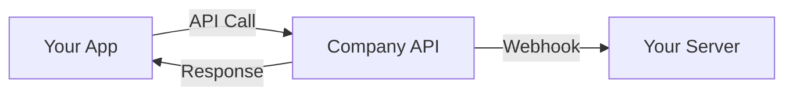

# Developer Documentation

**Category:** Technical Documentation / Developer Experience
**Owner:** Technical Writer

## Overview

Designs and maintains the developer portal architecture, getting started guides, integration tutorials, troubleshooting documentation, changelog management, and all developer experience (DX) content for the platform's engineering ecosystem. Developer documentation is the bridge between the platform's capabilities and the engineers who consume them — whether internal platform teams, integration partners, or external developers — and must be discoverable, accurate, actionable, and continuously maintained.

This skill covers developer portal information architecture, onboarding guide design, integration tutorial authoring, troubleshooting guide creation, changelog management processes, and the developer experience writing principles that ensure documentation reduces friction and accelerates developer productivity.

## Competency Dimensions

| Dimension                     | Description                                                                                                   | Proficiency Indicators                                                                                              |
| ----------------------------- | ------------------------------------------------------------------------------------------------------------- | ------------------------------------------------------------------------------------------------------------------- |
| Developer Portal Architecture | Design information architecture, navigation, search, and content organization for developer-facing portals    | Can design a portal IA that achieves ≥90% search success rate; navigation task completion ≥95% in usability testing |
| Getting Started Guides        | Write onboarding guides that take a developer from zero to first successful API call in ≤5 minutes            | ≥80% of developers complete the getting started flow on first attempt; time-to-first-call ≤5 minutes                |
| Integration Tutorials         | Author step-by-step tutorials for common integration patterns with complete, tested code examples             | Tutorial completion rate ≥75%; zero critical gaps reported by developers following the tutorial end-to-end          |
| Troubleshooting Documentation | Create diagnostic guides, FAQ entries, and error resolution documentation                                     | ≥70% of support tickets deflected by troubleshooting docs; mean time to resolution reduced by ≥30%                  |
| Changelog Management          | Maintain structured, versioned changelogs with clear release notes, deprecation notices, and migration guides | Changelog read rate ≥60%; zero developer complaints about undocumented breaking changes                             |
| Developer Experience Writing  | Apply DX writing principles that reduce cognitive load, accelerate comprehension, and respect developer time  | DX writing score ≥4.3/5 in developer surveys; documentation NPS ≥+40                                                |

## Execution Guidance

### Developer Portal Architecture

#### Information Architecture Principles

| Principle                    | Application                                                                                                                       |
| ---------------------------- | --------------------------------------------------------------------------------------------------------------------------------- |
| **Task-oriented navigation** | Organize by what developers want to do (authenticate, list resources, handle errors), not by internal service boundaries          |
| **Progressive disclosure**   | Surface the minimum information needed for the current task; link to deeper detail for those who need it                          |
| **Consistent patterns**      | Every endpoint doc, every guide, every troubleshooting entry follows the same structure. Developers learn once, apply everywhere. |
| **Search-first design**      | Assume developers will search before browsing. Optimize titles, headings, and metadata for search relevance.                      |
| **Version-aware**            | Every page displays the API version it applies to. Version selector is visible on every page.                                     |
| **Mobile-responsive**        | Developers read docs on phones during commutes, in meetings, and at their desks. All pages are fully responsive.                  |

#### Portal Page Template

```markdown
# [Page Title]

**API Version:** v1.x
**Last Updated:** YYYY-MM-DD
**Reading Time:** ~X minutes

## Overview

[1-2 sentences: What this page covers and who it's for]

## Prerequisites

- [What the reader needs before starting: account, API key, SDK installed, etc.]
- [Link to prerequisite docs if they exist elsewhere]

## [Main Content Sections]

[Structured content following the page type template — see below for specific templates]

## Next Steps

- [Link to related guide or next logical action]
- [Link to API reference for deeper detail]
- [Link to troubleshooting if relevant]

## Related Resources

- [Link 1: Related guide]
- [Link 2: API reference]
- [Link 3: SDK documentation]
- [Link 4: Community discussion or FAQ]
```

#### Navigation Structure

```
Home
├── Quick Start (5 min)
├── Getting Started
│   ├── Create Account & Get API Key
│   ├── Authentication Overview
│   ├── Making Your First Request
│   └── SDK Installation & Setup
├── API Reference
│   ├── [Service 1]
│   │   ├── Overview
│   │   ├── Endpoints
│   │   ├── Models
│   │   └── Error Codes
│   └── [Service 2]
├── Guides
│   ├── Authentication Deep Dive
│   ├── Pagination & Filtering
│   ├── Error Handling Best Practices
│   ├── Rate Limiting & Throttling
│   ├── Webhooks
│   └── Migration Guides
├── SDKs & Tools
│   ├── Kotlin SDK (Android)
│   ├── Swift SDK (iOS)
│   ├── Dart SDK (Flutter)
│   ├── CLI Tools
│   └── Postman Collection
├── Troubleshooting
│   ├── Common Errors
│   ├── Diagnostic Guides
│   ├── FAQ
│   └── Contact Support
├── Changelog
│   ├── Latest Release
│   ├── Version History
│   └── Deprecated Features
└── Support
    ├── Status Page
    ├── Community Forum
    └── Contact
```

### Getting Started Guides

#### 5-Minute Quick Start Template

````markdown
# Quick Start: Make Your First API Call

**Time:** ~5 minutes
**Prerequisites:** None — we'll walk you through everything

## Step 1: Get Your API Key (1 min)

1. Go to [Developer Dashboard](https://developer.company.com/dashboard)
2. Sign in or create an account
3. Navigate to **API Keys** → **Generate New Key**
4. Copy your key — you'll need it in Step 3

> ⚠️ **Keep your API key secret.** Never commit it to version control or include it in client-side code.

## Step 2: Install the SDK (1 min)

### Kotlin (Android)

```kotlin
// Add to your build.gradle.kts
implementation("com.company:api-sdk:1.0.0")
```
````

### Swift (iOS)

```swift
// Add to your Package.swift
dependencies: [
    .package(url: "https://github.com/company/api-sdk-swift", from: "1.0.0")
]
```

### Dart (Flutter)

```yaml
# Add to your pubspec.yaml
dependencies:
  company_api_sdk: ^1.0.0
```

## Step 3: Make Your First Request (2 min)

### Kotlin

```kotlin
val client = CompanyApiClient(apiKey = "YOUR_API_KEY")
val response = client.resources.listResources(page = 1, limit = 10)

if (response.isSuccessful) {
    val resources = response.body()?.data ?: emptyList()
    println("Found ${resources.size} resources")
} else {
    println("Error: ${response.code()} - ${response.errorBody()?.string()}")
}
```

### Swift

```swift
let client = CompanyApiClient(apiKey: "YOUR_API_KEY")
client.resources.listResources(page: 1, limit: 10) { result in
    switch result {
    case .success(let response):
        print("Found \(response.data.count) resources")
    case .failure(let error):
        print("Error: \(error)")
    }
}
```

### Dart

```dart
final client = CompanyApiClient(apiKey: 'YOUR_API_KEY');
final response = await client.resources.listResources(page: 1, limit: 10);
print('Found ${response.data.length} resources');
```

## Step 4: Explore the API (1 min)

- [API Reference](/api-reference/) — Browse all available endpoints
- [Guides](/guides/) — Learn common patterns and best practices
- [SDK Documentation](/sdks/) — Full SDK reference

## What's Next?

1. [Read the Authentication Guide](/guides/authentication/) — Understand how API keys and JWT tokens work
2. [Explore the API Reference](/api-reference/) — See all available endpoints and models
3. [Check out the Guides](/guides/) — Learn pagination, filtering, error handling, and more

## What You'll Build

[1-2 sentences describing the end result of the tutorial]

## Architecture Overview

[Brief diagram or description of how the components fit together]



## Step 1: [Setup Step]

[Detailed instructions with code examples]

## Step 2: [Implementation Step]

[Detailed instructions with code examples]

## Step 3: [Integration Step]

[Detailed instructions with code examples]

## Step 4: [Testing Step]

[How to verify the integration works correctly]

---

## Reference Materials

Detailed examples and implementation guides are in `references/`:

- [`error-troubleshooting.md`](references/error-troubleshooting.md) — API Error Troubleshooting
- [`error-code-reference.md`](references/error-code-reference.md) — Error Code Reference
- [`changelog-standards.md`](references/changelog-standards.md) — Changelog Standards
- [`changelog.md`](references/changelog.md) — Changelog Example
- [`execution-guidance.md`](references/execution-guidance.md) — Execution Guidance
- [`methods.md`](references/methods.md) — HTTP Methods
- [`pipeline-integration.md`](references/pipeline-integration.md) — Pipeline Integration
- [`quality-standards.md`](references/quality-standards.md) — Quality Standards
- [`quick-diagnostic.md`](references/quick-diagnostic.md) — Quick Diagnostic
- [`troubleshooting.md`](references/troubleshooting.md) — Troubleshooting Guide
