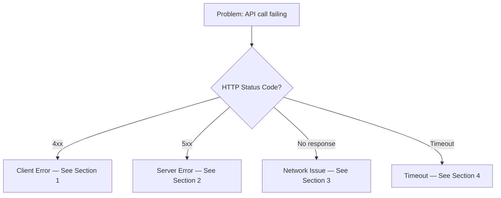

# Quick Diagnostic

## Quick Diagnostic

```mermaid
flowchart TD
    A[Problem: API call failing] --> B{HTTP Status Code?}
    B -->|4xx| C[Client Error — See Section 1]
    B -->|5xx| D[Server Error — See Section 2]
    B -->|No response| E[Network Issue — See Section 3]
    B -->|Timeout| F[Timeout — See Section 4]
```
