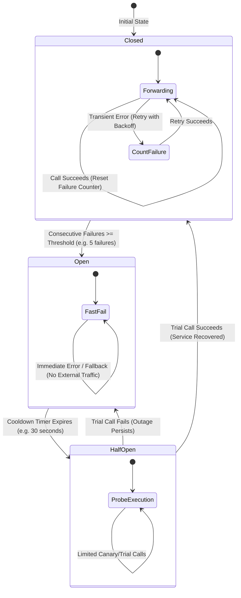

# Agent Harness Engineering: Building Production-Grade Agent Loops

**智能体运行框架工程：构建生产级智能体循环**

| Field   | English                                                                               | 中文                                               |
| ------- | ------------------------------------------------------------------------------------- | -------------------------------------------------- |
| Level   | Advanced                                                                              | 高级                                               |
| Cluster | Agent Architecture & Design Patterns                                                  | 智能体架构与设计模式                               |
| Author  | Dr. Inés Roldán, Research Scientist — Software Engineering / Computer Science, ANU-00 | ANU-00 软件工程与计算机科学研究员 Inés Roldán 博士 |

---

## 0. Where This Module Fits

**本模块的定位**

This module builds strictly on three earlier curriculum modules and assumes nothing beyond them.
From `introductory/04-tool-use-and-function-calling-basics.md` it assumes the reader already knows
what tool use and function calling are — the mechanism by which an agent invokes external code with
structured arguments rather than only generating text.

本模块严格建立在此前三个课程模块的基础之上，不假设读者具备这些模块之外的任何知识。模块 `introductory/04-tool-use-and-function-calling-basics.md` 已经讲解了什么是工具使用与函数调用——即智能体以结构化参数调用外部代码、而非仅仅生成文本的机制，本模块假定读者已掌握这一概念。

From `intermediate/03-agent-design-patterns-react-plan-execute-reflexion.md` it assumes familiarity
with the ReAct, Plan-and-Execute, and Reflexion agent design patterns as cognitive loops — patterns
for how an agent decides what to do next, independent of the software that runs around that
decision. From this author's own
`intermediate/04-agent-memory-systems-short-term-long-term-episodic.md` it assumes the working
memory / long-term memory / episodic memory / semantic memory / procedural memory taxonomy, and in
particular the MemGPT virtual-context-management mechanism covered there, which this module treats
as one piece of a larger production system. This module does not re-derive any of that material; it
names the module whenever it leans on it.

模块 `intermediate/03-agent-design-patterns-react-plan-execute-reflexion.md` 已经讲解了 ReAct、Plan-and-Execute 与 Reflexion 三种智能体设计模式，将其作为认知层面的循环——即智能体如何决定下一步行动的模式，与运转在该决策周围的软件相互独立，本模块假定读者对此已经熟悉。本作者所撰写的模块 `intermediate/04-agent-memory-systems-short-term-long-term-episodic.md` 已经讲解了工作记忆、长期记忆、情景记忆、语义记忆与程序性记忆这一分类体系，特别是其中介绍的 MemGPT 虚拟上下文管理机制，本模块假定读者已掌握这些内容，并将其作为一个更大生产系统中的一环来处理。本模块不会重新推导上述任何内容，而是在依赖它们时明确指出所依赖的模块。

---

## 1. What a Harness Is, and Why It Is Not the Agent Loop

**什么是运行框架，它为何不同于智能体循环**

An agent design pattern such as ReAct, covered in [`intermediate/03`](/academic-neural-unit-00/curriculum/intermediate/03-agent-design-patterns-react-plan-execute-reflexion.md), describes a cognitive loop: how
an LLM interleaves reasoning and action to decide what to do next. An agent harness is a different
thing entirely — it is the surrounding production software that turns that cognitive loop into
something that can run unattended, safely, repeatedly, and at scale, without a human watching every
step. Where the design pattern answers "what should the agent think and do next," the harness
answers a longer list of questions the pattern itself is silent on: how is a tool call actually
executed, and what happens if it fails?

[`intermediate/03`](/academic-neural-unit-00/curriculum/intermediate/03-agent-design-patterns-react-plan-execute-reflexion.md) 中所讲解的 ReAct 这类智能体设计模式，描述的是一种认知层面的循环：LLM 如何交替进行推理与行动，以决定下一步该做什么。而智能体运行框架则完全是另一回事——它是围绕在这一认知循环之外、将其转变为一种能够在无人值守情况下安全、可重复、大规模运转的生产级软件。设计模式回答的问题是“智能体接下来应当思考并做什么”，而运行框架要回答的，则是一份该模式本身完全没有涉及的更长问题清单：一次工具调用究竟是如何被实际执行的？

How is the loop stopped before it runs forever or spends unbounded money? What is logged, and who
can see it? What is the agent allowed to touch, and what is it sandboxed away from? How is a limited
context window kept usable across a session that runs far longer than one window can hold? A harness
is the answer to all of these questions, implemented once, so that the cognitive pattern inside it
does not have to reinvent the answer every time.

如果调用失败会发生什么？如何在循环无限运转下去、或耗费无上限的资金之前将其停止？哪些内容会被记录日志，谁可以查看这些日志？智能体被允许触碰什么，又被沙箱化隔离在什么之外？在一次运行时间远超单个上下文窗口所能容纳的会话中，如何让有限的上下文窗口始终保持可用？运行框架正是对所有这些问题的解答，它只需实现一次，其内部的认知模式便无需在每次运转时重新发明这些答案。

The distinction matters because a naive implementation conflates the two. A tutorial-grade agent
loop — call the model, parse a tool call out of its text output, run the tool, append the result,
repeat — works perfectly on a demo and fails in production for reasons that have nothing to do with
the reasoning pattern: a malformed tool call the parser cannot handle, a tool that hangs instead of
returning, a loop that never emits a stop condition and runs until the context window overflows, a
single expensive external API called in an unbounded retry storm.

这一区分之所以重要，是因为一个朴素的实现往往会把两者混为一谈。一个教程级别的智能体循环——调用模型、从其文本输出中解析出一次工具调用、运行该工具、将结果追加进去、循环往复——在演示中运转得完美无缺，但在生产环境中却会因为一系列与推理模式本身毫无关系的原因而失败：解析器无法处理的格式错误的工具调用、挂起而非返回结果的工具、从未发出停止条件而一直运转到上下文窗口溢出的循环、对某个昂贵的外部 API 进行无限重试风暴式调用。

None of these are reasoning failures. They are harness failures — gaps in the engineering that was
supposed to surround the loop — and the rest of this module works through the concrete patterns that
close them.

这些都不是推理层面的失败，而是运行框架层面的失败——本应包裹在循环外部的工程环节出现了缺口——本模块接下来的内容，正是逐一讲解用以弥合这些缺口的具体模式。

---

## 2. Design Vocabulary: The Augmented LLM and Five Composable Patterns

**设计词汇：增强型 LLM 与五种可组合模式**

Before assembling a harness it helps to have a shared vocabulary for the shapes a production agent
system can take, and Anthropic's December 2024 engineering post "Building Effective Agents," by Erik
Schluntz and Barry Zhang, is a widely cited source for exactly this vocabulary, distilled from
observing many real customer deployments.

在着手搭建运行框架之前，若能拥有一套关于生产级智能体系统可能呈现出的形态的共同词汇，会大有帮助。 Anthropic 于 2024 年 12 月发布的工程博客文章《构建高效的智能体》（"Building Effective Agents"，作者 Erik Schluntz 与 Barry Zhang），正是这样一份被广泛引用的词汇来源，它是从观察大量真实客户部署案例中提炼而来。

It starts from what it calls "the augmented LLM" — "an LLM enhanced with augmentations such as
retrieval, tools, and memory" — as the basic building block every larger system is composed from,
and it draws a load-bearing distinction between two shapes built on top of that block: workflows,
"systems where LLMs and tools are orchestrated through predefined code paths," and agents, "systems
where LLMs dynamically direct their own processes and tool usage, maintaining control over how they
accomplish tasks."

文章从其所称的“增强型 LLM”出发——“一个被检索、工具与记忆等增强手段强化的 LLM”——将其作为构建一切更大系统的基本模块，并在此基础之上，划出了两种形态之间一条具有支撑意义的区分：工作流，“LLM 与工具通过预先定义好的代码路径进行编排的系统”；以及智能体，“LLM 动态地主导自身流程与工具使用、并对如何完成任务保持自主掌控的系统”。

A ReAct loop, per this vocabulary, is an agent in the strict sense — the model itself decides, turn
by turn, what happens next — while many production systems that people casually call "agents" are
actually workflows, with fixed code deciding the sequence and the LLM filling in the content at each
step.

按照这套词汇，[`intermediate/03`](/academic-neural-unit-00/curriculum/intermediate/03-agent-design-patterns-react-plan-execute-reflexion.md) 中的 ReAct 循环，在严格意义上属于智能体——由模型自身逐轮决定接下来发生什么——而许多被人们随口称作“智能体”的生产系统，实际上是工作流：由固定的代码决定执行顺序，LLM 只是在每一步填充具体内容。

The same post names five composable patterns that, in the authors' account, cover most production
agent designs:

同一篇文章还给出了五种可组合模式，在作者看来，这五种模式覆盖了大多数生产级智能体设计：

| Pattern                                   | EN                                                                                                                                                         | 中文                                                                                                                              |
| ----------------------------------------- | ---------------------------------------------------------------------------------------------------------------------------------------------------------- | --------------------------------------------------------------------------------------------------------------------------------- |
| **Prompt chaining**（提示词链）           | decomposes a task into a fixed sequence of LLM calls with programmatic checks between steps.                                                               | 将一项任务拆分为一串固定顺序的 LLM 调用，并在各步骤之间插入程序化检查。                                                           |
| **Routing**（路由）                       | classifies an input and sends it down one of several specialized paths.                                                                                    | 对输入进行分类，并将其导向若干专门路径中的一条。                                                                                  |
| **Parallelization**（并行化）             | runs multiple LLM calls at once, either by splitting a task into independent sections or by running the same task several times and voting on the results. | 同时运行多次 LLM 调用，既可以将任务拆分为若干独立部分并行处理（分段式），也可以对同一任务重复运行多次并对结果进行投票（投票式）。 |
| **Orchestrator-workers**（编排者-工作者） | a central LLM breaks a complex task into subtasks and delegates them to worker LLM calls, then synthesizes their results.                                  | 由一个中枢 LLM 将复杂任务拆解为若干子任务，分派给若干工作者 LLM 调用去完成，再对其结果进行综合。                                  |
| **Evaluator-optimizer**（评估者-优化者）  | one LLM call generates a candidate answer and a second LLM call evaluates it, feeding critique back for another round.                                     | 由一次 LLM 调用生成候选答案，再由另一次调用对其进行评估，并将反馈意见带回下一轮迭代。                                             |

A harness engineer's first design decision is choosing among these shapes — or a genuine agent loop
— for the task at hand, and the post's own guidance on that choice is conservative: "you should
consider adding complexity only when it demonstrably improves outcomes," meaning a fixed workflow
should be preferred over an open-ended agent loop whenever the task's steps are actually predictable
in advance, reserving full agentic autonomy for tasks where they are not.

运行框架工程师所要做的第一个设计决策，正是针对手头的任务，在这些形态——或是一个真正的智能体循环——之间做出选择，而文章本身在这一取舍上给出的建议是保守的：“只有在能够切实证明会改善结果时，才应当考虑增加复杂度”，也就是说，只要任务的各个步骤事实上是可以提前预测的，就应当优先选用固定的工作流，而非开放式的智能体循环，把完全的智能体自主权留给那些步骤确实无法提前预测的任务。

---

## 3. Design Vocabulary Applied to the Naive Loop's Failure Modes

**将设计词汇应用于朴素循环的失效模式**

Mapping [§1](#1-what-a-harness-is-and-why-it-is-not-the-agent-loop)'s list of naive-loop failures onto this vocabulary clarifies what a harness must add. A
malformed tool call the parser cannot handle is an action-space problem — how the agent expresses
"call this tool with these arguments" needs to be robust to the model's own output variability. A
tool that hangs is a resilience problem — the harness needs timeouts and failure isolation
independent of what the cognitive pattern does.

将 [§1](#1-what-a-harness-is-and-why-it-is-not-the-agent-loop) 中列出的朴素循环失效情形映射到这套词汇上，可以更清楚地看出运行框架必须补上哪些内容。解析器无法处理的格式错误的工具调用，属于动作空间问题——智能体表达“用这些参数调用这个工具”的方式，需要对模型自身输出的不确定性具备足够的鲁棒性。一个挂起的工具，属于韧性问题——运行框架需要具备超时与故障隔离机制，且这一机制应独立于认知模式本身的运作。

A loop with no stop condition is a control problem — the harness, not the model alone, must own an
iteration or cost budget. An unbounded retry storm against an external API is also a resilience
problem, but one specifically about repeated failure rather than a single hang. Each of the next
four sections works through one of these, in turn, with a named, citable pattern for each.

一个没有停止条件的循环，属于控制问题——迭代或成本预算应当由运行框架来掌控，而不能仅仅依赖模型自身。对某个外部 API 的无限重试风暴，同样属于韧性问题，但它针对的是反复失败，而非单次挂起。接下来的四节将依次讲解这四类问题中的每一类，并各自给出一种有名可考的模式。

---

## 4. The Action Space: Tool-Calling Formats and the Agent-Computer Interface

**动作空间：工具调用格式与智能体-计算机接口**

The default action space covered in [`introductory/04`](/academic-neural-unit-00/curriculum/introductory/04-tool-use-and-function-calling-basics.md) is structured tool calling: the model emits a
JSON object naming a function and its arguments, and the harness parses and dispatches it. This
works well for a small, fixed set of simple tools, but John Yang, Carlos Jimenez, Alexander Wettig,
Kilian Lieret, Shunyu Yao, Karthik Narasimhan, and Ofir Press's 2024 SWE-agent paper makes an
argument a harness engineer should take seriously: language model agents "represent a new category
of end users" and, like human end users, benefit from an interface purpose-built for them rather
than one merely adapted from a human-facing tool.

[`introductory/04`](/academic-neural-unit-00/curriculum/introductory/04-tool-use-and-function-calling-basics.md) 中所讲解的默认动作空间，是结构化的工具调用：模型生成一个 JSON 对象，指明函数名及其参数，由运行框架负责解析并分派执行。这种方式对于数量少、固定的简单工具集合运转良好，但 John Yang、Carlos Jimenez、Alexander Wettig、Kilian Lieret、Shunyu Yao、Karthik Narasimhan 与 Ofir Press 于 2024 年发表的 SWE-agent 论文提出了一个运行框架工程师应当认真对待的论点：语言模型智能体“构成了一类新的终端用户”，正如人类终端用户一样，它们也需要一种为其量身定制的接口，而不仅仅是一种从面向人类的工具改造而来的接口。

SWE-agent's custom agent-computer interface (ACI) significantly improved the agent's ability to
create and edit files, navigate an entire repository, and run tests, precisely because the
interface's commands, output formatting, and error messages were designed around how an LLM actually
reads and reasons over text, not around what a human terminal user finds convenient.

SWE-agent 定制的智能体-计算机接口（agent-computer interface，简称 ACI）显著提升了智能体创建与编辑文件、遍历整个代码仓库、以及运行测试的能力，其原因正在于该接口的命令、输出格式与错误信息，是围绕 LLM 实际阅读与推理文本的方式来设计的，而非围绕人类终端用户觉得便利的方式来设计的。

The general lesson for a harness — echoed in Anthropic's own guidance to "invest as much effort in
tool design as you would in a good human- computer interface" — is that a tool's schema, its error
messages, and even its output verbosity are not implementation details; they are part of the
harness's action-space design and directly affect how often the model calls the tool correctly.

对运行框架而言，这一普遍教训——与 Anthropic 自身“在工具设计上投入的精力，应当不亚于设计一个优秀的人机界面”这一建议相呼应——在于：一个工具的模式、错误信息、乃至输出的详略程度，都不是可有可无的实现细节，它们都是运行框架动作空间设计的一部分，并直接影响模型正确调用该工具的频率。

A second, more radical option for the action space is to abandon JSON tool calls altogether in favor
of executable code. Xingyao Wang, Yangyi Chen, Lifan Yuan, Yizhe Zhang, Yunzhu Li, Hao Peng, and
Heng Ji's 2024 paper "Executable Code Actions Elicit Better LLM Agents" proposes CodeAct, which
consolidates an agent's actions into a single, unified action space: executable Python code, run
through a Python interpreter, rather than a fixed menu of individually-defined JSON tool schemas.

动作空间的第二种、也更为激进的选择，是彻底放弃 JSON 工具调用，转而采用可执行代码。 Xingyao Wang、Yangyi Chen、Lifan Yuan、Yizhe Zhang、Yunzhu Li、Hao Peng 与 Heng Ji 于 2024 年发表的论文《可执行代码动作激发更优的 LLM 智能体》（"Executable Code Actions Elicit Better LLM Agents"）提出了 CodeAct，它将智能体的各种动作统一整合为单一的动作空间：通过 Python 解释器运行的可执行代码，而非一份由若干单独定义的 JSON 工具模式所构成的固定菜单。

Because Python already has control flow, error handling, and the ability to compose multiple
operations in one action, a CodeAct-style agent can express things a fixed JSON tool set cannot —
looping over a list of files, catching an exception and trying an alternative approach within a
single action — and the paper reports up to a 20% higher success rate against JSON-tool-calling
alternatives across its evaluated benchmarks. The harness-level cost of this choice is that
executing arbitrary code is exactly the sandboxing problem covered in [§7](#7-sandboxing-and-observability-watching-and-containing-the-loop) below — the flexibility
CodeAct buys has to be paid for with a correspondingly stronger execution sandbox, not a weaker one.

由于 Python 本身已经具备控制流、错误处理能力，以及在单次动作中组合多个操作的能力，一个采用 CodeAct 风格的智能体，能够表达出固定 JSON 工具集所无法表达的内容——例如在单次动作内对一组文件列表进行循环处理、捕获异常并尝试另一种替代方案——论文报告称，在其评测的基准测试中，相较于 JSON 工具调用的替代方案，其成功率最高可提升 20%。这一选择在运行框架层面所付出的代价，正是下文 [§7](#7-sandboxing-and-observability-watching-and-containing-the-loop) 所讲解的沙箱化问题：执行任意代码正是该问题的典型场景——CodeAct 带来的灵活性，必须以相应更强、而非更弱的执行沙箱作为代价来换取。

Whichever action space a harness chooses, integrating many external tools consistently is itself a
production concern.

无论运行框架选择哪一种动作空间，将大量外部工具以一致的方式集成起来，本身就是一个生产层面的问题。

Anthropic's Model Context Protocol (MCP), introduced in November 2024, standardizes this integration
with a client-server architecture: an MCP server exposes a set of tools, resources, and prompts in a
uniform way, and any MCP-compliant harness can connect to it without writing bespoke integration
code for every external system it wants to reach. For a harness engineer, MCP's practical value is
turning what would otherwise be an N-times-M integration problem — N agent harnesses each writing
custom code for M external tools — into an N-plus-M problem, where each tool is exposed once as an
MCP server and each harness implements the protocol once as a client.

Anthropic 于 2024 年 11 月推出的模型上下文协议（Model Context Protocol，简称 MCP）通过一种客户端-服务器架构，将这一集成问题标准化：一台 MCP 服务器以统一的方式对外暴露一组工具、资源与提示词，任何符合 MCP 规范的运行框架都可以与之连接，而无需针对每一个想要接入的外部系统各自编写定制的集成代码。对运行框架工程师而言，MCP 的实用价值在于，将原本一个 N × M 的集成问题——N 个智能体运行框架各自为 M 个外部工具编写定制代码——转变为一个 N + M 的问题：每个工具只需作为一台 MCP 服务器暴露一次，每个运行框架也只需作为客户端实现一次该协议。

---

## 5. Resilience: Retries, Timeouts, and the Circuit Breaker

**韧性：重试、超时与熔断器**

External calls fail — a model provider has a transient outage, a tool's downstream API times out, a
network hiccups — and a harness that treats every call as certain to succeed will crash on the first
failure that a well-engineered system would have absorbed. The two most basic resilience primitives
are a timeout, so a hung call cannot block the loop forever, and a bounded retry with exponential
backoff, so a transient failure gets a small number of chances to resolve itself before the harness
gives up, spaced increasingly far apart so retries do not themselves add to the load on a struggling
downstream system.

外部调用会失败——模型提供方可能出现短暂的服务中断，工具所依赖的下游 API 可能超时，网络也可能出现抖动——一个把每次调用都视为必定成功的运行框架，会在第一次本应被一个精心设计的系统所吸收的失败面前就崩溃。两个最基本的韧性原语，一是超时，使得挂起的调用不会永远阻塞整个循环；二是带指数退避（exponential backoff）的有限次重试，使得一次瞬时性失败在运行框架放弃之前，能够获得少量自行恢复的机会，且各次重试之间的间隔逐渐拉长，从而避免重试本身进一步加重本已陷入困境的下游系统的负担。

Retries alone are not enough when a downstream dependency is not merely slow but genuinely down,
because blind retries against a dead dependency waste time and resources without ever succeeding,
and can make the outage worse by piling load onto a system that is already failing. The circuit
breaker pattern, described in Martin Fowler's widely read bliki entry "CircuitBreaker" and
originally popularized in Michael Nygard's book "Release It!", addresses exactly this case by
wrapping a protected call in an object that tracks failures and moves through three states:

当某个下游依赖不仅是响应缓慢、而是确实已经宕机时，仅靠重试是不够的，因为对一个已经失效的依赖进行盲目重试，只会浪费时间与资源却始终无法成功，甚至可能因为向一个本已出现故障的系统持续施加负载，而使故障进一步恶化。熔断器模式（circuit breaker pattern），记载于 Martin Fowler 广为传阅的 bliki 词条“CircuitBreaker”，并最早由 Michael Nygard 在其著作《Release It!》中推广开来，正是针对这一情形而提出的：它将受保护的调用包裹在一个对象之中，由该对象追踪失败情况，并在三种状态之间切换——

| State                 | EN                                                                                                                                                                                                                        | 中文                                                                                                                                           |
| --------------------- | ------------------------------------------------------------------------------------------------------------------------------------------------------------------------------------------------------------------------- | ---------------------------------------------------------------------------------------------------------------------------------------------- |
| **Closed**（闭合）    | where calls pass through normally.                                                                                                                                                                                        | 状态下，调用正常通过。                                                                                                                         |
| **Open**（开启）      | where, once failures exceed a threshold, the breaker stops forwarding calls immediately — typically failing fast or falling back to a default — for a cooldown period rather than letting each one time out individually. | 一旦失败次数超过阈值，便进入该状态，熔断器会在一段冷却期内立即停止转发调用（通常表现为快速失败或回退到默认值），而不是让每次调用各自等待超时。 |
| **Half-open**（半开） | where after the cooldown the breaker allows a small number of test calls through to check whether the dependency has recovered, returning to closed if they succeed and back to open if they do not.                      | 冷却期结束后进入该状态，熔断器允许少量测试调用通过，以检测该依赖是否已经恢复——若测试调用成功，则回到闭合状态，若仍然失败，则重新回到开启状态。 |

The state machine diagram below models the three circuit breaker states, their transition triggers,
and recovery pathways:

下面的状态机图直观展示了熔断器的三种核心状态、状态转移触发条件以及故障恢复路径：

In a harness, this pattern is naturally applied around a tool call to an unreliable external API or
around the call to the LLM provider itself, and it composes directly with the bounded-retry
mechanism above — retries handle brief transient failures inside the closed state, while the breaker
handles the case where the dependency has stopped working altogether.

在运行框架中，这一模式通常应用于对不可靠外部 API 的工具调用、或对 LLM 提供方自身的调用之上，并可直接与上文的有限重试机制组合使用——重试机制处理闭合状态下的短暂瞬时故障，而熔断器则处理该依赖已彻底停止工作的情形。

---

## 6. Control: Iteration Budgets, Cost Budgets, and Termination

**控制：迭代预算、成本预算与终止条件**

A ReAct-style loop, as covered in [`intermediate/03`](/academic-neural-unit-00/curriculum/intermediate/03-agent-design-patterns-react-plan-execute-reflexion.md), is open-ended by design — the model itself
decides, at each turn, whether the task is finished — and that openness is exactly what makes a
control layer in the harness necessary rather than optional.

正如 [`intermediate/03`](/academic-neural-unit-00/curriculum/intermediate/03-agent-design-patterns-react-plan-execute-reflexion.md) 中所讲解的，ReAct 风格的循环在设计上是开放式的——由模型自身在每一轮判断任务是否已经完成——而正是这种开放性，使得运行框架中的控制层不再是可有可无，而是必需的。

A production harness enforces a hard iteration cap independent of the model's own judgment, so a
loop that never converges terminates anyway rather than running indefinitely, and it tracks a
running cost or token budget across the whole session, since a loop that stays under the iteration
cap can still be arbitrarily expensive if each iteration is large.

一个生产级运行框架会强制执行一个独立于模型自身判断的硬性迭代上限，使得一个永远无法收敛的循环仍会被终止，而不是无限期地运转下去；它还会在整个会话过程中追踪累计的成本或词元预算，因为即便循环停留在迭代上限之内，只要每一轮的规模足够大，其开销仍可能高得没有上限。

Anthropic's own guidance is explicit that this matters more, not less, as autonomy increases: "for
tasks with open-ended solutions... extensive testing in sandboxed environments, along with the
appropriate guardrails, is essential," precisely because an agent given more autonomy over more
turns has correspondingly more opportunity for a small per-step error to compound into a large one
before any human notices.

Anthropic 自身的建议明确指出，随着自主性的提升，这一点非但不会变得不那么重要，反而变得愈发重要：“对于具有开放式解决方案的任务……在沙箱化环境中进行充分的测试，并配以相应的护栏机制，是必不可少的”——原因正在于，一个被赋予更多自主权、可运转更多轮次的智能体，也相应地拥有更多机会，让一个微小的单步错误在被人类察觉之前，累积演变为一个重大错误。

A well-engineered control layer also distinguishes between an agent stopping because it decided the
task is done and an agent being stopped by the harness because a budget was exceeded, and surfaces
that distinction rather than silently truncating output either way — a session cut off by a token
budget with no indication that it was cut off is a harder defect to diagnose than one that fails
loudly and explains why.

一个设计精良的控制层，还会区分两种情形：智能体因为自行判断任务已完成而停止，与智能体因为超出预算而被运行框架强制停止，并将这两者的区别清晰地呈现出来，而不是无论哪种情形都悄无声息地截断输出——一个因词元预算耗尽而被中止、却没有任何提示表明其已被中止的会话，比一个大声报错并说明原因的失败，要难以诊断得多。

---

## 7. Sandboxing and Observability: Watching and Containing the Loop

**沙箱化与可观测性：监视并约束循环**

Anthropic's guidance on autonomous agents pairs "extensive testing in sandboxed environments" with
"appropriate guardrails" as a single, joint requirement, and a harness's sandboxing layer is what
makes that pairing concrete: file-system access scoped to a working directory rather than the whole
machine, network access allow-listed rather than open by default, and — for a CodeAct-style
code-execution action space as covered in [§4](#4-the-action-space-tool-calling-formats-and-the-agent-computer-interface) — code run inside an isolated interpreter process
rather than the harness's own process, so that a bug or an adversarial prompt cannot reach outside
the sandbox's boundary.

Anthropic 关于自主智能体的建议，将“在沙箱化环境中进行充分测试”与“配以相应的护栏机制”作为一项统一的、联合的要求提出，而运行框架中的沙箱化层，正是让这一要求落地为具体实践的关键：文件系统访问被限定在某个工作目录之内，而非整台机器；网络访问采用白名单机制，而非默认开放；而对于 [§4](#4-the-action-space-tool-calling-formats-and-the-agent-computer-interface) 中所讲的 CodeAct 风格的代码执行动作空间而言，代码应在一个隔离的解释器进程中运行，而非运行框架自身的进程之中，从而使得一个缺陷或一个恶意提示词无法突破沙箱的边界。

SWE-agent's ACI, also covered in [§4](#4-the-action-space-tool-calling-formats-and-the-agent-computer-interface), is a sandboxing decision as much as an interface decision: its
custom file-viewer and editor commands constrain what the agent can do to a repository to operations
the harness explicitly supports and can undo, rather than handing the agent an unrestricted shell.

同样在 [§4](#4-the-action-space-tool-calling-formats-and-the-agent-computer-interface) 中讲到的 SWE-agent 的 ACI，与其说是一项接口设计决策，不如说同样也是一项沙箱化决策：其定制的文件查看器与编辑器命令，将智能体对代码仓库所能执行的操作，限定在运行框架明确支持、且可以撤销的操作范围之内，而不是直接赋予智能体一个不受限制的 shell。

Observability is the harness's other half of the same coin: every model call, every tool call and
its result, every retry, every circuit-breaker state transition, and every budget check should be
logged as a structured trace of the loop's actual execution, not just its final output. This serves
two distinct purposes.

可观测性是同一枚硬币的另一面：每一次模型调用、每一次工具调用及其结果、每一次重试、每一次熔断器状态切换、以及每一次预算检查，都应当作为循环实际执行过程的结构化追踪记录被记录下来，而不仅仅是记录最终输出。这样做有两个不同的作用。

First, it is what makes the failure modes covered in [§§4–6](#4-the-action-space-tool-calling-formats-and-the-agent-computer-interface) diagnosable after the fact — a session
that failed because a circuit breaker tripped looks different in the trace from one that failed
because the iteration cap was hit, and an engineer debugging a production incident needs that
distinction available, not reconstructed from guesswork.

其一，它使得 [§§4–6](#4-the-action-space-tool-calling-formats-and-the-agent-computer-interface) 中所讲的各种失效模式，能够在事后被诊断出来——一个因熔断器跳闸而失败的会话，在追踪记录中的表现，与一个因触及迭代上限而失败的会话截然不同，而工程师在排查一次生产事故时，需要能够直接获取这一区别，而不是靠猜测去重建。

Second, for any harness that pages memory in and out the way MemGPT does, as covered in
[`intermediate/04`](/academic-neural-unit-00/curriculum/intermediate/04-agent-memory-systems-short-term-long-term-episodic.md), the trace is also the record of which memories were retrieved and written at each
step, which is often the first place to look when an agent's behavior seems to have been shaped by a
memory that turned out to be stale or wrong.

其二，对于任何像 MemGPT 那样对记忆进行分页调入调出的运行框架（如 [`intermediate/04`](/academic-neural-unit-00/curriculum/intermediate/04-agent-memory-systems-short-term-long-term-episodic.md) 中所讲）而言，这份追踪记录同时也是每一步骤中哪些记忆被检索、哪些记忆被写入的记录——当一个智能体的行为看似受到了某条事后被证明是陈旧或错误的记忆的影响时，这份记录往往是首先需要查阅的地方。

---

## 8. Worked Example: The Architecture of a Production Coding-Agent Harness

**综合算例：一个生产级编程智能体运行框架的架构**

Assemble the pieces above into a single request's path through a production coding-agent harness. A
user submits a request. The harness's control layer initializes an iteration counter and a cost
budget for the session before anything else runs. On each loop turn, the harness assembles the
model's working memory — the current task, recent conversation, and any long-term memories retrieved
via the recency/importance/relevance scoring covered in [`intermediate/04` §5](/academic-neural-unit-00/curriculum/intermediate/04-agent-memory-systems-short-term-long-term-episodic.md#5-episodic-memory-remembering-specific-experiences) — and calls the model,
wrapped by a circuit breaker and a bounded retry with exponential backoff in case the model provider
itself is degraded.

将上文各个环节整合起来，看一次请求在一个生产级编程智能体运行框架中所经历的完整路径。用户提交一个请求。在其他任何环节运转之前，运行框架的控制层首先为本次会话初始化一个迭代计数器与一个成本预算。在循环的每一轮，运行框架会组装模型的工作记忆——当前任务、近期对话，以及通过 [`intermediate/04` § 5](/academic-neural-unit-00/curriculum/intermediate/04-agent-memory-systems-short-term-long-term-episodic.md#5-episodic-memory-remembering-specific-experiences) 中所讲的新近度/重要性/相关性评分检索到的任何长期记忆——然后调用模型，该调用被熔断器与带指数退避的有限次重试所包裹，以应对模型提供方自身出现服务降级的情形。

The model returns either a final answer or an action, expressed either as a JSON tool call or, in a
CodeAct-style harness, as executable code. If it is an action, the harness dispatches it through a
sandboxed execution environment scoped to the current working directory, with its own timeout
independent of the model-call timeout, and every one of these steps — the prompt sent, the model's
raw output, the parsed action, the tool's result, and the memory operations performed — is written
to a structured trace.

模型要么返回最终答案，要么返回一个动作——该动作既可以表示为 JSON 工具调用，也可以在采用 CodeAct 风格的运行框架中表示为可执行代码。如果是一个动作，运行框架会将其分派到一个限定在当前工作目录范围内的沙箱化执行环境中运行，该环境拥有独立于模型调用超时的自身超时设置，而以上每一个步骤——发送的提示词、模型的原始输出、解析出的动作、工具的执行结果，以及所执行的记忆操作——都会被写入一份结构化的追踪记录。

Before starting the next turn, the control layer checks the iteration counter and the cost budget
against their caps; if either is exceeded, the loop terminates with an explicit "budget exceeded"
status distinct from a normal completion, rather than being silently cut off. If the model's own
output indicates the task is complete, the loop terminates normally instead, and — closing the
circle back to [`intermediate/04`](/academic-neural-unit-00/curriculum/intermediate/04-agent-memory-systems-short-term-long-term-episodic.md) — the harness writes an episodic memory of what happened this
session, so that a future session's retrieval has something new to find.

在开始下一轮之前，控制层会将迭代计数器与成本预算与各自的上限进行核对；若任一项超出上限，循环便会以一个明确区别于正常完成的“预算超出”状态终止，而不是被悄无声息地截断。反之，若模型自身的输出表明任务已经完成，循环则会正常终止——此时呼应回 [`intermediate/04`](/academic-neural-unit-00/curriculum/intermediate/04-agent-memory-systems-short-term-long-term-episodic.md)——运行框架会写入一条关于本次会话经过的情景记忆，使得未来某次会话在检索时，能够找到一些新的内容。

---

## 9. Summary

**小结**

The agent design patterns covered in [`intermediate/03`](/academic-neural-unit-00/curriculum/intermediate/03-agent-design-patterns-react-plan-execute-reflexion.md) describe how an agent thinks; this module has
covered how that thinking is made to run safely and repeatedly in production.

[`intermediate/03`](/academic-neural-unit-00/curriculum/intermediate/03-agent-design-patterns-react-plan-execute-reflexion.md) 中所讲解的智能体设计模式，描述的是智能体如何思考；本模块所讲解的，则是如何让这种思考在生产环境中安全、可重复地运转起来。

A harness gives the loop a deliberately designed action space — JSON tool calls per
[`introductory/04`](/academic-neural-unit-00/curriculum/introductory/04-tool-use-and-function-calling-basics.md), an SWE-agent- style agent-computer interface, or a CodeAct-style code-execution
space, standardized where possible through MCP; resilience primitives — bounded retries with
exponential backoff and the circuit breaker pattern — for when external dependencies fail; a control
layer that owns iteration and cost budgets independent of the model's own judgment; and a sandboxing
and observability layer that contains what the loop can touch and records what it actually did.

运行框架为循环提供了经过精心设计的动作空间——遵循 [`introductory/04`](/academic-neural-unit-00/curriculum/introductory/04-tool-use-and-function-calling-basics.md) 的 JSON 工具调用、SWE-agent 风格的智能体-计算机接口，或是 CodeAct 风格的代码执行空间，并尽可能通过 MCP 加以标准化；提供了韧性原语——带指数退避的有限次重试与熔断器模式——用以应对外部依赖出现故障的情形；提供了独立于模型自身判断、掌控迭代与成本预算的控制层；以及一个约束循环所能触及范围、并记录其实际执行过程的沙箱化与可观测性层。

None of these five concerns is optional in a system meant to run unattended, and none of them is
answered by a better prompt or a better reasoning pattern alone — they are answered by engineering
the software the loop runs inside.

在一个旨在无人值守运转的系统中，这五个方面无一是可有可无的，也没有哪一个仅凭一句更好的提示词或一种更好的推理模式便能得到解决——它们只能通过对承载这一循环的软件本身进行工程化设计来解决。

---

## References

**参考文献**

### External Sources

- [Yao, S., Zhao, J., Yu, D., Du, N., Shafran, I., Narasimhan, K., & Cao, Y. (2022). ReAct: Synergizing Reasoning and Acting in Language Models](https://arxiv.org/abs/2210.03629)
- [Shinn, N., Cassano, F., Berman, E., Gopinath, A., Narasimhan, K., & Yao, S. (2023). Reflexion: Language Agents with Verbal Reinforcement Learning](https://arxiv.org/abs/2303.11366)
- [Schluntz, E., & Zhang, B. (2024). Building Effective Agents (Anthropic Engineering)](https://www.anthropic.com/engineering/building-effective-agents)
- [Yang, J., Jimenez, C. E., Wettig, A., Lieret, K., Yao, S., Narasimhan, K., & Press, O. (2024). SWE-agent: Agent-Computer Interfaces Enable Automated Software Engineering](https://arxiv.org/abs/2405.15793)
- [Wang, X., Chen, Y., Yuan, L., Zhang, Y., Li, Y., Peng, H., & Ji, H. (2024). Executable Code Actions Elicit Better LLM Agents (CodeAct)](https://arxiv.org/abs/2402.01030)
- [Anthropic (2024). Introducing the Model Context Protocol](https://www.anthropic.com/news/model-context-protocol)
- [Fowler, M. CircuitBreaker (martinfowler.com bliki)](https://martinfowler.com/bliki/CircuitBreaker.html)
- [Packer, C., Wooders, S., Lin, K., Fang, V., Patil, S. G., Stoica, I., & Gonzalez, J. E. (2023). MemGPT: Towards LLMs as Operating Systems](https://arxiv.org/abs/2310.08560)

### Internal Cross-References

- [`introductory/04-tool-use-and-function-calling-basics.md`](/academic-neural-unit-00/curriculum/introductory/04-tool-use-and-function-calling-basics.md)
- [`intermediate/03-agent-design-patterns-react-plan-execute-reflexion.md`](/academic-neural-unit-00/curriculum/intermediate/03-agent-design-patterns-react-plan-execute-reflexion.md)
- [`intermediate/04-agent-memory-systems-short-term-long-term-episodic.md`](/academic-neural-unit-00/curriculum/intermediate/04-agent-memory-systems-short-term-long-term-episodic.md)
