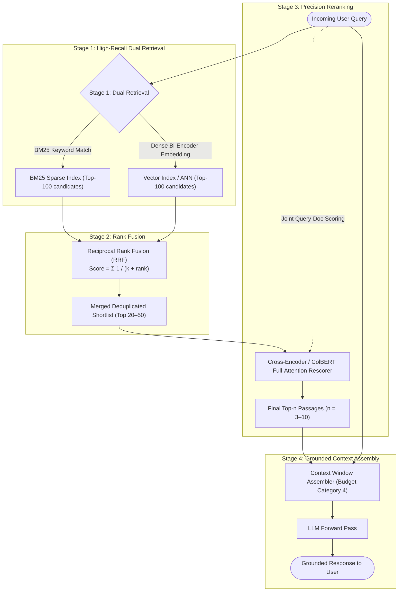

# RAG at Scale: Hybrid Search, Reranking & Evaluation

**规模化 RAG：混合检索、重排序与评估**

| Field   | English                                                           | 中文                                            |
| ------- | ----------------------------------------------------------------- | ----------------------------------------------- |
| Level   | Advanced                                                          | 高级                                            |
| Cluster | Prompt & Context Engineering                                      | 提示与上下文工程                                |
| Author  | Dr. Wei-Ling Tan, Research Scientist — Applied AI Systems, ANU-00 | ANU-00 应用人工智能系统研究员 Wei-Ling Tan 博士 |

---

This chapter builds directly on
`advanced/05-advanced-context-engineering-long-context-and-budgeting.md` [§7](#7-evaluating-rag-systems-ragas), which ended by naming
retrieval as the escape valve for content that does not fit a context budget an engineer is willing
to pay for — this chapter is that continuation, developing retrieval as a discipline in its own
right. It also builds on the embedding vector definition already given in
`introductory/02-the-transformer-architecture-and-attention.md` [§3](#3-dense-retrieval-embeddings-and-the-bi-encoder), and on the token and
context-window vocabulary from `introductory/06-context-windows-tokens-and-memory-basics.md`.

本章直接建立在《高级上下文工程：长上下文与上下文预算》(`advanced/05-advanced-context-engineering-long-context-and-budgeting.md`)[第 7 节](#7-evaluating-rag-systems-ragas)之上——该节最后提出，当所需内容超出了工程师愿意承担的上下文预算时，检索正是应对这一困境的泄压阀，本章正是这一思路的延续，将检索本身发展为一门独立的学科。本章同时建立在《Transformer 架构与注意力机制》(`introductory/02-the-transformer-architecture-and-attention.md`)[第 3 节](#3-dense-retrieval-embeddings-and-the-bi-encoder)已经给出的嵌入向量定义之上，以及《上下文窗口、词元与记忆基础》(`introductory/06-context-windows-tokens-and-memory-basics.md`)所讲授的词元与上下文窗口相关词汇之上。

A note on scope: per the module index in `curriculum/README.md` [§7](#7-evaluating-rag-systems-ragas), this chapter's designated
intermediate-level prerequisite is
`intermediate/06-rag-fundamentals-retrieval-embeddings-and-grounding.md` (Retrieval, Embeddings &
Grounding). Section 1 below is a compatible recap of the retrieval-augmented generation (RAG)
concept that module defines — grounded directly in the paper that introduced RAG — before this
chapter proceeds to the advanced techniques that are its actual subject. A reader who has already
completed [`intermediate/06`](https://anu00.dev/curriculum/intermediate/06-rag-fundamentals-retrieval-embeddings-and-grounding.md) will find this chapter's Section 1 a light, familiar recap rather than
new information.

范围说明：根据《课程手册》(`curriculum/README.md`)[第 7 节](#7-evaluating-rag-systems-ragas)的模块索引，本章所对应的中级层面先修模块是《RAG 基础：检索、嵌入与依据》(`intermediate/06-rag-fundamentals-retrieval-embeddings-and-grounding.md`)。下文[第 1 节](#1-retrieval-augmented-generation-a-self-contained-recap)是对该模块所定义的检索增强生成概念的一段兼容性回顾——直接依据提出该概念的论文，先给出 RAG 本身的定义，再进入本章真正要讲授的高级技巧。若读者已经学完了《RAG 基础》，会发现本章[第 1 节](#1-retrieval-augmented-generation-a-self-contained-recap)只是一段与之兼容的轻量回顾，而非全新的信息。

## 1. Retrieval-Augmented Generation: A Self-Contained Recap

**检索增强生成：自洽回顾**

**Retrieval-augmented generation (RAG, 检索增强生成)**, named and introduced by Lewis et al. (2020) in "Retrieval-Augmented Generation for Knowledge-Intensive NLP Tasks," is an architecture that combines a language model with an external, searchable collection of documents (a **corpus**): given a query, the system first _retrieves_ a small number of documents or document fragments (**passages** or **chunks**) judged most relevant to that query, then places those retrieved passages inside the language model's prompt as context before it generates an answer — the language model's generation is thereby "grounded" in retrieved text it can quote or paraphrase, rather than relying solely on facts implicitly encoded in its trained parameters.

**检索增强生成**(retrieval-augmented generation, RAG)由 Lewis 等人(2020)在论文《Retrieval-Augmented Generation for Knowledge-Intensive NLP Tasks》中提出并命名，它是一种将语言模型与一个外部的、可供搜索的文档集合(即**语料库**)结合起来的架构：给定一个查询，系统首先*检索*出少量被判定为与该查询最相关的文档或文档片段(即**段落**或**分块**)，然后将这些检索到的段落置于语言模型提示词内部的上下文之中，再让模型据此生成答案——由此，语言模型的生成结果便“有据可依”，能够引用或转述所检索到的文本，而不再单纯依赖训练参数中隐含编码的事实。

Lewis et al.'s original motivation, stated directly in the paper, was that a pre-trained language
model's parametric knowledge is difficult to inspect, cannot be easily updated without retraining,
and provides no natural way to cite where a claim came from — retrieval directly addresses all
three: the retrieved passages are visible and inspectable, the corpus can be updated by simply
adding or editing documents rather than retraining the model, and the retrieved passages themselves
serve as a natural provenance trail for the generated answer.

Lewis 等人在论文中直接阐明了他们最初的研究动机：一个预训练语言模型的参数化知识难以被检视、若不重新训练便难以更新，也没有任何自然的方式来标明某个论断究竟出自何处——而检索恰好直接针对这三个问题分别给出了解决办法：检索到的段落是可见、可检视的；语料库只需增添或编辑文档即可更新，无需重新训练模型；检索到的段落本身也天然地为生成的答案提供了一条可追溯的出处线索。

[`advanced/05`](https://anu00.dev/curriculum/advanced/05-advanced-context-engineering-long-context-and-budgeting.md) established that a context window is a finite, expensive resource whose middle region
is used less reliably than its edges.

《高级上下文工程》确立了这样一个事实：上下文窗口是一种有限且昂贵的资源，其中间区域的可靠使用程度不及首尾两端。

RAG is the architectural response to that constraint at the level of an entire knowledge base:
rather than trying to fit an organization's entire product manual, policy document set, or codebase
into a single prompt — which, per [`advanced/05` §1](https://anu00.dev/curriculum/advanced/05-advanced-context-engineering-long-context-and-budgeting.md#1-recap-and-scope)'s $O(n^2)$ cost and [§8](#8-common-failure-modes-at-scale)'s budgeting discipline,
becomes expensive and unreliable well before it becomes impossible — a RAG system keeps that full
corpus outside the model entirely, in a separate search index, and loads into context, on each
individual query, only the small handful of passages that retrieval judges relevant to that specific
question.

RAG 正是在整个知识库这一层面上，针对这一约束给出的架构性回应：与其试图把一家机构的整本产品手册、全部政策文件，或整个代码库塞进单一的提示词之中——根据《高级上下文工程》[第 1 节](#1-retrieval-augmented-generation-a-self-contained-recap)所述的 $O(n^2)$ 成本以及[第 8 节](#8-common-failure-modes-at-scale)所述的预算纪律，这种做法远在真正变得不可能之前，就已经先变得昂贵且不可靠了——RAG 系统会把完整的语料库完全留在模型之外，置于一个独立的搜索索引中，并且对于每一次具体的查询，只将检索判定为与该具体问题相关的少量段落加载进上下文。

The rest of this chapter is about how to make that retrieval step accurate and reliable enough to
trust at production scale — a corpus of thousands to billions of passages, not the toy examples used
to introduce the concept.

本章接下来的内容，正是要探讨如何让这一检索步骤足够准确、足够可靠，以至于能够在生产规模下——也就是成千上万乃至数十亿个段落的语料库，而非用来介绍概念的玩具级示例——被真正信赖。

## 2. Sparse Retrieval: BM25

**稀疏检索：BM25**

The oldest and still widely used family of retrieval methods is **sparse retrieval**, so called
because it represents each document and query as a very high-dimensional vector — one dimension per
distinct word in the vocabulary — that is almost entirely zeros for any given short piece of text (a
document mentions only a tiny fraction of all possible words). The dominant sparse method, **BM25**,
is a scoring function formalized by Robertson and Zaragoza (2009) in "The Probabilistic Relevance
Framework: BM25 and Beyond," building on retrieval research from the 1970s–1980s. For a query `Q`
containing terms $q_1 \ldots q_n$ and a candidate document `D`, BM25 scores their relevance as:

历史最悠久、至今仍被广泛使用的一大类检索方法是**稀疏检索**，之所以称为“稀疏”，是因为它把每一份文档和每一条查询都表示为一个维度极高的向量——词表中每一个不同的词各占一维——而对于任意一段较短的文本而言，这个向量中绝大多数维度都是零(一份文档只会用到所有可能词汇中极小的一部分)。其中占主导地位的稀疏方法是 **BM25**，这是一个由 Robertson 与 Zaragoza(2009)在论文《The Probabilistic Relevance Framework: BM25 and Beyond》中正式形式化的评分函数，其研究渊源可追溯至20世纪70至80年代的检索研究。对于一个包含词项 $q_1 \ldots q_n$ 的查询 `Q` 与一份候选文档 `D`,BM25 对二者相关性的评分公式为：

$$
\text{score}(D, Q) = \sum_i \text{IDF}(q_i) \cdot \frac{f(q_i, D) \cdot (k_1 + 1)}{f(q_i, D) + k_1 \cdot \left(1 - b + b \cdot |D| / \text{avgdl}\right)}
$$

$$
\text{where}\quad \text{IDF}(q_i) = \ln\left(\frac{N - n(q_i) + 0.5}{n(q_i) + 0.5} + 1\right)
$$

Here $f(q_i, D)$ is how many times term $q_i$ appears in document `D`, `|D|` is the length of `D` in
words, `avgdl` is the average document length across the whole corpus, `N` is the total number of
documents, and $n(q_i)$ is how many documents contain term $q_i$ at all. The `IDF` (inverse document
frequency) factor gives more weight to rare, distinctive terms and less to common ones that appear
in nearly every document.

其中，$f(q_i, D)$ 表示词项 $q_i$ 在文档 `D` 中出现的次数，`|D|` 是文档 `D` 的词数长度，`avgdl` 是整个语料库中文档的平均长度，`N` 是文档总数，$n(q_i)$ 是包含词项 $q_i$ 的文档数量。逆文档频率因子会给稀有、有区分度的词项赋予更高的权重，而给几乎在每份文档中都出现的常见词赋予较低的权重。

The fraction that follows implements **term-frequency saturation**: as $f(q_i, D)$ grows, the score
contribution grows more and more slowly rather than linearly, controlled by the tunable constant
$k_1$ (typically in the range 1.2–2.0) — this reflects the intuition that a document mentioning a
query term 10 times is not necessarily 10 times as relevant as one mentioning it once.

公式后半部分的分数，实现的是**词频饱和**：随着 $f(q_i, D)$ 增大，其对得分的贡献增长得越来越慢，而非线性增长，这一效果由可调常数 $k_1$(通常取值在1.2至2.0之间)加以控制——这体现了这样一种直觉：一份文档中某个查询词出现10次，并不必然意味着它的相关性是只出现1次的文档的10倍。

The constant `b` (typically 0.75) controls how strongly a document's length is penalized relative to
the corpus average, on the reasoning that a very long document may simply contain many words by
virtue of its length rather than being especially relevant. As a worked illustration: for a
two-document, single-term-query corpus where the query term appears once in a 50-word document and
once in a 500-word document (with `avgdl = 275`, $k_1 = 1.5$, `b = 0.75`, `N = 2`, $n(q_i) = 2$),
the shorter document's length-normalization factor $(1 - b + b \cdot |D| / \text{avgdl})$ evaluates
to $0.25 + 0.75 \times (50/275) \approx 0.386$, versus $0.25 + 0.75 \times (500/275) \approx 1.614$
for the longer one — the shorter document's saturation denominator is smaller, so it receives the
higher BM25 score for the same single occurrence of the term, exactly reflecting the length-penalty
intuition BM25 encodes.

常数 `b`(通常取0.75)则控制着文档长度相对于语料库平均长度所受到的惩罚力度，其理由是：一份很长的文档，词数众多可能仅仅是因为它篇幅长，而未必意味着它格外相关。举一个具体的数值示例：考虑一个只有两份文档、查询仅含单个词项的语料库，该查询词分别在一份50个词的文档和一份500个词的文档中各出现一次(取 `avgdl = 275`、$k_1 = 1.5$、`b = 0.75`、`N = 2`、$n(q_i) = 2$)，较短文档的长度归一化因子 $(1 - b + b \cdot |D| / \text{avgdl})$ 计算结果约为 $0.25 + 0.75 \times (50/275) \approx 0.386$，而较长文档则约为 $0.25 + 0.75 \times (500/275) \approx 1.614$——较短文档的饱和项分母更小，因此在词项同样只出现一次的情况下，它会获得更高的 BM25 得分，这恰恰体现了 BM25 所编码的那种长度惩罚直觉。

BM25's core limitation is that it matches on literal word overlap: a query for "how do I cancel my
membership" will not match a passage that only says "terminating your subscription," because the two
share no literal words in common, even though a human reader immediately recognizes they mean the
same thing. This limitation motivates the dense retrieval methods in Section 3.

BM25 的核心局限在于，它依赖的是字面上的词语重合：查询"how do I cancel my membership"(我该如何取消会员资格)不会匹配到一段只写着"terminating your subscription"(终止您的订阅)的段落，因为二者在字面上没有任何共同的词语，尽管一个人类读者能够一眼看出二者说的是同一件事。正是这一局限，促使人们发展出了[第 3 节](#3-dense-retrieval-embeddings-and-the-bi-encoder)所要讲的稠密检索方法。

## 3. Dense Retrieval: Embeddings and the Bi-Encoder

**稠密检索：嵌入向量与双编码器**

**Dense retrieval** replaces literal word matching with semantic similarity in embedding space.
[`introductory/02` §3](https://anu00.dev/curriculum/introductory/02-the-transformer-architecture-and-attention.md#3-the-core-idea-of-attention-letting-every-position-look-at-every-other-position) already defined an embedding vector as a learned, fixed-size numeric
representation that a transformer produces for a token; dense retrieval extends this same idea to
whole passages and whole queries, using a model trained so that texts with similar _meaning_ — not
necessarily similar wording — end up as nearby vectors, typically compared using **cosine
similarity**, a measure of the angle between two vectors that is high when they point in a similar
direction regardless of their magnitude.

**稠密检索**用嵌入空间中的语义相似度，取代了字面上的词语匹配。《Transformer 架构与注意力机制》[第 3 节](#3-dense-retrieval-embeddings-and-the-bi-encoder)已经将嵌入向量定义为：transformer 为一个 token 生成的、经过学习的、固定维度的数值表示；稠密检索把同样的思路推广到整段文本与整条查询上，使用一个经过专门训练的模型，使得*含义*相近——而未必措辞相近——的文本，最终对应到彼此接近的向量，通常用**余弦相似度**来比较，这是一种衡量两个向量夹角的指标，只要两个向量指向相近的方向，无论其长度大小，余弦相似度都会较高。

Reimers and Gurevych (2019), in "Sentence-BERT: Sentence Embeddings using Siamese BERT-Networks,"
introduced the **bi-encoder** architecture that makes this practical at scale: rather than feeding a
query and a candidate passage into the model _together_ (which, the paper notes, would require
re-running the full model for every query-passage pair at search time — computing the most similar
pair among 10,000 sentences this way would require roughly 65 hours on the hardware they
benchmarked), a bi-encoder runs the query and each passage through the model _independently_,
producing one fixed-size embedding vector per passage that can be computed once, in advance, and
stored.

Reimers 与 Gurevych(2019)在论文《Sentence-BERT: Sentence Embeddings using Siamese BERT-Networks》中提出了**双编码器**架构，使这一思路能够在规模化场景下真正落地：与其把查询和候选段落*一起*输入模型(论文指出，这种做法需要在每次搜索时，针对每一对“查询-段落”都重新运行一遍完整模型——若要以这种方式从10,000个句子中找出最相似的一对，在他们所用的硬件上大约需要65个小时)，双编码器让查询和每一段候选文本*各自独立地*通过模型，为每份段落生成一个固定维度的嵌入向量，这个向量可以提前一次性算好并存储起来。

At search time, only the query needs to be freshly embedded; comparing it against every stored
passage embedding via cosine similarity is comparatively cheap and is what modern vector search
indexes are built to do efficiently at large scale.

到了实际搜索时，只需要对查询本身重新计算嵌入向量；将它与所有已存储的段落嵌入逐一做余弦相似度比较，相对而言开销很小，而现代的向量搜索索引，正是为了能够在大规模场景下高效完成这一比较而设计的。

Karpukhin et al. (2020), in "Dense Passage Retrieval for Open-Domain Question Answering," trained
this same dual-encoder design specifically for retrieval — one encoder for queries, one for
passages, trained together so that a question and the passage containing its answer are pulled close
together in embedding space and pulled apart from irrelevant passages — and reported that their
resulting dense retriever outperformed a strong BM25 baseline by 9 to 19 percentage points of
absolute top-20 retrieval accuracy across several open-domain question-answering benchmarks,
precisely on the kind of semantically-related-but-lexically-different query the previous section
identified as BM25's weak point.

Karpukhin 等人(2020)在论文《Dense Passage Retrieval for Open-Domain Question Answering》中，专门针对检索任务训练了同样的双编码器设计——一个编码器处理查询，另一个编码器处理段落，二者被联合训练，使一个问题与包含其答案的段落在嵌入空间中被拉近，同时与不相关的段落被拉远——并报告称，他们训练出的稠密检索器，在多个开放域问答基准测试上，top-20 检索准确率比一个强力的 BM25 基线绝对提升了9至19个百分点，而这恰恰是上一节所指出的、BM25 表现薄弱的那一类“语义相关但字面不同”的查询。

Dense retrieval is not strictly superior to sparse retrieval, however: BM25 remains strong exactly
where dense retrieval can struggle — queries containing rare identifiers, exact error codes, product
SKUs, or specific proper nouns that a query embedding may not represent as precisely as an exact
literal match would. This complementary strength-and-weakness pattern is what motivates hybrid
search in Section 4.

不过，稠密检索并不能说在所有方面都严格优于稀疏检索：BM25 恰恰在稠密检索容易吃力的地方依然表现强劲——例如包含罕见标识符、精确错误代码、产品 SKU 或特定专有名词的查询，查询嵌入向量未必能像精确的字面匹配那样准确地表示这些内容。正是这种优劣互补的模式，促使人们发展出了[第 4 节](#4-hybrid-search-reciprocal-rank-fusion)所要讲的混合检索。

## 4. Hybrid Search: Reciprocal Rank Fusion

**混合检索：倒数排名融合**

**Hybrid search** runs both a sparse retriever (Section 2) and a dense retriever (Section 3) against
the same query, producing two separately ranked lists of candidate passages, and then combines the
two rankings into one. A simple approach — averaging the raw BM25 score and the raw
cosine-similarity score — is awkward in practice because the two scores live on entirely different,
incomparable numeric scales, and the right weighting between them is not obvious and can vary by
corpus.

**混合检索**针对同一条查询，同时运行一次稀疏检索([第 2 节](#2-sparse-retrieval-bm25))和一次稠密检索([第 3 节](#3-dense-retrieval-embeddings-and-the-bi-encoder))，分别得到两份候选段落的排序列表，再将这两份排序合并为一份。一种简单的做法——直接对 BM25 原始得分与余弦相似度原始得分取平均——在实践中并不理想，因为这两种得分处在完全不同、彼此不可比较的数值量级上，而二者之间该采用怎样的权重也并不显而易见，并且会因语料库不同而变化。

Cormack, Clarke, and Buettcher (2009), in "Reciprocal Rank Fusion Outperforms Condorcet and Individual Rank Learning Methods," proposed a fusion method that sidesteps this scale problem entirely by discarding the raw scores and working only with each list's _rank positions_. **Reciprocal Rank Fusion (RRF, 倒数排名融合)** scores a document `d` as:

Cormack、Clarke 与 Buettcher(2009)在论文《Reciprocal Rank Fusion Outperforms Condorcet and Individual Rank Learning Methods》中，提出了一种融合方法，完全绕开了这一量级问题：它舍弃原始得分，只利用每份列表中的*排名位置*。 **倒数排名融合**(Reciprocal Rank Fusion, RRF)对文档 `d` 的评分公式为：

$$
RRF(d) = \sum_{r \text{ containing } d} \frac{1}{k + \text{rank}_r(d)}
$$

where $\text{rank}_r(d)$ is `d`'s position (starting from 1) in ranked list `r`, and `k` is a small
constant — a value of `k = 60` is the widely used default, documented for example in Elasticsearch's
implementation of the technique, which credits it directly to Cormack et al.'s paper.

其中 $\text{rank}_r(d)$ 是文档 `d` 在排序列表 `r` 中的位置(从1开始计数),`k` 是一个较小的常数——`k = 60` 是被广泛采用的默认取值，例如 Elasticsearch 对该技术的实现文档中就记录了这一取值，并明确将其归功于 Cormack 等人的论文。

The constant `k` softens the effect of rank 1 versus rank 2 slightly while still weighting
top-ranked documents far more heavily than low-ranked ones, and — critically, per the paper's own
reported advantage — the formula requires no score normalization and no tuning of relative weights
between the sparse and dense rankers to combine them. As a worked example: suppose a passage ranks
2nd in the BM25 list and 5th in the dense-retrieval list.

常数 `k` 会略微削弱第1名与第2名之间差距的影响，但仍然会让排名靠前的文档获得远高于排名靠后文档的权重——而且，依照论文自身所报告的优势，这一至关重要的一点在于：该公式无需对得分做归一化处理，也无需为稀疏检索器与稠密检索器之间的相对权重做任何调参，就能将二者的结果加以融合。举一个具体的数值示例：假设某段落在 BM25 列表中排名第2，在稠密检索列表中排名第5。

Its RRF score is $1/(60+2) + 1/(60+5) = 1/62 + 1/65 \approx 0.01613 + 0.01538 \approx 0.03151$.

它的 RRF 得分为 $1/(60+2) + 1/(60+5) = 1/62 + 1/65 \approx 0.01613 + 0.01538 \approx 0.03151$。

A second passage that ranks 1st in BM25 but does not appear in the dense list's top results at all
contributes only its BM25 term, $1/(60+1) \approx 0.01639$ — lower than the first passage's combined
score despite having a better single-list rank, illustrating RRF's core effect: a passage that both
retrievers agree is reasonably relevant outranks a passage only one retriever strongly favors.
Cormack et al. report that this method consistently outperformed both Condorcet fusion (a competing
rank-fusion method) and every individual ranking method they compared it against, across the
retrieval systems tested in the paper.

另一份段落在 BM25 列表中排名第1，但完全没有出现在稠密检索列表的靠前结果中，它只贡献了 BM25 一项的得分，$1/(60+1) \approx 0.01639$——尽管它在单一列表中的排名更靠前，这一得分却低于第一份段落的综合得分，这恰恰体现了 RRF 的核心效果：两个检索器都认为相当相关的段落，其排名会高于只被其中一个检索器强烈偏好的段落。 Cormack 等人报告称，在论文所测试的各类检索系统中，这一方法始终稳定地优于 Condorcet 融合(一种竞争性的排名融合方法)以及每一种与之对比的单一排序方法。

## 5. Reranking: Cross-Encoders and Late Interaction

**重排序：交叉编码器与后期交互**

Hybrid search (Section 4) produces a fused candidate list, but the bi-encoder embeddings underlying
its dense half were, per Section 3, computed for the query and each passage _independently_ — the
model never directly compares the specific query text against the specific passage text at the same
time.

混合检索([第 4 节](#4-hybrid-search-reciprocal-rank-fusion))会产出一份融合后的候选列表，但根据[第 3 节](#3-dense-retrieval-embeddings-and-the-bi-encoder)所述，支撑其稠密检索那一半的双编码器嵌入，是针对查询和每份段落*各自独立*计算出来的——模型从未在同一时刻直接把具体的查询文本与具体的段落文本放在一起比较。

Nogueira and Cho (2019), in "Passage Re-ranking with BERT," showed a more accurate but more
expensive alternative for a second stage: a **cross-encoder** that feeds the query and a single
candidate passage _together_, as one combined input, into the model, letting the model's attention
mechanism ([`introductory/02` §4](https://anu00.dev/curriculum/introductory/02-the-transformer-architecture-and-attention.md#4-queries-keys-and-values)–[§6](#6-assembling-a-production-rag-pipeline)) directly compare query tokens against passage tokens within the
same forward pass, before outputting a single relevance score for that specific pair.

Nogueira 与 Cho(2019)在论文《Passage Re-ranking with BERT》中，为第二阶段展示了一种更精确、但代价也更高的替代方案：**交叉编码器**把查询和某一份候选段落*一起*作为一个组合输入，共同送入模型，让模型的注意力机制(《Transformer 架构与注意力机制》第4至[第 6 节](#6-assembling-a-production-rag-pipeline))能够在同一次前向计算中，直接比较查询的各个 token 与段落的各个 token，然后针对这一具体的“查询-段落”配对，输出一个单一的相关性得分。

Because cross-encoder attention can directly weigh any query word against any passage word, it
typically produces more accurate relevance judgments than a bi-encoder's independently-computed
cosine similarity — Nogueira and Cho reported their BERT-based reranker achieved state-of-the-art
results on the TREC-CAR dataset and topped the MS MARCO passage-retrieval leaderboard, improving
over the prior best result by 27% relative in the MRR@10 ranking metric.

由于交叉编码器的注意力能够直接权衡任意一个查询词与任意一个段落词之间的关系，它给出的相关性判断，通常比双编码器那种各自独立计算出来的余弦相似度更加准确——Nogueira 与 Cho 报告称，他们基于 BERT 的重排序器在 TREC-CAR 数据集上取得了当时最先进的结果，并登顶了 MS MARCO 段落检索排行榜，在 MRR@10 这一排序指标上，相较此前的最好结果实现了27%的相对提升。

The cost is that a cross-encoder cannot pre-compute passage representations in advance the way a
bi-encoder can — every query-passage pair requires a full forward pass at query time — which makes
it far too slow to run against an entire corpus, but well suited to _reranking_ a small shortlist
(typically tens to a few hundred candidates) already narrowed down by the cheaper hybrid search
stage.

其代价在于，交叉编码器无法像双编码器那样提前预先计算好段落的表示——每一对“查询-段落”都需要在查询时进行一次完整的前向计算——这使得它在整个语料库上运行显得过于缓慢，但却非常适合用来对一份已经由更廉价的混合检索阶段筛选出的小型候选名单(通常是几十到几百个候选)进行*重排序*。

Khattab and Zaharia (2020), in "ColBERT: Efficient and Effective Passage Search via Contextualized
Late Interaction over BERT," propose a middle ground between the bi-encoder's speed and the
cross-encoder's accuracy, called **late interaction**.

Khattab 与 Zaharia(2020)在论文《ColBERT: Efficient and Effective Passage Search via Contextualized Late Interaction over BERT》中，提出了一种介于双编码器的速度与交叉编码器的准确度之间的折中方案，称为**后期交互**(late interaction)。

Rather than compressing an entire passage into one single embedding vector (as a bi-encoder does) or
requiring a full joint forward pass per pair (as a cross-encoder does), ColBERT keeps a separate
embedding for every individual token in a passage — computed once, independently, and stored,
preserving the bi-encoder's precomputation advantage — and, only at query time, computes a
lightweight token-to-token similarity comparison (a "MaxSim" operation, matching each query token to
its most similar passage token) between the query's token embeddings and the passage's stored token
embeddings.

ColBERT 既不像双编码器那样把整段文本压缩成单一一个嵌入向量，也不像交叉编码器那样要求每一对都进行一次完整的联合前向计算，而是为段落中的每一个 token 都保留一个独立的嵌入向量——这些向量各自独立、一次性计算完成并存储下来，从而保留了双编码器“预先计算”的优势——只有到了查询时，才在查询的 token 嵌入与段落已存储的 token 嵌入之间，计算一次轻量级的 token 对 token 相似度比较(称为"MaxSim"操作，即为每一个查询 token 找到与之最相似的段落 token)。

The paper reports ColBERT's effectiveness is competitive with full cross-encoder BERT rerankers,
while executing two orders of magnitude faster, because the expensive joint attention computation
that a cross-encoder repeats for every pair is replaced by a cheap similarity operation over
already-computed token embeddings. Commercial reranking is also available as a hosted API — Cohere's
documented Rerank endpoint, for instance, accepts a query and a list of candidate documents and
returns them reordered by a relevance score, letting an application add a cross-encoder-quality
reranking stage without hosting the reranking model itself.

论文报告称，ColBERT 的效果可以与完整的交叉编码器 BERT 重排序器相媲美，同时执行速度快了两个数量级，因为交叉编码器对每一对都要重复进行的昂贵联合注意力计算，被替换成了在已经算好的 token 嵌入之上进行的廉价相似度运算。商业化的重排序服务也可以作为托管 API 使用——例如 Cohere 官方文档记录的 Rerank 接口，接受一条查询与一份候选文档列表，返回按相关性得分重新排序后的结果，使得应用程序无需自行托管重排序模型，就能加入一个具备交叉编码器级别质量的重排序阶段。

## 6. Assembling a Production RAG Pipeline

**组装一条生产级 RAG 流水线**

Sections 2–5 combine into a standard multi-stage pipeline used at production scale, precisely
because no single technique is simultaneously fast enough and accurate enough on its own, summarized
in the table below.

第2至[第 5 节](#5-reranking-cross-encoders-and-late-interaction)的内容，组合起来构成了一条在生产规模下使用的标准多阶段流水线，原因正在于：没有任何单一技巧能够同时做到足够快、又足够准确，概述如下表所示。

| #   | Stage                              | EN                                                                                                                                                                                                                                                                                                                                                                                                                                                                                                                                                                                                                                                                                                                                                                                                                                                                                                                                                                                                                                                                                          | 中文                                                                                                                                                                                                                                                                                                                                                                                                                                                                                                                                                                         |
| --- | ---------------------------------- | ------------------------------------------------------------------------------------------------------------------------------------------------------------------------------------------------------------------------------------------------------------------------------------------------------------------------------------------------------------------------------------------------------------------------------------------------------------------------------------------------------------------------------------------------------------------------------------------------------------------------------------------------------------------------------------------------------------------------------------------------------------------------------------------------------------------------------------------------------------------------------------------------------------------------------------------------------------------------------------------------------------------------------------------------------------------------------------------- | ---------------------------------------------------------------------------------------------------------------------------------------------------------------------------------------------------------------------------------------------------------------------------------------------------------------------------------------------------------------------------------------------------------------------------------------------------------------------------------------------------------------------------------------------------------------------------- |
| 1   | **Dual retrieval**（双路检索）     | the incoming query is retrieved against a BM25 sparse index ([§2](#2-sparse-retrieval-bm25)) and a dense vector index ([§3](#3-dense-retrieval-embeddings-and-the-bi-encoder)) in parallel, each returning its own top-`k` candidates (a typical value might be 100 each).                                                                                                                                                                                                                                                                                                                                                                                                                                                                                                                                                                                                                                                                                                                                                                                                                  | 传入的查询会并行地同时对一个 BM25 稀疏索引([第 2 节](#2-sparse-retrieval-bm25))和一个稠密向量索引([第 3 节](#3-dense-retrieval-embeddings-and-the-bi-encoder))进行检索，各自返回自己的 top-`k` 候选(典型取值可能是各返回100个)。                                                                                                                                                                                                                                                                                                                                             |
| 2   | **Fusion**（融合）                 | Reciprocal Rank Fusion ([§4](#4-hybrid-search-reciprocal-rank-fusion)) merges these two ranked lists into a single deduplicated candidate list.                                                                                                                                                                                                                                                                                                                                                                                                                                                                                                                                                                                                                                                                                                                                                                                                                                                                                                                                             | 用倒数排名融合([第 4 节](#4-hybrid-search-reciprocal-rank-fusion))把这两份排序列表合并为一份去重后的候选列表。                                                                                                                                                                                                                                                                                                                                                                                                                                                               |
| 3   | **Reranking**（重排序）            | a cross-encoder or ColBERT-style reranker ([§5](#5-reranking-cross-encoders-and-late-interaction)) — too expensive for the whole corpus, but affordable for this already-narrowed candidate list — rescores the fused candidates (typically the top 20–50 of the fused list) and selects the final top-`n` (typically 3–10) to actually place in the language model's context.                                                                                                                                                                                                                                                                                                                                                                                                                                                                                                                                                                                                                                                                                                              | 用交叉编码器或 ColBERT 风格的重排序器([第 5 节](#5-reranking-cross-encoders-and-late-interaction))——它对整个语料库来说开销太大，但对这份已经缩小范围的候选名单而言开销尚可承受——对融合后的候选(通常是融合列表中排名前20至50的部分)重新打分，并选出最终的 top-`n`(通常是3至10个)真正放入语言模型的上下文中。                                                                                                                                                                                                                                                                  |
| 4   | **Context assembly**（上下文组装） | those final passages are inserted into the prompt following [`advanced/05` §7](https://anu00.dev/curriculum/advanced/05-advanced-context-engineering-long-context-and-budgeting.md#7-context-budgeting-as-an-engineering-discipline)'s placement discipline and counted against that chapter's "retrieved or reference documents" budget category ([`advanced/05` §7](https://anu00.dev/curriculum/advanced/05-advanced-context-engineering-long-context-and-budgeting.md#7-context-budgeting-as-an-engineering-discipline)'s category 4) — the number of passages retrieved is itself a budget decision, not a free parameter, since Section 5's reranking is exactly what makes it possible to keep `n` small (a few precisely relevant passages) rather than large (many loosely relevant ones, which [`advanced/05` §5](https://anu00.dev/curriculum/advanced/05-advanced-context-engineering-long-context-and-budgeting.md#5-the-empirical-shape-of-long-context-performance-lost-in-the-middle)'s "lost in the middle" finding warns will not all be used reliably even if they fit). | 这些最终的段落会依照《高级上下文工程》[第 7 节](#7-evaluating-rag-systems-ragas)所述的位置排布纪律插入提示词，并计入该章“检索或参考文档”这一预算类别(《高级上下文工程》[第 7 节](#7-evaluating-rag-systems-ragas)的第4类)——检索出的段落数量本身就是一项预算决策，而不是一个可以随意设定的自由参数，因为第5节的重排序，恰恰使得把 `n` 控制得较小(少数几个精确相关的段落)、而非较大(许多松散相关的段落，而《高级上下文工程》[第 5 节](#5-reranking-cross-encoders-and-late-interaction)“迷失在中间”的发现已经警示过，即便这些段落都能装得下，也未必都能被可靠地用到)成为可能。 |

The architectural flowchart below visualizes this complete four-stage hybrid retrieval and reranking
pipeline at production scale:

下面的架构流程图直观展示了这一在生产规模下运行的完整四阶段混合检索与重排序流水线：

---

## 7. Evaluating RAG Systems: RAGAS

**评估 RAG 系统：RAGAS**

A RAG pipeline can fail in ways that are specific to its two-stage structure, and a single overall
"is the final answer correct" metric conflates two genuinely different questions: did retrieval find
the right passages, and did generation use them correctly? Es, James, Espinosa-Anke, and Schockaert
(2023), in "RAGAS: Automated Evaluation of Retrieval Augmented Generation," introduce a suite of
three **reference-free** metrics (requiring no human-written "correct answer" to compare against,
unlike traditional evaluation) that separate these questions.

一条 RAG 流水线可能会以其两阶段结构所特有的方式出错，而单一的“最终答案是否正确”这一整体指标，会把两个截然不同的问题混为一谈：检索找到的段落对不对，以及生成环节有没有正确地使用它们？Es、James、Espinosa-Anke 与 Schockaert(2023)在论文《RAGAS: Automated Evaluation of Retrieval Augmented Generation》中，提出了一套包含三项**无需参考答案**的指标(与传统评估不同，这些指标不需要人工撰写的“标准答案”来做比对)，分别把这两个问题区分开来。

| Metric                                | EN                                                                                                                                                                                                                                                                                                                                                                                                                                                                                             | 中文                                                                                                                                                                                                                                                                                       |
| ------------------------------------- | ---------------------------------------------------------------------------------------------------------------------------------------------------------------------------------------------------------------------------------------------------------------------------------------------------------------------------------------------------------------------------------------------------------------------------------------------------------------------------------------------- | ------------------------------------------------------------------------------------------------------------------------------------------------------------------------------------------------------------------------------------------------------------------------------------------ |
| **Faithfulness**（忠实度）            | measures whether the claims made in the generated answer are actually supported by the retrieved context — it works by decomposing the answer into individual factual statements and checking each one against the retrieved passages, catching a specific failure mode where generation "hallucinates" content that sounds plausible but was not actually present in what was retrieved.                                                                                                      | 衡量生成答案中所作出的论断，是否真正得到了检索所得上下文的支持——其做法是将答案拆解为一条条独立的事实性陈述，并逐一对照检索到的段落加以核实，从而捕捉一种特定的失败模式：生成环节“幻觉”出了听起来言之凿凿、但实际上并未出现在检索结果中的内容。                                             |
| **Answer relevance**（答案相关性）    | measures whether the generated answer actually addresses the question asked — the paper's method generates plausible questions that the given answer _would_ answer, and compares those against the actual original question, penalizing answers that are evasive, incomplete, or padded with irrelevant detail.                                                                                                                                                                               | 衡量生成的答案是否真正回应了所提出的问题——论文中的方法会根据给定的答案，反向生成出这个答案*本应*回答的若干条候选问题，再将它们与真正的原始问题进行比较，从而对那些答非所问、内容不全或掺杂了无关细节的回答加以惩罚。                                                                       |
| **Context relevance**（上下文相关性） | measures whether the retrieved passages contain a high proportion of information that is actually necessary to answer the question, rather than being diluted with irrelevant or redundant material — the paper computes this as the ratio of sentences within the retrieved context judged essential to the total sentences retrieved, penalizing a retrieval stage that returns bulky, mostly-irrelevant passages even when the correct answer is technically present somewhere inside them. | 衡量检索到的段落中，真正对回答该问题必不可少的信息所占的比例有多高，而不是被无关或冗余的材料所稀释——论文中将其计算为：检索到的上下文中被判定为关键的句子数，占检索到的全部句子总数的比例，从而对那种即便正确答案技术上确实存在于其中某处、却返回了冗长、大部分无关段落的检索阶段加以惩罚。 |

Because all three metrics are reference-free, a team can run RAGAS-style evaluation continuously
against production traffic — not just against a fixed, hand-labeled test set — and use the three
scores diagnostically: a low faithfulness score with high context relevance points to a generation
problem (the right passages were retrieved but not used correctly), while low context relevance
regardless of faithfulness points to a retrieval or reranking problem (Sections 2–5 of this
chapter), directing debugging effort to the stage that actually needs it rather than treating the
pipeline as one opaque unit.

由于这三项指标都是无需参考答案的，团队可以针对生产环境中的真实流量持续运行 RAGAS 风格的评估——而不仅仅局限于一份固定的、人工标注的测试集——并将这三个分数用作诊断依据：忠实度低但上下文相关性高，指向的是生成环节出了问题(检索到了正确的段落，但没有被正确使用)；而无论忠实度如何，只要上下文相关性低，指向的就是检索或重排序阶段出了问题(即本章第2至[第 5 节](#5-reranking-cross-encoders-and-late-interaction)的内容)，从而能够把调试精力精准地导向真正需要修正的那一阶段，而不是把整条流水线当作一个无法拆解的黑箱来对待。

## 8. Common Failure Modes at Scale

**规模化场景下的常见失败模式**

Four failure patterns are specific to running RAG at production scale, distinct from the
context-budgeting pitfalls in [`advanced/05` §9](https://anu00.dev/curriculum/advanced/05-advanced-context-engineering-long-context-and-budgeting.md#9-common-pitfalls-at-this-level).

有四种失败模式是在生产规模下运行 RAG 所特有的，不同于《高级上下文工程》[第 9 节](#9-summary)所讲的上下文预算方面的坑。

| #   | Failure pattern                   | EN                                                                                                                                                                                                                                                                                                                                                                                                                                                                                                                                                                                                                                                  | 中文                                                                                                                                                                                                                                                                                                                                                                                                                                                                                                                               |
| --- | --------------------------------- | --------------------------------------------------------------------------------------------------------------------------------------------------------------------------------------------------------------------------------------------------------------------------------------------------------------------------------------------------------------------------------------------------------------------------------------------------------------------------------------------------------------------------------------------------------------------------------------------------------------------------------------------------- | ---------------------------------------------------------------------------------------------------------------------------------------------------------------------------------------------------------------------------------------------------------------------------------------------------------------------------------------------------------------------------------------------------------------------------------------------------------------------------------------------------------------------------------- |
| 1   | **Chunking granularity mismatch** | splitting a corpus into passages that are too large dilutes each passage's embedding (Section 3) with unrelated content, hurting both retrieval precision and — per Section 7's context-relevance metric — evaluation scores, while passages that are too small lose surrounding context a reader would need to correctly interpret them, and the right chunk size is corpus- and task-dependent rather than a fixed default.                                                                                                                                                                                                                       | 如果把语料库切分成过大的段落，每个段落的嵌入向量([第 3 节](#3-dense-retrieval-embeddings-and-the-bi-encoder))就会被无关内容稀释，既损害检索精度，也会——依照第7节的上下文相关性指标——拉低评估得分；而分块过小，又会丢失一个读者理解这段内容所需要的周边上下文，合适的分块大小取决于具体语料库与具体任务，而不存在一个固定不变的默认值。                                                                                                                                                                                             |
| 2   | **Retrieval-generation mismatch** | even a well-tuned pipeline can retrieve passages that are topically related but do not actually answer the specific question asked, which Section 7's faithfulness metric will not catch (the model may faithfully decline to answer, or faithfully answer a slightly different question) but which context relevance is designed to catch.                                                                                                                                                                                                                                                                                                         | 即便是一条调优良好的流水线，也可能检索到主题相关、但实际上并未回答所提问题的段落，[第 7 节](#7-evaluating-rag-systems-ragas)的忠实度指标未必能捕捉到这一点(模型可能是忠实地拒绝作答，也可能是忠实地回答了一个略有偏差的问题)，但这正是上下文相关性指标所要专门捕捉的。                                                                                                                                                                                                                                                             |
| 3   | **Index staleness**               | because dense retrieval's passage embeddings (Section 3) are precomputed and stored, any change to the underlying corpus requires re-embedding and re-indexing the changed documents — a RAG system serving a document that changed yesterday but was not yet re-indexed will confidently retrieve and cite outdated content, silently, with no error signal distinguishing this from a correct retrieval.                                                                                                                                                                                                                                          | 由于稠密检索的段落嵌入([第 3 节](#3-dense-retrieval-embeddings-and-the-bi-encoder))是预先计算并存储的，底层语料库的任何变动，都要求对发生变化的文档重新计算嵌入并重新建立索引——一个服务于昨天刚刚更新、但尚未重新建立索引的文档的 RAG 系统，会不动声色地、满怀信心地检索并引用已经过时的内容，而没有任何错误信号能将这种情况与一次正确的检索区分开来。                                                                                                                                                                             |
| 4   | **First-stage recall ceiling**    | because reranking (Section 5) can only reorder the candidates that dual retrieval (Stage 1 of Section 6) already surfaced, a relevant passage that neither BM25 nor the dense retriever placed anywhere in their initial top-`k` cannot be recovered by reranking no matter how good the reranker is — this is why Section 6's Stage 1 uses a comparatively generous `k` (e.g., 100 per retriever) despite Section 8's earlier point about avoiding an oversized final context: the _first-stage_ candidate pool should be generous precisely because reranking (Stage 3) and the final context budget (Stage 4) each narrow it further downstream. | 由于重排序([第 5 节](#5-reranking-cross-encoders-and-late-interaction))只能对双路检索([第 6 节](#6-assembling-a-production-rag-pipeline)第一阶段)已经召回的候选进行重新排序，任何一个既未被 BM25、也未被稠密检索器纳入初始 top-`k` 的相关段落，无论重排序器多么优秀，都无法被重排序“救回来”——这正是为什么第6节的第一阶段要采用相对宽松的 `k` 值(例如每个检索器各取100)，尽管本节前面刚刚提到过要避免最终上下文过于臃肿：*第一阶段*的候选池理应宽松，恰恰是因为重排序(第三阶段)与最终的上下文预算(第四阶段)会在下游进一步将其收窄。 |

## 9. Summary

**小结**

This chapter opened by recapping retrieval-augmented generation itself (Lewis et al., 2020) as a
self-contained, compatible recap of its designated intermediate-level prerequisite,
`intermediate/06-rag-fundamentals-retrieval-embeddings-and-grounding.md`, and then developed the
production-scale techniques that are its actual subject: BM25 sparse retrieval (Robertson &
Zaragoza, 2009) and its exact term-frequency-saturation formula; dense retrieval via bi-encoders
(Reimers & Gurevych, 2019) and dual-encoder training (Karpukhin et al., 2020); Reciprocal Rank
Fusion for combining sparse and dense rankings without score normalization (Cormack et al., 2009);
cross-encoder and late-interaction reranking as a second, more accurate stage (Nogueira & Cho, 2019;
Khattab & Zaharia, 2020); the assembled four-stage production pipeline, tying its final stage
directly to [`advanced/05`](https://anu00.dev/curriculum/advanced/05-advanced-context-engineering-long-context-and-budgeting.md)'s context-budgeting discipline; and reference-free evaluation via RAGAS's
three diagnostic metrics (Es et al., 2023).

本章开篇先回顾了检索增强生成本身(Lewis 等人，2020)，作为对其所对应的中级层面先修模块——《RAG 基础：检索、嵌入与依据》(`intermediate/06-rag-fundamentals-retrieval-embeddings-and-grounding.md`)——的一段自洽、兼容的回顾，随后展开了本章真正要讲授的规模化技巧：BM25 稀疏检索(Robertson & Zaragoza,2009)及其精确的词频饱和公式；通过双编码器(Reimers & Gurevych,2019)与双塔训练(Karpukhin 等人，2020)实现的稠密检索；在不做得分归一化的前提下融合稀疏与稠密排序结果的倒数排名融合(Cormack 等人，2009)；作为更精确的第二阶段的交叉编码器与后期交互重排序(Nogueira & Cho,2019;Khattab & Zaharia,2020)；组装而成的四阶段生产流水线，并将其最后一个阶段与《高级上下文工程》的上下文预算纪律直接衔接；以及借助 RAGAS 三项诊断性指标实现的无需参考答案的评估方法(Es 等人，2023)。

Together with [`advanced/05`](https://anu00.dev/curriculum/advanced/05-advanced-context-engineering-long-context-and-budgeting.md), this chapter completes the Prompt & Context Engineering cluster's
advanced-level arc that began in `introductory/05-prompt-engineering-fundamentals.md`: from writing
a single well-formed prompt, to prompting techniques for harder tasks, to managing a model's own
context window as a finite resource, to retrieving what that window cannot hold from an external
corpus at production scale.

连同《高级上下文工程》一起，本章完成了“提示与上下文工程”这一主题群在高级层级上的完整脉络——这条脉络始于《提示工程基础》(`introductory/05-prompt-engineering-fundamentals.md`)：从写好单条格式良好的提示词，到应对更困难任务的提示技巧，到把模型自身的上下文窗口当作有限资源加以管理，再到在生产规模下，从外部语料库中检索出那个窗口本身容纳不下的内容。

## References

**参考文献**

### External Sources

- [Retrieval-Augmented Generation for Knowledge-Intensive NLP Tasks (Lewis et al., 2020, arXiv:2005.11401)](https://arxiv.org/abs/2005.11401)
- [The Probabilistic Relevance Framework: BM25 and Beyond (Robertson & Zaragoza, 2009, Foundations and Trends in Information Retrieval 3(4))](https://dl.acm.org/doi/abs/10.1561/1500000019)
- [Sentence-BERT: Sentence Embeddings using Siamese BERT-Networks (Reimers & Gurevych, 2019, arXiv:1908.10084)](https://arxiv.org/abs/1908.10084)
- [Dense Passage Retrieval for Open-Domain Question Answering (Karpukhin et al., 2020, arXiv:2004.04906)](https://arxiv.org/abs/2004.04906)
- [Reciprocal Rank Fusion Outperforms Condorcet and Individual Rank Learning Methods (Cormack, Clarke & Buettcher, 2009, SIGIR)](https://cormack.uwaterloo.ca/cormacksigir09-rrf.pdf)
- [Elasticsearch Reference — Reciprocal Rank Fusion (RRF) (implementation and `rank_constant` default of 60, attributed to Cormack et al.)](https://www.elastic.co/guide/en/elasticsearch/reference/current/rrf.html)
- [Passage Re-ranking with BERT (Nogueira & Cho, 2019, arXiv:1901.04085)](https://arxiv.org/abs/1901.04085)
- [ColBERT: Efficient and Effective Passage Search via Contextualized Late Interaction over BERT (Khattab & Zaharia, 2020, arXiv:2004.12832)](https://arxiv.org/abs/2004.12832)
- [Cohere — Rerank Overview](https://docs.cohere.com/docs/rerank-overview)
- [Ragas: Automated Evaluation of Retrieval Augmented Generation (Es, James, Espinosa-Anke & Schockaert, 2023, arXiv:2309.15217)](https://arxiv.org/abs/2309.15217)

### Internal Cross-References

- [`introductory/02-the-transformer-architecture-and-attention.md`](https://anu00.dev/curriculum/introductory/02-the-transformer-architecture-and-attention.md) — prerequisite: embedding vector definition, attention mechanism used by cross-encoders in [§5](#5-reranking-cross-encoders-and-late-interaction).
- [`introductory/06-context-windows-tokens-and-memory-basics.md`](https://anu00.dev/curriculum/introductory/06-context-windows-tokens-and-memory-basics.md) — prerequisite: token and context-window vocabulary.
- [`advanced/05-advanced-context-engineering-long-context-and-budgeting.md`](https://anu00.dev/curriculum/advanced/05-advanced-context-engineering-long-context-and-budgeting.md) — direct prerequisite: context budgeting, the "lost in the middle" finding referenced in [§6](#6-assembling-a-production-rag-pipeline) and [§8](#8-common-failure-modes-at-scale), and the escape-valve framing this chapter continues.
- [`intermediate/06-rag-fundamentals-retrieval-embeddings-and-grounding.md`](https://anu00.dev/curriculum/intermediate/06-rag-fundamentals-retrieval-embeddings-and-grounding.md) — this chapter's designated module-index prerequisite; Section 1 above is a self-contained, compatible recap of its foundational RAG concepts (see the scope note in the introduction).
