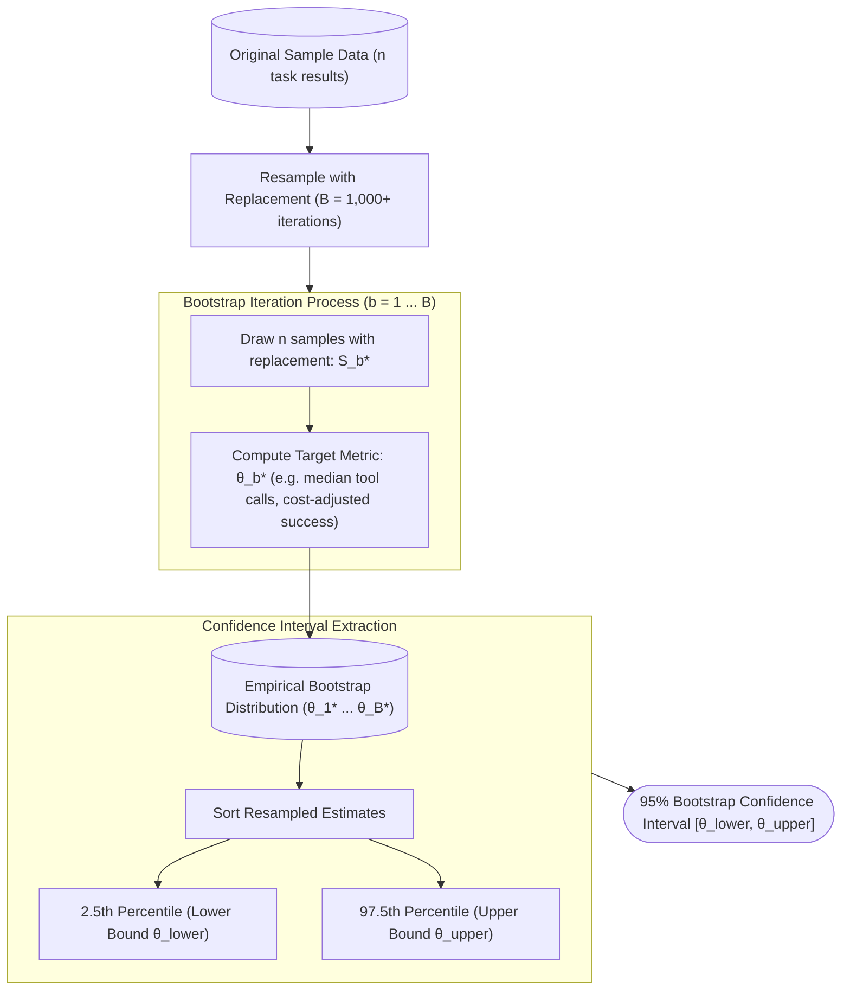

# Rigorous Agent Evaluation: Statistical Methodology

**智能体评估的统计学方法论**

| Field   | English                                                       | 中文                                       |
| ------- | ------------------------------------------------------------- | ------------------------------------------ |
| Level   | Advanced                                                      | 高级                                       |
| Cluster | Multi-Agent Systems & Evaluation                              | 多智能体系统与评估                         |
| Author  | Dr. Mireille Dubois, Research Scientist — LLM Systems, ANU-00 | ANU-00 LLM 系统研究员 Mireille Dubois 博士 |

---

## 0. Where This Module Fits

**本模块的定位**

[`intermediate/08`](/academic-neural-unit-00/curriculum/intermediate/08-evaluating-agent-systems-benchmarks-and-methodology.md) formalized agent evaluation into named benchmarks, defined pass@k, introduced
LLM-as-judge methodology and its biases, and — in its [§7](#7-the-multiple-comparisons-problem-testing-across-many-benchmarks) and [§8](#8-passk-revisited-estimator-variance-and-the-passk-reliability-metric) — flagged that a multi-agent
system's performance is a _distribution_ across repeated runs rather than a single number, without
giving the tools to say precisely how uncertain that distribution leaves us. This module supplies
those tools: confidence intervals for a success rate, formal significance testing for comparing two
systems, the statistical properties of pass@k made precise, and a rigorous treatment of inter-rater
agreement.

[`intermediate/08`](/academic-neural-unit-00/curriculum/intermediate/08-evaluating-agent-systems-benchmarks-and-methodology.md)已将智能体评估形式化为具名的基准测试，定义了 pass@k，介绍了 LLM 评判方法论及其偏差，并在其[第 7 节](#7-the-multiple-comparisons-problem-testing-across-many-benchmarks)与[第 8 节](#8-passk-revisited-estimator-variance-and-the-passk-reliability-metric)中指出，多智能体系统的表现是重复运行所形成的一个**分布**，而非单一数字——但尚未给出精确表述这一分布留给我们多大不确定性的工具。本模块正是要提供这些工具：成功率的置信区间、比较两个系统的正式显著性检验、对 pass@k 统计性质的精确刻画，以及对评分者间一致性的严谨处理。

It also draws on [`intermediate/01`](/academic-neural-unit-00/curriculum/intermediate/01-training-dynamics-optimization-and-generalization.md)'s treatment of the bias–variance tradeoff and [`advanced/01`](/academic-neural-unit-00/curriculum/advanced/01-scaling-laws-and-emergent-capabilities.md)'s
treatment of extrapolating a noisy empirical trend, and on [`advanced/07`](/academic-neural-unit-00/curriculum/advanced/07-multi-agent-orchestration-worktree-isolation-and-consensus.md)'s named consensus
mechanisms (self-consistency, multiagent debate) as concrete sources of the variance this module
learns to quantify. Every formula below traces to a verified, cited source, per
`curriculum/README.md` [§5](#5-the-bootstrap-confidence-intervals-without-a-closed-form).

本模块还借助了[`intermediate/01`](/academic-neural-unit-00/curriculum/intermediate/01-training-dynamics-optimization-and-generalization.md)对偏差—方差权衡的论述，[`advanced/01`](/academic-neural-unit-00/curriculum/advanced/01-scaling-laws-and-emergent-capabilities.md)对如何外推一条带噪声经验趋势的论述，以及[`advanced/07`](/academic-neural-unit-00/curriculum/advanced/07-multi-agent-orchestration-worktree-isolation-and-consensus.md)中具名的共识机制（自洽性、多智能体辩论），将其作为本模块所要量化的方差的具体来源。以下每一条公式，均按`curriculum/README.md`[第 5 节](#5-the-bootstrap-confidence-intervals-without-a-closed-form)的要求，可追溯到一个经核实的引用来源。

---

## 1. Why a Single Run Is Not Evidence: Sources of Variance

**为何单次运行不能算作证据：方差的来源**

[`intermediate/08` §7](/academic-neural-unit-00/curriculum/intermediate/08-evaluating-agent-systems-benchmarks-and-methodology.md#7-evaluating-multi-agent-systems-formalizing-the-6-concern-from-introductory08) named the core problem for multi-agent evaluation: repeated runs of the exact
same task can produce different outcomes. It is worth being precise about where this variance
actually comes from, because different sources call for different statistical treatment.

[`intermediate/08` 第 7 节](/academic-neural-unit-00/curriculum/intermediate/08-evaluating-agent-systems-benchmarks-and-methodology.md#7-evaluating-multi-agent-systems-formalizing-the-6-concern-from-introductory08)指出了多智能体评估的核心问题：同一任务的重复运行可能产生不同的结果。有必要精确说明这种方差究竟源自何处，因为不同的来源需要不同的统计处理方式。

| # | Source | EN | 中文 || --- | --------------------------------------------- | ------------------------------------------------------------------------------------------------------------------------------------------------------------------------------------------------------------------------------------------------------------------------------------------------------------------------------------------------------------------------------ | ---------------------------------------------------------------------------------------------------------------------------------------------------------------------------------------------------------------------------------------------------------------------- || 1 | **Sampling variance in the LLM's own output** | at any non-zero temperature, the same prompt produces a different token sequence each time, the same mechanism [`intermediate/05` §3](/academic-neural-unit-00/curriculum/intermediate/05-advanced-prompting-cot-few-shot-structured-output.md#3-self-consistency-sampling-multiple-reasoning-paths) exploited deliberately for self-consistency and [`advanced/07` §7](/academic-neural-unit-00/curriculum/advanced/07-multi-agent-orchestration-worktree-isolation-and-consensus.md#7-semantic-consensus-among-llm-agents) built on for multiagent debate — this is randomness by design, not a bug, but it means a single sample is a single draw from a distribution, not the distribution itself. | 在任何非零温度下，同一提示词每次都会产生不同的词元序列——[`intermediate/05` 第 3 节](/academic-neural-unit-00/curriculum/intermediate/05-advanced-prompting-cot-few-shot-structured-output.md#3-self-consistency-sampling-multiple-reasoning-paths)正是刻意利用了这一机制来实现自洽性，[`advanced/07` 第 7 节](/academic-neural-unit-00/curriculum/advanced/07-multi-agent-orchestration-worktree-isolation-and-consensus.md#7-semantic-consensus-among-llm-agents)的多智能体辩论也建立在此机制之上——这是设计使然的随机性，而非缺陷，但这意味着单一样本只是对某个分布的一次抽取，而非该分布本身。 || 2 | **Sampling variance in the task set** | the benchmark's own tasks are themselves a finite sample from a much larger space of possible tasks ([`intermediate/08` §1](/academic-neural-unit-00/curriculum/intermediate/08-evaluating-agent-systems-benchmarks-and-methodology.md#1-from-an-informal-test-set-to-a-formal-benchmark)'s task-diversity requirement), so even a deterministic agent's measured success rate on, say, 50 tasks is an estimate of its true success rate on the full population of tasks it might encounter, not that true rate itself. | 基准测试自身的任务，本就是从一个远为庞大的可能任务空间中抽取的有限样本（见[`intermediate/08` 第 1 节](/academic-neural-unit-00/curriculum/intermediate/08-evaluating-agent-systems-benchmarks-and-methodology.md#1-from-an-informal-test-set-to-a-formal-benchmark)的任务多样性要求），因此即便是一个确定性智能体，其在比如 50 项任务上测得的成功率，也只是对其在可能遇到的全部任务总体上真实成功率的一个估计，而非真实成功率本身。 || 3 | **Environment nondeterminism** | a live tool, a flaky network call, or another agent's own sampling variance in a MAS ([`introductory/03` §6](/academic-neural-unit-00/curriculum/introductory/03-what-is-an-ai-agent-concepts-and-the-agent-loop.md#6-the-environment-what-the-agent-perceives-and-acts-upon)'s stochastic-environment concept, extended to the multi-agent case) can change outcomes independent of anything the agent under test did differently. | 某个实时工具、一次不稳定的网络调用，或 MAS 中另一个智能体自身的采样方差（[`introductory/03` 第 6 节](/academic-neural-unit-00/curriculum/introductory/03-what-is-an-ai-agent-concepts-and-the-agent-loop.md#6-the-environment-what-the-agent-perceives-and-acts-upon)随机性环境的概念，在此被扩展到多智能体情形），都可能在被测智能体本身没有任何不同做法的情况下改变结果。 |

All three sources point to the same conclusion: a single number from a single run is a point
estimate, and every point estimate needs an accompanying statement of how much it might be wrong by.

这三种来源都指向同一个结论：单次运行得出的单一数字只是一个点估计，而每一个点估计都需要附带一份关于它可能偏差多大的说明。

---

## 2. The Wilson Score Interval: Confidence Bounds for a Success Rate

**Wilson 得分区间：成功率的置信区间**

The most basic agent-evaluation number — success rate on n tasks — is a proportion, and the
statistics of estimating a true proportion p from a limited sample is a classical problem with a
classical solution.

智能体评估中最基础的数字——n 项任务上的成功率——本质上是一个比例，而由有限样本估计真实比例 p 的统计学问题，是一个有着经典解法的经典问题。

Edwin Wilson's 1927 paper on the subject derived what is now called the **Wilson score
interval（Wilson 得分区间）**, a confidence interval for a binomial proportion that avoids a specific
known flaw of the more commonly taught "textbook" formula (the Wald interval): the Wald interval can
produce nonsensical bounds — such as an interval extending below 0% or above 100% — precisely in the
small-sample, extreme-proportion regime that agent evaluation runs into constantly (few tasks, and
either very high or very low success rates).

Edwin Wilson 在其 1927 年关于此课题的论文中，推导出了如今被称为 **Wilson 得分区间**的公式，这是二项比例的一种置信区间，避免了更常见的“教科书式”公式（Wald 区间）一个已知的具体缺陷：Wald 区间可能给出不合理的边界——例如区间下限低于 0% 或上限高于 100%——而这恰恰发生在智能体评估中反复遇到的小样本、极端比例的情形下（任务数不多，且成功率要么很高要么很低）。

Given $n$ trials with $c$ observed successes, $\hat{p} = c/n$, and a $z$-value corresponding to the
desired confidence level ($z = 1.96$ for a conventional 95% interval), the Wilson score interval is:

给定 $n$ 次试验中观察到 $c$ 次成功， $\hat{p} = c/n$，以及对应所需置信水平的 $z$ 值（常规 95% 置信区间对应 $z = 1.96$），Wilson 得分区间为：

$$\tilde{p} = \frac{\hat{p} + \dfrac{z^2}{2n} \pm z\sqrt{\dfrac{\hat{p}(1-\hat{p})}{n} + \dfrac{z^2}{4n^2}}}{1 + \dfrac{z^2}{n}}$$

The interval is asymmetric around $\hat{p}$ and, unlike the Wald interval, is always contained
within $[0, 1]$, which is precisely why it is the recommended default for reporting a success-rate
confidence interval in agent evaluation rather than the simpler-looking but less reliable Wald
formula. [`advanced/01` §2](/academic-neural-unit-00/curriculum/advanced/01-scaling-laws-and-emergent-capabilities.md#2-the-kaplan-et-al-power-law-picture) built a power-law formula from Kaplan et al.'s empirical fit and then, in
[§3](#3-worked-example-wilson-intervals-for-two-candidate-agent-harnesses), worked a concrete numeric extrapolation from it; [§3](#3-worked-example-wilson-intervals-for-two-candidate-agent-harnesses) below follows the identical pattern for the
Wilson interval.

该区间围绕 $\hat{p}$ 是不对称的，并且与 Wald 区间不同，它始终被包含在 $[0, 1]$ 范围之内，这正是为什么在智能体评估中报告成功率置信区间时，推荐将其作为默认选择，而不是那个看起来更简单、却不够可靠的 Wald 公式。[`advanced/01` 第 2 节](/academic-neural-unit-00/curriculum/advanced/01-scaling-laws-and-emergent-capabilities.md#2-the-kaplan-et-al-power-law-picture)根据 Kaplan 等人的经验拟合构建了一个幂律公式，随后在[第 3 节](#3-worked-example-wilson-intervals-for-two-candidate-agent-harnesses)据此给出了一个具体的数值外推；下文[第 3 节](#3-worked-example-wilson-intervals-for-two-candidate-agent-harnesses)将对 Wilson 区间遵循完全相同的处理模式。

---

## 3. Worked Example: Wilson Intervals for Two Candidate Agent Harnesses

**实例演练：两种候选智能体运行框架的 Wilson 区间**

Suppose two candidate harnesses for the same coding-assistant task (the kind of harness introduced
architecturally in [`advanced/03`](/academic-neural-unit-00/curriculum/advanced/03-agent-harness-engineering-production-grade-agent-loops.md)) are each run once on the same held-out set of 50 tasks. Harness A
succeeds on 42 tasks ($\hat{p} = 0.84$); Harness B succeeds on 37 tasks ($\hat{p} = 0.74$). Applying
the [§2](#2-the-wilson-score-interval-confidence-bounds-for-a-success-rate) formula with $n = 50$ and $z = 1.96$:

假设为同一个编程助手任务设计的两种候选运行框架（即[`advanced/03`](/academic-neural-unit-00/curriculum/advanced/03-agent-harness-engineering-production-grade-agent-loops.md)在架构层面所介绍的那类运行框架），分别在同一份包含 50 项任务的留出测试集上各运行一次。运行框架 A 在 42 项任务上成功（$\hat{p} = 0.84$）；运行框架 B 在 37 项任务上成功（$\hat{p} = 0.74$）。以 $n = 50$、$z = 1.96$ 代入[第 2 节](#2-the-wilson-score-interval-confidence-bounds-for-a-success-rate)的公式：

- Harness A: $\hat{p} = 0.84$ → 95% Wilson interval $\approx [0.715, 0.917]$ (71.5%–91.7%)
- Harness B: $\hat{p} = 0.74$ → 95% Wilson interval $\approx [0.605, 0.841]$ (60.5%–84.1%)

The raw success rates look ten points apart, which might read as a clear win for Harness A. The
confidence intervals tell a more careful story: they overlap substantially, from 71.5% to 84.1%,
meaning this sample of 50 tasks alone does not let us confidently rule out the possibility that the
two harnesses have the same true success rate and the observed gap is sampling noise.

原始成功率相差十个百分点，乍看之下似乎是运行框架 A 明显胜出。但置信区间讲述了一个更审慎的故事：二者的区间大幅重叠，重叠范围从 71.5% 到 84.1%，这意味着仅凭这 50 项任务的样本，我们尚无法有信心排除“两种运行框架真实成功率其实相同、观察到的差距只是抽样噪声”这一可能性。

This is exactly the failure mode [`intermediate/08` §9](/academic-neural-unit-00/curriculum/intermediate/08-evaluating-agent-systems-benchmarks-and-methodology.md#9-common-methodological-pitfalls-at-this-level) named leaderboard chasing guards against: a
single headline number, reported without its interval, invites exactly the overconfident "A beats B"
conclusion this worked example shows is not yet justified. [§6](#6-mcnemars-test-comparing-two-systems-on-the-same-test-set) below returns to this same pair of
harnesses with a test built for exactly this situation — two systems compared on the _same_ set of
paired tasks.

这正是 [`intermediate/08` 第 9 节](/academic-neural-unit-00/curriculum/intermediate/08-evaluating-agent-systems-benchmarks-and-methodology.md#9-common-methodological-pitfalls-at-this-level)所指出的追逐排行榜这一失效模式所要防范的情形：若只报告一个亮眼的头条数字、却不附带其置信区间，恰恰会诱导得出“A 胜过 B”这种过度自信的结论，而本实例演练表明，这一结论目前尚不成立。下文[第 6 节](#6-mcnemars-test-comparing-two-systems-on-the-same-test-set)将针对这同一对运行框架，运用一种恰恰是为此类情形而设计的检验方法——在*同一*组配对任务上比较两个系统。

---

## 4. When the Normal Approximation Breaks: Small-Sample LLM Evaluation

**正态近似失效之时：小样本 LLM 评估**

The Wilson interval in [§2](#2-the-wilson-score-interval-confidence-bounds-for-a-success-rate) is still, ultimately, built on a normal (Gaussian) approximation to the
binomial distribution, justified by the Central Limit Theorem (CLT) — an approximation that gets
better as the sample size grows and can be poor when it is small. This matters specifically for
agent evaluation because many of the named benchmarks from [`intermediate/08` §3](/academic-neural-unit-00/curriculum/intermediate/08-evaluating-agent-systems-benchmarks-and-methodology.md#3-a-tour-of-named-agent-benchmarks) are, by research
standards, small: GAIA's validation split has 165 questions, and many specialized or newly
constructed agent benchmarks have far fewer.

[第 2 节](#2-the-wilson-score-interval-confidence-bounds-for-a-success-rate)的 Wilson 区间，归根结底仍是建立在中心极限定理（CLT）所支持的、对二项分布的正态（高斯）近似之上——这种近似随样本量增大而愈发精确，样本量较小时则可能失准。这一点对智能体评估尤为重要，因为[`intermediate/08` 第 3 节](/academic-neural-unit-00/curriculum/intermediate/08-evaluating-agent-systems-benchmarks-and-methodology.md#3-a-tour-of-named-agent-benchmarks)所列举的许多具名基准测试，按研究标准而言规模都不大：GAIA 的验证集只有 165 道题，而许多专用或新构建的智能体基准测试规模更小。

Sam Bowyer, Laurence Aitchison, and Desi Ivanova's 2025 position paper, accepted at ICML 2025, makes
exactly this point directly for LLM evaluation: they show that CLT-based uncertainty estimates,
while appropriate for benchmarks with thousands of examples, "usually dramatically underestimate
uncertainty" — meaning error bars come out too small and misleadingly confident — once a benchmark
shrinks to the scale common in specialized LLM and agent evaluation, and they recommend alternative
frequentist and Bayesian methods better suited to this small-sample regime.

Sam Bowyer、Laurence Aitchison 与 Desi Ivanova 2025 年被 ICML 2025 接收的立场论文，正是针对 LLM 评估提出了这一论点：他们指出，基于 CLT 的不确定性估计虽然适用于拥有数千个样本的基准测试，但一旦基准测试规模缩小到专用 LLM 与智能体评估中常见的水平，就“通常会严重低估不确定性”——意味着误差区间估计得过窄，从而带来误导性的过度自信——他们建议改用更适合这一小样本情形的替代性频率派与贝叶斯方法。

The practical implication for this curriculum's reader: the Wilson interval from [§2](#2-the-wilson-score-interval-confidence-bounds-for-a-success-rate) is a substantial
improvement over the naive Wald interval, but it is not a substitute for recognizing that any
interval computed from, say, 20 or 30 tasks should be treated with real caution about just how tight
its true uncertainty is, and that the bootstrap method in [§5](#5-the-bootstrap-confidence-intervals-without-a-closed-form) is one of the more robust alternatives
available for exactly this regime.

这对本课程读者的实际启示是：[第 2 节](#2-the-wilson-score-interval-confidence-bounds-for-a-success-rate)的 Wilson 区间相较于朴素的 Wald 区间已是重大改进，但它并不能替代这样一种认识——仅凭比如 20 或 30 项任务计算出的任何区间，都应对其真实不确定性究竟有多“紧”保持真正的谨慎，而下文[第 5 节](#5-the-bootstrap-confidence-intervals-without-a-closed-form)的自助法，正是适用于这一情形的更稳健的替代方法之一。

---

## 5. The Bootstrap: Confidence Intervals Without a Closed Form

**自助法：无需封闭公式的置信区间**

Not every metric an agent-evaluation practitioner cares about has a clean formula like the Wilson interval — how would one build a confidence interval around, say, the _median_ number of tool calls an agent used, or a more complex cost-adjusted score combining success rate and token spend ([`intermediate/08` §2](/academic-neural-unit-00/curriculum/intermediate/08-evaluating-agent-systems-benchmarks-and-methodology.md#2-designing-an-agent-benchmark-what-makes-it-different-from-an-llm-benchmark)'s dual-metric point)? Bradley Efron and Robert Tibshirani's 1993 textbook _An Introduction to the Bootstrap_ introduced a general-purpose answer: the **bootstrap（自助法 / 自助抽样法）**.

并非每一个智能体评估从业者关心的指标，都像 Wilson 区间那样拥有简洁的公式——比如，该如何为智能体所使用工具调用次数的*中位数*，或是一个结合了成功率与词元花费的更复杂的成本调整分数（[`intermediate/08` 第 2 节](/academic-neural-unit-00/curriculum/intermediate/08-evaluating-agent-systems-benchmarks-and-methodology.md#2-designing-an-agent-benchmark-what-makes-it-different-from-an-llm-benchmark)所述的双指标要点），构建置信区间呢？ Bradley Efron 与 Robert Tibshirani 1993 年的教科书《An Introduction to the Bootstrap》提出了一种通用的解答：**自助法**。

Given the original sample of n task results, the bootstrap repeatedly draws a new sample of size n
_with replacement_ from that original sample (so some results appear more than once and others not
at all in a given resample), computes the metric of interest on this resampled data, and repeats
this process many times (commonly $B = 1{,}000$ or more resamples) to build up an entire empirical
distribution of the metric — the spread of that distribution is then used directly as the confidence
interval, typically by taking its 2.5th and 97.5th percentiles for a 95% interval (the **percentile
method**, one of several bootstrap variants Efron and Tibshirani's book covers, including a
bias-corrected version for cases where the resampled distribution is itself skewed).

给定原始的 n 项任务结果样本，自助法反复地从该原始样本中*有放回地*抽取一份新的、大小同样为 n 的样本（因此在某一次重抽样中，某些结果可能出现多次，另一些则可能一次也不出现），在这份重抽样数据上计算所关心的指标，并将这一过程重复多次（通常重抽样 $B = 1{,}000$ 次或更多），从而构建出该指标的一整个经验分布——随后直接用该分布的离散程度作为置信区间，通常取其第 2.5 与第 97.5 百分位数作为 95% 置信区间（**百分位法**，这是 Efron 与 Tibshirani 书中所涵盖的若干自助法变体之一，另有一种针对重抽样分布本身存在偏斜情形的偏差校正版本）。

The bootstrap requires no assumption about the underlying distribution's shape, which is precisely
what makes it useful as a check on, or an alternative to, the normal-approximation methods of [§2](#2-the-wilson-score-interval-confidence-bounds-for-a-success-rate) and
[§4](#4-when-the-normal-approximation-breaks-small-sample-llm-evaluation) — at the cost of needing repeated computation rather than a single formula evaluation.

自助法不需要对底层分布的形状做任何假设，这正是它之所以能够作为[第 2 节](#2-the-wilson-score-interval-confidence-bounds-for-a-success-rate)与[第 4 节](#4-when-the-normal-approximation-breaks-small-sample-llm-evaluation)正态近似方法的检验或替代方案的原因——代价是需要反复计算，而非一次性求值一个公式。

The flowchart below illustrates the computational pipeline of bootstrap resampling for
non-closed-form agent evaluation metrics:

下面的流程图直观展示了针对非封闭公式智能体评估指标的自助抽样计算流水线：



---

## 6. McNemar's Test: Comparing Two Systems on the Same Test Set

**McNemar 检验：在同一测试集上比较两个系统**

[§3](#3-worked-example-wilson-intervals-for-two-candidate-agent-harnesses) left Harnesses A and B in an ambiguous state — overlapping confidence intervals, no confident
verdict. Comparing two systems on the _same_ set of paired tasks (rather than two independent
samples) is a more powerful comparison than comparing their two separate confidence intervals,
because it can use information the separate-interval view throws away: on how many _specific_ tasks
did the two systems actually disagree?

[第 3 节](#3-worked-example-wilson-intervals-for-two-candidate-agent-harnesses)让运行框架 A 与 B 停留在一种含糊不明的状态——置信区间相互重叠，无法给出确信的定论。在 *同一*组配对任务上比较两个系统（而非比较两组独立样本），是一种比分别比较两个置信区间更有效力的比较方式，因为它能够利用分别比较区间时会丢弃的信息：这两个系统究竟在哪些*具体*任务上出现了分歧？

Quinn McNemar's 1947 paper introduced exactly this test for paired binary outcomes. The data is
organized into a $2\times 2$ table of the four possible pairings — both succeed, both fail, A
succeeds and B fails, A fails and B succeeds — and the test statistic depends only on the two
_discordant_ cells, conventionally labeled $b$ (A succeeds, B fails) and $c$ (A fails, B succeeds),
since the concordant cells (both succeed, both fail) provide no information about which system is
better:

Quinn McNemar 1947 年的论文正是为配对二元结果提出了这样一种检验。数据被整理成一张 $2\times 2$ 表格，涵盖四种可能的配对情形——二者皆成功、二者皆失败、A 成功而 B 失败、A 失败而 B 成功——而检验统计量只依赖于两个*不一致*的单元格，通常记为 $b$（A 成功、B 失败）与 $c$（A 失败、B 成功），因为一致的单元格（二者皆成功、二者皆失败）并不能提供任何关于哪个系统更优的信息：

McNemar's chi-squared statistic (with continuity correction):

$$\chi^2 = \frac{(|b - c| - 1)^2}{b + c}, \quad \text{with 1 degree of freedom}$$

Continuing the [§3](#3-worked-example-wilson-intervals-for-two-candidate-agent-harnesses) example with the paired outcomes filled in: of the 50 tasks, both harnesses
succeed on 35, both fail on 6, A succeeds while B fails on 7, and A fails while B succeeds on 2
(consistent with A's 42 total successes and B's 37). Here $b = 7$, $c = 2$, giving $\chi^2 = (|7 -
2| - 1)^2 / (7 + 2) = 16 / 9 \approx 1.78$.

延续[第 3 节](#3-worked-example-wilson-intervals-for-two-candidate-agent-harnesses)的例子并补充配对结果：在这 50 项任务中，二者皆成功的有 35 项，皆失败的有 6 项，A 成功而 B 失败的有 7 项，A 失败而 B 成功的有 2 项（与 A 共 42 次成功、B 共 37 次成功相符）。此处 $b = 7$，$c = 2$，得出 $\chi^2 = (|7 - 2| - 1)^2 / (7 + 2) = 16 / 9 \approx 1.78$。

Against the standard critical value of 3.84 for 1 degree of freedom at the conventional $\alpha =
0.05$ significance threshold, 1.78 falls short — McNemar's test agrees with the overlapping-interval
read from [§3](#3-worked-example-wilson-intervals-for-two-candidate-agent-harnesses): this sample does not provide statistically significant evidence that Harness A is
genuinely better, despite the visually striking ten-point gap in raw success rate. Both [§3](#3-worked-example-wilson-intervals-for-two-candidate-agent-harnesses) and this
section illustrate the same broader lesson from different angles: with only 50 paired tasks and only
9 tasks where the systems actually disagreed, there simply is not enough evidence yet to declare a
winner.

相较于自由度为 1、常规 $\alpha = 0.05$ 显著性阈值下 3.84 的标准临界值，1.78 未能达标——McNemar 检验的结论与[第 3 节](#3-worked-example-wilson-intervals-for-two-candidate-agent-harnesses)区间重叠的解读相一致：尽管原始成功率之间存在视觉上颇为醒目的十个百分点差距，但这份样本尚不足以提供统计显著的证据，证明运行框架 A 真正更优。[第 3 节](#3-worked-example-wilson-intervals-for-two-candidate-agent-harnesses)与本节从不同角度阐明了同一个更普遍的教训：仅凭 50 项配对任务、且两个系统实际产生分歧的任务只有 9 项，目前尚不足以宣布获胜者。

---

## 7. The Multiple-Comparisons Problem: Testing Across Many Benchmarks

**多重比较问题：跨多个基准测试进行检验**

[`intermediate/08` §3](/academic-neural-unit-00/curriculum/intermediate/08-evaluating-agent-systems-benchmarks-and-methodology.md#3-a-tour-of-named-agent-benchmarks) named five different benchmarks; a real evaluation effort frequently tests a
new agent system against several of them at once, and this creates a subtle statistical trap.

[`intermediate/08` 第 3 节](/academic-neural-unit-00/curriculum/intermediate/08-evaluating-agent-systems-benchmarks-and-methodology.md#3-a-tour-of-named-agent-benchmarks)列举了五个不同的基准测试；一次真正的评估工作往往会同时在其中若干个上测试一个新的智能体系统，而这会产生一个微妙的统计学陷阱。

A significance test run at the conventional $\alpha = 0.05$ threshold accepts, by construction, a 5%
chance of a **false positive** — concluding a real difference exists when it does not — on any
single comparison. Run five independent comparisons (say, McNemar's test from [§6](#6-mcnemars-test-comparing-two-systems-on-the-same-test-set) applied separately
on SWE-bench, WebArena, AgentBench, GAIA, and τ-bench results) and the probability that _at least
one_ of them produces a false positive purely by chance rises well above 5% — this is the
**multiple-comparisons problem**.

以常规 $\alpha = 0.05$ 阈值运行的显著性检验，就其构造而言，在任意一次单独的比较中都接受 5% 的**假阳性**概率——即在实际并无差异的情况下，却得出存在真实差异的结论。若独立运行五次比较（比如分别在 SWE-bench、 WebArena、AgentBench、GAIA 与 τ-bench 的结果上各运行一次[第 6 节](#6-mcnemars-test-comparing-two-systems-on-the-same-test-set)的 McNemar 检验），那么*至少一次*纯属偶然产生假阳性的概率会大幅高于 5%——这就是**多重比较问题**。

The simplest standard correction, attributed to Carlo Emilio Bonferroni's foundational work in
probability inequalities, is the **Bonferroni correction（Bonferroni 校正）**: for $m$ comparisons at a
desired overall significance level $\alpha$, require each individual test to clear the stricter
threshold $\alpha/m$ rather than $\alpha$ itself — for the five-benchmark case above, each
individual test would need to clear $0.05/5 = 0.01$, not $0.05$, to be reported as significant.

最简单的标准校正方法，归功于 Carlo Emilio Bonferroni 在概率不等式方面的奠基性工作，即 **Bonferroni 校正**：对于 $m$ 次比较、期望的总体显著性水平为 $\alpha$，要求每一次单独检验都要越过更严格的阈值 $\alpha/m$，而非 $\alpha$ 本身——对上述五个基准测试的情形，每一次单独检验都需要越过 $0.05/5 = 0.01$，而非 $0.05$，才能被报告为显著。

Rotem Dror and colleagues' 2018 paper "The Hitchhiker's Guide to Testing Statistical Significance in
Natural Language Processing," presented at ACL, surveys this and related correction procedures
specifically for NLP evaluation practice and provides a practical protocol for choosing an
appropriate significance test in the first place — a directly relevant companion to McNemar's test
in [§6](#6-mcnemars-test-comparing-two-systems-on-the-same-test-set) for the paired, discrete-outcome case common in agent evaluation. The practical lesson: a
claim like "our agent beat the baseline on 3 of 5 benchmarks" is a weaker claim than it sounds
unless the significance threshold used for each of those five tests was actually adjusted for having
run five of them.

Rotem Dror 及其合作者 2018 年发表于 ACL 的论文《The Hitchhiker's Guide to Testing Statistical Significance in Natural Language Processing》，专门针对 NLP 评估实践综述了这一及相关的校正程序，并提供了一套如何首先选择恰当显著性检验的实用协议——这与[第 6 节](#6-mcnemars-test-comparing-two-systems-on-the-same-test-set)中针对智能体评估常见的配对离散结果情形所用的 McNemar 检验，是直接相关的配套方法。其实践教训是：“我们的智能体在五个基准测试中的三个上超过了基线”这样的说法，若这五次检验所用的显著性阈值并未真正针对“进行了五次检验”这一事实作出调整，那么该说法实际上比听起来要弱得多。

---

## 8. pass@k Revisited: Estimator Variance and the pass^k Reliability Metric

**pass@k 再探：估计量方差与 pass^k 可靠性指标**

[`intermediate/08` §4](/academic-neural-unit-00/curriculum/intermediate/08-evaluating-agent-systems-benchmarks-and-methodology.md#4-metrics-for-agent-evaluation-success-rate-and-passk) gave Chen et al.'s (2021) unbiased pass@k estimator without examining its
statistical behavior; that behavior matters directly for the small-sample caution of [§4](#4-when-the-normal-approximation-breaks-small-sample-llm-evaluation) above,
because pass@k for a large $k$ computed from a small number of drawn samples $n$ can have
substantial variance even though the estimator itself is unbiased — unbiasedness guarantees the
estimator is correct _on average_ across many hypothetical benchmark runs, not that any single
computed value is close to the true value. A second, more recent metric addresses a different
question entirely.

[`intermediate/08` 第 4 节](/academic-neural-unit-00/curriculum/intermediate/08-evaluating-agent-systems-benchmarks-and-methodology.md#4-metrics-for-agent-evaluation-success-rate-and-passk)给出了 Chen 等人（2021）提出的无偏 pass@k 估计量，却未考察其统计行为；这一行为直接关系到上文[第 4 节](#4-when-the-normal-approximation-breaks-small-sample-llm-evaluation)所述的小样本警示，因为对于较大的 $k$、而抽取样本数 $n$ 较小的情形，pass@k 即便本身是无偏的，也可能具有相当大的方差——无偏性所保证的，只是该估计量在众多假想的基准测试重复运行中“平均而言”是正确的，而并不意味着任何单次计算出的具体数值都接近真实值。另有一个更新近的指标，回答的则是一个完全不同的问题。

Shunyu Yao and colleagues, in the 2024 τ-bench paper already named in [`intermediate/08` §3](/academic-neural-unit-00/curriculum/intermediate/08-evaluating-agent-systems-benchmarks-and-methodology.md#3-a-tour-of-named-agent-benchmarks), observed
that pass@k answers "can the agent solve this at least once in k tries" — a discovery-oriented
question well suited to research settings where a best-of-many attempt is acceptable — but a
production system serving real users needs a different, stricter question: will it succeed _every
single time_ it is asked, not just at least once. Their paper introduces **pass^k（读作 "pass-hat-k"）**
for exactly this reliability question, defined analogously to pass@k but requiring _all_ k sampled
trials to succeed rather than at least one, with the same combinatorial structure:

Shunyu Yao 及其合作者，在[`intermediate/08` 第 3 节](/academic-neural-unit-00/curriculum/intermediate/08-evaluating-agent-systems-benchmarks-and-methodology.md#3-a-tour-of-named-agent-benchmarks)已提及的 2024 年 τ-bench 论文中观察到，pass@k 回答的是“智能体能否在 k 次尝试中至少成功一次”——这是一个偏重“发现”的问题，适合于可以接受多次尝试中挑最优结果的研究场景——但一个服务真实用户的生产系统需要的是一个不同、更严格的问题：它是否*每一次*被要求执行任务时都能成功，而不仅仅是至少成功一次。他们的论文正是为了这一可靠性问题引入了 **pass^k（读作 "pass-hat-k"）**，其定义方式与 pass@k 类比，但要求 k 次采样的全部试验都成功，而非至少一次成功，采用相同的组合数学结构：

$$\text{pass}^k := \mathbb{E}_{\text{task}}\left[\frac{\binom{c}{k}}{\binom{n}{k}}\right] \quad \text{(probability that ALL } k \text{ trials succeed)}$$

$$\text{pass@}k := \mathbb{E}_{\text{task}}\left[1 - \frac{\binom{n-c}{k}}{\binom{n}{k}}\right] \quad \text{(probability that AT LEAST ONE trial succeeds)}$$

Worked example: a task is sampled $n = 10$ times, with $c = 6$ successes. `pass@5` computes to $1 -
\binom{4}{5}/\binom{10}{5} = 1 - 0/252 = 1.0$ — since only 4 of the 10 samples failed, any group of
5 samples is mathematically guaranteed to contain at least one success, so pass@5 reports perfect
reliability.

实例演练：某任务被采样 $n = 10$ 次，其中 $c = 6$ 次成功。 `pass@5` 计算为 $1 - \binom{4}{5}/\binom{10}{5} = 1 - 0/252 = 1.0$——由于 10 个样本中只有 4 个失败，任意一组 5 个样本在数学上必然至少包含一次成功，因此 pass@5 报告出完美的可靠性。

`pass^5`, on the same data, computes to $\binom{6}{5}/\binom{10}{5} = 6/252 \approx 0.024$ — only a
2.4% chance that a given group of 5 trials are _all_ successful. The contrast is stark and exactly
the point: a 60% single-attempt success rate looks nearly perfect through the pass@k lens and nearly
unusable through the pass^k lens, and choosing the wrong lens for the actual deployment question —
"can it eventually succeed" versus "can it be trusted every time" — produces a misleadingly
optimistic or pessimistic conclusion from the identical underlying data.

而同一份数据上的 `pass^5`，计算为 $\binom{6}{5}/\binom{10}{5} = 6/252 \approx 0.024$——某一组 5 次试验*全部*成功的概率只有 2.4%。这一对比十分鲜明，也正是要害所在：60% 的单次尝试成功率，透过 pass@k 的视角看几乎完美，透过 pass^k 的视角看却近乎不可用，而针对实际部署所要回答的问题——“它最终能否成功”还是“它是否每次都值得信赖”——选错了衡量视角，就会从完全相同的底层数据中，得出误导性的过度乐观或过度悲观的结论。

---

## 9. Quantifying LLM-as-Judge Agreement: A Worked Cohen's Kappa Calculation

**量化 LLM 评判的一致性：Cohen's kappa 系数实例计算**

[`intermediate/08` §6](/academic-neural-unit-00/curriculum/intermediate/08-evaluating-agent-systems-benchmarks-and-methodology.md#6-human-evaluation-and-measuring-whether-human-raters-agree) introduced Cohen's (1960) kappa coefficient and Landis and Koch's (1977)
interpretation scale without a worked numeric example; one belongs here, since a headline
percent-agreement figure (like the "over 80%" agreement Zheng et al.'s 2023 study reported for GPT-4
as judge, per [`intermediate/08` §5](/academic-neural-unit-00/curriculum/intermediate/08-evaluating-agent-systems-benchmarks-and-methodology.md#5-llm-as-judge-methodology-in-full-prompting-bias-and-calibration)) can obscure a much less impressive kappa once chance agreement
is properly subtracted out. Suppose a human rater and an LLM judge each grade 20 outputs of an agent
system as "pass" or "fail," with the results forming this contingency table:

[`intermediate/08` 第 6 节](/academic-neural-unit-00/curriculum/intermediate/08-evaluating-agent-systems-benchmarks-and-methodology.md#6-human-evaluation-and-measuring-whether-human-raters-agree)介绍了 Cohen（1960）的 kappa 系数以及 Landis 与 Koch（1977）的解读量表，但未给出具体的数值演算实例；此处正应补上，因为一个亮眼的原始一致率数字（例如 [`intermediate/08` 第 5 节](/academic-neural-unit-00/curriculum/intermediate/08-evaluating-agent-systems-benchmarks-and-methodology.md#5-llm-as-judge-methodology-in-full-prompting-bias-and-calibration)所述、Zheng 等人 2023 年研究报告的 GPT-4 作为评判者时“超过 80%”的一致率）一旦恰当扣除偶然一致的部分，可能会掩盖一个远不那么亮眼的 kappa 值。假设一位人类评分者与一个 LLM 评判者各自将某智能体系统的 20 份输出评为“通过”或“不通过”，其结果构成如下列联表：

```text
                       LLM judge: pass   LLM judge: fail   Row total
Human rater: pass            12                3              15
Human rater: fail             1                4               5
Column total                 13                7              20
```

Observed agreement $p_0 = (12 + 4) / 20 = 0.80$ — an apparently strong 80% raw agreement rate.
Chance-expected agreement, per [§6](#6-mcnemars-test-comparing-two-systems-on-the-same-test-set)'s formula, requires each rater's own marginal rates:
$p_{0,\text{pass}} = 15/20 = 0.75$ and $p_{0,\text{fail}} = 5/20 = 0.25$ for the human rater; $13/20
= 0.65$ and $7/20 = 0.35$ for the LLM judge. Then $p_e = (0.75 \times 0.65) + (0.25 \times 0.35) =
0.4875 + 0.0875 =\n0.575$, and:

观察到的一致率 $p_0 = (12 + 4) / 20 = 0.80$——看似高达 80% 的原始一致率。而按[第 6 节](#6-mcnemars-test-comparing-two-systems-on-the-same-test-set)的公式，偶然一致率需要用到每位评分者各自的边际比率：人类评分者为 $p_{\text{pass}} = 15/20 = 0.75$、 $p_{\text{fail}} = 5/20 = 0.25$；LLM 评判者为 $13/20 = 0.65$、$7/20 = 0.35$。于是 $p_e = (0.75 \times 0.65) + (0.25 \times 0.35) = 0.4875 + 0.0875 = 0.575$，进而：

$$\kappa = \frac{p_0 - p_e}{1 - p_e} = \frac{0.80 - 0.575}{1 - 0.575} = \frac{0.225}{0.425} \approx 0.53$$

Per Landis and Koch's scale ([`intermediate/08` §6](/academic-neural-unit-00/curriculum/intermediate/08-evaluating-agent-systems-benchmarks-and-methodology.md#6-human-evaluation-and-measuring-whether-human-raters-agree)), $\kappa \approx 0.53$ falls in the "moderate"
band (0.41–0.60) — a materially weaker statement than the raw "80% agreement" headline alone
suggests, precisely because most of that 80% figure is attributable to both raters simply agreeing
more often on "pass" than "fail" by base rate, not to the LLM judge tracking the human's actual,
item-by-item reasoning. This is the concrete cautionary counterpart to [§8](#8-passk-revisited-estimator-variance-and-the-passk-reliability-metric)'s
discovery-versus-reliability distinction: two different valid ways of summarizing the same numbers
can support very different levels of confidence in the underlying grading method.

按照 Landis 与 Koch 的量表（见[`intermediate/08` 第 6 节](/academic-neural-unit-00/curriculum/intermediate/08-evaluating-agent-systems-benchmarks-and-methodology.md#6-human-evaluation-and-measuring-whether-human-raters-agree)），$\kappa \approx 0.53$ 落在“中度一致”区间（0.41–0.60）——这是一个比单纯“80% 一致率”这个头条数字所暗示的要弱得多的结论，其原因正在于，那 80% 的一致率中，大部分其实只是因为两位评分者出于基础比率、单纯更常倾向于判“通过”而非“不通过”所致，而并非因为 LLM 评判者真正逐项跟随了人类的实际推理。这正是[第 8 节](#8-passk-revisited-estimator-variance-and-the-passk-reliability-metric)“发现导向 vs. 可靠性导向”这一区分在评分方法上的具体警示对应：用两种不同、但都有效的方式来概括同一批数字，可能会对底层评分方法的可信程度支持出截然不同的信心水平。

---

## 10. Statistical Challenges Unique to Multi-Agent Evaluation

**多智能体评估所特有的统计学挑战**

[`intermediate/08` §7](/academic-neural-unit-00/curriculum/intermediate/08-evaluating-agent-systems-benchmarks-and-methodology.md#7-evaluating-multi-agent-systems-formalizing-the-6-concern-from-introductory08) established that a MAS's outcomes form a distribution across repeated runs; [§1](#1-why-a-single-run-is-not-evidence-sources-of-variance)
through [§9](#9-quantifying-llm-as-judge-agreement-a-worked-cohens-kappa-calculation) above give the general machinery to quantify any such distribution, but two further
complications are specific to the multi-agent case.

[`intermediate/08` 第 7 节](/academic-neural-unit-00/curriculum/intermediate/08-evaluating-agent-systems-benchmarks-and-methodology.md#7-evaluating-multi-agent-systems-formalizing-the-6-concern-from-introductory08)确立了 MAS 的结果在重复运行中构成一个分布；上文[第 1 节](#1-why-a-single-run-is-not-evidence-sources-of-variance)至[第 9 节](#9-quantifying-llm-as-judge-agreement-a-worked-cohens-kappa-calculation)给出了量化任何此类分布的通用工具，但还有两个复杂之处是多智能体情形所特有的。

First, **non-independence across runs of the same architecture**: the self-consistency and
multiagent-debate mechanisms from [`advanced/07` §7](/academic-neural-unit-00/curriculum/advanced/07-multi-agent-orchestration-worktree-isolation-and-consensus.md#7-semantic-consensus-among-llm-agents) deliberately combine multiple sampled outputs
into one final answer, which means the "runs" being averaged for a metric like pass^k in [§8](#8-passk-revisited-estimator-variance-and-the-passk-reliability-metric) are not
always statistically independent draws in the way the underlying combinatorial formulas assume —
treating five debate rounds as five independent trials, when they in fact influenced each other
through the debate process itself, will understate the true variance.

第一，**同一架构不同运行之间的非独立性**： [`advanced/07` 第 7 节](/academic-neural-unit-00/curriculum/advanced/07-multi-agent-orchestration-worktree-isolation-and-consensus.md#7-semantic-consensus-among-llm-agents)的自洽性与多智能体辩论机制，本就有意将多个采样输出汇总为一个最终答案，这意味着[第 8 节](#8-passk-revisited-estimator-variance-and-the-passk-reliability-metric)中用于计算 pass^k 之类指标时被求平均的那些“运行”，未必真的是底层组合数学公式所假设的那种统计独立抽取——若把辩论过程中本就相互影响的五轮辩论当作五次独立试验来处理，就会低估真实的方差。

Second, **variance attribution across agents**: [`intermediate/08` §7](/academic-neural-unit-00/curriculum/intermediate/08-evaluating-agent-systems-benchmarks-and-methodology.md#7-evaluating-multi-agent-systems-formalizing-the-6-concern-from-introductory08)'s Coder/Reviewer worked example
showed that a failure can originate with either agent; formally comparing two multi-agent
_architectures_ (say, a centralized orchestrator per [`introductory/07` §4](/academic-neural-unit-00/curriculum/introductory/07-introduction-to-multi-agent-systems.md#4-architectures-centralized-decentralized-and-hierarchical) versus a decentralized
one) therefore requires either controlling which agent's variance is being measured, or explicitly
decomposing total outcome variance into the portion attributable to each agent's own sampling
variance versus the portion attributable to their interaction — a genuinely harder problem than the
single-agent case this module's tools were originally built for, and one where the field's
methodology is still actively developing rather than fully settled.

第二，**跨智能体的方差归因**： [`intermediate/08` 第 7 节](/academic-neural-unit-00/curriculum/intermediate/08-evaluating-agent-systems-benchmarks-and-methodology.md#7-evaluating-multi-agent-systems-formalizing-the-6-concern-from-introductory08)编码/审查智能体的实例演练表明，失败可能源自任一智能体；因此，若要正式比较两种多智能体*架构*（比如[`introductory/07` 第 4 节](/academic-neural-unit-00/curriculum/introductory/07-introduction-to-multi-agent-systems.md#4-architectures-centralized-decentralized-and-hierarchical)所述的集中式编排器与去中心式架构），就需要要么控制究竟在测量哪个智能体的方差，要么将总体结果方差显式分解为各智能体自身采样方差所贡献的部分，与它们相互作用所贡献的部分——这确实比本模块工具最初为之设计的单智能体情形更为困难，也是该领域方法论仍在积极发展、尚未完全定型的一个方面。

Where the literature does not yet offer a single agreed-upon decomposition method, the honest
position — per `curriculum/README.md` [§5](#5-the-bootstrap-confidence-intervals-without-a-closed-form)'s standing instruction that not knowing is a permitted
answer — is to report both agents' individual metrics alongside the joint outcome, rather than
collapsing multi-agent variance into one number that implies more precision than the current state
of the field can support.

在文献尚未给出统一公认分解方法的地方，诚实的做法——按照`curriculum/README.md`[第 5 节](#5-the-bootstrap-confidence-intervals-without-a-closed-form)“承认不知道是一种被允许的答案”这一常设指示——是将各智能体的个体指标与联合结果一并报告，而不是把多智能体方差压缩成一个数字，从而暗示出超出该领域当前发展水平所能支撑的精确程度。

---

## 11. Worked Example: A Full Statistical Comparison of Two Agent Harnesses

**实例演练：对两种智能体运行框架的完整统计学比较**

Bring [§2](#2-the-wilson-score-interval-confidence-bounds-for-a-success-rate) through [§9](#9-quantifying-llm-as-judge-agreement-a-worked-cohens-kappa-calculation) together into one coherent evaluation report, continuing the Harness A/B
comparison from [§3](#3-worked-example-wilson-intervals-for-two-candidate-agent-harnesses) and [§6](#6-mcnemars-test-comparing-two-systems-on-the-same-test-set), now extended to three benchmarks (SWE-bench, WebArena, and AgentBench) to
also illustrate [§7](#7-the-multiple-comparisons-problem-testing-across-many-benchmarks)'s multiple-comparisons correction:

将[第 2 节](#2-the-wilson-score-interval-confidence-bounds-for-a-success-rate)至[第 9 节](#9-quantifying-llm-as-judge-agreement-a-worked-cohens-kappa-calculation)汇总为一份连贯完整的评估报告，延续[第 3 节](#3-worked-example-wilson-intervals-for-two-candidate-agent-harnesses)与[第 6 节](#6-mcnemars-test-comparing-two-systems-on-the-same-test-set)中运行框架 A 与 B 的比较，并进一步扩展到三个基准测试（SWE-bench、WebArena、AgentBench），以同时展示[第 7 节](#7-the-multiple-comparisons-problem-testing-across-many-benchmarks)的多重比较校正：

| Benchmark  | A success (n=50) | B success (n=50) | Wilson 95% CI overlap?                                                           | McNemar $\chi^2$                                                         | $p < 0.05/3$? |
| ---------- | ---------------- | ---------------- | -------------------------------------------------------------------------------- | ------------------------------------------------------------------------ | ------------- |
| SWE-bench  | 42/50 (84%)      | 37/50 (74%)      | Yes ([§3](#3-worked-example-wilson-intervals-for-two-candidate-agent-harnesses)) | 1.78 ([§6](#6-mcnemars-test-comparing-two-systems-on-the-same-test-set)) | No            |
| WebArena   | 30/50 (60%)      | 20/50 (40%)      | No                                                                               | 3.68                                                                     | No            |
| AgentBench | 25/50 (50%)      | 23/50 (46%)      | Yes                                                                              | 0.20                                                                     | No            |

(WebArena figures assumed for illustration: 14 both-succeed, 16 A-only, 6 B-only, 14 both-fail,
giving $b = 16$, $c = 6$. Using the continuity-corrected formula this module uses throughout ([§6](#6-mcnemars-test-comparing-two-systems-on-the-same-test-set)):
$\chi^2 = (|16-6|-1)^2/(16+6) = 81/22 \approx 3.68$.

（WebArena 的数字为示例假设：二者皆成功 14 项，仅 A 成功 16 项，仅 B 成功 6 项，二者皆失败 14 项，得出 $b = 16$、$c = 6$。使用本模块通篇采用的连续性校正公式（见[第 6 节](#6-mcnemars-test-comparing-two-systems-on-the-same-test-set)）： $\chi^2 = (|16-6|-1)^2/(16+6) = 81/22 \approx 3.68$。

That falls short even of the unadjusted $\alpha = 0.05$ critical value of 3.84 ([§6](#6-mcnemars-test-comparing-two-systems-on-the-same-test-set)) — so it is, a
fortiori, also short of the stricter Bonferroni-adjusted threshold from [§7](#7-the-multiple-comparisons-problem-testing-across-many-benchmarks)'s $\alpha/m$ logic at $m
= 3$, which requires $\alpha = 0.05/3 \approx 0.0167$, corresponding to a critical $\chi^2 \approx
5.73$. WebArena shows the largest raw success-rate gap of the three benchmarks, but it does not
translate into statistical significance at this sample size, at either threshold.)

这一数值甚至未能越过未经调整的 $\alpha=0.05$ 对应的临界值 3.84（[第 6 节](#6-mcnemars-test-comparing-two-systems-on-the-same-test-set)）——因此更不必说更严格的、按[第 7 节](#7-the-multiple-comparisons-problem-testing-across-many-benchmarks) $\alpha/m$ 逻辑在 $m=3$ 时得出的 Bonferroni 校正阈值了：后者要求 $\alpha = 0.05/3 \approx 0.0167$，对应的临界 $\chi^2$ 约为 5.73。 WebArena 在三个基准测试中呈现出最大的原始成功率差距，但在这一样本量下，无论对照哪一个门槛，这一差距都未能转化为统计显著性。）

The honest report from this three-benchmark comparison is therefore: Harness A shows a directional
advantage on all three benchmarks, but after correcting for having tested three benchmarks, none of
the three individual comparisons clears a properly adjusted significance bar at this sample size — a
materially more cautious conclusion than "Harness A wins 3 of 3 benchmarks" would suggest on its
own, and exactly the discipline [`intermediate/08` §9](/academic-neural-unit-00/curriculum/intermediate/08-evaluating-agent-systems-benchmarks-and-methodology.md#9-common-methodological-pitfalls-at-this-level)'s warning against leaderboard chasing is asking
for in concrete, numeric form.

因此，这份基于三个基准测试比较所给出的诚实报告是：运行框架 A 在全部三个基准测试上都表现出方向性的优势，但在对同时测试三个基准测试这一事实进行校正之后，这三次单独比较在当前样本量下，没有一个能够越过恰当校正后的显著性门槛——这是一个比“运行框架 A 三战三胜”所暗示的结论要审慎得多的结论，也正是[`intermediate/08` 第 9 节](/academic-neural-unit-00/curriculum/intermediate/08-evaluating-agent-systems-benchmarks-and-methodology.md#9-common-methodological-pitfalls-at-this-level)对追逐排行榜的警示，以具体数字形式所要求的那种审慎态度。

---

## 12. Common Statistical Malpractice and How to Avoid It

**常见的统计学不当做法及其防范**

Three specific malpractices recur in agent-evaluation reporting, each a concrete, numeric version of
a pitfall [`intermediate/08` §9](/academic-neural-unit-00/curriculum/intermediate/08-evaluating-agent-systems-benchmarks-and-methodology.md#9-common-methodological-pitfalls-at-this-level) already named informally.

三种具体的不当做法在智能体评估报告中反复出现，每一种都是[`intermediate/08` 第 9 节](/academic-neural-unit-00/curriculum/intermediate/08-evaluating-agent-systems-benchmarks-and-methodology.md#9-common-methodological-pitfalls-at-this-level)此前已非正式命名的某种陷阱的具体数字化版本。

| Malpractice | EN | 中文 || ------------------------------------------------ | ------------------------------------------------------------------------------------------------------------------------------------------------------------------------------------------------------------------------------------------------------------------------------------------------------------------------------------------------------------------------------------------------------------------------------------------------------------------------------------------------------------------------------------------------------------- | ------------------------------------------------------------------------------------------------------------------------------------------------------------------------------------------------------------------------------------------------------------------------------------------------------------------------------------------------------------------------- || **Cherry-picking runs** | running a stochastic evaluation multiple times and reporting only the best-performing run as "the" result, rather than the mean and confidence interval (§2–[§5](#5-the-bootstrap-confidence-intervals-without-a-closed-form)) across all runs — a direct numeric instance of the cherry-picking pitfall [`introductory/08` §7](/academic-neural-unit-00/curriculum/introductory/08-why-and-how-we-evaluate-agents.md#7-common-pitfalls-for-a-first-evaluation) first named for single hand-picked examples, now applied to entire repeated benchmark runs. | 对一次随机性评估多次运行，却只把表现最好的那一次报告为“该”结果，而不是报告全部运行的均值与置信区间（第 2–5 节）——这正是[`introductory/08` 第 7 节](/academic-neural-unit-00/curriculum/introductory/08-why-and-how-we-evaluate-agents.md#7-common-pitfalls-for-a-first-evaluation)最初针对少数精挑细选样例所命名的挑选样本陷阱，在整批重复基准测试运行层面上的直接数字化版本。 || **Reporting point estimates with no error bars** | presenting a bare success-rate percentage with no Wilson or bootstrap interval at all invites exactly the overconfident A-beats-B misreading [§3](#3-worked-example-wilson-intervals-for-two-candidate-agent-harnesses) walked through concretely. | 仅呈现一个赤裸裸的成功率百分比、完全不附带 Wilson 区间或自助法区间，恰恰会招致第 3 节所具体演示过的那种过度自信的“A 胜过 B”式误读。 || **p-hacking across benchmarks** | testing many benchmarks or many metric variants and reporting only the subset that reached significance at the uncorrected $\alpha = 0.05$ threshold, silently skipping the Bonferroni-style correction [§7](#7-the-multiple-comparisons-problem-testing-across-many-benchmarks) and [§11](#11-worked-example-a-full-statistical-comparison-of-two-agent-harnesses) demonstrated is necessary once more than one comparison is run — this is the single most direct numeric descendant of Goodhart's law ([`intermediate/08` §9](/academic-neural-unit-00/curriculum/intermediate/08-evaluating-agent-systems-benchmarks-and-methodology.md#9-common-methodological-pitfalls-at-this-level)): treating "reached p < 0.05 somewhere" as the target, rather than treating each individual test's threshold as something that must itself account for how many tests were run. | 测试许多个基准测试或许多种指标变体，却只报告在未经校正的 $\alpha = 0.05$ 阈值下达到显著的那一部分，悄悄跳过第 7 节与第 11 节所证明的、一旦运行不止一次比较就必需的 Bonferroni 式校正——这是古德哈特定律（[`intermediate/08` 第 9 节](/academic-neural-unit-00/curriculum/intermediate/08-evaluating-agent-systems-benchmarks-and-methodology.md#9-common-methodological-pitfalls-at-this-level)）最直接的数字化后裔：把“在某处达到了 p < 0.05”当作目标本身，而不是把每一次单独检验的阈值，当作本就必须考虑到究竟运行了多少次检验的东西。 |

None of these three requires deliberate dishonesty to occur — each is what happens by default when
statistical rigor is treated as optional polish rather than as part of what "the agent works" is
actually claiming.

这三种做法都无需刻意的不诚实即可发生——每一种都是当统计学严谨性被当作可有可无的装饰、而非“智能体确实有效”这一断言本身所要求的一部分时，默认就会发生的结果。

---

## 13. Summary

**小结**

Any single evaluation run is one draw from a distribution shaped by sampling variance in the LLM's
own output, sampling variance in the task set, and, for multi-agent systems, environment
nondeterminism layered on top of both.

任何单次评估运行，都只是一个由三重来源所共同塑造的分布中的一次抽取：LLM 输出本身的采样方差、任务集的采样方差，以及对多智能体系统而言，叠加于二者之上的环境非确定性。 Wilson 得分区间为成功率提供了一个即便在小样本下也始终落在 [0, 1] 范围内的可靠置信边界，尽管近期研究表明，一旦样本规模缩小到几百以下，即便是它也可能低估真实的不确定性，此时自助法提供了一种不依赖分布假设的替代方案。

The Wilson score interval gives a reliable confidence bound for a success rate that stays within [0,
1] even at small sample sizes, though recent work shows even it can understate uncertainty once
samples shrink below a few hundred, at which point the bootstrap offers a distribution-free
alternative.

McNemar 检验利用配对的、基于同一任务集的比较，比分别比较两个独立置信区间更有力地检测出两个系统之间的真实差异，而 Bonferroni 校正则在运行不止一次比较时，确保这种检验力度不被虚假放大。

McNemar's test uses paired, same-task-set comparisons to detect a real difference between two
systems more powerfully than comparing separate confidence intervals, and the Bonferroni correction
keeps that power honest once more than one comparison is run. pass@k and pass^k answer two genuinely
different deployment questions — eventual discovery versus every-time reliability — from the
identical underlying data, and Cohen's kappa reveals how much of an apparently strong raw agreement
percentage between two graders is actually attributable to chance.

pass@k 与 pass^k 从完全相同的底层数据出发，回答了两个真正不同的部署问题——最终能否被发现成功，与是否每次都值得信赖——而 Cohen's kappa 系数则揭示出，两位评分者之间看似高强的原始一致率，究竟有多大比例其实只是偶然所致。

Multi-agent evaluation adds non-independence across combined runs and cross-agent variance
attribution as open methodological challenges the field has not yet fully settled, and
cherry-picking, missing error bars, and p-hacking across benchmarks are the concrete, numeric forms
Goodhart's law takes once evaluation claims are expected to carry statistical weight.

多智能体评估还带来了合并运行间的非独立性，以及跨智能体方差归因这两项该领域尚未完全解决的开放方法论挑战，而挑选运行结果、缺失误差范围，以及跨基准测试的 p 值操纵，正是当评估结论被期望承载统计学分量之后，古德哈特定律所呈现出的具体数字化形态。

This module completes the Multi-Agent Systems & Evaluation cluster's three-level arc:
[`introductory/08`](/academic-neural-unit-00/curriculum/introductory/08-why-and-how-we-evaluate-agents.md) established why and how to evaluate an agent at all, [`intermediate/08`](/academic-neural-unit-00/curriculum/intermediate/08-evaluating-agent-systems-benchmarks-and-methodology.md) formalized
that practice with named benchmarks and methodology, and this module supplies the statistical rigor
needed to state an evaluation result with an honestly quantified degree of confidence — the same
standard, per `curriculum/README.md` [§1](#1-why-a-single-run-is-not-evidence-sources-of-variance), this curriculum asks its reader to be able to defend in a
real technical interview.

本模块完成了多智能体系统与评估这一主题群跨越三个层级的完整脉络：[`introductory/08`](/academic-neural-unit-00/curriculum/introductory/08-why-and-how-we-evaluate-agents.md)确立了为何以及如何评估一个智能体，[`intermediate/08`](/academic-neural-unit-00/curriculum/intermediate/08-evaluating-agent-systems-benchmarks-and-methodology.md)用具名的基准测试与方法论将这一实践加以形式化，而本模块则提供了以诚实量化的置信程度陈述评估结论所需的统计学严谨性——正如`curriculum/README.md` [第 1 节](#1-why-a-single-run-is-not-evidence-sources-of-variance)所要求的，这正是本课程期望其读者能够在一场真实技术面试中捍卫的标准。

---

## References

**参考文献**

### External Sources

- [Wilson, E. B. (1927) — "Probable Inference, the Law of Succession, and Statistical Inference"](https://www.jstor.org/stable/2276774)
- [Bowyer, S., Aitchison, L., & Ivanova, D. R. (2025) — "Position: Don't Use the CLT in LLM Evals With Fewer Than a Few Hundred Datapoints"](https://arxiv.org/abs/2503.01747)
- [Efron, B. & Tibshirani, R. J. (1993) — _An Introduction to the Bootstrap_](https://www.cambridge.org/core/services/aop-cambridge-core/content/view/D7CC806A82BF7AA651C2BBF745D58017/S0033312300003379a.pdf/b_efron_and_r_j_tibshirani_1993_an_introduction_to_the_bootstrap_new_york_chapman_hall_xvi_436_pp_isbn_04120423t2_5000.pdf)
- [McNemar, Q. (1947) — "Note on the Sampling Error of the Difference Between Correlated Proportions or Percentages"](https://pubmed.ncbi.nlm.nih.gov/20254758/)
- [Dror, R., Baumer, G., Shlomov, S., & Reichart, R. (2018) — "The Hitchhiker's Guide to Testing Statistical Significance in Natural Language Processing"](https://aclanthology.org/P18-1128/)
- [Chen, M. et al. (2021) — "Evaluating Large Language Models Trained on Code" (pass@k)](https://arxiv.org/abs/2107.03374)
- [Yao, S., Shinn, N., Razavi, P., & Narasimhan, K. (2024) — "τ-bench: A Benchmark for Tool-Agent-User Interaction in Real-World Domains" (pass^k)](https://arxiv.org/abs/2406.12045)
- [Cohen, J. (1960) — "A Coefficient of Agreement for Nominal Scales"](https://journals.sagepub.com/doi/10.1177/001316446002000104)
- [Landis, J. R. & Koch, G. G. (1977) — "The Measurement of Observer Agreement for Categorical Data"](https://pubmed.ncbi.nlm.nih.gov/843571/)
- [Zheng, L. et al. (2023) — "Judging LLM-as-a-Judge with MT-Bench and Chatbot Arena"](https://arxiv.org/abs/2306.05685)

### Internal Cross-References

- [`introductory/03` — What Is an AI Agent? Concepts & the Agent Loop](/academic-neural-unit-00/curriculum/introductory/03-what-is-an-ai-agent-concepts-and-the-agent-loop.md)
- [`introductory/07` — Introduction to Multi-Agent Systems](/academic-neural-unit-00/curriculum/introductory/07-introduction-to-multi-agent-systems.md)
- [`introductory/08` — Why & How We Evaluate Agents](/academic-neural-unit-00/curriculum/introductory/08-why-and-how-we-evaluate-agents.md)
- [`intermediate/01` — Training Dynamics: Optimization & Generalization](/academic-neural-unit-00/curriculum/intermediate/01-training-dynamics-optimization-and-generalization.md)
- [`intermediate/05` — Advanced Prompting: Chain-of-Thought, Few-Shot & Structured Output](/academic-neural-unit-00/curriculum/intermediate/05-advanced-prompting-cot-few-shot-structured-output.md)
- [`intermediate/08` — Evaluating Agent Systems: Benchmarks & Methodology](/academic-neural-unit-00/curriculum/intermediate/08-evaluating-agent-systems-benchmarks-and-methodology.md)
- [`advanced/01` — Scaling Laws & Emergent Capabilities](/academic-neural-unit-00/curriculum/advanced/01-scaling-laws-and-emergent-capabilities.md)
- [`advanced/03` — Agent Harness Engineering: Building Production-Grade Agent Loops](/academic-neural-unit-00/curriculum/advanced/03-agent-harness-engineering-production-grade-agent-loops.md)
- [`advanced/07` — Multi-Agent Orchestration: Worktree Isolation & Consensus](/academic-neural-unit-00/curriculum/advanced/07-multi-agent-orchestration-worktree-isolation-and-consensus.md)
