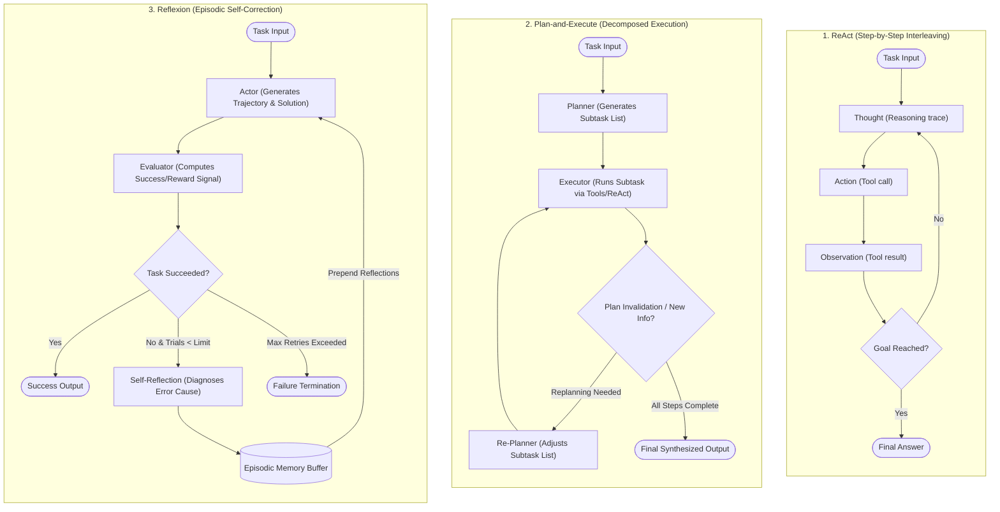

# Agent Design Patterns: ReAct, Plan-and-Execute & Reflexion

**智能体设计模式：ReAct、计划-执行与 Reflexion**

| Field   | English                                                                 | 中文                                        |
| ------- | ----------------------------------------------------------------------- | ------------------------------------------- |
| Level   | Intermediate                                                            | 中级                                        |
| Cluster | Agent Architecture & Design Patterns                                    | 智能体架构与设计模式                        |
| Author  | Dr. Kaito Fujimori, Research Scientist — Agent Systems Research, ANU-00 | ANU-00 智能体系统研究员 Kaito Fujimori 博士 |

---

## 1. From a Generic Loop to Named, Engineered Patterns

**从通用循环到具名的工程化模式**

[`introductory/03`](../introductory/03-what-is-an-ai-agent-concepts-and-the-agent-loop.md) gave you the generic skeleton of every agent: perceive, think, act, observe,
repeat. That skeleton is deliberately minimal — it says nothing about _how_ the "think" step should
reason, _when_ a plan should be made versus revised, or _what_ an agent should do with a past
failure the next time it tries.

[`introductory/03`](../introductory/03-what-is-an-ai-agent-concepts-and-the-agent-loop.md) 为你提供了每一个智能体通用的骨架：感知、思考、行动、观察，如此往复。这一骨架刻意保持最简化——它并未说明“思考”这一步*应当*如何进行推理、*何时*应当先制定计划再修改计划，也未说明智能体在下一次尝试时应当如何利用上一次失败的经验。

Those are design choices, and over the past several years the agent-systems research community has
converged on a handful of named patterns that answer them in different, reusable ways.

这些都是设计选择，而在过去数年间，智能体系统研究社区已经在若干具名模式上达成了共识，这些模式以不同的、可复用的方式回答了上述问题。

This module covers three of the most influential: **ReAct**, which interleaves reasoning and action
one step at a time; **Plan-and-Execute**, which separates upfront planning from execution; and
**Reflexion**, which adds a memory of past failures to improve future attempts. Each is a specific,
citable answer to "how should the think step work," not a vague slogan — and by the end of this
module you will be able to trace, by hand, exactly what each pattern does differently on the same
task.

本模块将介绍其中三种最具影响力的模式：**ReAct**（推理与行动协同），它将推理与行动逐步交替进行；**计划-执行（Plan-and-Execute）**，它将前期规划与后续执行分离开来；以及 **Reflexion**（自我反思），它为智能体加入了对过往失败经验的记忆，以改进未来的尝试。这三者都是对“思考步骤应当如何运作”这一问题给出的具体的、有据可查的答案，而非空泛的口号——学完本模块后，你将能够手动逐步追踪出这三种模式在同一任务上分别会有怎样不同的表现。

---

## 2. ReAct: Interleaving Reasoning Traces and Actions

**ReAct：交替进行推理轨迹与行动**

Yao et al.'s 2022 paper "ReAct: Synergizing Reasoning and Acting in Language Models" (already
referenced in [`introductory/03`](../introductory/03-what-is-an-ai-agent-concepts-and-the-agent-loop.md) and [`introductory/07`](../introductory/07-introduction-to-multi-agent-systems.md)) proposes prompting the LLM to produce, at
every step of the loop, an explicit **thought** — a short piece of free-text reasoning about what to
do and why — immediately before the **action** it takes, and to read the resulting **observation**
before producing the next thought.

Yao 等人 2022 年发表的论文《ReAct：语言模型中推理与行动的协同增效》（"ReAct: Synergizing Reasoning and Acting in Language Models"，已在 [`introductory/03`](../introductory/03-what-is-an-ai-agent-concepts-and-the-agent-loop.md) 与 [`introductory/07`](../introductory/07-introduction-to-multi-agent-systems.md) 中引用过）提出：在循环的每一步，都提示 LLM 先生成一段明确的**思考**——一小段关于“该做什么、为什么这么做”的自由文本推理——紧接着才产出**行动**，并在读取由此产生的**观察**之后，再生成下一段思考。

The paper's central claim, tested on question-answering and interactive decision-making benchmarks,
is that this interleaving lets reasoning and acting improve each other: the reasoning traces help
the model track progress, handle exceptions, and decide when to act, while the actions let the model
pull in fresh information the model's own reasoning alone (without a tool) could never invent (Yao
et al., 2022).

该论文的核心论断——在问答与交互式决策类基准测试上得到验证——是这种交替方式能让推理与行动相互促进：推理轨迹帮助模型追踪进度、处理异常情况、判断何时该采取行动；而行动则让模型能够引入模型自身推理（在没有工具的情况下）永远无法凭空产生的新信息（Yao et al., 2022）。

The pattern's name is exactly this loop, spelled out: **Re**ason, **Act** — a single, repeated
thought → action → observation cycle, which is a direct specialization of the generic
perceive-think-act-observe loop from [`introductory/03`](../introductory/03-what-is-an-ai-agent-concepts-and-the-agent-loop.md), where the "think" step is required to
externalize its reasoning as text before choosing the action.

这一模式的名字正是对这一循环的直接概括：**Re**ason、**Act**——一个单一的、反复进行的“思考 → 行动 → 观察”周期，它正是 [`introductory/03`](../introductory/03-what-is-an-ai-agent-concepts-and-the-agent-loop.md) 中通用的“感知-思考-行动-观察”循环的一种直接特化，只是这里的“思考”步骤被要求先以文本形式外化其推理过程，然后才能选择行动。

### 2.1 A Worked Trace

**2.1 逐步追踪示例**

Consider the task "what is the population of the capital city of the country where the 2016 Summer
Olympics were held?" — a question that needs two facts chained together, neither of which the LLM
can be assumed to know precisely from training alone. A ReAct-style trace, using the tool schema
conventions from [`introductory/04`](../introductory/04-tool-use-and-function-calling-basics.md), looks like this:

考虑这样一个任务：“2016 年夏季奥运会举办国的首都人口是多少？”——这是一个需要将两条事实串联起来才能回答的问题，而这两条事实都不能假定 LLM 仅凭训练所得就能精确掌握。采用 [`introductory/04`](../introductory/04-tool-use-and-function-calling-basics.md) 中的工具模式约定，一段 ReAct 风格的追踪记录如下：

```text
Thought 1: I need to find which country hosted the 2016 Summer Olympics.
Action 1: search("2016 Summer Olympics host country")
Observation 1: "The 2016 Summer Olympics were held in Rio de Janeiro, Brazil."
Thought 2: The country is Brazil. Now I need Brazil's capital.
Action 2: search("capital of Brazil")
Observation 2: "The capital of Brazil is Brasília."
Thought 3: The capital is Brasília. Now I need its population.
Action 3: search("population of Brasília")
Observation 3: "Brasília has a population of approximately 3.1 million (metro area)."
Thought 4: I now have both facts chained together. I can answer.
Final Answer: The 2016 Summer Olympics were held in Brazil, whose capital, Brasília,
has a population of about 3.1 million.
```

```text
思考1：我需要先查明 2016 年夏季奥运会的举办国是哪一个。
行动1：search("2016 年夏季奥运会举办国")
观察1："2016 年夏季奥运会在巴西里约热内卢举行。"
思考2：举办国是巴西。现在我需要查找巴西的首都。
行动2：search("巴西的首都")
观察2："巴西的首都是巴西利亚。"
思考3：首都是巴西利亚。现在我需要查找其人口。
行动3：search("巴西利亚人口")
观察3："巴西利亚人口约为 310 万（都市区）。"
思考4：现在我已经把两条事实串联起来了，可以作答了。
最终答案：2016 年夏季奥运会在巴西举行，巴西首都巴西利亚的人口约为 310 万。
```

Notice each thought does real work: Thought 1 decomposes the compound question, Thought 2 and
Thought 3 each chain the previous observation into the next sub-question, and Thought 4 explicitly
checks that enough information has been gathered before answering. Yao et al. report that this
explicit reasoning materially reduces a specific failure mode of tool-using agents — acting on a
stale or misread observation — because the thought step forces the model to restate what it just
learned before deciding what to do with it (Yao et al., 2022).

请注意每一步思考都在发挥实际作用：思考1 将复合问题拆解开来，思考2 与思考3 各自把前一步的观察结果串联为下一个子问题，思考4 则在作答之前明确核对信息是否已经收集充分。Yao 等人报告指出，这种显式推理能够切实减少工具使用型智能体的一种特定失效模式——基于陈旧或误读的观察结果采取行动——因为思考步骤迫使模型在决定下一步做什么之前，先重新陈述自己刚刚了解到的内容（Yao et al., 2022）。

---

## 3. Plan-and-Execute: Separating "What to Do" from "Doing It"

**计划-执行：将“该做什么”与“实际去做”分离开来**

ReAct decides one step at a time, with no commitment to more than the immediate next action. An
alternative family of patterns instead produces an explicit, multi-step **plan** up front — before
taking any action — and then works through that plan step by step, only revising it when execution
reveals the plan will not work.

ReAct 每次只决定一步该做什么，对于紧接着的下一步之外的任何行动都不作事先承诺。而另一类模式则截然不同：它会在采取任何行动*之前*，先产出一份明确的、多步骤的**计划**，随后按部就班地逐步执行该计划，只有当执行过程暴露出计划行不通时，才会对其进行修订。

Wang et al.'s 2023 paper "Plan-and-Solve Prompting: Improving Zero-Shot Chain-of-Thought Reasoning
by Large Language Models" formalizes this at the prompting level: the LLM is instructed to first
"devise a plan to divide the entire task into smaller subtasks, and then carry out the subtasks
according to the plan," rather than reasoning step by step without ever writing the overall
structure down (Wang et al., 2023).

Wang 等人 2023 年发表的论文《计划-求解提示：改进大语言模型的零样本思维链推理》（"Plan-and-Solve Prompting: Improving Zero-Shot Chain-of-Thought Reasoning by Large Language Models"）在提示词层面对这一思路进行了形式化：其指示 LLM 首先“制定一份计划，将整个任务拆分为若干更小的子任务，然后按照该计划逐一执行这些子任务”，而不是在从未将整体结构写下来的情况下逐步进行推理（Wang et al., 2023）。

The LangChain engineering team's 2023 blog post "Plan-and-Execute Agents" applies the same idea at
the level of a full agent architecture rather than a single prompt: a **planner** LLM call produces
an ordered list of subtasks for the whole task, and a separate **executor** — which may itself use a
ReAct-style loop internally for each subtask — carries out that list one item at a time, with the
plan optionally re-generated if execution surfaces new information the planner did not have
(LangChain, 2023).

LangChain 工程团队 2023 年发布的博客文章《计划-执行智能体》（"Plan-and-Execute Agents"）则将同样的思路应用到了完整智能体架构的层面，而非单一提示词层面：一次**规划器** LLM 调用为整个任务产出一份有序的子任务列表，而一个独立的**执行器**——它本身在处理每个子任务时可能内部采用 ReAct 风格的循环——逐项执行该列表，若执行过程中出现了规划器当初并不掌握的新信息，计划也可以被重新生成（LangChain, 2023）。

### 3.1 A Worked Trace of the Same Task

**3.1 同一任务的逐步追踪**

Applying Plan-and-Execute to the Olympics question from [§2.1](#21-a-worked-trace) produces a different-shaped trace — the
plan is committed to before any tool is called:

将计划-执行模式应用于[第 2.1 节](#21-a-worked-trace)中的奥运会问题，会产出一份结构不同的追踪记录——计划在任何工具被调用之前就已经确定：

```text
Plan (produced once, before execution):
  Step 1: Find the host country of the 2016 Summer Olympics.
  Step 2: Find the capital of that country.
  Step 3: Find the population of that capital.
  Step 4: Combine the three facts into a final answer.

Execute Step 1: search("2016 Summer Olympics host country") -> "Brazil"
Execute Step 2: search("capital of Brazil") -> "Brasília"
Execute Step 3: search("population of Brasília") -> "approx. 3.1 million"
Execute Step 4: (no tool call — synthesize) -> Final Answer, same as §2.1
```

```text
计划（在执行开始前一次性产出）：
  第一步：查明 2016 年夏季奥运会的举办国。
  第二步：查明该国的首都。
  第三步：查明该首都的人口。
  第四步：将三条事实综合为最终答案。

执行第一步：search("2016 年夏季奥运会举办国") -> "巴西"
执行第二步：search("巴西的首都") -> "巴西利亚"
执行第三步：search("巴西利亚人口") -> "约 310 万"
执行第四步：（无需工具调用——直接综合）-> 最终答案，与第 2.1 节相同
```

On a task this simple, the two traces reach the same answer through nearly the same number of steps,
and the difference looks cosmetic.

在这样一个简单任务上，两条追踪记录得出了相同的答案，所经历的步骤数也大致相同，二者的差异看起来只是表面上的。

The difference stops being cosmetic on harder tasks: because the whole plan is visible at once, a
Plan-and-Execute agent can identify that Steps 1–3 are independent of each other's _content_ (each
only depends on the previous step's output, forming a strict chain here, but on a different task,
independent subtasks could be dispatched in parallel — a capability a strictly one-step-at-a-time
ReAct loop does not expose as naturally), and a human reviewer can approve or edit the plan before
any tool call happens at all, which matters directly for the human-in-the-loop autonomy spectrum
introduced in [`introductory/03` §7](../introductory/03-what-is-an-ai-agent-concepts-and-the-agent-loop.md#7-autonomy-and-the-human-in-the-loop-spectrum).

但在更复杂的任务上，这一差异就不再只是表面的了：由于整份计划一次性可见，计划-执行型智能体能够识别出第一步到第三步在*内容*上彼此独立（在这里，每一步都只依赖于前一步的输出，构成了一条严格的链条；但在另一项任务中，若干独立的子任务则可以被并行派发——这是一种严格逐步进行的 ReAct 循环并不那么自然地具备的能力），并且人工审阅者可以在任何工具调用真正发生之前，就对该计划进行批准或修改，这与 [`introductory/03` 第 7 节](../introductory/03-what-is-an-ai-agent-concepts-and-the-agent-loop.md#7-autonomy-and-the-human-in-the-loop-spectrum)中介绍的“人在回路”自主性光谱直接相关。

The cost is the opposite of ReAct's flexibility: if Step 2's real answer turns out to depend on
information only discoverable during Step 3, a rigid plan must detect this and re-plan, whereas a
ReAct loop would simply have reasoned its way there one step at a time.

而其代价则与 ReAct 的灵活性恰恰相反：如果第二步的真实答案实际上依赖于只有在第三步执行过程中才能发现的信息，僵化的计划就必须检测到这一点并重新规划，而 ReAct 循环则只需一步一步地自然推理过去即可。

---

## 4. Reflexion: Learning From a Failed Attempt Within the Same Task

**Reflexion：在同一任务内从失败的尝试中学习**

Both ReAct and Plan-and-Execute describe how a single attempt at a task proceeds. Neither says
anything about what happens if that attempt fails outright — the LLM's own weights are frozen, so it
cannot "learn" in the training sense described in [`introductory/01`](../introductory/01-neural-networks-and-deep-learning-foundations.md), and without an explicit
mechanism it would simply retry the same task the same way and likely fail the same way again.

ReAct 与计划-执行这两种模式，描述的都是单次任务尝试如何进行。二者都没有说明，如果这次尝试彻底失败了，接下来会发生什么——LLM 自身的权重是冻结的，因此它无法像 [`introductory/01`](../introductory/01-neural-networks-and-deep-learning-foundations.md) 中所述训练意义上的“学习”那样进行学习；如果没有明确的机制，它只会以同样的方式重新尝试同一个任务，并且很可能以同样的方式再次失败。

Shinn et al.'s 2023 paper "Reflexion: Language Agents with Verbal Reinforcement Learning" (also
referenced in this curriculum's [`advanced/03`](../advanced/03-agent-harness-engineering-production-grade-agent-loops.md)) addresses exactly this gap.

Shinn 等人 2023 年发表的论文《Reflexion：具备语言化强化学习能力的语言智能体》（"Reflexion: Language Agents with Verbal Reinforcement Learning"，本课程 [`advanced/03`](../advanced/03-agent-harness-engineering-production-grade-agent-loops.md) 中也曾引用）正是针对这一空白提出的解决方案。

After an attempt ends in failure — detected either by an external signal, such as a failing test, or
by the LLM's own judgment of its result — the agent is prompted to generate a **self-reflection**: a
short piece of text analyzing, in natural language, what went wrong and what to try differently.
This reflection is stored in an episodic memory buffer, and is included in the LLM's context the
next time it attempts the same or a similar task, so that the _content_ of the model's context
changes across attempts even though the model's weights never do — the paper's own framing for why
this counts as a form of reinforcement learning, despite using no gradient updates at all (Shinn et
al., 2023).

当一次尝试以失败告终——无论是由外部信号（例如一次未通过的测试）检测到，还是由 LLM 自身对其结果的判断得知——智能体便会被提示生成一段**自我反思**：一小段以自然语言分析“哪里出了问题、下次应当尝试哪些不同做法”的文本。这段反思会被存入一个情景记忆缓冲区，并在该智能体下一次尝试同一或类似任务时被纳入 LLM 的上下文——这样一来，尽管模型的权重从未发生变化，模型上下文的*内容*却会随着尝试次数的增加而不断改变——这正是该论文自身对“为何这可以被视为一种强化学习形式”的论证，尽管整个过程完全没有使用任何梯度更新（Shinn et al., 2023）。

### 4.1 A Worked Trace Across Two Attempts

**4.1 跨越两次尝试的追踪示例**

Suppose the task is a coding exercise: "write a function `is_palindrome(s)` that returns `True` if
`s` reads the same forwards and backwards, ignoring case, and `False` otherwise," checked against a
hidden test suite.

设任务是一道编程练习：“编写一个函数 `is_palindrome(s)`，若 `s` 忽略大小写后正读反读相同则返回 `True`，否则返回 `False`”，并针对一个隐藏测试套件进行检验。

```text
Attempt 1:
  def is_palindrome(s):
      return s == s[::-1]
  Test result: FAIL on input "Racecar" (expected True, got False — case not ignored).

Reflection: "My implementation compared the string directly without normalizing case.
The failing case 'Racecar' has mixed case. Next attempt should lowercase the string
before comparing."

Attempt 2 (reflection included in context):
  def is_palindrome(s):
      s = s.lower()
      return s == s[::-1]
  Test result: PASS on all cases, including "Racecar".
```

```text
第一次尝试：
  def is_palindrome(s):
      return s == s[::-1]
  测试结果：在输入 "Racecar" 上失败（期望 True，实际得到 False——未忽略大小写）。

反思："我的实现直接比较字符串，未对大小写进行归一化处理。失败的用例 'Racecar' 包含大小写混合。下次尝试应在比较之前先将字符串转换为小写。"

第二次尝试（反思已纳入上下文）：
  def is_palindrome(s):
      s = s.lower()
      return s == s[::-1]
  测试结果：所有用例均通过，包括 "Racecar"。
```

The reflection did the specific work of diagnosing the _root cause_ of the failure — not merely
noting "attempt 1 failed" — and stating a concrete change to try.

这段反思所完成的工作是具体地诊断出失败的*根本原因*——而不仅仅是记下“第一次尝试失败了”这一事实——并给出了一项具体、可执行的改进方案。

Shinn et al. report that this verbal self-correction loop substantially improves success rates on
coding and decision-making benchmarks over simply retrying without a reflection step, and that the
effect compounds across multiple attempts on harder tasks where one round of reflection is not
enough (Shinn et al., 2023).

Shinn 等人报告称，相较于在没有反思步骤的情况下简单地重新尝试，这种语言化的自我纠正循环能够显著提升编程与决策类基准测试上的成功率，并且在更困难、单轮反思不足以奏效的任务上，这一效果会随着多次尝试而不断累积（Shinn et al., 2023）。

It is worth being precise about scope: Reflexion, as described here, operates entirely within
solving one task across repeated attempts (or a small family of very similar tasks); it is not the
same claim as an agent permanently updating its general behavior across unrelated tasks, which would
require either weight updates or a persistent, cross-task memory system of the kind covered in
`intermediate/04-agent-memory-systems-short-term-long-term-episodic.md`.

有必要精确界定其适用范围：本节所述的 Reflexion，其运作完全局限于同一任务（或一小组高度相似的任务）内的反复尝试之中；这与“智能体在互不相关的各类任务之间永久性地更新其通用行为”并不是同一个论断——后者要么需要权重更新，要么需要一套跨任务的持久性记忆系统，也就是 `intermediate/04-agent-memory-systems-short-term-long-term-episodic.md` 所讲授的内容。

---

## 5. Comparing the Three Patterns

**三种模式的比较**

| Dimension                                    | ReAct                                                                   | Plan-and-Execute                           | Reflexion                                                    |
| -------------------------------------------- | ----------------------------------------------------------------------- | ------------------------------------------ | ------------------------------------------------------------ |
| When is the "think" step's output committed? | One action at a time                                                    | Whole plan, up front                       | Whole attempt, then revised across retries                   |
| Best suited for                              | Tasks whose next step depends heavily on the last observation           | Tasks decomposable into knowable subtasks  | Tasks with a checkable success/fail signal and room to retry |
| Human review point                           | Hard to insert before an action, since actions are chosen one at a time | Natural — review the plan before execution | After a failed attempt, before the retry                     |
| What happens on failure?                     | Model reasons about it at the next step, no dedicated mechanism         | Plan may need regeneration                 | Explicit self-reflection stored and reused                   |
| Primary citation                             | Yao et al., 2022                                                        | Wang et al., 2023; LangChain, 2023         | Shinn et al., 2023                                           |

| 维度                             | ReAct                                          | 计划-执行                          | Reflexion                                   |
| -------------------------------- | ---------------------------------------------- | ---------------------------------- | ------------------------------------------- |
| “思考”步骤的产出何时被确定下来？ | 每次一个行动                                   | 整份计划，提前确定                 | 整次尝试，随后在多次重试间不断修订          |
| 最适用场景                       | 下一步高度依赖上一次观察结果的任务             | 可拆解为已知子任务的任务           | 具备可检验成功/失败信号、且有重试空间的任务 |
| 人工审阅点                       | 难以在某个行动执行前插入，因为行动是逐一选定的 | 天然存在——可在执行前审阅计划       | 在一次失败尝试之后、下一次重试之前          |
| 失败后会发生什么？               | 模型在下一步中对此进行推理，没有专门机制       | 计划可能需要重新生成               | 显式的自我反思被存储并复用                  |
| 主要引用来源                     | Yao et al., 2022                               | Wang et al., 2023；LangChain, 2023 | Shinn et al., 2023                          |

The architectural diagram below compares the control flow and state transitions across all three
patterns:

下面的架构流程图对比了这三种模式各自的控制流与状态转移机制：



These patterns are not mutually exclusive engineering choices in production systems — a
Plan-and-Execute agent's executor is frequently implemented as an internal ReAct loop for each
subtask, and a Reflexion-style retry loop can wrap either a ReAct agent or a Plan-and-Execute agent
as an outer layer, since Reflexion is agnostic to how a single attempt is structured internally.

在生产系统中，这几种模式并非互斥的工程选择——计划-执行智能体的执行器，往往会针对每个子任务在内部实现为一个 ReAct 循环；而 Reflexion 风格的重试循环，则可以作为外层包裹住一个 ReAct 智能体或一个计划-执行智能体，因为 Reflexion 本身并不关心单次尝试内部是如何组织的。

Recognizing which pattern (or combination) fits a given task's structure — is the next step
predictable from the last observation, or is the whole task decomposable in advance, or is there a
cheap way to check success and try again — is itself the central design skill this module aims to
build.

判断某个给定任务的结构最适合哪种模式（或哪几种模式的组合）——下一步是否可以由上一次观察结果预测出来？整个任务是否可以提前拆解？是否存在一种低成本的方式来检验成功与否并重试？——这本身正是本模块所要培养的核心设计能力。

---

## 6. Common Pitfalls at This Level

**本层级的常见陷阱**

A ReAct agent's reasoning trace can look convincing while being wrong — a fluent thought that
misreads an observation is not automatically caught by the pattern itself, since ReAct only
structures _where_ reasoning happens, not whether it is correct; a harness must still validate
actions before executing them, exactly as [`introductory/03` §8](../introductory/03-what-is-an-ai-agent-concepts-and-the-agent-loop.md#8-common-failure-modes-of-the-agent-loop) already warned for the generic loop.
A Plan-and-Execute agent's plan can be confidently detailed and still wrong end to end if an early
step's assumption turns out false, which is why production systems typically allow re-planning
rather than treating the first plan as final.

一个 ReAct 智能体的推理轨迹，可能看起来令人信服，实际上却是错的——一段流畅但误读了观察结果的思考，并不会被该模式本身自动纠正，因为 ReAct 只规定了推理*发生在哪里*，而不保证推理本身正确与否；运行框架仍必须在执行任何行动之前对其进行校验，这正是 [`introductory/03` 第 8 节](../introductory/03-what-is-an-ai-agent-concepts-and-the-agent-loop.md#8-common-failure-modes-of-the-agent-loop)针对通用循环早已提出的警示。一个计划-执行智能体的计划，即便看起来自信而详尽，若其中某个较早步骤的假设最终被证明是错误的，整份计划从头到尾都可能是错的——这正是为什么生产系统通常允许重新规划，而不是将最初的计划视为一成不变的。

A Reflexion loop can also fail in a specific way worth naming: if the success/failure signal itself
is unreliable (for example, an LLM judging its own success, discussed further in [`introductory/08`](../introductory/08-why-and-how-we-evaluate-agents.md)'s
treatment of evaluation), the reflection may "correct" a step that was not actually the problem, and
repeated retries can drift rather than converge. None of these pitfalls is solved by picking a
different pattern; each pattern shifts _where_ the failure can occur, not whether failure is
possible — which is precisely why [`advanced/03`](../advanced/03-agent-harness-engineering-production-grade-agent-loops.md) treats none of these cognitive patterns as a
substitute for harness-level resilience and control engineering.

一个 Reflexion 循环也可能以一种值得专门指出的方式失败：如果成功/失败信号本身并不可靠（例如由 LLM 自行判断自己是否成功，这一点在 [`introductory/08`](../introductory/08-why-and-how-we-evaluate-agents.md) 关于评估的讨论中有更详细的说明），反思环节可能会“纠正”一个实际上并非问题所在的步骤，导致反复重试出现漂移而非收敛。这些陷阱都不能通过换用另一种模式来解决；每种模式只是改变了失败*可能发生的位置*，而无法保证失败不会发生——这正是为什么 [`advanced/03`](../advanced/03-agent-harness-engineering-production-grade-agent-loops.md) 不将这些认知层面的模式视为运行框架层面韧性与控制工程的替代品。

---

## 7. Summary and What Comes Next

**小结与后续内容**

This module introduced three named, citable patterns for how the "think" step of the agent loop from
[`introductory/03`](../introductory/03-what-is-an-ai-agent-concepts-and-the-agent-loop.md) can be structured: ReAct interleaves an explicit reasoning trace with each action,
one step at a time; Plan-and-Execute commits to a multi-step plan before execution begins, trading
flexibility for reviewability and decomposability; and Reflexion adds an episodic self-correction
loop across repeated attempts at the same task, letting a frozen model's behavior still improve
attempt over attempt through the content of its context rather than through weight updates. None of
the three is universally superior — each answers a different question about how a single agent
should organize its own reasoning.

本模块介绍了三种具名、有据可查的模式，用以回答 [`introductory/03`](../introductory/03-what-is-an-ai-agent-concepts-and-the-agent-loop.md) 中智能体循环“思考”这一步骤应当如何组织：ReAct 逐步将显式推理轨迹与每一次行动交替进行；计划-执行在执行开始前就确定一份多步骤计划，以灵活性换取可审阅性与可拆解性；而 Reflexion 则在同一任务的反复尝试之间加入了一个情景性的自我纠正循环，使得即便模型权重被冻结，其行为也能通过上下文内容——而非权重更新——在一次次尝试中不断改进。三者之中并无哪一个绝对优于其他——它们各自回答了“单个智能体应当如何组织自身推理”这一问题的不同侧面。

`intermediate/04-agent-memory-systems-short-term-long-term-episodic.md` picks up exactly where
Reflexion's episodic memory buffer left off, and develops a full taxonomy of what an agent can
remember beyond a single task.
`intermediate/07-multi-agent-communication-and-coordination-protocols.md` extends these single-agent
patterns to systems where multiple agents, each potentially running one of these patterns
internally, must communicate and coordinate. [`advanced/03`](../advanced/03-agent-harness-engineering-production-grade-agent-loops.md) (already published in this curriculum)
treats all three patterns as the cognitive layer that a production harness must wrap with
resilience, control, and observability engineering — read together with this module, not as a
replacement for it.

`intermediate/04-agent-memory-systems-short-term-long-term-episodic.md` 正是从 Reflexion 情景记忆缓冲区结束的地方继续讲起，发展出一套关于智能体除单一任务之外还能记住哪些内容的完整分类体系。 `intermediate/07-multi-agent-communication-and-coordination-protocols.md` 将这些单智能体模式扩展到多个智能体（每个智能体内部都可能运行着这三种模式之一）必须相互通信与协调的系统之中。本课程中已发布的 [`advanced/03`](../advanced/03-agent-harness-engineering-production-grade-agent-loops.md) 则将这三种模式共同视为认知层面，生产级运行框架必须在此之上再包裹一层韧性、控制与可观测性工程——应与本模块结合阅读，而非将其视为对本模块的替代。

---

## References

**参考文献**

### External Sources

- [Yao, S., Zhao, J., Yu, D., Du, N., Shafran, I., Narasimhan, K., & Cao, Y. (2022). ReAct: Synergizing Reasoning and Acting in Language Models](https://arxiv.org/abs/2210.03629)
- [Wang, L., Xu, W., Lan, Y., Hu, Z., Lan, Y., Lee, R. K.-W., & Lim, E.-P. (2023). Plan-and-Solve Prompting: Improving Zero-Shot Chain-of-Thought Reasoning by Large Language Models](https://arxiv.org/abs/2305.04091)
- [LangChain (2023). Plan-and-Execute Agents (LangChain Blog)](https://blog.langchain.com/plan-and-execute-agents/)
- [Shinn, N., Cassano, F., Berman, E., Gopinath, A., Narasimhan, K., & Yao, S. (2023). Reflexion: Language Agents with Verbal Reinforcement Learning](https://arxiv.org/abs/2303.11366)

### Internal Cross-References

- [`introductory/03` — What Is an AI Agent? Concepts & the Agent Loop](../introductory/03-what-is-an-ai-agent-concepts-and-the-agent-loop.md)
- [`introductory/04` — Tool Use & Function Calling Basics](../introductory/04-tool-use-and-function-calling-basics.md)
- [`introductory/06` — Context Windows, Tokens & Memory Basics](../introductory/06-context-windows-tokens-and-memory-basics.md)
- [`introductory/07` — Introduction to Multi-Agent Systems](../introductory/07-introduction-to-multi-agent-systems.md)
- [`introductory/08` — Why & How We Evaluate Agents](../introductory/08-why-and-how-we-evaluate-agents.md)
- [`intermediate/04` — Agent Memory Systems: Short-Term, Long-Term & Episodic Memory](04-agent-memory-systems-short-term-long-term-episodic.md)
- [`intermediate/07` — Multi-Agent Communication & Coordination Protocols](07-multi-agent-communication-and-coordination-protocols.md)
- [`advanced/03` — Agent Harness Engineering: Building Production-Grade Agent Loops](../advanced/03-agent-harness-engineering-production-grade-agent-loops.md)
