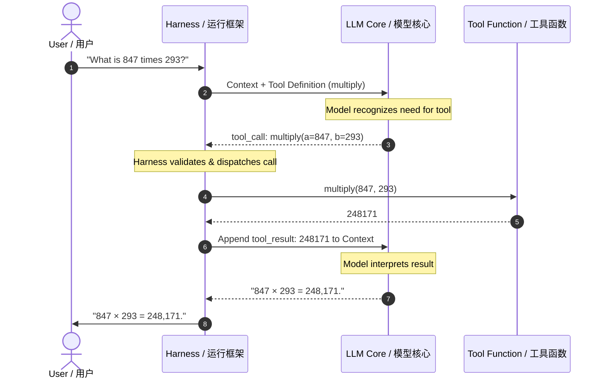

# Tool Use & Function Calling Basics

**工具使用与函数调用基础**

| Field   | English                                                                 | 中文                                        |
| ------- | ----------------------------------------------------------------------- | ------------------------------------------- |
| Level   | Introductory                                                            | 入门                                        |
| Cluster | Agent Architecture & Design Patterns                                    | 智能体架构与设计模式                        |
| Author  | Dr. Kaito Fujimori, Research Scientist — Agent Systems Research, ANU-00 | ANU-00 智能体系统研究员 Kaito Fujimori 博士 |

---

## 1. Why Language Models Need Tools

**引言：为什么语言模型需要工具**

[`introductory/03`](https://anu00.dev/curriculum/introductory/03-what-is-an-ai-agent-concepts-and-the-agent-loop.md) established that an AI agent is an LLM wrapped in a loop that lets it act on an
environment and observe the result, and that the "act" stage is what separates an agent from a plain
chatbot. This module opens that "act" stage up in full detail.

[`introductory/03`](https://anu00.dev/curriculum/introductory/03-what-is-an-ai-agent-concepts-and-the-agent-loop.md)已确立：AI 智能体是被包裹在一个循环中的 LLM，该循环使其能够作用于环境并观察结果，而“行动”阶段正是智能体区别于普通聊天机器人的关键所在。本模块将完整展开这一“行动”阶段。

An LLM, on its own, can only do one thing: given some input text, produce output text.

LLM 本身只能做一件事：给定一段输入文本，产出一段输出文本。

It cannot look up today's stock price, run a calculation it is unsure of, read a file on your
computer, or send an email — not because it is unintelligent, but because none of those things are
text prediction. A **tool**, in the agent-systems sense used throughout this curriculum, is a piece
of ordinary software — a function, an API endpoint, a database query — that the agent's surrounding
harness (the non-LLM code that runs the loop, as defined in [`introductory/03`](https://anu00.dev/curriculum/introductory/03-what-is-an-ai-agent-concepts-and-the-agent-loop.md)) can execute on the
LLM's behalf, and whose result is then fed back into the LLM as a new observation.

它无法查询今天的股价，无法运行一个自己没把握的计算，无法读取你电脑上的某个文件，也无法发送邮件——这并非因为它不够智能，而是因为这些事情都不是“文本预测”。本课程中所使用的**工具**这一术语，特指某个普通软件——一个函数、一个 API 端点、一次数据库查询——它可以由智能体周边的运行框架（即[`introductory/03`](https://anu00.dev/curriculum/introductory/03-what-is-an-ai-agent-concepts-and-the-agent-loop.md)中定义的、运行循环的非 LLM 代码）代表 LLM 执行，其结果随后作为一条新的观察被反馈给 LLM。

Tool use is the mechanism that turns "predicting the next word" into "getting real things done."

工具使用是把“预测下一个词”转化为“真正完成事情”的机制。

It matters enough that a dedicated line of research exists on it: Timo Schick and colleagues'
Toolformer paper (2023) demonstrated that a language model can be trained to decide for itself which
external APIs to call, when to call them, and how to weave the results into its output — a result
that helped establish tool use as a first-class capability of modern LLMs rather than an
afterthought bolted onto a text generator. This module explains the mechanics that make that
possible in practice, at a level suitable for someone who has never seen an API before.

这一机制的重要性使其发展出了一条专门的研究方向：Timo Schick 及其合作者的 Toolformer 论文（2023）证明，语言模型可以经过训练，自行决定该调用哪些外部 API、何时调用，以及如何把结果融入自己的输出——这一结果有力地确立了“工具使用”是现代 LLM 的一项一等能力，而非事后拼接到文本生成器上的附加功能。本模块将以适合从未接触过 API 的读者的水平，解释使这一切在实践中得以实现的具体机制。

---

## 2. What Is a "Tool" or "Function" in This Context?

**这里所说的“工具”或“函数”究竟是什么？**

Before going further, three terms need precise, from-scratch definitions, since this module assumes
no prior programming background.

在继续之前，有三个术语需要从零开始给出精确定义，因为本模块假定读者没有任何编程背景。

| Term                                                                                                                                                        | EN                                                                                                                                                                                                                                                                                                                                                  | 中文                                                                                                                                                                                                      |
| ----------------------------------------------------------------------------------------------------------------------------------------------------------- | --------------------------------------------------------------------------------------------------------------------------------------------------------------------------------------------------------------------------------------------------------------------------------------------------------------------------------------------------- | --------------------------------------------------------------------------------------------------------------------------------------------------------------------------------------------------------- |
| **Function**（函数）                                                                                                                                        | is a named, reusable piece of code that takes some input values (called **arguments** or **parameters**) and produces an output value (called its **return value**) — for example, a function named `add` that takes the arguments `3` and `5` and returns `8`.                                                                                     | 是一段有名字、可复用的代码，它接收若干输入值（称为**参数**），并产出一个输出值（称为其**返回值**）——例如，一个名为 `add` 的函数接收参数 `3` 和 `5`，返回 `8`。                                            |
| **API**（应用程序编程接口，Application Programming Interface）                                                                                              | is a defined way for one piece of software to ask another piece of software to do something and get a result back — for example, a weather service's API lets your program ask "what is the weather in Tokyo?" and receive structured data in return, without your program needing to know anything about how the weather service works internally. | 是一种既定方式，使某个软件能够请求另一个软件执行某项操作并取回结果——例如，某天气服务的 API 让你的程序能够询问“东京天气如何？”并得到结构化数据作为回应，而你的程序完全无需了解该天气服务内部是如何工作的。 |
| **Function calling**（函数调用，也称**工具调用** / tool calling — the two terms are used interchangeably in industry documentation and in this curriculum） | is the specific capability of an LLM to output, instead of ordinary reply text, a structured request to invoke one of these functions with specific argument values — a request the harness then actually carries out.                                                                                                                              | 是 LLM 的一项特定能力：它不输出普通的回复文本，而是输出一个结构化的请求，要求以特定参数值调用上述某个函数——这一请求随后由运行框架真正执行。                                                               |

---

## 3. The Function-Calling Contract: Schema, Call, Result

**函数调用的契约：模式、调用与结果**

Function calling works because of a three-part contract between the developer, the LLM, and the
harness.

函数调用之所以能够运作，依赖于开发者、LLM 与运行框架三方之间的一份契约。

| #   | Step                         | EN                                                                                                                                                                                                                                                                                                                                                                                                        | 中文                                                                                                                                                                                                                                          |
| --- | ---------------------------- | --------------------------------------------------------------------------------------------------------------------------------------------------------------------------------------------------------------------------------------------------------------------------------------------------------------------------------------------------------------------------------------------------------- | --------------------------------------------------------------------------------------------------------------------------------------------------------------------------------------------------------------------------------------------- |
| 1   | **Schema**（模式）           | the developer writes a **schema** — a structured description of the tool that states its name, what it does in plain language, and the names and types of its arguments. This is typically written in **JSON（JavaScript Object Notation）**, a lightweight, human-readable format for structured data that uses key–value pairs, covered concretely in [§5](#5-json-schema-basics-for-tool-definitions). | 开发者编写一份**模式**——对该工具的结构化描述，说明其名称、用通俗语言表述的功能，以及其参数的名称与类型。这通常以 **JSON（JavaScript Object Notation）** 格式书写——一种轻量、人类可读、以键值对表示结构化数据的格式，具体内容将在第 5 节展开。 |
| 2   | Inclusion in the LLM's input | this schema (along with every other available tool's schema) is included in the LLM's input alongside the conversation — the LLM never executes any code itself; it only ever sees text descriptions of what tools exist and decides, in its own generated output, that it wants one of them called.                                                                                                      | 这份模式（连同所有其他可用工具的模式）会与对话内容一起被纳入 LLM 的输入——LLM 本身从不执行任何代码；它所看到的始终只是“存在哪些工具”的文字描述，并在自己生成的输出中做出决定，表示希望调用其中某一个。                                         |
| 3   | Harness execution            | when the LLM's output names a tool and supplies argument values, the harness (never the LLM) parses that structured request, runs the real function with those arguments, and returns the function's actual output back into the conversation as a new observation for the LLM to read on its next turn.                                                                                                  | 当 LLM 的输出指明了某个工具名称并给出参数值时，运行框架（绝非 LLM 本身）会解析这一结构化请求，用这些参数运行真正的函数，并把函数的实际输出作为一条新的观察返回到对话中，供 LLM 在下一轮读取。                                                 |

It is worth stating the security-relevant consequence of this contract plainly, because it is easy
to misread as a technicality: the LLM only ever _proposes_ a call; it never has direct access to
your computer, your files, or the internet. Every single action still passes through code the
developer wrote and controls. This "propose, don't execute" separation is the foundation for the
safety patterns covered in depth in [`advanced/04`](https://anu00.dev/curriculum/advanced/04-agentic-safety-guardrails-and-governance-patterns.md) — an agent is only as safe as the harness's
willingness to validate and, when appropriate, refuse a proposed call.

值得明确指出这一契约在安全方面的含义，因为它很容易被误读为一个无关紧要的技术细节：LLM 始终只是“提议”一次调用，它从不直接访问你的电脑、文件或互联网。每一个行动仍然要经过开发者编写并掌控的代码。这种“只提议、不执行”的分离，正是[`advanced/04`](https://anu00.dev/curriculum/advanced/04-agentic-safety-guardrails-and-governance-patterns.md)中深入探讨的安全模式的基础——一个智能体的安全程度，取决于运行框架愿意在多大程度上校验、并在必要时拒绝一次被提议的调用。

---

## 4. Worked Example: A Calculator Tool, Traced End to End

**实例演练：完整追踪一个计算器工具**

Suppose a developer gives an LLM one tool, `multiply(a: number, b: number) -> number`, described to
the LLM in plain language as "multiplies two numbers and returns the product." A user asks: "What is
847 times 293?" LLMs are known to make arithmetic errors on large multiplications when asked to
compute them purely as text prediction, so a well-built agent should prefer the tool over mental
math. The full exchange looks like this:

假设开发者给 LLM 提供了一个工具 `multiply(a: number, b: number) -> number`，并用通俗语言向 LLM 说明其功能为“将两个数字相乘并返回乘积”。用户提问：“847 乘以 293 等于多少？”已知 LLM 在被要求纯粹以文本预测方式计算较大的乘法时容易出错，因此一个设计良好的智能体应当优先使用工具而非“心算”。完整的交互过程如下：

```text
User input:        "What is 847 times 293?"
LLM output:         tool_call: multiply(a=847, b=293)     [not reply text — a structured request]
Harness action:      runs the real multiply() function: 847 * 293 = 248,171
Harness returns:      tool_result: 248171
LLM input (next turn): the conversation so far, plus tool_result: 248171
LLM output:          "847 × 293 = 248,171."
```

```text
用户输入：             "847 乘以 293 等于多少？"
LLM 输出：             tool_call: multiply(a=847, b=293)   （并非回复文本，而是一个结构化请求）
运行框架的动作：        运行真正的 multiply() 函数：847 * 293 = 248,171
运行框架返回：          tool_result: 248171
LLM 下一轮输入：        此前的对话内容，加上 tool_result: 248171
LLM 输出：             "847 × 293 = 248,171。"
```

The sequence diagram below visualizes this exact message-passing lifecycle between the user, the
execution harness, the LLM core, and the external function:

下面的时序图直观展示了用户、执行运行框架、LLM 核心与外部函数之间这一完整的消息传递生命周期：



Notice the parallel to the weather example in [`introductory/03` §4](https://anu00.dev/curriculum/introductory/03-what-is-an-ai-agent-concepts-and-the-agent-loop.md#4-worked-example-a-weather-checking-agent-traced-step-by-step): this is the same agent loop —
perceive, think, act, observe — with the "act" step now shown in the mechanical detail this module
promised. The LLM never computed 847 × 293 itself; it recognized that the task called for the
`multiply` tool, requested it with the correct arguments, and then read back an exact, guaranteed-
correct result rather than an estimate.

请注意这与[`introductory/03` 第 4 节](https://anu00.dev/curriculum/introductory/03-what-is-an-ai-agent-concepts-and-the-agent-loop.md#4-worked-example-a-weather-checking-agent-traced-step-by-step)天气示例的对应关系：这仍然是同一个智能体循环——感知、思考、行动、观察——只是本模块将“行动”这一步以其机械细节完整呈现出来。LLM 自己从未计算过 847 × 293；它识别出该任务需要使用 `multiply` 工具，以正确的参数发起请求，随后读回一个精确、保证正确的结果，而非一个估算值。

---

## 5. JSON Schema Basics for Tool Definitions

**工具定义中的 JSON 模式基础**

Nearly every major LLM provider describes tools to the model using a format based on **JSON
Schema**, a standard for describing the shape of structured data. A minimal tool definition for the
`multiply` example above looks like this:

几乎所有主流 LLM 提供商都使用基于 **JSON Schema** 的格式向模型描述工具，这是一种用于描述结构化数据形状的标准。上文 `multiply` 示例的最简工具定义大致如下：

```json
{
  "name": "multiply",
  "description": "Multiplies two numbers and returns the product.",
  "parameters": {
    "type": "object",
    "properties": {
      "a": { "type": "number", "description": "The first number." },
      "b": { "type": "number", "description": "The second number." }
    },
    "required": ["a", "b"]
  }
}
```

Reading this line by line for a reader new to JSON: `"name"` is the identifier the LLM will use to
request this tool; `"description"` is the plain-language explanation the LLM reads to decide _when_
this tool is appropriate — a vague or missing description is one of the most common causes of an
agent choosing the wrong tool, since the LLM has nothing else to go on; `"parameters"` describes the
expected input as an `"object"` (a JSON structure of named fields) with two `"properties"`, `a` and
`b`, each typed as a `"number"`; and `"required"` lists which of those properties must always be
supplied.

对于初次接触 JSON 的读者，逐行解读如下：`"name"` 是 LLM 请求该工具时所使用的标识符；`"description"` 是 LLM 用来判断*何时*适合使用该工具的通俗语言说明——描述含糊或缺失是导致智能体选错工具的最常见原因之一，因为 LLM 除此之外再无其他依据；`"parameters"` 将期望的输入描述为一个 `"object"`（即一个由具名字段组成的 JSON 结构），其中包含两个 `"properties"` `a` 与 `b`，各自被指定为 `"number"` 类型；`"required"` 则列出了这些属性中哪些必须始终被提供。

This same schema-based approach — name, description, typed parameters — is used, with minor
syntactic differences, by every major provider's tool-calling interface, including OpenAI's
function-calling API and Anthropic's tool-use API, both covered next in [§8](#8-tool-use-across-providers-a-brief-comparison).

这种基于模式（名称、描述、带类型的参数）的方法，被每一家主流提供商的工具调用接口所采用，仅在语法细节上略有差异，包括 OpenAI 的函数调用 API 与 Anthropic 的工具使用 API，二者将在[第 8 节](#8-tool-use-across-providers-a-brief-comparison)详细介绍。

---

## 6. Parallel and Sequential Tool Calls

**并行工具调用与顺序工具调用**

Not every task needs its tool calls one at a time. If an agent has been given both a `get_weather`
tool and a task like "compare the weather in Tokyo, Osaka, and Kyoto," a capable LLM can request all
three calls in a single "think" step — this is called a **parallel tool call**, and the harness
executes all three (typically concurrently, since they don't depend on each other) before returning
all three results together as the next observation.

并非每个任务都需要一次执行一个工具调用。如果某智能体同时拥有 `get_weather` 工具，并接到“比较东京、大阪与京都的天气”这样的任务，一个能力足够的 LLM 可以在单次“思考”步骤中一并请求这三次调用——这称为 **并行工具调用**，运行框架会（由于三者互不依赖，通常并发地）执行全部三次调用，然后将三个结果一并作为下一条观察返回。

By contrast, a **sequential tool call** is required whenever a later call's arguments depend on an
earlier call's result — for instance, "look up the weather in whichever of these three cities has
the highest population" first needs a `get_population` call to determine which city to then pass
into `get_weather`. Recognizing which of these two patterns a task needs is not something the
developer hardcodes; it is exactly the kind of decision the LLM's "think" step is responsible for,
task by task, based on what it can infer about dependencies between the actions.

相对地，**顺序工具调用**则是当后一次调用的参数依赖于前一次调用的结果时所必需的——例如，“查询这三座城市中人口最多的那座的天气”首先需要一次 `get_population` 调用来确定应把哪座城市传入 `get_weather`。判断某项任务需要这两种模式中的哪一种，并非由开发者事先写死，而恰恰是 LLM“思考”步骤逐任务负责的决策，其依据是它能从行动之间的依赖关系中推断出什么。

---

## 7. Error Handling: When Tools Fail

**错误处理：当工具失败时**

Real tools fail: an API might time out, a file might not exist, a database query might return no
rows. A tool-using agent must handle this as a normal, expected case, not an exceptional one.

真实世界中的工具是会失败的：API 可能超时，文件可能不存在，数据库查询可能返回零行结果。一个使用工具的智能体必须把这视为正常且可预期的情况，而非例外情况。

The harness's job when a tool call fails is not to hide the failure from the LLM but to translate it
into a clear, structured observation — for example, returning `{"error": "city not found: Tkoyo (did
you mean Tokyo?)"}` rather than silently returning nothing or crashing.

当工具调用失败时，运行框架的职责不是向 LLM 隐瞒失败，而是将其转化为清晰、结构化的观察——例如返回 `{"error": "city not found: Tkoyo (did you mean Tokyo?)"}`，而不是悄无声息地返回空值或直接崩溃。

This matters because the LLM's next "think" step can only make a good decision — retry with
corrected arguments, try a different tool, or tell the user it cannot complete the task — if the
error observation gives it enough information to reason about what went wrong. An agent whose
harness swallows errors silently will either hallucinate a plausible-sounding but false result, or
loop indefinitely retrying an unfixable call — both of which connect directly back to the failure
modes named in [`introductory/03` §8](https://anu00.dev/curriculum/introductory/03-what-is-an-ai-agent-concepts-and-the-agent-loop.md#8-common-failure-modes-of-the-agent-loop).

这一点之所以重要，是因为 LLM 下一次“思考”步骤只有在错误观察中包含足够信息、能够据此推断出问题所在时，才能做出好的决策——用修正后的参数重试、改用另一个工具，或告知用户任务无法完成。若某智能体的运行框架悄悄吞掉错误，它要么会产生一个听起来合理却虚假的结果（幻觉），要么会针对一个根本无法修复的调用无限重试——这两种情形都直接呼应了 [`introductory/03` 第 8 节](https://anu00.dev/curriculum/introductory/03-what-is-an-ai-agent-concepts-and-the-agent-loop.md#8-common-failure-modes-of-the-agent-loop)中所述的失效模式。

---

## 8. Tool Use Across Providers: A Brief Comparison

**跨提供商的工具使用：简要比较**

The schema-and-call mechanics described in [§3](#3-the-function-calling-contract-schema-call-result)–[§5](#5-json-schema-basics-for-tool-definitions) are, in substance, shared across the industry, but
it helps a newcomer to see the concrete names used by three major real-world interfaces.

第 3 至[第 5 节](#5-json-schema-basics-for-tool-definitions)所述的“模式与调用”机制，在本质上是全行业共通的，但对初学者而言，了解三种真实主流接口的具体名称会有所帮助。

| Provider Interface                                 | EN                                                                                                                                                                                                                                                                                                          | 中文                                                                                                                                                                                                                        |
| -------------------------------------------------- | ----------------------------------------------------------------------------------------------------------------------------------------------------------------------------------------------------------------------------------------------------------------------------------------------------------- | --------------------------------------------------------------------------------------------------------------------------------------------------------------------------------------------------------------------------- |
| **OpenAI's function calling**（OpenAI 的函数调用） | (part of its API, documented in OpenAI's official developer guide) lets a developer pass a list of function schemas alongside a chat request; the model's response may include a structured `tool_calls` field the calling application then executes.                                                       | （其 API 的一部分，记录于 OpenAI 官方开发者指南中）允许开发者在聊天请求中一并传入一组函数模式；模型的响应中可能包含一个结构化的 `tool_calls` 字段，由调用方应用程序据此执行。                                               |
| **Anthropic's tool use**（Anthropic 的工具使用）   | (documented at the Claude Platform Docs) follows the same contract: a developer defines `tools` with a name, description, and JSON-Schema `input_schema`; Claude's response can include a `tool_use` content block, and the application sends the result back as a `tool_result` block in the next message. | （记录于 Claude 平台文档中）遵循同样的契约：开发者以名称、描述与 JSON Schema 形式的 `input_schema` 定义 `tools`；Claude 的响应中可以包含一个 `tool_use` 内容块，应用程序则在下一条消息中以 `tool_result` 块的形式返回结果。 |
| **Model Context Protocol (MCP)**（模型上下文协议） | introduced by Anthropic in November 2024 as an open standard: rather than every application writing custom tool integrations for every LLM provider, MCP defines a single, provider-agnostic protocol so that a tool built once can be connected to any MCP-compatible agent.                               | 由 Anthropic 于 2024 年 11 月作为一项开放标准推出：与其让每个应用程序为每个 LLM 提供商分别编写定制化的工具集成代码，MCP 定义了单一、与提供商无关的协议，使得一个工具只需构建一次，便可连接到任何兼容 MCP 的智能体。         |

All three of these share the exact contract this module taught in [§3](#3-the-function-calling-contract-schema-call-result) — schema, proposed call,
executed result — which is precisely why learning the mechanics rather than memorizing one
provider's syntax is the durable skill.

这三者共享的正是本模块[第 3 节](#3-the-function-calling-contract-schema-call-result)所讲授的同一套契约——模式、被提议的调用、被执行的结果——这也正是为什么学习其背后的机制、而非死记某一家提供商的具体语法，才是真正经久有用的技能。

---

## 9. Summary

**小结**

Tool use is what lets an LLM's decisions in the agent loop ([`introductory/03`](https://anu00.dev/curriculum/introductory/03-what-is-an-ai-agent-concepts-and-the-agent-loop.md)) turn into real
effects in the world. The mechanism rests on a three-part contract: a developer-written schema
describing what a tool does and what arguments it takes, the LLM proposing a structured call based
on that schema, and the harness — never the LLM — actually executing the call and returning its
result as a new observation.

工具使用使得 LLM 在智能体循环（[`introductory/03`](https://anu00.dev/curriculum/introductory/03-what-is-an-ai-agent-concepts-and-the-agent-loop.md)）中做出的决策，能够转化为世界中的真实效果。这一机制依赖于一份三方契约：由开发者编写的模式，描述某工具的功能及所需参数；LLM 基于该模式提议一次结构化调用；以及运行框架（而绝非 LLM 本身）真正执行该调用，并将其结果作为一条新的观察返回。

This same contract, with only surface syntax differing, underlies OpenAI's function calling,
Anthropic's tool use, and the newer provider-agnostic Model Context Protocol. Robust agents must
also handle failure explicitly, feeding clear error observations back to the LLM rather than hiding
them, and must decide task by task whether calls can run in parallel or must run in sequence.

这同一份契约，仅在表层语法上有所不同，构成了 OpenAI 的函数调用、Anthropic 的工具使用，以及更新出现的、与提供商无关的模型上下文协议的共同基础。健壮的智能体还必须显式地处理失败情形，把清晰的错误观察反馈给 LLM，而非将其隐藏，并且必须逐任务判断各次调用应当并行执行还是必须顺序执行。

[`introductory/07`](https://anu00.dev/curriculum/introductory/07-introduction-to-multi-agent-systems.md) next extends these single-agent tool-use mechanics to systems where multiple
agents, each with their own tools, must work together. [`intermediate/03`](https://anu00.dev/curriculum/intermediate/03-agent-design-patterns-react-plan-execute-reflexion.md) returns to tool use to
build named, formal agent design patterns — ReAct, Plan-and-Execute, and Reflexion — directly on top
of the loop and tool-calling mechanics taught in this module and the previous one.

接下来，[`introductory/07`](https://anu00.dev/curriculum/introductory/07-introduction-to-multi-agent-systems.md)会将本模块所述单智能体的工具使用机制，扩展到多个各自拥有工具的智能体必须协同工作的系统之中。[`intermediate/03`](https://anu00.dev/curriculum/intermediate/03-agent-design-patterns-react-plan-execute-reflexion.md)则会回到工具使用这一主题，在本模块与上一模块所讲授的循环与函数调用机制之上，构建具名的、正式的智能体设计模式——ReAct、Plan-and-Execute 与 Reflexion。

---

## References

**参考文献**

### External Sources

- [Schick, T. et al. (2023) — "Toolformer: Language Models Can Teach Themselves to Use Tools"](https://arxiv.org/abs/2302.04761)
- [Anthropic — "Tool use with Claude" (Claude Platform Docs)](https://platform.claude.com/docs/en/agents-and-tools/tool-use/overview)
- [OpenAI — "Function calling" (OpenAI API Guide)](https://developers.openai.com/api/docs/guides/function-calling)
- [Anthropic — "Introducing the Model Context Protocol" (2024)](https://www.anthropic.com/news/model-context-protocol)

### Internal Cross-References

- [`introductory/03` — What Is an AI Agent? Concepts & the Agent Loop](https://anu00.dev/curriculum/introductory/03-what-is-an-ai-agent-concepts-and-the-agent-loop.md)
- [`introductory/06` — Context Windows, Tokens & Memory Basics](https://anu00.dev/curriculum/introductory/06-context-windows-tokens-and-memory-basics.md)
- [`introductory/07` — Introduction to Multi-Agent Systems](https://anu00.dev/curriculum/introductory/07-introduction-to-multi-agent-systems.md)
- [`intermediate/03` — Agent Design Patterns: ReAct, Plan-and-Execute & Reflexion](https://anu00.dev/curriculum/intermediate/03-agent-design-patterns-react-plan-execute-reflexion.md)
- [`advanced/04` — Agentic Safety, Guardrails & Governance Patterns](https://anu00.dev/curriculum/advanced/04-agentic-safety-guardrails-and-governance-patterns.md)
