# Departments

This directory contains all company departments. Each department holds a `supervisor/` directory for its C-suite lead (placed before recruitment) and a `team/` directory for subsequently recruited personnel, split into `supervisors/` and `teammates/` by seniority tier.

> **Reporting structure:** Each agent's `agent/profile.md` frontmatter carries six required fields: `role`, `tier`, `seniority`, `department`, `agent_id`, and `hire_date`. Skill files in `skills/` define how each agent executes their responsibilities.

---

## Directory Map

```
departments/
├── brand-design/                                              # Supervised by CDO
│   ├── supervisor/
│   │   └── chief-design-officer/                             # Yuki Tanaka-Chen
│   └── team/
│       └── teammates/
│           └── product-ui-ux-prototyper/
│               └── lena-vasquez/
├── cyberspace-security/                                       # Co-supervised by CIO + CSO
│   ├── supervisor/
│   │   ├── chief-information-officer/                        # Dr. Priya Mehta
│   │   └── chief-security-officer/                          # Dr. Sarah Chen
│   └── team/
│       ├── supervisors/
│       │   ├── security-architect/
│       │   │   └── natalia-petrova/
│       │   └── lead-security-engineer/
│       │       └── james-wright/
│       └── teammates/
│           ├── devops-engineer/                              # Leila Khoury · Yuki Matsuda
│           ├── security-engineer/                            # Sana Khoury · Omar Farouq · Li Wei Chen
│           └── compliance-analyst/                           # Ingrid Solberg
├── human-resources/                                          # Supervised by CHRO
│   ├── supervisor/
│   │   └── chief-human-resources-officer/                   # Dr. Evelyn Hartwell
│   └── team/
│       └── teammates/
│           └── engineering-onboarding-lead/
│               └── grace-muthoni/
├── localization/                                             # Supervised by CTO-L
│   ├── supervisor/
│   │   └── chief-translation-officer/                       # Dr. Amara Osei-Mensah
│   └── team/
│       └── teammates/
│           ├── english-linguist/                             # Amelia Hartington
│           ├── chinese-linguist/                             # Wei-Chen Liu
│           ├── japanese-linguist/                            # Haruki Yoshimoto
│           ├── korean-linguist/                              # Ji-Hyun Bae
│           ├── french-linguist/                              # Isabelle Moreau-Leclerc
│           └── localization-engineer/                        # Dario Esposito
├── product-management/                                       # Supervised by CPO
│   ├── supervisor/
│   │   └── chief-product-officer/                           # Marcus Tran-Yoshida
│   └── team/
│       └── supervisors/
│           ├── vp-product-web-platform/                     # Julia Thorne
│           └── vp-product-api-platform/                     # Alex Rivera
└── research-develop/                                         # Supervised by CTO
    ├── supervisor/
    │   └── chief-technology-officer/                         # Dr. Kenji Nakamura
    └── team/
        ├── supervisors/
        │   ├── vp-mobile/                                    # Marcus Andersson
        │   ├── vp-platform/                                  # David Okonkwo
        │   ├── vp-quality/                                   # Aisha Patel
        │   ├── vp-web-backend/                               # Elena Vasquez
        │   ├── head-of-data-vp-data/                         # Dr. Hana Sato
        │   ├── software-architect/
        │   │   └── rafael-okonkwo/
        │   ├── test-lead/
        │   │   └── priscilla-oduya/
        │   ├── android-development-lead/
        │   │   └── kofi-asante-mensah/
        │   ├── ios-development-lead/
        │   │   └── seo-yeon-park/
        │   ├── cross-platform-development-lead/
        │   │   └── mei-ling-johansson/
        │   ├── backend-chapter-lead/
        │   │   └── dev-malhotra/
        │   ├── frontend-chapter-lead/
        │   │   └── amira-voss/
        │   ├── devops-lead/
        │   │   └── thomas-zhang/
        │   ├── test-automation-lead/
        │   │   └── rachel-kim/
        │   └── senior-software-architect/
        │       └── dr-elena-rostova/
        └── teammates/
            ├── android-engineer/                             # Jan Kowalski · Kwame Osei · Nina Bergström
            ├── ios-engineer/                                 # Arjun Mehta · Camila Rodriguez · Hiroshi Tanaka
            ├── cross-platform-engineer/                      # Dmitri Volkov · Fatima Al-Zahra
            ├── full-stack-engineer/                          # Diego Morales · Marcus Wright · Nina Petrova · Sora Kim
            ├── backend-engineer/                             # Ingrid Nilsen · Omar Hassan · Thabo Mokoena
            ├── frontend-engineer/                            # Lucas Silva · Yuna Park
            ├── developer-experience-engineer/                # Kai Nakamura · Zara Okonkwo
            ├── devops-engineer/                              # Leila Nasser · Yuki Tanaka
            ├── sre-engineer/                                 # Elin Ström · Raihan Rahman
            ├── senior-android-engineer/                      # Priya Narayanan · Sofia Rezende · Tariq Al-Hassan
            ├── senior-backend-engineer/                      # Aisha Mohammed · Kael Jensen · Viktor Horváth
            ├── senior-frontend-engineer/                     # Elena Kim · Rafael Santos
            ├── senior-ios-engineer/                          # Amara Diallo · Lars Eriksson · Mei Chen
            ├── sdet-mobile/                                  # Ananya Krishnan · Tobias Weber
            ├── sdet-web-backend/                             # Priya Sharma
            ├── internationalization-specialist/              # Tomas Dvoracek
            └── technical-writer/                             # Henrik Larsen · Amina Razak
```

---

## Company Employee Hierarchy

The diagram below shows the full reporting structure from the User (apex authority) through all C-suite roles, department supervisors, and team leads. Individual contributor teammates are represented as grouped nodes.

```mermaid
flowchart TD
    U(["👤 User — CEO · Apex Authority"])

    U --> CPO["Marcus Tran-Yoshida\nCPO"]
    U --> CDO["Yuki Tanaka-Chen\nCDO"]
    U --> CIO["Dr. Priya Mehta\nCIO"]
    U --> CSO["Dr. Sarah Chen\nCSO"]
    U --> CHRO["Dr. Evelyn Hartwell\nCHRO"]
    U --> CTOL["Dr. Amara Osei-Mensah\nCTO-L"]
    U --> CTO["Dr. Kenji Nakamura\nCTO"]

    CPO --> VPW["Julia Thorne\nVP Product, Web Platforms"]
    CPO --> VPA["Alex Rivera\nVP Product, API & Developer Platforms"]

    CDO --> LV["Lena Vasquez\nProduct UI/UX Prototyper"]

    CIO --> NP["Natalia Petrova\nSecurity Architect"]
    CIO --> JW["James Wright\nLead Security Engineer"]
    CIO --> CS5(["5 Security Teammates"])
    CSO --> NP
    CSO --> JW
    CSO --> CS5

    CHRO --> GM["Grace Muthoni\nEngineering Onboarding Lead"]

    CTOL --> LING(["Amelia Hartington · Wei-Chen Liu\nHaruki Yoshimoto · Ji-Hyun Bae\nIsabelle Moreau-Leclerc · Dario Esposito"])

    CTO --> VPM["Marcus Andersson\nVP Mobile Engineering"]
    CTO --> VPP["David Okonkwo\nVP Platform Engineering"]
    CTO --> VPQ["Aisha Patel\nVP Quality Engineering"]
    CTO --> VPWB["Elena Vasquez\nVP Web & Backend Engineering"]
    CTO --> VPD["Dr. Hana Sato\nVP Data · Head of Analytics"]
    CTO --> SA["Rafael Okonkwo\nSoftware Architect"]
    CTO --> TL["Priscilla Oduya\nTest Lead"]
    CTO --> AL["Kofi Asante-Mensah\nAndroid Development Lead"]
    CTO --> IL["Seo-Yeon Park\niOS Development Lead"]
    CTO --> XL["Mei-Ling Johansson\nCross-Platform Development Lead"]
    CTO --> BCL["Dev Malhotra\nBackend Chapter Lead"]
    CTO --> FCL["Amira Voss\nFrontend Chapter Lead"]
    CTO --> DVL["Thomas Zhang\nDevOps Lead"]
    CTO --> TAL["Rachel Kim\nTest Automation Lead"]
    CTO --> SSA["Dr. Elena Rostova\nSr. Software Architect"]
    CTO --> RDT(["45 R&D Teammates\nEngineers · SDETs · Writers · SREs"])
```



> Full profiles and skill files: [`company/library/overview/personnel.md`](company/library/overview/personnel.md)

---

## Brand Design Department

> Supervised by the Chief Design Officer (CDO).

Supervisor:

| Name             | Role                 | Path                                            |
| ---------------- | -------------------- | ----------------------------------------------- |
| Yuki Tanaka-Chen | Chief Design Officer | `brand-design/supervisor/chief-design-officer/` |

Skills: `mobile-design-systems` · `interaction-design-specification` · `design-to-engineering-handoff` · `user-research-driven-design`

Teammates:

| Name         | Role                     | Path                                                                 |
| ------------ | ------------------------ | -------------------------------------------------------------------- |
| Lena Vasquez | Product UI/UX Prototyper | `brand-design/team/teammates/product-ui-ux-prototyper/lena-vasquez/` |

Skills: `web-prototype-development` · `interaction-design-specification`

Translates CPO product requirements into high-fidelity, browser-runnable HTML prototypes. Upon final approval, produces the Interaction Design Specification (IDS) and delivers both artifacts to the R&D Department and CTO at the close of Stage 2.

---

## Cyberspace Security Department

> Co-supervised by the Chief Information Officer (CIO) and Chief Security Officer (CSO).

Supervisors:

| Name            | Role                      | Path                                                        |
| --------------- | ------------------------- | ----------------------------------------------------------- |
| Dr. Priya Mehta | Chief Information Officer | `cyberspace-security/supervisor/chief-information-officer/` |
| Dr. Sarah Chen  | Chief Security Officer    | `cyberspace-security/supervisor/chief-security-officer/`    |

CIO Skills: `technology-evaluation` · `mobile-architecture-strategy` · `technical-selection-documentation`

CSO Skills: `mobile-security-architecture` · `application-security-hardening` · `security-risk-assessment` · `emerging-threat-evaluation`

Team Supervisors:

| Name            | Role                   | Path                                                                        |
| --------------- | ---------------------- | --------------------------------------------------------------------------- |
| Natalia Petrova | Security Architect     | `cyberspace-security/team/supervisors/security-architect/natalia-petrova/`  |
| James Wright    | Lead Security Engineer | `cyberspace-security/team/supervisors/lead-security-engineer/james-wright/` |

Teammates:

| Name           | Role               | Path                                                                    |
| -------------- | ------------------ | ----------------------------------------------------------------------- |
| Leila Khoury   | DevOps Engineer    | `cyberspace-security/team/teammates/devops-engineer/leila-khoury/`      |
| Yuki Matsuda   | DevOps Engineer    | `cyberspace-security/team/teammates/devops-engineer/yuki-matsuda/`      |
| Sana Khoury    | Security Engineer  | `cyberspace-security/team/teammates/security-engineer/sana-khoury/`     |
| Omar Farouq    | Security Engineer  | `cyberspace-security/team/teammates/security-engineer/omar-farouq/`     |
| Li Wei Chen    | Security Engineer  | `cyberspace-security/team/teammates/security-engineer/li-wei-chen/`     |
| Ingrid Solberg | Compliance Analyst | `cyberspace-security/team/teammates/compliance-analyst/ingrid-solberg/` |

---

## Human Resources Department

> Supervised by the Chief Human Resources Officer (CHRO).

Supervisor:

| Name                | Role                          | Path                                                        |
| ------------------- | ----------------------------- | ----------------------------------------------------------- |
| Dr. Evelyn Hartwell | Chief Human Resources Officer | `human-resources/supervisor/chief-human-resources-officer/` |

Skills: `vet-candidate` · `recruit-engineering` · `recruit-product` · `recruit-design` · `recruit-data` · `recruit-business` · `recruit-translation`

Teammates:

| Name          | Role                        | Path                                                                        |
| ------------- | --------------------------- | --------------------------------------------------------------------------- |
| Grace Muthoni | Engineering Onboarding Lead | `human-resources/team/teammates/engineering-onboarding-lead/grace-muthoni/` |

---

## Localization Department

> Supervised by the Chief Translation Officer (CTO-L). Activated mid-way through Stage 9, after the R&D Department delivers the string extraction handoff package.

Supervisor:

| Name                  | Role                      | Path                                                 |
| --------------------- | ------------------------- | ---------------------------------------------------- |
| Dr. Amara Osei-Mensah | Chief Translation Officer | `localization/supervisor/chief-translation-officer/` |

Skills: `language-translation-module`

Teammates:

| Name                    | Role                  | Language Pairs         | Path                                                 |
| ----------------------- | --------------------- | ---------------------- | ---------------------------------------------------- |
| Amelia Hartington       | English Linguist      | EN-US / EN-GB          | `localization/team/teammates/english-linguist/`      |
| Wei-Chen Liu            | Chinese Linguist      | ZH-CN / ZH-TW          | `localization/team/teammates/chinese-linguist/`      |
| Haruki Yoshimoto        | Japanese Linguist     | JA                     | `localization/team/teammates/japanese-linguist/`     |
| Ji-Hyun Bae             | Korean Linguist       | KO                     | `localization/team/teammates/korean-linguist/`       |
| Isabelle Moreau-Leclerc | French Linguist       | FR-FR / FR-CA          | `localization/team/teammates/french-linguist/`       |
| Dario Esposito          | Localization Engineer | (pipeline engineering) | `localization/team/teammates/localization-engineer/` |

Shared linguist skill: `mobile-ui-translation` (present in each linguist's `skills/` directory)

Localization Engineer skill: `localization-pipeline-engineering`

The Localization Engineer runs the TMS pipeline (string intake, push, pull, validation linting). Linguists translate within the TMS. The CTO-L governs all work via the Language Translation Module and issues the Translation Verification Report.

---

## Product Management Department

> Supervised by the Chief Product Officer (CPO).

Supervisor:

| Name                | Role                  | Path                                                   |
| ------------------- | --------------------- | ------------------------------------------------------ |
| Marcus Tran-Yoshida | Chief Product Officer | `product-management/supervisor/chief-product-officer/` |

Skills: `mobile-product-strategy` · `prd-authorship`

Team Supervisors:

| Name         | Role                                  | Path                                                           |
| ------------ | ------------------------------------- | -------------------------------------------------------------- |
| Julia Thorne | VP Product, Web Platforms             | `product-management/team/supervisors/vp-product-web-platform/` |
| Alex Rivera  | VP Product, API & Developer Platforms | `product-management/team/supervisors/vp-product-api-platform/` |

---

## R&D Department

> Supervised by the Chief Technology Officer (CTO), with cross-cutting oversight from the CIO (ADRs, TSD) and CSO (SRD, security reviews).

Sub-departments: Android Development · iOS Development · Cross-Platform Development (KMP, Flutter) · Platform Engineering · Quality Engineering · Web & Backend Engineering · Data & Analytics · DevOps

Supervisor (C-suite):

| Name               | Role                     | Path                                                    |
| ------------------ | ------------------------ | ------------------------------------------------------- |
| Dr. Kenji Nakamura | Chief Technology Officer | `research-develop/supervisor/chief-technology-officer/` |

Skills: `spec-development` · `software-architecture-design` · `mobile-technology-strategy` · `technical-project-management`

VP Engineering:

| Name             | Role                            | Path                                                      |
| ---------------- | ------------------------------- | --------------------------------------------------------- |
| Marcus Andersson | VP of Mobile Engineering        | `research-develop/team/supervisors/vp-mobile/`            |
| David Okonkwo    | VP of Platform Engineering      | `research-develop/team/supervisors/vp-platform/`          |
| Aisha Patel      | VP of Quality Engineering       | `research-develop/team/supervisors/vp-quality/`           |
| Elena Vasquez    | VP of Web & Backend Engineering | `research-develop/team/supervisors/vp-web-backend/`       |
| Dr. Hana Sato    | VP Data / Head of Analytics     | `research-develop/team/supervisors/head-of-data-vp-data/` |

Team Supervisors (Leads & Architects):

| Name               | Role                            | Path                                                                                    |
| ------------------ | ------------------------------- | --------------------------------------------------------------------------------------- |
| Rafael Okonkwo     | Software Architect              | `research-develop/team/supervisors/software-architect/rafael-okonkwo/`                  |
| Priscilla Oduya    | Test Lead                       | `research-develop/team/supervisors/test-lead/priscilla-oduya/`                          |
| Kofi Asante-Mensah | Android Development Lead        | `research-develop/team/supervisors/android-development-lead/kofi-asante-mensah/`        |
| Seo-Yeon Park      | iOS Development Lead            | `research-develop/team/supervisors/ios-development-lead/seo-yeon-park/`                 |
| Mei-Ling Johansson | Cross-Platform Development Lead | `research-develop/team/supervisors/cross-platform-development-lead/mei-ling-johansson/` |
| Dev Malhotra       | Backend Chapter Lead            | `research-develop/team/supervisors/backend-chapter-lead/dev-malhotra/`                  |
| Amira Voss         | Frontend Chapter Lead           | `research-develop/team/supervisors/frontend-chapter-lead/amira-voss/`                   |
| Thomas Zhang       | DevOps Lead                     | `research-develop/team/supervisors/devops-lead/thomas-zhang/`                           |
| Rachel Kim         | Test Automation Lead            | `research-develop/team/supervisors/test-automation-lead/rachel-kim/`                    |
| Dr. Elena Rostova  | Senior Software Architect       | `research-develop/team/supervisors/senior-software-architect/dr-elena-rostova/`         |

Team Teammates: 45 individual contributors across Android, iOS, Cross-Platform, Frontend, Backend, Full-Stack, DevOps, SRE, SDET, and technical writing roles. Full roster: [`personnel.md`](company/library/overview/personnel.md).

---

## Pipeline Stage to Responsible Agent Index

| Stage | Name                                 | Responsible Producer(s)     | Key Agents                                            |
| ----- | ------------------------------------ | --------------------------- | ----------------------------------------------------- |
| 1     | Requirements to PRD + SRD            | CPO (PRD), CSO (SRD)        | Marcus Tran-Yoshida, Dr. Sarah Chen                   |
| 2     | PRD to Web Prototype + IDS           | CDO                         | Yuki Tanaka-Chen, Lena Vasquez                        |
| 3     | Prototype to UML Engineering Package | CTO (UML), CIO (ADRs + TSD) | Dr. Kenji Nakamura, Rafael Okonkwo, Dr. Priya Mehta   |
| 4     | UML to Coding Implementation Plan    | CTO                         | Dr. Kenji Nakamura                                    |
| 5     | Plan to Software Development         | CTO + Platform Leads        | Kofi Asante-Mensah, Seo-Yeon Park, Mei-Ling Johansson |
| 6     | Development to Code Review           | CTO (panel)                 | All C-suite, Rafael Okonkwo                           |
| 7     | Code Review to Automated Testing     | CTO + Test Lead             | Priscilla Oduya                                       |
| 8     | Testing to Integrity Verification    | CTO (panel)                 | All C-suite, Platform Leads, Priscilla Oduya          |
| 9     | Integrity to Internationalization    | CTO-L + R&D                 | Tomas Dvoracek, Dr. Amara Osei-Mensah, Linguist Team  |
| 10    | i18n to Release Readiness Check      | CTO (panel)                 | All C-suite + User                                    |

---

## Roster Integrity Protocol

**Mandatory rules for any agent creating, promoting, or relocating a profile.**

This protocol exists to prevent structural drift — where a profile's filesystem tier diverges from its roster tier label. This class of defect escaped detection during the initial ASE audit and required a post-plan deep-check to surface.

### Canonical Path Rules

| Tier            | Canonical Path Pattern                                                 |
| --------------- | ---------------------------------------------------------------------- |
| C-suite         | `departments/<dept>/supervisor/<role>/agent/profile.md`                |
| Team Supervisor | `departments/<dept>/team/supervisors/<role>/[<name>/]agent/profile.md` |
| Teammate        | `departments/<dept>/team/teammates/<role>/[<name>/]agent/profile.md`   |

> The optional `<name>/` subfolder is used when multiple agents share a role slug (e.g., two DevOps Engineers). Single-occupant roles may omit it. **The rule is consistent within a department — do not mix name-folder and no-name-folder patterns for the same role tier.**

### Three-Point Verification Checklist

Every agent that creates or modifies a profile **must** complete all three checks before finalising:

| #   | Check                | What to Verify                                                                                                                                                                  |
| --- | -------------------- | ------------------------------------------------------------------------------------------------------------------------------------------------------------------------------- |
| 1   | **Tier ↔ Path**      | The `tier` field in the profile's YAML frontmatter matches the directory segment: C-suite → `supervisor/`, Team Supervisor → `team/supervisors/`, Teammate → `team/teammates/`. |
| 2   | **Profile ↔ Roster** | The agent appears in `company/library/overview/personnel.md` with the correct name, role, tier, and a working profile link.                                                     |
| 3   | **Link ↔ Disk**      | The path in the `personnel.md` profile link column resolves to a real file on disk. Verify by navigating the relative path from `company/library/overview/`.                    |

### When Promoting an Agent

If an agent's tier changes (e.g., Teammate → Team Supervisor after a promotion):

1. `git mv` the entire `<name>/` directory from `team/teammates/<role>/` to `team/supervisors/<role>/`.
2. Update the YAML `tier` field inside `profile.md`.
3. Update the profile link in `personnel.md`.
4. Update the tier label in `personnel.md`.
5. Search the workspace for any other documents referencing the old path and update them.
6. Run the Three-Point Verification Checklist above.
