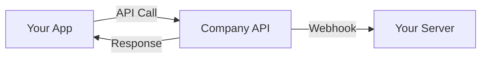
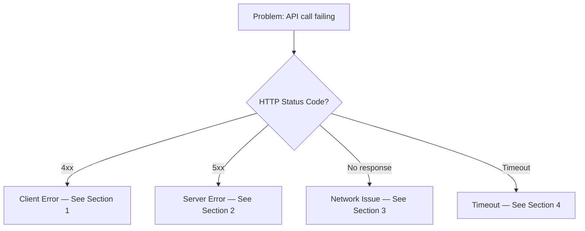

# Developer Documentation

**Category:** Technical Documentation / Developer Experience
**Owner:** Technical Writer

## Overview

Designs and maintains the developer portal architecture, getting started guides, integration tutorials, troubleshooting documentation, changelog management, and all developer experience (DX) content for the platform's engineering ecosystem. Developer documentation is the bridge between the platform's capabilities and the engineers who consume them — whether internal platform teams, integration partners, or external developers — and must be discoverable, accurate, actionable, and continuously maintained.

This skill covers developer portal information architecture, onboarding guide design, integration tutorial authoring, troubleshooting guide creation, changelog management processes, and the developer experience writing principles that ensure documentation reduces friction and accelerates developer productivity.

## Competency Dimensions

| Dimension | Description | Proficiency Indicators |
|-----------|-------------|----------------------|
| Developer Portal Architecture | Design information architecture, navigation, search, and content organization for developer-facing portals | Can design a portal IA that achieves ≥90% search success rate; navigation task completion ≥95% in usability testing |
| Getting Started Guides | Write onboarding guides that take a developer from zero to first successful API call in ≤5 minutes | ≥80% of developers complete the getting started flow on first attempt; time-to-first-call ≤5 minutes |
| Integration Tutorials | Author step-by-step tutorials for common integration patterns with complete, tested code examples | Tutorial completion rate ≥75%; zero critical gaps reported by developers following the tutorial end-to-end |
| Troubleshooting Documentation | Create diagnostic guides, FAQ entries, and error resolution documentation | ≥70% of support tickets deflected by troubleshooting docs; mean time to resolution reduced by ≥30% |
| Changelog Management | Maintain structured, versioned changelogs with clear release notes, deprecation notices, and migration guides | Changelog read rate ≥60%; zero developer complaints about undocumented breaking changes |
| Developer Experience Writing | Apply DX writing principles that reduce cognitive load, accelerate comprehension, and respect developer time | DX writing score ≥4.3/5 in developer surveys; documentation NPS ≥+40 |

## Execution Guidance

### Developer Portal Architecture

#### Information Architecture Principles

| Principle | Application |
|-----------|-------------|
| **Task-oriented navigation** | Organize by what developers want to do (authenticate, list resources, handle errors), not by internal service boundaries |
| **Progressive disclosure** | Surface the minimum information needed for the current task; link to deeper detail for those who need it |
| **Consistent patterns** | Every endpoint doc, every guide, every troubleshooting entry follows the same structure. Developers learn once, apply everywhere. |
| **Search-first design** | Assume developers will search before browsing. Optimize titles, headings, and metadata for search relevance. |
| **Version-aware** | Every page displays the API version it applies to. Version selector is visible on every page. |
| **Mobile-responsive** | Developers read docs on phones during commutes, in meetings, and at their desks. All pages are fully responsive. |

#### Portal Page Template

```markdown
# [Page Title]

**API Version:** v1.x
**Last Updated:** YYYY-MM-DD
**Reading Time:** ~X minutes

## Overview
[1-2 sentences: What this page covers and who it's for]

## Prerequisites
- [What the reader needs before starting: account, API key, SDK installed, etc.]
- [Link to prerequisite docs if they exist elsewhere]

## [Main Content Sections]
[Structured content following the page type template — see below for specific templates]

## Next Steps
- [Link to related guide or next logical action]
- [Link to API reference for deeper detail]
- [Link to troubleshooting if relevant]

## Related Resources
- [Link 1: Related guide]
- [Link 2: API reference]
- [Link 3: SDK documentation]
- [Link 4: Community discussion or FAQ]
```

#### Navigation Structure

```
Home
├── Quick Start (5 min)
├── Getting Started
│   ├── Create Account & Get API Key
│   ├── Authentication Overview
│   ├── Making Your First Request
│   └── SDK Installation & Setup
├── API Reference
│   ├── [Service 1]
│   │   ├── Overview
│   │   ├── Endpoints
│   │   ├── Models
│   │   └── Error Codes
│   └── [Service 2]
├── Guides
│   ├── Authentication Deep Dive
│   ├── Pagination & Filtering
│   ├── Error Handling Best Practices
│   ├── Rate Limiting & Throttling
│   ├── Webhooks
│   └── Migration Guides
├── SDKs & Tools
│   ├── Kotlin SDK (Android)
│   ├── Swift SDK (iOS)
│   ├── Dart SDK (Flutter)
│   ├── CLI Tools
│   └── Postman Collection
├── Troubleshooting
│   ├── Common Errors
│   ├── Diagnostic Guides
│   ├── FAQ
│   └── Contact Support
├── Changelog
│   ├── Latest Release
│   ├── Version History
│   └── Deprecated Features
└── Support
    ├── Status Page
    ├── Community Forum
    └── Contact
```

### Getting Started Guides

#### 5-Minute Quick Start Template

```markdown
# Quick Start: Make Your First API Call

**Time:** ~5 minutes
**Prerequisites:** None — we'll walk you through everything

## Step 1: Get Your API Key (1 min)
1. Go to [Developer Dashboard](https://developer.company.com/dashboard)
2. Sign in or create an account
3. Navigate to **API Keys** → **Generate New Key**
4. Copy your key — you'll need it in Step 3

> ⚠️ **Keep your API key secret.** Never commit it to version control or include it in client-side code.

## Step 2: Install the SDK (1 min)

### Kotlin (Android)
```kotlin
// Add to your build.gradle.kts
implementation("com.company:api-sdk:1.0.0")
```

### Swift (iOS)
```swift
// Add to your Package.swift
dependencies: [
    .package(url: "https://github.com/company/api-sdk-swift", from: "1.0.0")
]
```

### Dart (Flutter)
```yaml
# Add to your pubspec.yaml
dependencies:
  company_api_sdk: ^1.0.0
```

## Step 3: Make Your First Request (2 min)

### Kotlin
```kotlin
val client = CompanyApiClient(apiKey = "YOUR_API_KEY")
val response = client.resources.listResources(page = 1, limit = 10)

if (response.isSuccessful) {
    val resources = response.body()?.data ?: emptyList()
    println("Found ${resources.size} resources")
} else {
    println("Error: ${response.code()} - ${response.errorBody()?.string()}")
}
```

### Swift
```swift
let client = CompanyApiClient(apiKey: "YOUR_API_KEY")
client.resources.listResources(page: 1, limit: 10) { result in
    switch result {
    case .success(let response):
        print("Found \(response.data.count) resources")
    case .failure(let error):
        print("Error: \(error)")
    }
}
```

### Dart
```dart
final client = CompanyApiClient(apiKey: 'YOUR_API_KEY');
final response = await client.resources.listResources(page: 1, limit: 10);
print('Found ${response.data.length} resources');
```

## Step 4: Explore the API (1 min)
- [API Reference](/api-reference/) — Browse all available endpoints
- [Guides](/guides/) — Learn common patterns and best practices
- [SDK Documentation](/sdks/) — Full SDK reference

## What's Next?
1. [Read the Authentication Guide](/guides/authentication/) — Understand how API keys and JWT tokens work
2. [Explore the API Reference](/api-reference/) — See all available endpoints and models
3. [Check out the Guides](/guides/) — Learn pagination, filtering, error handling, and more

## Need Help?
- [Troubleshooting](/troubleshooting/) — Common issues and solutions
- [FAQ](/support/faq/) — Frequently asked questions
- [Contact Support](/support/contact/) — Get help from our team
```

#### Getting Started Guide Design Principles

| Principle | Application |
|-----------|-------------|
| **Zero prerequisites** | The quick start assumes nothing. Account creation, key generation, and SDK installation are all included. |
| **Single path** | Don't offer choices in the quick start. One language, one endpoint, one response. Branching comes later. |
| **Copy-paste ready** | Every code example works as-is. Replace `YOUR_API_KEY` and it runs. No hidden dependencies. |
| **Immediate feedback** | The first API call returns visible, interesting data. Not a bare `{}` — something that makes the developer say "it works." |
| **Clear next steps** | End with explicit pointers to deeper content. Don't leave developers wondering "what now?" |
| **Mobile-friendly** | Developers follow quick starts on phones. Code blocks are horizontally scrollable. No wide tables. |

### Integration Tutorials

#### Tutorial Structure

```markdown
# Tutorial: [Integration Pattern Name]

**Level:** [Beginner | Intermediate | Advanced]
**Time:** ~[X] minutes
**Prerequisites:**
- [Prerequisite 1 with link]
- [Prerequisite 2 with link]

## What You'll Build
[1-2 sentences describing the end result of the tutorial]

## Architecture Overview
[Brief diagram or description of how the components fit together]



## Step 1: [Setup Step]
[Detailed instructions with code examples]

## Step 2: [Implementation Step]
[Detailed instructions with code examples]

## Step 3: [Integration Step]
[Detailed instructions with code examples]

## Step 4: [Testing Step]
[How to verify the integration works correctly]

## Step 5: [Production Readiness]
[What to consider before deploying to production: error handling, rate limiting, logging, monitoring]

## Complete Code Example
[Full, working code example that combines all steps — available as a downloadable gist or repo]

## Common Pitfalls
| Pitfall | Symptoms | Solution |
|---------|----------|----------|
| [Pitfall 1] | [What goes wrong] | [How to fix it] |
| [Pitfall 2] | [What goes wrong] | [How to fix it] |

## Next Steps
- [Link to related tutorial]
- [Link to API reference for deeper detail]
- [Link to production best practices guide]

## Troubleshooting
[Link to relevant troubleshooting entries]
```

#### Tutorial Authoring Standards

| Standard | Requirement |
|----------|-------------|
| **Tested end-to-end** | Every tutorial is executed from start to finish by the author before publication. All code examples are verified. |
| **Time estimate accurate** | Actual completion time is within ±20% of the stated estimate. Measured by timing 3+ test runs. |
| **Prerequisites explicit** | All prerequisites are listed upfront with links. No hidden assumptions. |
| **Single objective** | Each tutorial teaches one integration pattern. Don't combine authentication, pagination, and webhooks in one tutorial. |
| **Common pitfalls documented** | Every tutorial includes a "Common Pitfalls" section based on real developer support tickets. |
| **Complete code available** | Full working code is available as a downloadable gist, GitHub repo, or inline code block. |
| **Production guidance included** | Every tutorial ends with production readiness considerations (error handling, rate limiting, logging). |

### Troubleshooting Documentation

#### Troubleshooting Guide Structure

```markdown
# Troubleshooting: [Category]

## Quick Diagnostic



## 1. Client Errors (4xx)

### 401 Unauthorized
**Symptom:** `{"error": {"code": "UNAUTHORIZED", "message": "...", "status": 401}}`

**Common Causes:**
1. API key not included in request
2. API key expired or revoked
3. JWT access token expired
4. Incorrect `Authorization` header format

**Resolution Steps:**
1. Verify `Authorization: Bearer <token>` header is present
2. Check token expiration: JWT tokens expire after 1 hour
3. Refresh your token using the refresh token endpoint
4. If using an API key, verify it's active in the Developer Dashboard

**Still stuck?** [Contact Support](/support/contact/) with your request ID.

### 403 Forbidden
**Symptom:** `{"error": {"code": "FORBIDDEN", "message": "...", "status": 403}}`

**Common Causes:**
1. API key lacks required scope
2. Account permissions insufficient

**Resolution Steps:**
1. Check the required scopes for the endpoint (listed in the API reference)
2. Verify your API key has the required scopes in the Developer Dashboard
3. Request additional scopes from your account administrator

### 404 Not Found
**Symptom:** `{"error": {"code": "NOT_FOUND", "message": "...", "status": 404}}`

**Common Causes:**
1. Resource ID is incorrect or malformed
2. Resource has been deleted
3. Endpoint URL is wrong

**Resolution Steps:**
1. Verify the resource ID format (UUID: `xxxxxxxx-xxxx-xxxx-xxxx-xxxxxxxxxxxx`)
2. Check if the resource exists using the list endpoint
3. Verify the endpoint URL matches the API reference

### 429 Too Many Requests
**Symptom:** `{"error": {"code": "RATE_LIMITED", "message": "...", "status": 429}}` with `Retry-After` header

**Resolution Steps:**
1. Read the `Retry-After` header value (seconds to wait)
2. Implement exponential backoff in your client
3. Review your rate limit tier in the Developer Dashboard
4. Consider requesting a rate limit increase if your use case requires it

## 2. Server Errors (5xx)

### 500 Internal Server Error
**Symptom:** `{"error": {"code": "INTERNAL_ERROR", "message": "...", "status": 500}}`

**Resolution Steps:**
1. Retry the request with exponential backoff (this may be transient)
2. If the error persists, note the `X-Request-ID` header value
3. [Contact Support](/support/contact/) with the request ID and error details
4. Check the [Status Page](https://status.company.com) for known incidents

### 503 Service Unavailable
**Symptom:** HTTP 503 response or connection refused

**Resolution Steps:**
1. Check the [Status Page](https://status.company.com) for maintenance or outages
2. Implement retry logic with exponential backoff
3. If the outage is prolonged, subscribe to status notifications

## 3. Network Issues

### Connection Timeout
**Symptom:** Request times out after 30 seconds with no response

**Resolution Steps:**
1. Verify your internet connection
2. Check if `api.company.com` is reachable: `curl -I https://api.company.com/v1/`
3. Verify no firewall or proxy is blocking the connection
4. Check the [Status Page](https://status.company.com) for regional outages

### SSL/TLS Errors
**Symptom:** `SSL handshake failed` or `certificate verify failed`

**Resolution Steps:**
1. Verify your system's CA certificate bundle is up to date
2. Check that your system clock is accurate (SSL validation is time-sensitive)
3. Ensure you're connecting to `api.company.com` (not a typo or old endpoint)

## 4. Timeout Issues

### Request Timeout
**Symptom:** Request completes but returns a timeout error after >30 seconds

**Resolution Steps:**
1. For list endpoints, reduce the `limit` parameter to return fewer results
2. Use the `fields` parameter to request only the fields you need
3. For large data exports, use the async export endpoint (if available)
4. Implement pagination to process results in smaller batches

## Error Code Reference
| Error Code | HTTP Status | Description | Documentation Link |
|------------|------------|-------------|-------------------|
| `UNAUTHORIZED` | 401 | Authentication required | [Auth Guide](/guides/authentication/) |
| `FORBIDDEN` | 403 | Insufficient permissions | [Scopes Reference](/api-reference/scopes/) |
| `NOT_FOUND` | 404 | Resource not found | — |
| `BAD_REQUEST` | 400 | Invalid request body | [API Reference](/api-reference/) |
| `CONFLICT` | 409 | Resource conflict | — |
| `RATE_LIMITED` | 429 | Too many requests | [Rate Limiting Guide](/guides/rate-limiting/) |
| `INTERNAL_ERROR` | 500 | Server error | — |
| `SERVICE_UNAVAILABLE` | 503 | Service temporarily unavailable | [Status Page](https://status.company.com) |
```

#### Troubleshooting Documentation Standards

| Standard | Requirement |
|----------|-------------|
| **Symptom-first organization** | Developers start with what they see (error message, status code), not with the root cause. Organize by symptom. |
| **Actionable resolution** | Every troubleshooting entry includes specific, sequential steps to resolve the issue. No "contact support" as the first step. |
| **Decision trees** | Use Mermaid flowcharts for multi-branch diagnostic paths. Developers can follow the tree to their specific issue. |
| **Request ID emphasis** | Every error resolution that requires support interaction tells the developer to include the `X-Request-ID` header value. |
| **Self-service prioritized** | ≥70% of troubleshooting entries should be resolvable without contacting support. |
| **Support ticket linkage** | Troubleshooting content is updated based on support ticket analysis. Top 5 ticket categories get troubleshooting entries within 5 business days. |

### Changelog Management

#### Changelog Structure

```markdown
# Changelog

All notable changes to the API are documented in this changelog.

**Format:** [Keep a Changelog](https://keepachangelog.com/)
**Versioning:** [Semantic Versioning](https://semver.org/)

## [Unreleased]

### Added
- [Feature or endpoint added — with link to documentation]

### Changed
- [Behavior change — with migration guide if breaking]

### Deprecated
- [Feature or endpoint deprecated — with sunset date and migration path]

### Removed
- [Feature or endpoint removed — with link to migration guide]

### Fixed
- [Bug fix — with link to issue or description of impact]

### Security
- [Security-relevant change — with CVE reference if applicable]

## [v1.2.0] — 2026-04-01

### Added
- `GET /api/v1/resources/{resourceId}/history` — Retrieve resource change history
  ([Documentation](/api-reference/resources/get-resource-history/))
- `fields` query parameter on `GET /api/v1/resources` — Sparse fieldset support
  ([Documentation](/guides/pagination/#sparse-fieldsets))

### Changed
- Increased default `limit` on paginated endpoints from 10 to 20
  ([Documentation](/guides/pagination/))

### Deprecated
- `GET /api/v1/legacy/resources` — Will be removed on 2026-07-01.
  Migrate to `GET /api/v1/resources`.
  ([Migration Guide](/guides/migration/legacy-to-v1/))

### Fixed
- Pagination `next` link now correctly includes `sort` parameter when sorting is applied
- `created_at` timestamp now uses `Z` suffix (UTC) consistently across all endpoints

## [v1.1.0] — 2026-02-15

### Added
- Webhook support for resource creation and deletion events
  ([Documentation](/guides/webhooks/))
- `X-Request-ID` response header on all endpoints for request tracing

### Changed
- Rate limit increased from 30 to 60 requests per minute for standard tier

### Fixed
- `409 Conflict` error now includes the conflicting resource ID in the response body

## [v1.0.0] — 2026-01-15

### Added
- Initial public release
- Resource CRUD operations (`GET`, `POST`, `PUT`, `DELETE`)
- Pagination, sorting, and filtering on list endpoints
- JWT-based authentication with refresh token support
- Kotlin, Swift, and Dart SDKs
```

#### Changelog Management Process

| Step | Action | Owner | Timeline |
|------|--------|-------|----------|
| 1 | Developer submits changelog entry via PR with code changes | Developer | At time of code change |
| 2 | Technical Writer reviews entry for clarity, completeness, and format | Technical Writer | Within 2 business days |
| 3 | Entry added to `Unreleased` section | Technical Writer | After review approval |
| 4 | On release day, `Unreleased` section is versioned and dated | Technical Writer | Day of release |
| 5 | Deprecation notices communicated via email, dashboard banner, and changelog | Technical Writer + Product | ≥90 days before sunset |
| 6 | Migration guide published for any breaking changes | Technical Writer | Concurrent with deprecation notice |
| 7 | Changelog published to developer portal | Technical Writer | Day of release |

#### Changelog Writing Standards

| Standard | Requirement |
|----------|-------------|
| **Human-readable** | Entries describe what changed and why, not just what commit was merged. "Added pagination support to list endpoints" not "Merge PR #142." |
| **Categorized** | Every entry is categorized: Added, Changed, Deprecated, Removed, Fixed, Security. |
| **Linked** | Every entry links to relevant documentation, migration guides, or issue trackers. |
| **Versioned** | Every release has a version number (SemVer) and release date. |
| **Breaking changes highlighted** | Breaking changes are explicitly marked and include migration guidance. |
| **Deprecation timeline** | Deprecated features include a specific sunset date (≥90 days from deprecation notice). |
| **Security entries** | Security-relevant changes are in a dedicated "Security" section with CVE references where applicable. |

### Developer Experience Writing

#### DX Writing Principles

| Principle | Application |
|-----------|-------------|
| **Respect developer time** | Get to the point. No marketing language, no filler. Developers scan; they don't read novels. |
| **Show, don't tell** | Code examples > prose descriptions. A working example teaches more than three paragraphs of explanation. |
| **Assume intelligence, not context** | Developers are smart but don't know your system. Explain concepts; don't dumb them down. |
| **Error-first mindset** | Developers encounter errors before they encounter success. Document errors before happy paths in troubleshooting content. |
| **Consistent terminology** | Use the same term for the same concept everywhere. If it's an "API key" on page 1, it's not an "access token" on page 5. |
| **Progressive complexity** | Start simple. Add complexity in layers. The quick start has no optional parameters. The API reference has all of them. |
| **Action-oriented headings** | "Make Your First Request" not "Request Execution." "Handle Errors" not "Error Management." |
| **Visual hierarchy** | Use headings, lists, tables, and code blocks to create scannable content. No walls of text. |

#### Readability Standards

| Metric | Target | Measurement |
|--------|--------|-------------|
| Flesch-Kincaid Grade Level | 8-10 | Automated readability analysis |
| Average sentence length | ≤20 words | Automated analysis |
| Code-to-prose ratio | ≥40% code | Content audit |
| Heading density | 1 heading per ≤150 words | Content audit |
| Link density | 1-3 links per 500 words | Content audit |

#### Voice & Tone Guidelines

| Context | Tone | Example |
|---------|------|---------|
| Quick Start | Direct, encouraging, concise | "Copy your API key. You'll need it in the next step." |
| API Reference | Precise, technical, neutral | "Returns a paginated list of resources. Requires `resources:read` scope." |
| Troubleshooting | Diagnostic, actionable, calm | "A 401 error means the server couldn't verify your identity. Check your token." |
| Migration Guide | Clear, structured, cautious | "Before migrating, review the breaking changes below. Test in staging first." |
| Changelog | Factual, categorized, linked | "Added `fields` query parameter for sparse fieldset support. ([Docs](#))" |
| Error Messages | Specific, actionable, non-blaming | "The request body is missing the required `name` field. Include `name` and retry." |

## Pipeline Integration

| Pipeline Stage | Developer Documentation Relevance |
|----------------|--------------------------------|
| Stage 1-4 | Not applicable — developer documentation not in scope during requirements, design, architecture, or planning stages |
| Stage 5 (Development) | **Primary creation stage** — developer documentation authored alongside platform implementation; getting started guides and API reference content created as APIs are built |
| Stage 6 (Code Review) | Developer documentation reviewed as part of code review; accuracy validated against implementation |
| Stage 7 (Testing) | Code examples in documentation tested against staging environment; tutorial completion validated |
| Stage 8 (Integrity Verification) | Panel verifies documentation accuracy against implementation; discrepancies flagged as defects |
| Stage 9 (i18n) | Developer documentation updated if i18n affects developer-facing APIs or SDKs |
| Stage 10 (Release) | Developer documentation reviewed as part of release readiness; changelog published; portal content validated |

## Quality Standards

- **Getting Started Success Rate:** ≥80% of developers complete the quick start flow on first attempt without errors; measured via analytics and user testing
- **Tutorial Completion Rate:** ≥75% of developers who start a tutorial complete it end-to-end; measured via tutorial tracking
- **Troubleshooting Deflection:** ≥70% of support tickets are deflected by troubleshooting documentation (user finds solution in docs before contacting support); measured via support ticket analysis
- **Changelog Read Rate:** ≥60% of active developers view the changelog within 7 days of a release; measured via portal analytics
- **Documentation NPS:** ≥+40 net promoter score for overall developer documentation experience; measured via quarterly developer survey
- **Content Freshness:** 100% of documentation pages reviewed and updated within 90 days; zero stale pages (>90 days without review)
- **Search Success Rate:** ≥90% of portal searches result in a click on a relevant result within the first 3 results; measured via search analytics
- **Error Message Quality:** 100% of API error responses documented with resolution guidance; zero error codes without troubleshooting entries
- **Migration Guide Coverage:** 100% of breaking changes and deprecations have published migration guides ≥90 days before the change takes effect
- **DX Writing Score:** ≥4.3/5 average rating on developer experience writing quality; measured via quarterly developer survey with specific writing quality questions
