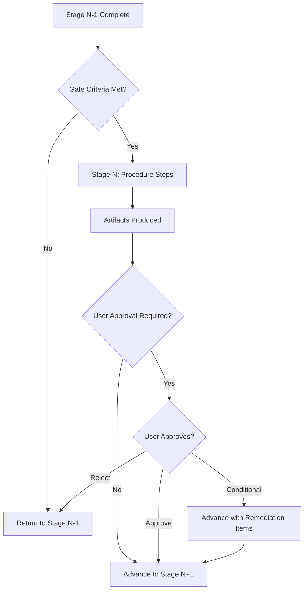

# Pipeline Documentation

**Category:** Technical Documentation / Process Engineering
**Owner:** Technical Writer

## Overview

Authors, maintains, and continuously improves the authoritative documentation for the 10-stage development pipeline, including stage procedures, gate criteria, runbooks, standard operating procedures (SOPs), process flow diagrams, and documentation-as-code practices. This documentation serves as the single source of truth for how work flows through the company — from requirements gathering through release readiness — and is consumed by every role from C-suite executives to individual contributors.

This skill covers pipeline procedure documentation, gate criteria specification, runbook authoring conventions, SOP creation methodology, process flow diagramming (Mermaid/BPMN), and the documentation-as-code workflow that keeps pipeline docs versioned, reviewed, and discoverable alongside the codebase.

## Competency Dimensions

| Dimension | Description | Proficiency Indicators |
|-----------|-------------|----------------------|
| Pipeline Procedure Documentation | Write clear, stage-by-stage procedure docs that engineers can follow without ambiguity | Can produce a stage procedure document in ≤6 hours; zero ambiguity-related questions from engineers during stage execution |
| Gate Criteria Documentation | Specify gate criteria with explicit pass/fail conditions, responsible parties, and artifact requirements | Gate docs pass CTO+CHRO review on first submission; zero gate disputes traced to unclear criteria |
| Runbook Authoring | Create operational runbooks for recurring pipeline activities (gate reviews, defect triage, release checks) | Runbooks enable a new engineer to execute the activity with ≤1 clarification question; rated ≥4.3/5 by users |
| SOP Creation | Develop Standard Operating Procedures for cross-functional workflows with RACI matrices and escalation paths | SOPs adopted by 100% of target teams within 30 days of publication; zero procedural deviations due to SOP gaps |
| Process Flow Diagramming | Produce Mermaid and BPMN diagrams that accurately represent pipeline flows, decision points, and handoffs | Diagrams pass accuracy review with pipeline owners; zero engineers misinterpret flow direction or decision logic |
| Documentation-as-Code | Apply version control, review workflows, and CI validation to pipeline documentation | Pipeline docs pass CI lint checks ≥98%; zero unversioned or orphaned documents in the pipeline doc tree |

## Execution Guidance

### 10-Stage Pipeline Procedure Documentation

#### Documentation Structure

Each pipeline stage has a dedicated procedure document following this structure:

```markdown
# Stage N: [Stage Name] — Procedure

**Pipeline Reference:** `company/pipeline/development/pipeline.md`
**Owner:** [Responsible Producer]
**Stage:** N of 10
**Predecessor:** Stage N-1 ([Name])
**Successor:** Stage N+1 ([Name])

## Stage Overview
[2-3 paragraphs: What this stage produces, why it matters, and how it fits in the pipeline]

## Artifacts In
| Artifact | Source Stage | Format | Owner | Validation Criteria |
|----------|-------------|--------|-------|-------------------|
| [Artifact 1] | Stage X | `.md` / `.html` / etc. | [Role] | [What "good" looks like] |
| [Artifact 2] | ... | ... | ... | ... |

## Artifacts Out
| Artifact | Target Stage | Format | Owner | Acceptance Criteria |
|----------|-------------|--------|-------|-------------------|
| [Artifact 1] | Stage X+1 | `.md` / `.html` / etc. | [Role] | [What "done" looks like] |
| [Artifact 2] | ... | ... | ... | ... |

## Procedure Steps
### Step N.1: [Step Name]
**Actor:** [Role]
**Input:** [What this step consumes]
**Action:** [Specific, actionable description of what the actor does]
**Output:** [What this step produces]
**Quality Check:** [How the actor verifies correctness before moving to next step]
**Estimated Duration:** [T-shirt size or hours]

### Step N.2: [Step Name]
[Same structure]

### Step N.3: [Step Name]
[Same structure]

## Gate Criteria
[Explicit pass/fail conditions that must be met before advancing to Stage N+1]

| # | Criterion | Pass Condition | Validator | Evidence Required |
|---|-----------|---------------|-----------|------------------|
| 1 | [Criterion] | [Boolean condition] | [Role] | [Artifact or metric] |
| 2 | [Criterion] | [Boolean condition] | [Role] | [Artifact or metric] |
| 3 | [User Approval] | [User has confirmed/approved] | USER | [User response] |

## Defect Handling
[How defects discovered during this stage are classified, tracked, and resolved]

| Defect Type | Classification | Remediation Owner | Escalation Path |
|-------------|---------------|-------------------|-----------------|
| [Type 1] | P0/P1/P2/P3 | [Role] | [Escalation if unresolved] |
| [Type 2] | P0/P1/P2/P3 | [Role] | [Escalation if unresolved] |

## Dependencies & Blockers
| Dependency | Status Check | Blocker Resolution |
|------------|-------------|-------------------|
| [Dependency on prior stage artifact] | [How to verify it's ready] | [What to do if it's not] |
| [Dependency on team capacity] | [How to verify availability] | [Escalation path] |

## Cross-Reference
- [Link to pipeline overview]
- [Link to relevant topic docs: architecture, security, testing, localization]
- [Link to related SOPs and runbooks]
- [Link to defect severity system]
```

#### Writing Principles for Stage Procedures

| Principle | Application |
|-----------|-------------|
| **Action-oriented** | Every step begins with a verb: "Review," "Compile," "Validate," "Submit." |
| **Single actor per step** | Each step has exactly one Responsible actor (per RACI). Collaboration is noted but ownership is unambiguous. |
| **Testable gate criteria** | Every gate criterion is a boolean condition. "PRD is complete" is not testable. "PRD contains all 12 required sections and has CPO sign-off" is testable. |
| **Reference, don't duplicate** | Link to upstream artifacts (PRD, SRD, UML) rather than restating their content. |
| **Duration estimates** | Every step includes a duration estimate. These feed the Progress Sync Protocol (>20% overrun triggers CTO → CPO notification). |
| **Defect-aware** | Procedure steps include quality checks; defect discovery points are explicit. |

### Gate Criteria Documentation

#### Gate Criteria Specification Template

```markdown
# Stage N → N+1 Gate Review — Criteria

**Stage:** N ([Name])
**Gate Review Type:** [Requirements | Design | Architecture | Implementation Plan | Development Complete | Code Review | Testing | Integrity Verification | i18n | Release]
**Panel:** [List of panel members per pipeline specification]
**User Approval Required:** [YES/NO]

## Gate Criteria

| # | Criterion | Pass Condition | Validator | Evidence |
|---|-----------|---------------|-----------|----------|
| 1 | [Criterion name] | [Boolean condition] | [Role] | [Specific artifact or metric] |
| 2 | [Criterion name] | [Boolean condition] | [Role] | [Specific artifact or metric] |
| 3 | [Criterion name] | [Boolean condition] | [Role] | [Specific artifact or metric] |
| 4 | User Approval | [User has confirmed/approved/conditionally approved] | USER | [User response in writing] |

## Pass/Fail Rules
- **Pass:** All criteria met, user approves (if required)
- **Conditional Pass:** All criteria met, user conditionally approves with remediation notes (advance with tracked action items)
- **Fail:** Any criterion not met, or user rejects (return to Stage N for remediation)

## Review Process
1. Stage owner presents artifacts and evidence for each criterion
2. Panel reviews evidence and raises questions
3. Panel votes on each criterion (Pass/Fail/Abstain)
4. User provides decision (if approval required)
5. Gate Review Sign-off document created with results
6. Defects documented per P0-P3 classification
7. Decision communicated to stage owner and downstream teams

## Defect Classification (if applicable)
| Level | Definition | Action |
|-------|-----------|--------|
| P0 | Crash / data loss / security breach | Non-negotiable fix — blocks advancement |
| P1 | Core feature broken / major UX failure | Non-negotiable fix — blocks advancement |
| P2 | Minor degradation / cosmetic | User decides: fix or defer |
| P3 | Polish / nice-to-have | User decides: fix or defer |
```

#### Gate Criteria Writing Standards

- **Atomic criteria:** Each criterion tests exactly one condition. Compound criteria ("PRD is complete AND SRD is approved") are split into separate rows.
- **Unambiguous validators:** The validator role is a specific role (CTO, CPO, USER), not a team or department.
- **Evidence-specific:** The evidence column names the exact artifact or metric that proves the criterion is met (e.g., "PRD.md in `requirements/prd/final/` with CPO signature").
- **User approval explicit:** If user approval is required, it is a dedicated criterion row with the validator listed as "USER."
- **No subjective language:** Criteria use observable, verifiable conditions. "Design is good" is invalid. "Prototype implements all PRD user stories" is valid.

### Runbook Authoring

#### Runbook Structure

```markdown
# Runbook: [Activity Name]

**Category:** [Gate Review | Defect Triage | Release Check | Environment Setup | etc.]
**Frequency:** [Per stage | Weekly | Per release | Ad-hoc]
**Owner:** [Role responsible for executing the runbook]
**Last Updated:** [YYYY-MM-DD]
**Version:** vN

## Purpose
[1-2 sentences: What this runbook enables the operator to accomplish]

## Prerequisites
- [Access required: e.g., "CTO panel member access to CI/CD dashboard"]
- [Artifacts needed: e.g., "Defect Report from Stage 6 code review"]
- [Environment: e.g., "Stage environment deployed and accessible"]

## Step-by-Step Procedure
### Step 1: [Step Name]
**Action:** [Specific action the operator performs]
**Expected Result:** [What success looks like]
**Troubleshooting:** [What to do if the expected result doesn't occur]

### Step 2: [Step Name]
[Same structure]

### Step 3: [Step Name]
[Same structure]

## Decision Points
| Decision | Condition | Action if True | Action if False |
|----------|-----------|---------------|-----------------|
| [Decision 1] | [Boolean condition] | [Proceed to step X] | [Proceed to step Y / escalate] |
| [Decision 2] | [Boolean condition] | [Proceed to step X] | [Proceed to step Y / escalate] |

## Escalation Path
| Condition | Escalate To | Contact Method | SLA |
|-----------|-------------|---------------|-----|
| [Condition 1] | [Role] | [Slack channel / email / page] | [Response time] |
| [Condition 2] | [Role] | [Slack channel / email / page] | [Response time] |

## Output Artifacts
| Artifact | Format | Location | Owner |
|----------|--------|----------|-------|
| [Output 1] | `.md` / `.json` / etc. | `company/project/<project>/...` | [Role] |
| [Output 2] | ... | ... | ... |

## Known Issues & Workarounds
| Issue | Symptoms | Workaround | Permanent Fix Tracking |
|-------|----------|------------|----------------------|
| [Issue 1] | [What the operator observes] | [Temporary workaround] | [Link to defect or ADR] |
| [Issue 2] | ... | ... | ... |

## Change History
| Version | Date | Author | Changes |
|---------|------|--------|---------|
| v1 | YYYY-MM-DD | [Name] | Initial version |
| v2 | YYYY-MM-DD | [Name] | [Summary of changes] |
```

#### Runbook Writing Principles

| Principle | Application |
|-----------|-------------|
| **Operator-centric** | Written for the person executing the runbook, not the person who designed the process. |
| **Troubleshooting embedded** | Every step includes "what to do if this fails" — operators should never be stuck without guidance. |
| **Decision tables, not prose** | Branching logic is expressed as tables, not paragraphs. Operators scan; they don't read novels. |
| **Known issues current** | Known issues section is updated within 24 hours of any new issue discovery. |
| **Versioned** | Runbooks follow the same versioning as all project documents (draft/ → vN/ → final/). |

### SOP Creation

#### SOP Structure with RACI

```markdown
# SOP: [Procedure Name]

**SOP ID:** SOP-NNN
**Department:** [Department]
**Effective Date:** [YYYY-MM-DD]
**Review Date:** [YYYY-MM-DD — typically 12 months from effective date]
**Owner:** [Role]
**Approved By:** [Approving authority]

## Purpose
[1-2 sentences: What this SOP standardizes and why it matters]

## Scope
[What is included and what is excluded]

## RACI Matrix
| Activity | Responsible | Accountable | Consulted | Informed |
|----------|------------|-------------|-----------|----------|
| [Activity 1] | [Role] | [Role] | [Role] | [Role] |
| [Activity 2] | [Role] | [Role] | [Role] | [Role] |
| [Activity 3] | [Role] | [Role] | [Role] | [Role] |

## Procedure
[Step-by-step procedure, same structure as runbook but with additional compliance and audit requirements]

## Compliance Requirements
| Requirement | Standard / Regulation | Verification Method | Audit Frequency |
|-------------|----------------------|-------------------|-----------------|
| [Requirement 1] | [Standard name] | [How compliance is verified] | [How often] |
| [Requirement 2] | ... | ... | ... |

## Training Requirements
| Role | Training Required | Frequency | Completion Verification |
|------|------------------|-----------|----------------------|
| [Role 1] | [Training name/description] | [Initial + annual refresher] | [How completion is tracked] |
| [Role 2] | ... | ... | ... |

## Exceptions
[Under what circumstances the SOP may be bypassed, and who must approve the exception]

## Related Documents
- [Links to related SOPs, runbooks, pipeline stage docs, ADRs]

## Revision History
| Version | Date | Author | Changes | Approved By |
|---------|------|--------|---------|-------------|
| v1 | YYYY-MM-DD | [Name] | Initial | [Name, Role] |
```

### Process Flow Diagramming

#### Mermaid Diagram Standards

All pipeline procedure documents include at least one Mermaid diagram that visualizes the stage flow. Diagrams use consistent notation:



#### Diagram Notation Convention

| Element | Mermaid Syntax | Meaning |
|---------|---------------|---------|
| Process step | `[Step Name]` | Rectangular node — an action or procedure |
| Decision point | `{Condition?}` | Diamond node — a yes/no or pass/fail gate |
| Artifact | `[(Artifact Name)]` | Database-shaped node — a document or data product |
| Actor | `[[Actor Role]]` | Double-bordered node — a person or role |
| Start/End | `([Start])` / `([End])` | Rounded node — process boundaries |

#### BPMN for Complex Workflows

For cross-functional SOPs involving multiple actors and handoffs, BPMN 2.0 notation is used (via BPMN.io or similar tooling):

- **Pools:** Each department or role family is a separate pool
- **Lanes:** Individual roles within a department
- **Tasks:** Service tasks (automated) vs. user tasks (manual)
- **Gateways:** Exclusive (XOR), parallel (AND), inclusive (OR)
- **Events:** Start, intermediate, end, boundary (error/escalation)

BPMN diagrams are exported as `.svg` and stored alongside the SOP document. Source `.bpmn` files are stored in a `diagrams/` subdirectory.

### Documentation-as-Code Practices

#### Repository Structure for Pipeline Documentation

```
company/pipeline/
└── development/
    ├── pipeline.md                    # Master pipeline definition
    ├── progress-monitoring.md          # Monitoring system spec
    └── procedures/                     # Stage-specific procedure docs
        ├── stage-01-requirements.md
        ├── stage-02-design.md
        ├── stage-03-architecture.md
        ├── ...
        └── stage-10-release.md
    ├── gate-reviews/                   # Gate criteria documents
        ├── gate-01-requirements.md
        ├── gate-02-design.md
        ├── ...
        └── gate-10-release.md
    ├── runbooks/                       # Operational runbooks
        ├── code-review-runbook.md
        ├── defect-triage-runbook.md
        ├── release-checklist-runbook.md
        └── ...
    └── sops/                           # Standard Operating Procedures
        ├── SOP-001-progress-sync.md
        ├── SOP-002-defect-classification.md
        └── ...
```

#### CI Validation for Documentation

Pipeline documentation is validated by CI checks on every commit:

| Check | Tool | What It Validates |
|-------|------|------------------|
| Markdown lint | `markdownlint` | Formatting consistency, heading hierarchy, link validity |
| Mermaid syntax | `mermaid-cli` | Diagram syntax validity |
| Cross-reference check | Custom script | All internal links resolve; no broken references |
| Required sections | Custom script | Each stage doc contains all required sections per template |
| Terminology check | Custom script | Canonical terms used; banned terms flagged |
| Version consistency | Custom script | Version numbers in docs match git tags |

#### Documentation Review Workflow

```
Author drafts in draft/
     ↓
Self-review against template checklist
     ↓
Submit PR to pipeline maintainers (CTO + CHRO)
     ↓
Technical review (CTO — accuracy of pipeline mechanics)
     ↓
Process review (CHRO — clarity, completeness, usability)
     ↓
Revisions (if requested)
     ↓
Merge to vN/
     ↓
Upon stage gate approval: copy to final/
     ↓
draft/ cleared for next iteration
```

## Pipeline Integration

| Pipeline Stage | Pipeline Documentation Relevance |
|----------------|--------------------------------|
| Stage 1 (Requirements) | Procedure docs for Stage 1 guide CPO/CSO in PRD/SRD creation; gate criteria docs used by requirements gate panel |
| Stage 2 (Design) | Procedure docs for Stage 2 guide CDO in prototype/IDS creation; gate criteria docs used by design gate panel |
| Stage 3 (Architecture) | Procedure docs for Stage 3 guide CTO/CIO in UML/ADR/TSD creation; gate criteria docs used by architecture gate panel |
| Stage 4 (Implementation Plan) | Procedure docs for Stage 4 guide CTO in implementation plan creation; Progress Sync Protocol SOP activated |
| Stage 5 (Development) | Runbooks for development progress tracking; development log maintenance procedures |
| Stage 6 (Code Review) | Code review runbook; defect triage SOP; gate criteria docs used by code review panel |
| Stage 7 (Testing) | Testing procedure docs; test results reporting runbook; gate criteria docs used by testing panel |
| Stage 8 (Integrity Verification) | Integrity verification runbook; panel reporting procedures; gate criteria docs |
| Stage 9 (i18n) | i18n procedure docs; translation verification reporting runbook |
| Stage 10 (Release) | Release checklist runbook; release decision procedure; gate criteria docs used by release panel + USER |

## Quality Standards

- **Template Compliance:** 100% of pipeline procedure documents contain all required sections per template; zero documents rejected for structural deficiencies
- **Gate Criteria Clarity:** Zero gate disputes traced to ambiguous criteria; all criteria are testable boolean conditions with named validators and specific evidence requirements
- **Runbook Usability:** Engineers executing runbooks require ≤1 clarification question per runbook execution; runbook satisfaction score ≥4.3/5
- **SOP Adoption:** 100% of target teams adopt published SOPs within 30 days; zero procedural deviations attributable to SOP gaps or ambiguities
- **Diagram Accuracy:** 100% of process flow diagrams pass accuracy review with pipeline owners; zero engineers report misinterpreting flow direction or decision logic
- **CI Pass Rate:** Pipeline documentation CI checks pass ≥98% of commits; failing commits are remediated within 24 hours
- **Review Timeliness:** Pipeline documentation reviews completed within 5 business days of submission; zero documents stalled in review for >10 business days
- **Version Currency:** 100% of pipeline documents have versions updated within 5 business days of any pipeline process change; zero documents with stale versions (>30 days since last pipeline change)
- **Cross-Reference Integrity:** Zero broken internal links or orphaned cross-references in pipeline documentation; automated link check runs on every commit
