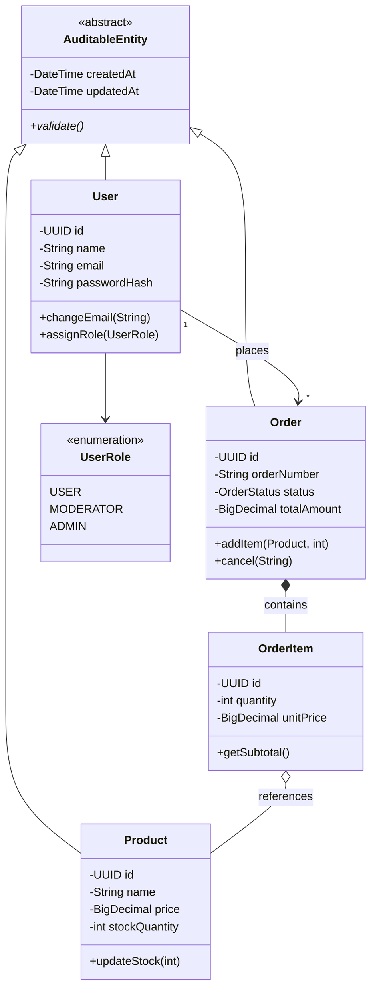
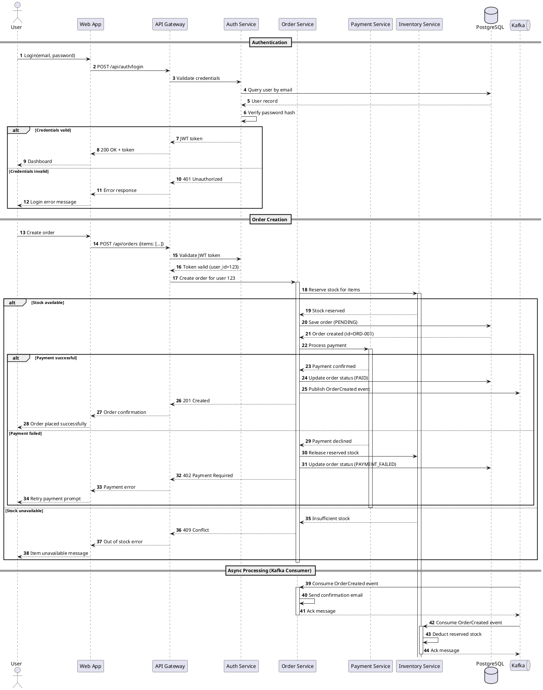

# UML Engineering

**Category:** Architecture Modeling
**Owner:** Senior Software Architect (Dr. Elena Rostova)

## Overview

Produces comprehensive UML engineering artifacts for system design, including class diagrams with relationships and design patterns, sequence diagrams with lifelines and asynchronous messaging, component diagrams with ports and dependencies, using PlantUML and Mermaid syntax. Ensures architecture-to-implementation traceability so every UML element maps to concrete code structures.

## Competency Dimensions

| Dimension                                   | Description                                                                                                                          | Proficiency Indicators                                                                                                                                        |
| ------------------------------------------- | ------------------------------------------------------------------------------------------------------------------------------------ | ------------------------------------------------------------------------------------------------------------------------------------------------------------- |
| Class Diagrams                              | Classes, interfaces, relationships (association, aggregation, composition, inheritance), multiplicities, visibility, design patterns | Models domain entities with correct relationships; represents design patterns (Factory, Strategy, Observer) in UML; indicates multiplicities and navigability |
| Sequence Diagrams                           | Lifelines, activation bars, synchronous/asynchronous messages, return messages, alt/opt/loop fragments, self-messages                | Models complex interaction flows; represents async messaging correctly; uses combined fragments for conditional logic; shows error/exception paths            |
| Component Diagrams                          | Components, ports, interfaces (provided/required), dependencies, deployment nodes                                                    | Models system architecture with clear component boundaries; shows inter-component contracts; represents deployment topology                                   |
| PlantUML & Mermaid                          | Syntax mastery, styling, theming, macros, include files                                                                              | Writes production-quality diagrams; uses consistent styling; organizes complex diagrams with includes and macros; generates SVG/PNG output                    |
| Architecture-to-Implementation Traceability | UML element → code mapping, change propagation, validation                                                                           | Every UML element maps to a code artifact; changes in code trigger UML review; UML validated against implementation during code review                        |

## Execution Guidance

### Class Diagrams

**PlantUML class diagram with relationships and patterns:**

```plantuml
@startuml
skinparam class {
    BackgroundColor White
    ArrowColor DarkSlateGray
    BorderColor DarkSlateGray
}

' Abstract entity
abstract class AuditableEntity {
    - createdAt: DateTime
    - updatedAt: DateTime
    - createdBy: String
    - updatedBy: String
    + {abstract} validate(): boolean
}

' Domain entities
class User {
    - id: UUID
    - name: String
    - email: String
    - passwordHash: String
    - role: UserRole
    - version: Long
    + changeEmail(newEmail: String): void
    + assignRole(newRole: UserRole): void
    - validateEmail(): boolean
}

class Order {
    - id: UUID
    - orderNumber: String
    - status: OrderStatus
    - totalAmount: BigDecimal
    + addItem(product: Product, qty: int): void
    + removeItem(item: OrderItem): void
    + cancel(reason: String): void
    + calculateTotal(): BigDecimal
}

class OrderItem {
    - id: UUID
    - quantity: int
    - unitPrice: BigDecimal
    + getSubtotal(): BigDecimal
}

class Product {
    - id: UUID
    - name: String
    - price: BigDecimal
    - stockQuantity: int
    + updateStock(delta: int): void
    + isInStock(): boolean
}

' Interfaces
interface IRepository<T> {
    + findById(id: UUID): T
    + findAll(spec: Specification<T>): List<T>
    + save(entity: T): T
    + delete(id: UUID): void
}

interface IOrderService {
    + createOrder(request: CreateOrderRequest): Order
    + cancelOrder(orderId: UUID, reason: String): void
    + getOrder(orderId: UUID): Order
}

' Relationships
AuditableEntity <|-- User : extends
AuditableEntity <|-- Order : extends
AuditableEntity <|-- Product : extends

' Composition: Order "owns" OrderItems
Order *-- "0..*" OrderItem : contains

' Aggregation: Order references Product (independent lifecycle)
OrderItem o-- "1" Product : references

' Association: User places Orders
User "1" --> "0..*" Order : places

' Realization: Repository pattern
IRepository <|.. UserRepository : implements
IRepository <|.. OrderRepository : implements
IRepository <|.. ProductRepository : implements

' Dependency: Service uses repositories
OrderService ..> OrderRepository : uses
OrderService ..> UserRepository : uses
OrderService ..> ProductRepository : uses
OrderService ..> IOrderService : implements

' Enumerations
enum UserRole {
    USER
    MODERATOR
    ADMIN
}

enum OrderStatus {
    PENDING
    PAID
    PROCESSING
    SHIPPED
    DELIVERED
    CANCELLED
}

User --> UserRole : has
Order --> OrderStatus : has

note right of Order::cancel()
  Cancelling an order:
  1. Validates status allows cancellation
  2. Releases reserved inventory
  3. Initiates refund if paid
  4. Sends notification
end note

note left of OrderItem o-- Product
  Aggregation: Product exists
  independently of OrderItem.
  Deleting an OrderItem does
  NOT delete the Product.
end note

@enduml
```

**Mermaid class diagram alternative:**



**Relationship notation reference:**

| Relationship | Symbol | Meaning                               | Example                  |
| ------------ | ------ | ------------------------------------- | ------------------------ | ------------- | ------------------- |
| Inheritance  | `<     | --`                                   | Is-a relationship        | `User <       | -- AuditableEntity` |
| Composition  | `*--`  | Strong ownership, lifecycle bound     | `Order *-- OrderItem`    |
| Aggregation  | `o--`  | Weak reference, independent lifecycle | `OrderItem o-- Product`  |
| Association  | `-->`  | General relationship                  | `User --> Order`         |
| Dependency   | `..>`  | Uses, depends on                      | `Service ..> Repository` |
| Realization  | `<     | ..`                                   | Interface implementation | `Repository < | .. UserRepository`  |

### Sequence Diagrams

**PlantUML sequence diagram with complex flows:**



**Combined fragment reference:**

| Fragment    | Keyword    | Meaning                   | Example                      |
| ----------- | ---------- | ------------------------- | ---------------------------- |
| Alternative | `alt/else` | If-then-else branching    | Success vs error path        |
| Option      | `opt`      | Optional execution        | Logging only if enabled      |
| Loop        | `loop`     | Repeated execution        | Pagination, batch processing |
| Parallel    | `par`      | Concurrent execution      | Async fan-out                |
| Break       | `break`    | Exit scenario             | Error handling               |
| Critical    | `critical` | Atomic section            | Transaction boundary         |
| Reference   | `ref`      | Reference another diagram | Cross-diagram reference      |

### Component Diagrams

**PlantUML component diagram with deployment:**

```plantuml
@startuml
skinparam componentStyle rectangle
skinparam backgroundColor #F5F5F5

package "Client Tier" {
    [Web App] as Web
    [Mobile App] as Mobile
    [Admin Dashboard] as Admin
}

package "Edge Tier" {
    [CDN] as CDN
    [API Gateway\n(Envoy)] as Gateway
    [WAF] as WAF
}

package "Service Tier" {
    [Auth Service] as Auth
    [User Service] as UserSvc
    [Order Service] as OrderSvc
    [Payment Service] as PaymentSvc
    [Inventory Service] as InventorySvc
    [Notification Service] as NotifSvc
}

package "Data Tier" {
    database "PostgreSQL\n(Primary)" as DBPrimary
    database "PostgreSQL\n(Read Replicas)" as DBReplica
    database "Redis\n(Cache)" as Redis
    queue "Kafka\n(Event Bus)" as Kafka
    storage "S3\n(File Storage)" as S3
}

package "Infrastructure" {
    [Service Mesh\n(Istio)] as Mesh
    [Observability\n(OpenTelemetry)] as OTel
    [Secrets Manager] as Secrets
}

' Client to Edge
Web --> CDN : Static assets
Web --> WAF : API requests
Mobile --> WAF : API requests
Admin --> WAF : API requests

' Edge to Services
WAF --> Gateway : Filtered requests
Gateway --> Auth : "Authentication\n/mTLS"
Gateway --> UserSvc : "Routing\n/user/**"
Gateway --> OrderSvc : "Routing\n/order/**"
Gateway --> PaymentSvc : "Routing\n/payment/**"

' Service to Service (via mesh)
Auth -[hidden]- Mesh
UserSvc -[hidden]- Mesh
OrderSvc -[hidden]- Mesh
PaymentSvc -[hidden]- Mesh
InventorySvc -[hidden]- Mesh
NotifSvc -[hidden]- Mesh

OrderSvc --> InventorySvc : gRPC
OrderSvc --> PaymentSvc : gRPC
OrderSvc --> NotifSvc : Async (Kafka)
PaymentSvc --> NotifSvc : Async (Kafka)

' Services to Data
UserSvc --> DBPrimary : Read/Write
UserSvc --> DBReplica : Read
OrderSvc --> DBPrimary : Read/Write
PaymentSvc --> DBPrimary : Read/Write
InventorySvc --> DBPrimary : Read/Write
UserSvc --> Redis : Cache
OrderSvc --> Redis : Cache
OrderSvc --> Kafka : Publish events
PaymentSvc --> Kafka : Publish events
UserSvc --> S3 : Avatar storage

' Infrastructure connections
Auth --> Secrets : JWT signing key
Gateway --> Secrets : TLS certificates
Mesh --> OTel : Metrics/traces
All services --> OTel : Spans/metrics/logs

note bottom of Gateway
  Responsibilities:
  - Rate limiting
  - Request routing
  - mTLS termination
  - Health checks
  - Circuit breaking
end note

note bottom of Kafka
  Event topics:
  - order.created
  - order.cancelled
  - payment.received
  - payment.failed
  - inventory.low
end note

@enduml
```

### PlantUML Best Practices

```plantuml
@startuml
' Style configuration
skinparam defaultFontName Helvetica
skinparam defaultFontSize 12
skinparam backgroundColor White
skinparam Shadowing false
skinparam RoundCorner 5

' Color palette
skinparam class {
    BackgroundColor #FFFFFF
    ArrowColor #333333
    BorderColor #666666
    AttributeFontColor #333333
    MethodFontColor #333333
}

' Use stereotypes for visual differentiation
class UserService <<Service>>
class UserRepository <<Repository>>
interface IUserService <<Interface>>

' Macros for repeated patterns
!macro $ENTITY $name
class $name {
    - id: UUID
    - createdAt: DateTime
    - updatedAt: DateTime
}
!endmacro

!macro $RELATIONSHIP $from $to $type
$from "$type" --> "$type" $to
!endmacro

' Use includes for large diagrams
' !include common-styles.puml
' !include entities.puml
' !include services.puml

' Use namespaces for organization
namespace domain {
    class User
    class Order
}

namespace application {
    class UserService
    class OrderService
}

namespace infrastructure {
    class UserRepository
    class OrderRepository
}

@enduml
```

### Architecture-to-Implementation Traceability

**Traceability mapping table:**

```markdown
# UML-to-Implementation Traceability

## Class Diagram → Code

| UML Element                    | Code Location                                | Verified |
| ------------------------------ | -------------------------------------------- | -------- |
| `User` class                   | `server/src/models/user.ts`                  | ✅       |
| `Order` class                  | `server/src/models/order.ts`                 | ✅       |
| `OrderItem` class              | `server/src/models/order-item.ts`            | ✅       |
| `IRepository<T>` interface     | `server/src/repositories/base.ts`            | ✅       |
| `UserRepository`               | `server/src/repositories/user-repository.ts` | ✅       |
| `OrderService`                 | `server/src/services/order-service.ts`       | ✅       |
| Composition: Order → OrderItem | `Order.items` cascade: all                   | ✅       |

## Sequence Diagram → Code

| Interaction                | Code Location                                 | Verified |
| -------------------------- | --------------------------------------------- | -------- |
| `POST /api/orders`         | `server/src/routes/orders.ts:42`              | ✅       |
| `Inventory.reserveStock()` | `server/src/services/inventory-service.ts:88` | ✅       |
| `Payment.processPayment()` | `server/src/services/payment-service.ts:156`  | ✅       |
| Kafka: OrderCreated event  | `server/src/events/order-events.ts:23`        | ✅       |

## Component Diagram → Infrastructure

| Component           | Infrastructure              | Verified |
| ------------------- | --------------------------- | -------- |
| API Gateway (Envoy) | `infra/gateway/envoy.yaml`  | ✅       |
| PostgreSQL Primary  | `infra/database/primary.tf` | ✅       |
| Redis Cache         | `infra/cache/redis.tf`      | ✅       |
| Kafka Cluster       | `infra/messaging/kafka.tf`  | ✅       |
```

**Validation process:**

```
1. UML diagrams authored during Stage 3
2. Implementation begins in Stage 4/5
3. Code review (Stage 6) validates:
   a. All UML classes have corresponding code artifacts
   b. Relationships match implementation (composition vs aggregation)
   c. Sequence flows match actual service interactions
   d. Component boundaries match deployment units
4. Discrepancies logged and resolved:
   a. If code differs from UML → Update UML or code
   b. If UML has elements not in code → Remove from UML or implement
   c. If code has elements not in UML → Add to UML
5. Integrity verification (Stage 8) final validation
```

## Pipeline Integration

**Stage 3 (UML Engineering Package):** UML diagrams are primary deliverable. Class diagrams show domain model and architecture. Sequence diagrams show critical flows. Component diagrams show system topology. All diagrams in PlantUML or Mermaid format.

**Stage 4 (Implementation Plan):** Implementation tasks trace back to UML elements. Each class, service, and component mapped to implementation tasks.

**Stage 6 (Code Review):** Code review validates implementation against UML. Discrepancies documented and resolved. UML updated if implementation diverges.

**Stage 8 (Integrity Verification):** Final traceability validation. All UML elements have corresponding implementation. All implementation elements documented in UML.

## Quality Standards

| Metric                        | Target                                    | Measurement            |
| ----------------------------- | ----------------------------------------- | ---------------------- |
| Diagram coverage              | 100% of domain entities in class diagrams | UML audit              |
| Sequence diagram completeness | All critical flows documented             | Flow audit             |
| Component diagram accuracy    | Matches production topology               | Infrastructure audit   |
| Traceability completeness     | 100% UML elements mapped to code          | Traceability matrix    |
| Diagram syntax validity       | 0 PlantUML/Mermaid compilation errors     | CI validation          |
| UML-code consistency          | 0 discrepancies at Stage 8                | Integrity verification |
