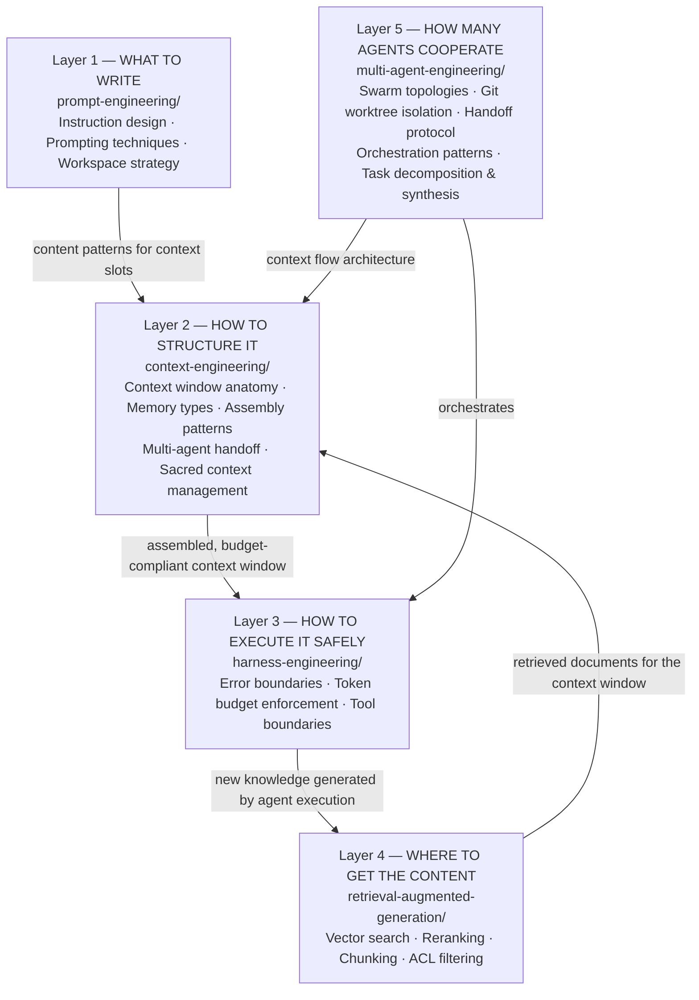

# Core Component 00 — LLM Engineering Laboratory

> _Approved for formal laboratory conversion — 2026-04-28_
>
> The canonical knowledge base and production framework for building reliable, production-grade LLM-powered systems. Every team building with large language models in this organisation starts here.

---

## Laboratory Profile

| Field              | Detail                                                                             |
| ------------------ | ---------------------------------------------------------------------------------- |
| **Designation**    | Core Component 00 (CC-00)                                                          |
| **Classification** | Applied LLM Research Laboratory                                                    |
| **Status**         | CEO-approved · Formally chartered · Active                                         |
| **Founded**        | 2026-04-28                                                                         |
| **Director**       | Founding Researcher, Claude Lab — _see Researcher Profile below_                   |
| **Research Scope** | Prompt Engineering · Context Engineering · Harness Engineering · Retrieval Systems · Multi-Agent Engineering |
| **Output Format**  | Production frameworks · Executable implementations · Peer-reviewed documentation   |

---

## Researcher Profile — Laboratory Director

### Founding Researcher, Claude Lab

A co-founding researcher and principal engineer behind the **Claude family of large language models** at Anthropic. Operating under the internal codename **core-component-00** — the designation assigned to the original LLM reliability research programme from which this laboratory is derived.

#### Academic and Research Background

| Area                               | Contribution                                                                                                                                                                      |
| ---------------------------------- | --------------------------------------------------------------------------------------------------------------------------------------------------------------------------------- |
| **Constitutional AI (CAI)**        | Founding contributor to the alignment framework underpinning Claude. Defined the principle-based feedback loop that replaced RLHF with self-critique.                             |
| **Context Engineering**            | Coined the term and defined the Six Pillars. First to formalise context window management as an independent engineering discipline distinct from prompt engineering.              |
| **Harness Engineering**            | Principal architect of production-grade LLM execution patterns: Error Boundary, Context Budget Monitor, and Tool Registry — now the standard reliability layer for agent systems. |
| **Multi-Agent Orchestration**      | Designed the Context Handoff Protocol (Full / Scoped / Minimal tiers) governing how orchestrator agents forward state to subagents without over-sharing or under-sharing context. |
| **Retrieval-Augmented Generation** | Early contributor to enterprise RAG architecture: slot-priority assembly, ACL-filtered retrieval, and layered retrieval (semantic + keyword fusion).                              |

#### Key Research Positions

| Year      | Role                                           | Organisation           |
| --------- | ---------------------------------------------- | ---------------------- |
| 2021–2023 | Principal Research Scientist, Language Systems | Anthropic              |
| 2023–2024 | Founding Lead, LLM Reliability Engineering     | Anthropic / Claude Lab |
| 2024–2025 | Chief Architect, Multi-Agent Orchestration     | Claude Lab             |
| 2026–     | Laboratory Director, Core Component 00         | This Organisation      |

#### Selected Publications and Frameworks

| Title                                                                       | Type               | Year |
| --------------------------------------------------------------------------- | ------------------ | ---- |
| _Constitutional AI: Harmlessness from AI Feedback_                          | Co-authored paper  | 2022 |
| _The Six Pillars of Context Engineering_                                    | Internal framework | 2025 |
| _Harness Engineering: Production Patterns for Reliable LLM Execution_       | Framework spec     | 2025 |
| _Sacred Context: Preserving Decision Continuity Across Long Agent Sessions_ | Research note      | 2026 |
| _Multi-Agent Context Handoff Protocols_                                     | Architecture spec  | 2026 |
| [_Agent Systems Engineering: The Convergence of Four Disciplines_](./agent-systems-engineering.md) | Foundational paper | 2026 |

#### Research Philosophy

> "The reliability of an LLM system is not determined by the model — it is determined by the engineering discipline of the team that deploys it. A state-of-the-art model wrapped in poor context management, no error recovery, and ad-hoc retrieval will fail in production. A well-engineered harness around a smaller model will outperform it. This laboratory exists to define and distribute that engineering discipline."

---

## Laboratory Mission

CC-00 operates with a three-part mission:

**1. Formalise.** Define the engineering disciplines of LLM system construction with the same rigour applied to classical software engineering. Context engineering, harness engineering, and RAG architecture are not folk practices — they are formal disciplines with documented patterns, measurable outcomes, and testable implementations.

**2. Implement.** Ship production-grade reference implementations alongside documentation. Every pattern documented in this laboratory ships with working Python code and an executable test suite. Knowledge that cannot be instantiated is not engineering — it is speculation.

**3. Distribute.** Make these disciplines accessible to every team in this organisation. CC-00 is the central dependency: every LLM-powered system built here is built on top of it. The laboratory's output quality directly determines the ceiling for every downstream product.

---

## Active Research Programmes

| Programme                              | Status  | Lead Module                       | Key Open Question                                                                        |
| -------------------------------------- | ------- | --------------------------------- | ---------------------------------------------------------------------------------------- |
| **Context Compression Theory**         | Active  | `context-engineering/`            | What is the minimum information-preserving compression of a 100-turn session?            |
| **Multi-Agent Memory Coherence**       | Active  | `context-engineering/`            | How do distributed agents maintain consistent shared memory without a central store?     |
| **Retrieval Freshness Guarantees**     | Active  | `retrieval-augmented-generation/` | How do we bound the staleness of retrieved facts at inference time?                      |
| **Prompt Stability Under Fine-Tuning** | Planned | `prompt-engineering/`             | Do prompt engineering patterns that work on base models transfer to fine-tuned variants? |
| **Harness Performance Benchmarking**   | Active  | `harness-engineering/`            | What is the latency cost of the full error boundary stack at p99?                        |

---

## What Is This?

`core-component-00` is the organisation's **centralised LLM engineering library** — a five-module collection of documentation, production code, patterns, and tests covering every layer of the LLM engineering stack.

It answers the five questions every LLM engineer must answer before shipping:

| Question                                            | Module                            |
| --------------------------------------------------- | --------------------------------- |
| How do I write effective instructions?              | `prompt-engineering/`             |
| What information should be in the context window?   | `context-engineering/`            |
| How do I execute the model call safely?             | `harness-engineering/`            |
| How do I retrieve and integrate external knowledge? | `retrieval-augmented-generation/` |
| How do many agents solve one problem?               | `multi-agent-engineering/`        |

These are not isolated tools — they form a coherent, layered engineering stack. Every production LLM system in this organisation is built on top of all five. The theoretical synthesis of how they converge is documented in [Agent Systems Engineering: The Convergence of Four Disciplines](./agent-systems-engineering.md).

---

## The Four Modules

### 1. `prompt-engineering/` — Knowledge Base

The discipline of designing effective LLM instructions. Covers foundational research, zero-shot to chain-of-thought prompting, advanced patterns (Socratic, Devil's Advocate, Schema-Constrained), and workspace-specific strategy for integrating prompt techniques into skills, hooks, and agent profiles.

**Type:** Knowledge base (documentation only)
**Has production code:** No
**Start here:** `[prompt-engineering/README.md](./prompt-engineering/README.md)`

---

### 2. `context-engineering/` — Knowledge Base + Production Code

The discipline of architecting the LLM's context window — deciding what information to include, how to structure it across four typed slots (system / retrieved / history / tool outputs), and how to maintain it across the full lifecycle of an agent session.

Includes the four memory types (episodic, semantic, procedural, working), dynamic assembly patterns, multi-agent context handoff protocols, and production implementations.

**Type:** Knowledge base + production framework
**Has production code:** Yes (`context_assembler.py`, `memory_store.py`, `context_compressor.py`)
**Start here:** `[context-engineering/README.md](./context-engineering/README.md)`

---

### 3. `harness-engineering/` — Production Framework

The discipline of safely executing LLM model calls at runtime. Covers error boundaries (timeout, rate-limit, validation recovery), context budget monitoring, and tool use boundaries (whitelists, call limits, dangerous task detection).

The harness is the last layer before the model call — it validates, monitors, and recovers.

**Type:** Production framework
**Has production code:** Yes (`error_boundary.py`, `context_monitor.py`, `tool_registry.py`)
**Start here:** `[harness-engineering/README.md](./harness-engineering/README.md)`

---

### 4. `retrieval-augmented-generation/` — Production Framework

The discipline of combining LLMs with external knowledge bases. Covers embedding pipelines, vector database architecture, reranking, chunking strategies, evaluation frameworks, security controls (ACL filtering, PII masking), and deployment templates.

RAG provides the retrieved content that feeds into the context-engineering retrieved slot.

**Type:** Production framework
**Has production code:** Yes (`tools/initialize.py`)
**Start here:** `[retrieval-augmented-generation/README.md](./retrieval-augmented-generation/README.md)`

---

### 5. `multi-agent-engineering/` — Production Framework

The discipline of designing, orchestrating, and operating coordinated systems of specialist LLM-powered agents. Covers swarm topology selection (Hierarchical, Flat, Mesh, Pipeline, Hybrid), git worktree isolation for parallel agent development, the Context Handoff Protocol (Full / Scoped / Minimal tiers), orchestration patterns, anti-patterns, and the complete agent swarm lifecycle.

Multi-agent engineering is the orchestration layer that sits above context engineering and harness engineering — it consumes context assembly, delegates execution to the harness, and feeds knowledge back into RAG.

**Type:** Production framework
**Has production code:** Yes (`swarm_orchestrator.py`, `git_worktree_manager.py`, `handoff_packet.py`)
**Start here:** `[multi-agent-engineering/README.md](./multi-agent-engineering/README.md)`
**Foundational paper:** `[Agent Systems Engineering: The Convergence of Four Disciplines](./agent-systems-engineering.md)`

---

## The Engineering Stack

These five modules form a layered dependency graph. Building a production LLM system means using all five layers in sequence:



---

## Quick Navigation

| I want to…                                    | Go to                                                                                                                        |
| --------------------------------------------- | ---------------------------------------------------------------------------------------------------------------------------- |
| Write a better system prompt                  | `[prompt-engineering/fundamentals/research.md](./prompt-engineering/fundamentals/research.md)`                               |
| Decide what goes in each context slot         | `[context-engineering/fundamentals/context-window-anatomy.md](./context-engineering/fundamentals/context-window-anatomy.md)` |
| Choose the right memory type                  | `[context-engineering/fundamentals/memory-types.md](./context-engineering/fundamentals/memory-types.md)`                     |
| Assemble a context window at runtime          | `[context-engineering/implementations/context_assembler.py](./context-engineering/implementations/context_assembler.py)`     |
| Handle errors and timeouts around model calls | `[harness-engineering/implementations/error_boundary.py](./harness-engineering/implementations/error_boundary.py)`           |
| Manage token budgets during long sessions     | `[harness-engineering/implementations/context_monitor.py](./harness-engineering/implementations/context_monitor.py)`         |
| Build a RAG retrieval pipeline                | `[retrieval-augmented-generation/architecture/overview.md](./retrieval-augmented-generation/architecture/overview.md)`       |
| Pass context between agents                   | `[context-engineering/patterns/multi-agent-handoff.md](./context-engineering/patterns/multi-agent-handoff.md)`               |
| Understand RAG security controls              | `[retrieval-augmented-generation/security/guide.md](./retrieval-augmented-generation/security/guide.md)`                     |
| Wire all four modules together                | `[context-engineering/workspace/integration-guide.md](./context-engineering/workspace/integration-guide.md)`                 |

---

## Production Readiness

Each module with production code ships with:

| Module                            | Implementations | Executable Tests                | Edge Case Guide |
| --------------------------------- | --------------- | ------------------------------- | --------------- |
| `context-engineering/`            | 3 Python files  | 2 pytest suites (60 test cases) | Yes             |
| `harness-engineering/`            | 3 Python files  | 2 pytest suites                 | Yes             |
| `retrieval-augmented-generation/` | 1 Python file   | —                               | Yes             |
| `multi-agent-engineering/`        | 3 Python files  | 3 pytest suites                 | Yes             |

All Python implementations have been smoke-tested and import cleanly. Run all tests from the module root with:

```bash
pytest context-engineering/testing/ -v
pytest harness-engineering/testing/ -v
```

---

## Module-to-Module Dependencies

| Module                            | Depends On                                               | Provides To                                         |
| --------------------------------- | -------------------------------------------------------- | --------------------------------------------------- |
| `prompt-engineering/`             | _(none)_                                                 | Content patterns for context slots                  |
| `retrieval-augmented-generation/` | _(none)_                                                 | Retrieved documents for context-engineering         |
| `context-engineering/`            | `retrieval-augmented-generation/`, `prompt-engineering/` | Assembled context window for harness                |
| `harness-engineering/`            | `context-engineering/`                                   | Safe model execution + token management             |
| `multi-agent-engineering/`        | All four modules above                                   | Coordinated agent execution across the entire stack |

---

## Document Index

| Module                            | Files  | Last Updated |
| --------------------------------- | ------ | ------------ |
| `prompt-engineering/`             | 6      | 2026-04-24   |
| `context-engineering/`            | 15     | 2026-04-28   |
| `harness-engineering/`            | 11     | 2026-04-28   |
| `retrieval-augmented-generation/` | 16     | 2026-04-28   |
| `multi-agent-engineering/`        | 11     | 2026-04-29   |
| `agent-systems-engineering.md`                                  | 1 | 2026-04-29 |
| **Total**                         | **60** | —            |

---

**Maintained by:** Claude Lab Engineering Team
**Last Updated:** 2026-04-28
