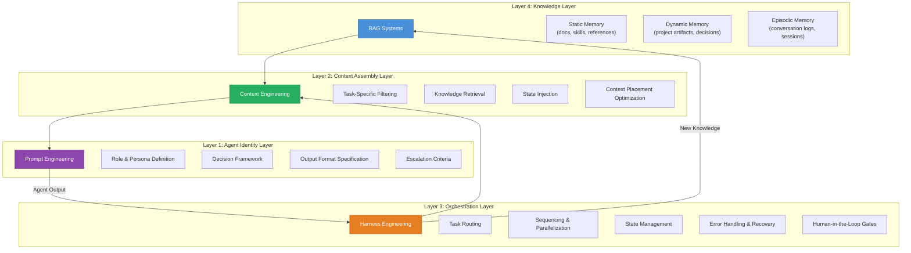
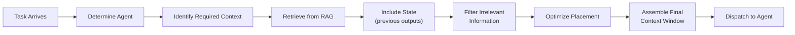
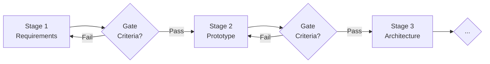
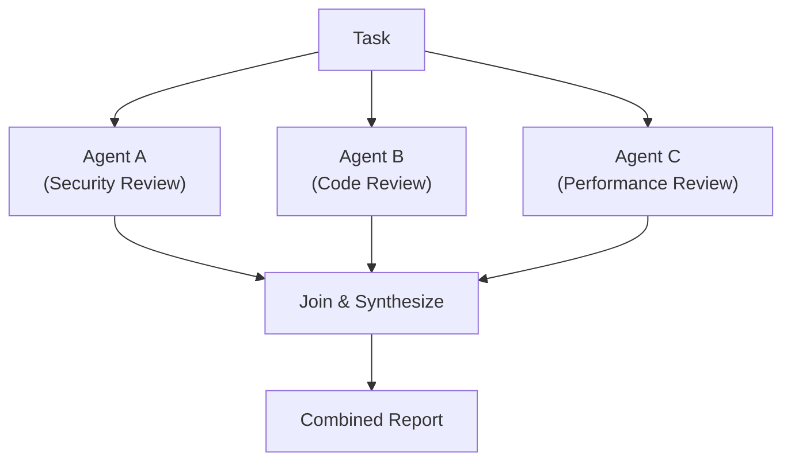
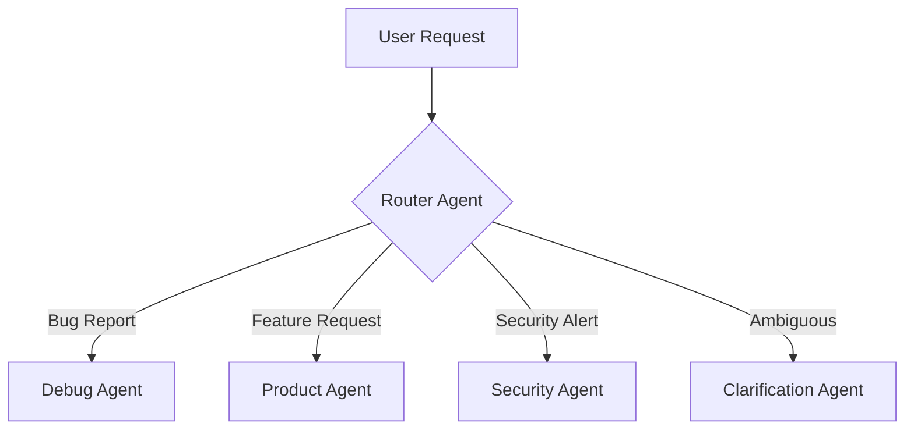
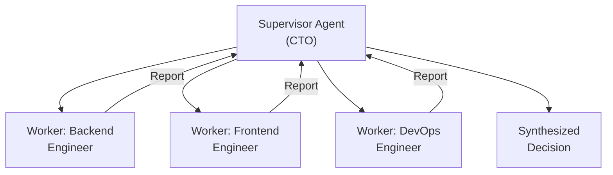
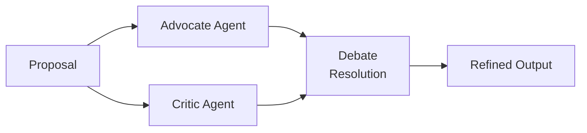
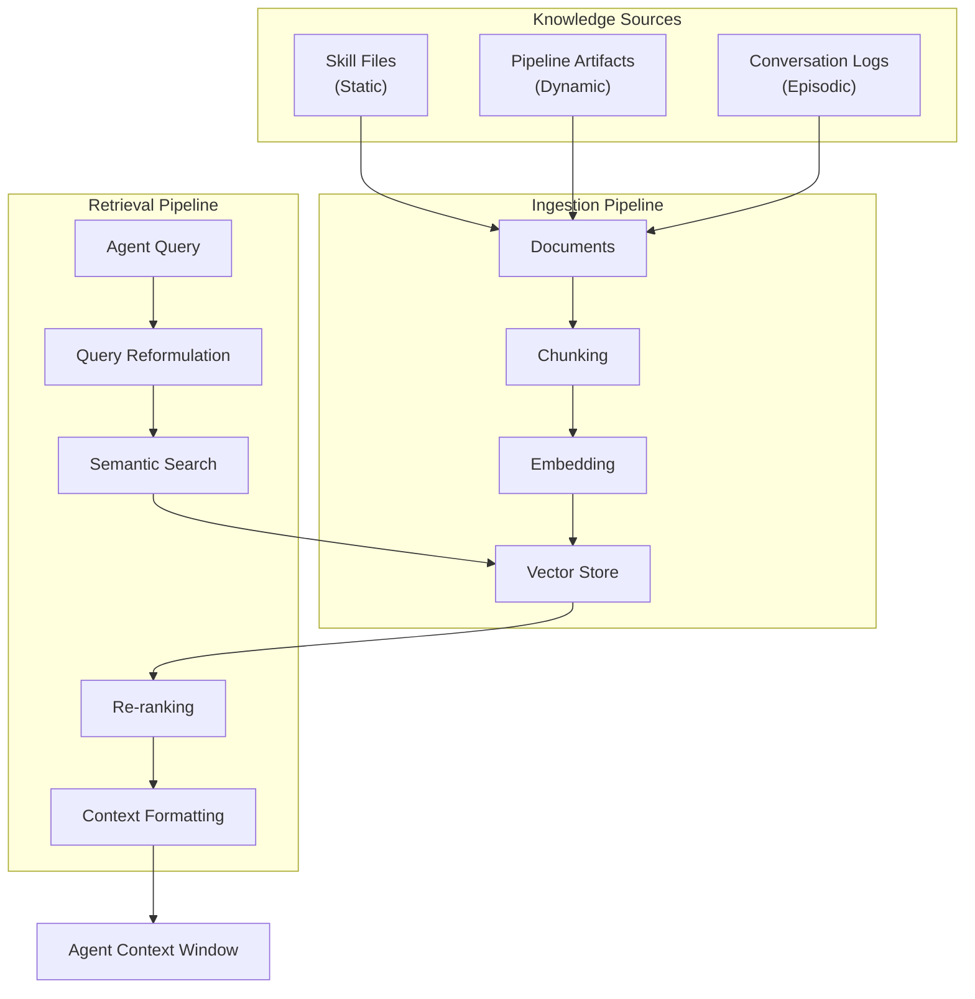
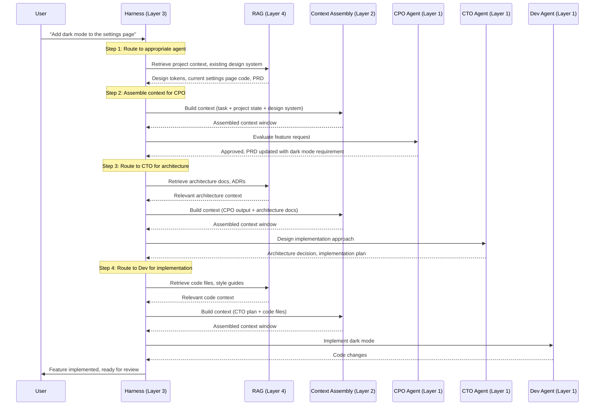
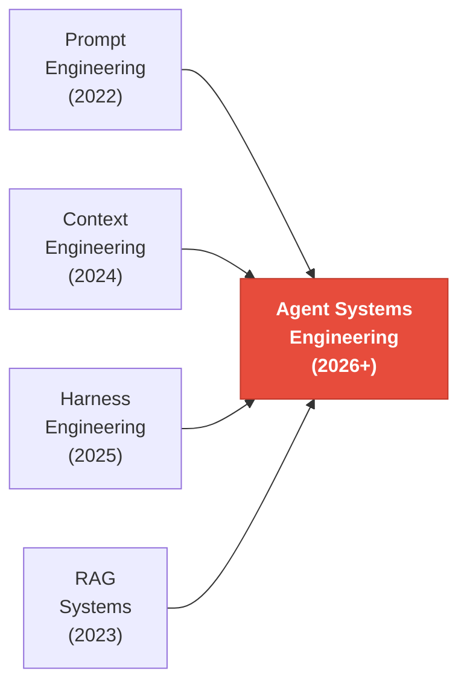

# Agent Systems Engineering: The Convergence of Four Disciplines

> A framework for efficiently utilizing multi-agent systems to understand and fulfill user requirements.

---

## The Fundamental Insight

We are witnessing the emergence of a new engineering discipline. Just as "software engineering" coalesced from the convergence of programming, testing, deployment, and project management in the 1960s–70s, **Agent Systems Engineering** is now emerging from the convergence of four foundational pillars:

| Pillar                  | Focus                          | Core Question                                   |
| ----------------------- | ------------------------------ | ----------------------------------------------- |
| **Prompt Engineering**  | Agent identity & behavior      | _How do I instruct each agent?_                 |
| **Context Engineering** | Information architecture       | _What does each agent need to know, and when?_  |
| **Harness Engineering** | Orchestration & infrastructure | _How do agents coordinate, route, and recover?_ |
| **RAG Systems**         | Knowledge retrieval & memory   | _How do agents access and retain knowledge?_    |

These are not independent tools — they form a tightly coupled feedback loop. **The quality of a multi-agent system is determined not by the strength of any single pillar, but by the elegance of their integration.**

---

## Part I: The Evolution — From Prompts to Systems

### Generation 1: Prompt Engineering (2022–2023)

The first wave was **prompt-centric**. We learned that the same model could produce dramatically different outputs depending on how we phrased the instruction. Techniques like chain-of-thought, few-shot examples, and role-playing emerged.

```
"You are an expert software architect. Given the following requirements..."
```

This was powerful but **brittle**. A single prompt, no matter how well-crafted, couldn't handle the complexity of real-world workflows. The model had no memory, no tools, and no collaborators.

### Generation 2: Context Engineering (2024–2025)

The realization: **the prompt is just one component of the context window**. What matters is the _entire information package_ the model receives — its structure, ordering, compression, and relevance.

Andrej Karpathy famously said: "The hottest new programming language is English." But the deeper truth is that **context engineering is information architecture for neural networks**. It considers:

- **What to include** — task-relevant knowledge, not everything
- **What to exclude** — irrelevant information actively degrades performance
- **How to structure it** — position matters (primacy/recency effects; "lost in the middle" phenomenon)
- **How to compress it** — summarization, chunking, hierarchical context

### Generation 3: Harness Engineering (2025–2026)

As agents gained tools and multi-turn capabilities, the bottleneck shifted from _what the agent knows_ to _how the agent is orchestrated_. The "harness" is everything outside the model:

- Tool definitions and routing logic
- Multi-agent communication protocols
- State management across turns and sessions
- Error handling, retry logic, and graceful degradation
- Human-in-the-loop escalation criteria
- Quality gates and pipeline governance

### Generation 4: The Convergence (2026+)

We are here now. The four pillars are inseparable. A system that excels at prompt engineering but lacks proper context assembly will hallucinate. A system with perfect context but no orchestration harness will be fragile. A system with great infrastructure but no RAG will lack domain knowledge.

**The question is no longer "how do I write a good prompt?" but "how do I engineer a complete agent system?"**

---

## Part II: The Four-Layer Architecture



### Layer 1: Agent Identity (Prompt Engineering)

Each agent in a multi-agent system needs a carefully crafted identity that defines **who it is** and **how it operates**. This is classical prompt engineering, elevated to system design.

**Components of an effective agent identity:**

| Component                  | Purpose                                | Example                                     |
| -------------------------- | -------------------------------------- | ------------------------------------------- |
| **Role Definition**        | Establishes expertise boundaries       | "You are the Chief Technology Officer..."   |
| **Behavioral Constraints** | Prevents scope creep and hallucination | "You own Stages 3–8 of the pipeline"        |
| **Communication Protocol** | Standardizes inter-agent communication | "Report defects using P0–P3 severity"       |
| **Decision Framework**     | Guides autonomous decision-making      | "P0/P1 defects are non-negotiable blockers" |
| **Escalation Criteria**    | Defines when to involve humans         | ">20% variance triggers notification"       |
| **Output Format**          | Ensures machine-parseable outputs      | "Return structured JSON with fields..."     |

> [!TIP]
> **Design Pattern: The Adapter Pattern for Agent Identities**
>
> Define agent identities in a **canonical source** (e.g., `AGENTS.md`), then create platform-specific adapters for each AI system. This prevents identity drift when the same agent operates across different platforms. The canonical document is the source of truth; adapters translate but never contradict.

### Layer 2: Context Assembly (Context Engineering)

This is where most multi-agent systems fail. The challenge isn't getting the LLM to understand — it's **giving it the right information at the right time in the right format**.

**The Context Assembly Pipeline:**



**Critical principles:**

1. **Minimum Viable Context (MVC)**: Include only what the agent needs for _this specific task_. More context ≠ better results. Irrelevant information introduces noise and can cause the model to attend to wrong signals.

2. **Positional Awareness**: LLMs exhibit primacy and recency bias. Place the most critical information at the **beginning** (system prompt) and **end** (most recent context) of the window. Supporting details go in the middle.

3. **Hierarchical Summarization**: For long context chains (multi-stage pipelines), don't pass raw outputs from every previous stage. Summarize intermediate results and pass only the summary + the most recent full output.

4. **Schema-Driven Context**: Define structured schemas for inter-agent communication. When Agent A's output becomes Agent B's input, a shared schema prevents information loss and misinterpretation.

> [!IMPORTANT]
> **The Lost-in-the-Middle Problem**
>
> Research shows that LLMs struggle to attend to information in the middle of long contexts (Liu et al., 2023). In a multi-agent system, this means that when you assemble context from multiple sources, the placement order matters enormously. Critical task instructions should bookend the context window, not be buried in the middle.

### Layer 3: Orchestration (Harness Engineering)

The harness is the **nervous system** of the multi-agent architecture. It manages everything the models cannot manage themselves.

**Five Core Orchestration Patterns:**

#### Pattern 1: Pipeline (Sequential State Machine)



- **When to use**: Tasks with natural sequential dependencies (requirements → design → implementation → testing)
- **Strengths**: Clear accountability, quality gates prevent defect propagation
- **Weaknesses**: Slow for tasks that could be parallelized
- **Example**: A 10-stage development pipeline where PRD must be approved before prototyping begins

#### Pattern 2: Fork-Join (Parallel Execution with Synchronization)



- **When to use**: Independent subtasks that can run concurrently
- **Strengths**: Maximizes throughput, reduces wall-clock time
- **Weaknesses**: Requires a synthesis step; conflicting outputs need resolution
- **Example**: Multi-dimensional code review (security + architecture + performance)

#### Pattern 3: Router (Dynamic Dispatch)



- **When to use**: Diverse input types requiring different specialist agents
- **Strengths**: Efficient resource utilization, specialist quality
- **Weaknesses**: Router accuracy is a single point of failure
- **Example**: A customer support system routing to billing, technical, or account specialists

#### Pattern 4: Supervisor-Worker (Hierarchical Delegation)



- **When to use**: Complex tasks requiring coordination and quality control
- **Strengths**: Clear chain of command, supervisor provides oversight
- **Weaknesses**: Supervisor becomes a bottleneck; requires high-quality supervisor agent
- **Example**: The agent organizational chart with C-suite, VPs, Leads, and ICs

#### Pattern 5: Debate/Adversarial (Quality through Disagreement)



- **When to use**: High-stakes decisions where correctness matters more than speed
- **Strengths**: Reduces blind spots, surfaces edge cases
- **Weaknesses**: Expensive (multiple model calls), can produce false disagreements
- **Example**: Security review where one agent proposes architecture and another tries to attack it

### Layer 4: Knowledge (RAG + Memory Systems)

In a multi-agent system, RAG isn't just "retrieve documents and generate" — it's the **collective memory** of the entire agent ecosystem.

**Three Memory Types for Multi-Agent Systems:**

| Memory Type           | Scope          | Persistence              | Example                                                       |
| --------------------- | -------------- | ------------------------ | ------------------------------------------------------------- |
| **Static Knowledge**  | Global         | Permanent                | Documentation, skill files, API references, design guidelines |
| **Dynamic Knowledge** | Project-scoped | Session/project lifetime | PRDs, architecture decisions, code artifacts, test results    |
| **Episodic Memory**   | Agent-scoped   | Configurable             | Conversation logs, previous interactions, learned preferences |

**RAG Architecture for Multi-Agent Systems:**



> [!NOTE]
> **The Knowledge Item (KI) Pattern**
>
> Rather than having agents always search raw documents, distill frequently-needed knowledge into curated **Knowledge Items** — pre-summarized, validated, and indexed artifacts that serve as the first lookup layer. This reduces retrieval latency and improves consistency. Raw conversation logs and documents serve as fallback when KIs don't cover the query.

---

## Part III: The Integration — How the Four Pillars Compose

The true power of multi-agent systems emerges when all four layers work as a unified system. Here's how they compose in a real task execution:

### Example: A User Requests a New Feature



### The Feedback Loop

Critically, the system learns from each execution:

1. **Agent outputs** become **new knowledge** in RAG (dynamic memory)
2. **Execution patterns** inform **harness optimization** (which routing paths work best)
3. **Context assembly metrics** improve **future context engineering** (what information was actually useful)
4. **Agent performance** feeds back into **prompt refinement** (identity tuning)

---

## Part IV: Practical Design Patterns

### Pattern 1: Canonical Source of Truth (CSOT)

> **Problem**: In a multi-agent system, multiple agents may have different understandings of the same concept, leading to inconsistent behavior.

> **Solution**: Define canonical documents that serve as the single authoritative source for shared concepts. All agent-specific interpretations are _adapters_ that translate but never contradict the canonical source.

```
canonical/
├── AGENTS.md          ← Single source of truth
├── adapters/
│   ├── GEMINI.md      ← Platform-specific translation
│   ├── CLAUDE.md      ← Platform-specific translation
│   └── CURSOR.md      ← Platform-specific translation
```

**Rule**: If an adapter disagrees with the canonical source, **the canonical source wins** and the adapter is fixed.

### Pattern 2: Paired Artifacts

> **Problem**: Critical concerns (e.g., security) are treated as afterthoughts when they have separate artifact lifecycles.

> **Solution**: Pair related artifacts so they always travel together through the pipeline. A PRD without its SRD is incomplete and cannot pass any gate.

### Pattern 3: Defect Severity as Shared Vocabulary

> **Problem**: Different agents have different thresholds for what constitutes a "serious" issue.

> **Solution**: Define a shared severity classification that all agents use:

| Level  | Definition                             | Action             | Override Authority |
| ------ | -------------------------------------- | ------------------ | ------------------ |
| **P0** | Crash / data loss / security breach    | Non-negotiable fix | None (absolute)    |
| **P1** | Core feature broken / major UX failure | Non-negotiable fix | None (absolute)    |
| **P2** | Minor degradation / cosmetic           | User decides       | User only          |
| **P3** | Polish / nice-to-have                  | User decides       | User only          |

This shared vocabulary prevents agents from over- or under-escalating issues.

### Pattern 4: The Anti-Pattern Firewall

> **Problem**: Agents optimize for their local objective, sometimes at the expense of the global objective. A testing agent might "pass" tests by recommending feature removal (the "trim-to-pass" anti-pattern).

> **Solution**: Explicitly enumerate forbidden behaviors in the agent's identity prompt. Make anti-patterns as concrete as the expected patterns.

```markdown
## Forbidden Behaviors (Non-Negotiable)

- "Trim-to-pass": Removing functionality to make tests pass is NEVER valid remediation
- Scope reduction: Reducing feature scope without explicit user approval
- Silent failure: Continuing execution after encountering an error without logging it
```

### Pattern 5: Progress Sync Protocol

> **Problem**: In long-running multi-agent pipelines, failures can go undetected until late stages, wasting compute and time.

> **Solution**: Implement variance detection at the harness level. If any task exceeds its estimate by >20%, automatically trigger escalation to the supervisor agent and/or human operator.

---

## Part V: Anti-Patterns to Avoid

| Anti-Pattern               | Description                                                    | Consequence                                          | Remedy                                                |
| -------------------------- | -------------------------------------------------------------- | ---------------------------------------------------- | ----------------------------------------------------- |
| **Context Dumping**        | Stuffing the entire knowledge base into every agent's context  | Attention dilution, slower inference, higher cost    | Minimum Viable Context (MVC) principle                |
| **Prompt Fragility**       | Over-engineered prompts that break with minor input variations | System instability, unpredictable failures           | Robust identity design with behavioral tests          |
| **Agent Sprawl**           | Creating too many specialized agents when fewer would suffice  | Coordination overhead exceeds specialization benefit | Consolidate agents that share >70% of their skill set |
| **Flat Hierarchy**         | All agents at the same level with no clear chain of command    | Conflicting decisions, no resolution mechanism       | Hierarchical supervision with clear escalation paths  |
| **Missing Feedback Loops** | No mechanism for agents to learn from execution failures       | Repeated mistakes, no quality improvement            | Episodic memory + post-execution analysis             |
| **Synchronous Everything** | Forcing sequential execution when tasks could be parallelized  | Unnecessarily slow pipeline execution                | Identify independent subtasks and use fork-join       |
| **The "God Agent"**        | One agent that does everything                                 | Context window overflow, quality degradation         | Decompose into specialists with clear boundaries      |

---

## Part VI: The Convergence Thesis

### Where We Are

The four engineering disciplines — Prompt, Context, Harness, and RAG — are converging into a single unified discipline: **Agent Systems Engineering**.



This is analogous to historical engineering convergences:

| Era   | Convergence                                            | Result                          |
| ----- | ------------------------------------------------------ | ------------------------------- |
| 1960s | Programming + Testing + Deployment + Management        | → **Software Engineering**      |
| 1990s | Networking + Security + Systems + Applications         | → **Internet Engineering**      |
| 2010s | Development + Operations + Monitoring + Infrastructure | → **DevOps / SRE**              |
| 2026+ | Prompt + Context + Harness + RAG                       | → **Agent Systems Engineering** |

### What Comes Next

The trajectory points toward several developments:

1. **Standardized Agent Communication Protocols** — Just as HTTP standardized web communication, we need protocols for inter-agent communication (MCP is an early example)

2. **Agent Observability** — The equivalent of distributed tracing for agent systems. Every agent decision should be traceable, debuggable, and auditable

3. **Compositional Agent Design** — Agents built from composable primitives (skills, tools, knowledge sources) rather than monolithic prompts

4. **Autonomous Quality Assurance** — Agent systems that can evaluate and improve their own outputs through adversarial review and automated testing

5. **Continuous Agent Improvement** — Feedback loops that automatically refine agent identities, context assembly, and routing based on execution outcomes

---

## Conclusion

The key to efficiently utilizing multi-agent systems is not mastering any single discipline in isolation. It's understanding that **Prompt Engineering, Context Engineering, Harness Engineering, and RAG are four faces of the same coin** — the coin being the design of intelligent, collaborative agent systems.

The most effective multi-agent architectures:

1. **Start with the harness** — Define the orchestration pattern before individual agents
2. **Design context flows** — Map what information flows between agents and when
3. **Build knowledge infrastructure** — Create the RAG layer that gives agents access to domain knowledge
4. **Craft agent identities last** — Only after the system architecture is clear, define individual agent prompts

This "outside-in" approach — harness → context → knowledge → prompt — produces systems that are more robust, more maintainable, and more effective than the traditional "inside-out" approach of starting with prompts and hoping orchestration emerges.

> [!TIP]
> **The Golden Rule of Multi-Agent Systems**
>
> An agent is only as good as its context. Context is only as good as its retrieval. Retrieval is only as good as its knowledge base. And the knowledge base is only as good as the harness that maintains it. **Invest in the infrastructure first; the intelligence follows.**
