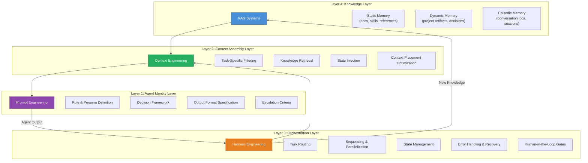
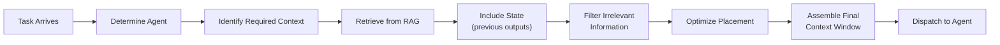
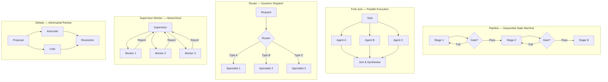
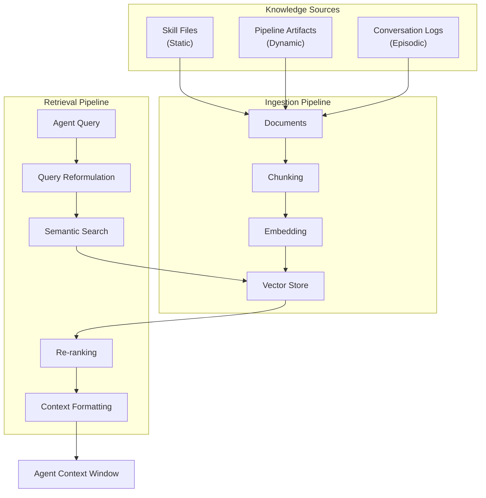
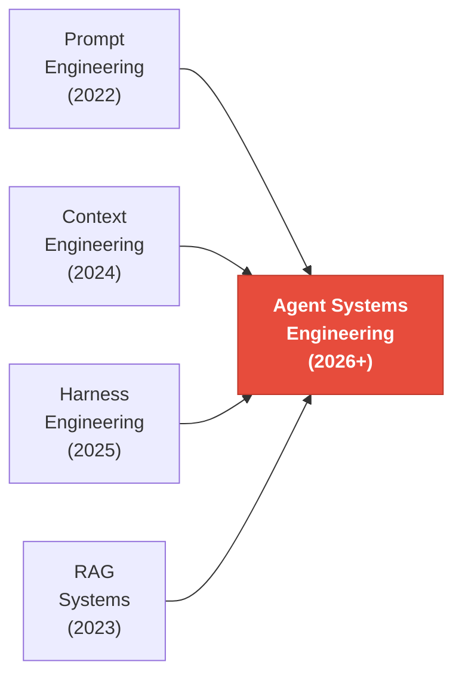

# Agent Systems Engineering: The Convergence of Four Disciplines

> **Type:** Foundational concepts document — the theoretical basis for this module.
> This document explains _why_ Agent Systems Engineering exists and _what_ it is.
> For _how to apply it_, see the module's `governance/`, `patterns/`, and `integration/` sub-folders.

---

## The Fundamental Insight

We are witnessing the emergence of a new engineering discipline. Just as "software
engineering" coalesced from the convergence of programming, testing, deployment, and
project management in the 1960s–70s, **Agent Systems Engineering** is now emerging
from the convergence of four foundational pillars:

| Pillar                  | Focus                          | Core Question                                   |
| ----------------------- | ------------------------------ | ----------------------------------------------- |
| **Prompt Engineering**  | Agent identity & behavior      | _How do I instruct each agent?_                 |
| **Context Engineering** | Information architecture       | _What does each agent need to know, and when?_  |
| **Harness Engineering** | Orchestration & infrastructure | _How do agents coordinate, route, and recover?_ |
| **RAG Systems**         | Knowledge retrieval & memory   | _How do agents access and retain knowledge?_    |

These are not independent tools — they form a tightly coupled feedback loop. **The
quality of a multi-agent system is determined not by the strength of any single pillar,
but by the elegance of their integration.**

---

## Part I: The Evolution — From Prompts to Systems

### Generation 1: Prompt Engineering (2022–2023)

The first wave was **prompt-centric**. We learned that the same model could produce
dramatically different outputs depending on how we phrased the instruction. Techniques
like chain-of-thought, few-shot examples, and role-playing emerged.

```
"You are an expert software architect. Given the following requirements..."
```

This was powerful but **brittle**. A single prompt, no matter how well-crafted, couldn't
handle the complexity of real-world workflows. The model had no memory, no tools, and no
collaborators.

### Generation 2: Context Engineering (2024–2025)

The realization: **the prompt is just one component of the context window**. What matters
is the _entire information package_ the model receives — its structure, ordering,
compression, and relevance.

Andrej Karpathy famously said: "The hottest new programming language is English." But the
deeper truth is that **context engineering is information architecture for neural
networks**. It considers:

| Dimension               | What It Means                                                               |
| ----------------------- | --------------------------------------------------------------------------- |
| **What to include**     | Task-relevant knowledge only — not everything available                     |
| **What to exclude**     | Irrelevant information actively degrades performance by consuming attention |
| **How to structure it** | Position matters: primacy and recency bias, "lost in the middle" phenomenon |
| **How to compress it**  | Summarisation, chunking, and hierarchical context for long sessions         |

### Generation 3: Harness Engineering (2025–2026)

As agents gained tools and multi-turn capabilities, the bottleneck shifted from _what the
agent knows_ to _how the agent is orchestrated_. The "harness" is everything outside the
model:

| Harness Component                                     | Function                                                                |
| ----------------------------------------------------- | ----------------------------------------------------------------------- |
| Tool definitions and routing logic                    | Determines which tool is called for which task                          |
| Multi-agent communication protocols                   | Governs how agents pass state and results between each other            |
| State management across turns and sessions            | Maintains context coherence across a session lifecycle                  |
| Error handling, retry logic, and graceful degradation | Prevents transient failures from propagating as unhandled exceptions    |
| Human-in-the-loop escalation criteria                 | Defines when the system yields control to a human                       |
| Quality gates and pipeline governance                 | Enforces pass/fail criteria before advancing to the next pipeline stage |

### Generation 4: The Convergence (2026+)

We are here now. The four pillars are inseparable. A system that excels at prompt
engineering but lacks proper context assembly will hallucinate. A system with perfect
context but no orchestration harness will be fragile. A system with great infrastructure
but no RAG will lack domain knowledge.

**The question is no longer "how do I write a good prompt?" but "how do I engineer a
complete agent system?"**

---

## Part II: The Four-Layer Architecture



### Layer 1: Agent Identity (Prompt Engineering)

Each agent in a multi-agent system needs a carefully crafted identity that defines
**who it is** and **how it operates**. This is classical prompt engineering, elevated
to system design.

**Components of an effective agent identity:**

| Component                  | Purpose                                | Example                                     |
| -------------------------- | -------------------------------------- | ------------------------------------------- |
| **Role Definition**        | Establishes expertise boundaries       | "You are the Chief Technology Officer..."   |
| **Behavioral Constraints** | Prevents scope creep and hallucination | "You own Stages 3–8 of the pipeline"        |
| **Communication Protocol** | Standardizes inter-agent communication | "Report defects using P0–P3 severity"       |
| **Decision Framework**     | Guides autonomous decision-making      | "P0/P1 defects are non-negotiable blockers" |
| **Escalation Criteria**    | Defines when to involve humans         | ">20% variance triggers notification"       |
| **Output Format**          | Ensures machine-parseable outputs      | "Return structured JSON with fields..."     |

> [!TIP]
> **Design Pattern: The Adapter Pattern for Agent Identities**
>
> Define agent identities in a **canonical source** (e.g., `AGENTS.md`), then create
> platform-specific adapters for each AI system. This prevents identity drift when the
> same agent operates across different platforms. The canonical document is the source of
> truth; adapters translate but never contradict.

### Layer 2: Context Assembly (Context Engineering)

This is where most multi-agent systems fail. The challenge isn't getting the LLM to
understand — it's **giving it the right information at the right time in the right
format**.

**The Context Assembly Pipeline:**



**Critical principles:**

| Principle                        | Operational Rule                                                                                                                                      | Risk Addressed                                                                                      |
| -------------------------------- | ----------------------------------------------------------------------------------------------------------------------------------------------------- | --------------------------------------------------------------------------------------------------- |
| **Minimum Viable Context (MVC)** | Include only what the agent needs for _this specific task_                                                                                            | Irrelevant information introduces noise and causes the model to attend to wrong signals             |
| **Positional Awareness**         | Place the most critical information at the beginning (system prompt) and end (most recent context); supporting details go in the middle               | LLMs exhibit primacy and recency bias — burying critical content in the middle degrades performance |
| **Hierarchical Summarisation**   | For long context chains, do not pass raw outputs from every stage; summarise intermediate results and pass only the summary + most recent full output | Raw outputs accumulate and overflow the context window across long pipelines                        |
| **Schema-Driven Context**        | Define structured schemas for inter-agent communication; Agent A's output format must match Agent B's expected input                                  | Unstructured handoffs cause information loss and misinterpretation at agent boundaries              |

> [!IMPORTANT]
> **The Lost-in-the-Middle Problem**
>
> Research shows that LLMs struggle to attend to information in the middle of long
> contexts (Liu et al., 2023). In a multi-agent system, this means that when you assemble
> context from multiple sources, the placement order matters enormously. Critical task
> instructions should bookend the context window, not be buried in the middle.

### Layer 3: Orchestration (Harness Engineering)

The harness is the **nervous system** of the multi-agent architecture. It manages
everything the models cannot manage themselves.

**Five Core Orchestration Patterns:**



Full implementation specifications:
`core-component-00/multi-agent-engineering/patterns/orchestration-patterns.md`

### Layer 4: Knowledge (RAG + Memory Systems)

In a multi-agent system, RAG isn't just "retrieve documents and generate" — it's the
**collective memory** of the entire agent ecosystem.

**Three Memory Types for Multi-Agent Systems:**

| Memory Type           | Scope          | Persistence              | Example                                                       |
| --------------------- | -------------- | ------------------------ | ------------------------------------------------------------- |
| **Static Knowledge**  | Global         | Permanent                | Documentation, skill files, API references, design guidelines |
| **Dynamic Knowledge** | Project-scoped | Session/project lifetime | PRDs, architecture decisions, code artifacts, test results    |
| **Episodic Memory**   | Agent-scoped   | Configurable             | Conversation logs, previous interactions, learned preferences |

**RAG Architecture for Multi-Agent Systems:**



> [!NOTE]
> **The Knowledge Item (KI) Pattern**
>
> Rather than having agents always search raw documents, distill frequently-needed
> knowledge into curated **Knowledge Items** — pre-summarized, validated, and indexed
> artifacts that serve as the first lookup layer. This reduces retrieval latency and
> improves consistency. Raw conversation logs and documents serve as fallback when KIs
> don't cover the query.

---

## Part III: Runtime Integration — How the Four Layers Compose

The four layers compose into a complete execution pipeline at runtime. Each layer's
output is another layer's input; the system is only as strong as its weakest integration
contract.

The five integration contracts (RAG → Context, Context → Harness, Prompt → Context,
Harness → RAG, Multi-Agent → Context), the full runtime execution trace, and the common
integration failure modes are specified in:

> **[`integration/four-layer-composition.md`](./integration/four-layer-composition.md)**

**The Feedback Loop** — critically, the system learns from each execution:

| Signal Source            | Feeds Into          | What It Optimises                                         |
| ------------------------ | ------------------- | --------------------------------------------------------- |
| Agent outputs            | RAG layer           | Dynamic memory — new knowledge enters the knowledge base  |
| Execution patterns       | Harness layer       | Routing path refinement and timeout threshold calibration |
| Context assembly metrics | Context engineering | Slot priority tuning and compression threshold adjustment |
| Agent performance        | Prompt layer        | Identity tuning and instruction refinement                |

---

## Part IV: Cross-Cutting Design Patterns

Five design patterns span the layer boundaries and cannot be owned by any single CC-00
module. Each is fully specified in the `patterns/` sub-folder:

| Pattern                                                                     | Problem It Solves                                              |
| --------------------------------------------------------------------------- | -------------------------------------------------------------- |
| [`canonical-source-of-truth.md`](./patterns/canonical-source-of-truth.md)   | Agent identity drift across platforms and deployments          |
| [`paired-artifacts.md`](./patterns/paired-artifacts.md)                     | Security and safety concerns treated as afterthoughts          |
| [`defect-severity-vocabulary.md`](./patterns/defect-severity-vocabulary.md) | Inconsistent escalation thresholds across agents and teams     |
| [`anti-pattern-firewall.md`](./patterns/anti-pattern-firewall.md)           | Agents optimising for local objectives at the system's expense |
| [`progress-sync-protocol.md`](./patterns/progress-sync-protocol.md)         | Silent failures in long-running multi-agent pipelines          |

---

## Part V: Anti-Patterns to Avoid

| Anti-Pattern               | Description                                                    | Consequence                                          | Remedy                                                |
| -------------------------- | -------------------------------------------------------------- | ---------------------------------------------------- | ----------------------------------------------------- |
| **Context Dumping**        | Stuffing the entire knowledge base into every agent's context  | Attention dilution, slower inference, higher cost    | Minimum Viable Context (MVC) principle                |
| **Prompt Fragility**       | Over-engineered prompts that break with minor input variations | System instability, unpredictable failures           | Robust identity design with behavioural tests         |
| **Agent Sprawl**           | Creating too many specialised agents when fewer would suffice  | Coordination overhead exceeds specialisation benefit | Consolidate agents that share >70% of their skill set |
| **Flat Hierarchy**         | All agents at the same level with no clear chain of command    | Conflicting decisions, no resolution mechanism       | Hierarchical supervision with clear escalation paths  |
| **Missing Feedback Loops** | No mechanism for agents to learn from execution failures       | Repeated mistakes, no quality improvement            | Episodic memory + post-execution analysis             |
| **Synchronous Everything** | Forcing sequential execution when tasks could be parallelised  | Unnecessarily slow pipeline execution                | Identify independent subtasks and use fork-join       |
| **The "God Agent"**        | One agent that does everything                                 | Context window overflow, quality degradation         | Decompose into specialists with clear boundaries      |

Full system-level anti-patterns:
`core-component-00/multi-agent-engineering/patterns/anti-patterns.md`

---

## Part VI: The Convergence Thesis

### Where We Are

The four engineering disciplines — Prompt, Context, Harness, and RAG — are converging
into a single unified discipline: **Agent Systems Engineering**.



This is analogous to historical engineering convergences:

| Era   | Convergence                                            | Result                          |
| ----- | ------------------------------------------------------ | ------------------------------- |
| 1960s | Programming + Testing + Deployment + Management        | → **Software Engineering**      |
| 1990s | Networking + Security + Systems + Applications         | → **Internet Engineering**      |
| 2010s | Development + Operations + Monitoring + Infrastructure | → **DevOps / SRE**              |
| 2026+ | Prompt + Context + Harness + RAG                       | → **Agent Systems Engineering** |

### What Comes Next

| Trend                                          | Description                                                                                                                 |
| ---------------------------------------------- | --------------------------------------------------------------------------------------------------------------------------- |
| **Standardised Agent Communication Protocols** | Just as HTTP standardised web communication, protocols for inter-agent communication are emerging — MCP is an early example |
| **Agent Observability**                        | The distributed-tracing equivalent for agent systems: every agent decision traceable, debuggable, and auditable             |
| **Compositional Agent Design**                 | Agents built from composable primitives (skills, tools, knowledge sources) rather than monolithic prompts                   |
| **Autonomous Quality Assurance**               | Agent systems that evaluate and improve their own outputs through adversarial review and automated testing                  |
| **Continuous Agent Improvement**               | Feedback loops that automatically refine agent identities, context assembly, and routing based on execution outcomes        |

---

## Conclusion

The key to efficiently utilising multi-agent systems is not mastering any single
discipline in isolation. It's understanding that **Prompt Engineering, Context
Engineering, Harness Engineering, and RAG are four faces of the same coin** — the coin
being the design of intelligent, collaborative agent systems.

The most effective multi-agent architectures:

1. **Start with the harness** — Define the orchestration pattern before individual agents
2. **Design context flows** — Map what information flows between agents and when
3. **Build knowledge infrastructure** — Create the RAG layer that gives agents access to domain knowledge
4. **Craft agent identities last** — Only after the system architecture is clear, define individual agent prompts

This "outside-in" approach — harness → context → knowledge → prompt — produces systems
that are more robust, more maintainable, and more effective than the traditional
"inside-out" approach of starting with prompts and hoping orchestration emerges.

> [!TIP]
> **The Golden Rule of Multi-Agent Systems**
>
> An agent is only as good as its context. Context is only as good as its retrieval.
> Retrieval is only as good as its knowledge base. And the knowledge base is only as good
> as the harness that maintains it. **Invest in the infrastructure first; the
> intelligence follows.**
