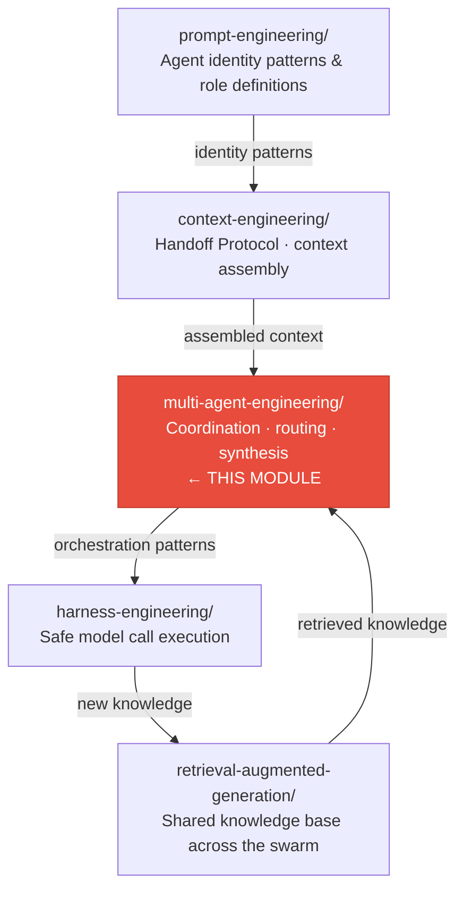

# Multi-Agent Engineering

> The discipline of designing, orchestrating, and operating **coordinated agent systems** — where multiple specialist agents collaborate through structured decomposition, parallel execution, contextual handoff, and synthesized integration to solve problems that exceed any single agent's capability.

---

## What Is Multi-Agent Engineering?

Multi-Agent Engineering is the architectural layer that governs how multiple LLM-powered agents work together as a unified system. While prompt engineering asks _"how do I instruct one agent?"_, multi-agent engineering asks _"how do I coordinate many agents to solve one problem?"_

It answers three questions that no other discipline covers:

1. **How to decompose** — breaking a complex user request into atomic subtasks assigned to specialist agents
2. **How to orchestrate** — managing the execution topology (sequential, parallel, hierarchical) and the communication between agents
3. **How to integrate** — synthesizing subagent outputs into a coherent final deliverable, resolving conflicts, and maintaining system-level coherence

---

## Documentation Structure

| File / Folder                                                                                                        | Purpose                                                                                            | Target Audience         |
| -------------------------------------------------------------------------------------------------------------------- | -------------------------------------------------------------------------------------------------- | ----------------------- |
| `README.md`                                                                                                          | This file — overview and navigation                                                                | All                     |
| `CONCEPTS.md`                                                                                                        | Agent Swarm theory, Git Worktree Orchestration, four-pillar convergence                            | Architects, Leads       |
| `quick-reference.md`                                                                                                 | Decision matrices, topology selector, handoff cheat sheet                                          | All engineers           |
| [`core-component-00/agent-systems-engineering/CONCEPTS.md`](core-component-00/agent-systems-engineering/CONCEPTS.md) | Foundational paper — how Prompt, Context, Harness, and RAG converge into Agent Systems Engineering | Researchers, Architects |
| `fundamentals/swarm-topologies.md`                                                                                   | The five swarm topology patterns (Hierarchical, Flat, Mesh, Pipeline, Hybrid)                      | Engineers               |
| `fundamentals/git-worktree-orchestration.md`                                                                         | Using `git worktree` as infrastructure for multi-agent parallel development                        | Engineers, DevOps       |
| `patterns/orchestration-patterns.md`                                                                                 | The five core orchestration patterns (Pipeline, Fork-Join, Router, Supervisor-Worker, Debate)      | Implementers            |
| `patterns/anti-patterns.md`                                                                                          | Seven anti-patterns to avoid in multi-agent systems                                                | All engineers           |
| `implementations/swarm_orchestrator.py`                                                                              | Production swarm orchestrator with topology selection and lifecycle management                     | Implementers            |
| `implementations/git_worktree_manager.py`                                                                            | Git worktree lifecycle management for agent isolation                                              | Implementers            |
| `implementations/handoff_packet.py`                                                                                  | Structured handoff packet for inter-agent context transfer                                         | Implementers            |
| `testing/test_swarm_orchestrator.py`                                                                                 | Executable pytest suite for swarm orchestrator                                                     | QA, CI/CD               |
| `testing/test_git_worktree_manager.py`                                                                               | Executable pytest suite for git worktree manager                                                   | QA, CI/CD               |
| `testing/edge-cases.md`                                                                                              | Edge case scenarios: merge conflicts, agent failures, context overflow                             | QA Engineers            |

---

## Quick Start (3-Minute Tour)

### Step 1: Choose Your Swarm Topology

| I need to...                                        | Use Topology                               |
| --------------------------------------------------- | ------------------------------------------ |
| Run a sequential pipeline with quality gates        | **Pipeline Swarm**                         |
| Execute independent subtasks concurrently           | **Flat Swarm** (Fork-Join)                 |
| Route diverse input types to specialists            | **Router** + specialist agents             |
| Coordinate a team with oversight                    | **Hierarchical Swarm** (Supervisor-Worker) |
| Make a high-stakes decision with adversarial review | **Debate / Adversarial Swarm**             |
| Handle all of the above dynamically                 | **Hybrid Swarm**                           |

### Step 2: Select the Context Handoff Tier

| Subagent relationship             | Handoff Tier | Token budget impact           |
| --------------------------------- | ------------ | ----------------------------- |
| Continues the same task           | **Full**     | ~100% of orchestrator context |
| Handles one bounded sub-task      | **Scoped**   | 20–40%                        |
| Is an independent tool/specialist | **Minimal**  | <10%                          |

### Step 3: Orchestrate with the Swarm Orchestrator

```python
from implementations.swarm_orchestrator import SwarmOrchestrator, SwarmConfig

config = SwarmConfig(
    topology="hierarchical",
    max_agents=10,
    enable_git_worktree=True,
)
orchestrator = SwarmOrchestrator(config)

# Decompose and dispatch
plan = orchestrator.plan(user_request="Add dark mode to the settings page")
results = await orchestrator.execute(plan)
final = orchestrator.synthesize(results)
```

---

## How Multi-Agent Engineering Relates to the Other Modules



Multi-Agent Engineering is the **orchestration layer** that sits above context engineering and harness engineering. It consumes context assembly (via the Handoff Protocol), delegates execution to the harness (per-agent model calls), and feeds knowledge back into RAG (dynamic memory).

---

## Security Checklist

Before deploying any multi-agent system:

| Security Requirement                                                                | Risk Mitigated                                                          |
| ----------------------------------------------------------------------------------- | ----------------------------------------------------------------------- |
| Each agent has an explicitly defined expertise boundary — no "God Agent"            | Context window overflow and quality degradation from over-broad agents  |
| Handoff packets to untrusted / third-party agents use Minimal tier only             | Sensitive context leaking to agents outside the trust boundary          |
| Sacred context (decisions, commitments) is never forwarded to external agents       | Confidential session data exposed beyond the originating swarm          |
| All inter-agent communication uses schema-validated return formats                  | Malformed outputs causing downstream agents to reason incorrectly       |
| Anti-pattern detection is active (trim-to-pass, context dumping, agent sprawl)      | Silent quality degradation and coordination failures                    |
| Git worktree branches follow the naming convention (`agent/<name>/task-<id>`)       | Filesystem collisions and loss of audit trail in parallel coding agents |
| Merge conflicts are resolved by a dedicated Integration Agent, not silently ignored | Silently overwritten work and lost changes in multi-agent codebases     |

---

## Document Status

| Document                                   | Version | Last Updated |
| ------------------------------------------ | ------- | ------------ |
| README.md                                  | 1.0     | 2026-04-29   |
| CONCEPTS.md                                | 1.0     | 2026-04-29   |
| quick-reference.md                         | 1.0     | 2026-04-29   |
| ../agent-systems-engineering/CONCEPTS.md   | 1.0     | 2026-04-30   |
| fundamentals/swarm-topologies.md           | 1.0     | 2026-04-29   |
| fundamentals/git-worktree-orchestration.md | 1.0     | 2026-04-29   |
| patterns/orchestration-patterns.md         | 1.0     | 2026-04-29   |
| patterns/anti-patterns.md                  | 1.0     | 2026-04-29   |
| implementations/swarm_orchestrator.py      | 1.0     | 2026-04-29   |
| implementations/git_worktree_manager.py    | 1.0     | 2026-04-29   |
| implementations/handoff_packet.py          | 1.0     | 2026-04-29   |

**Maintained by:** Claude Lab Engineering Team
