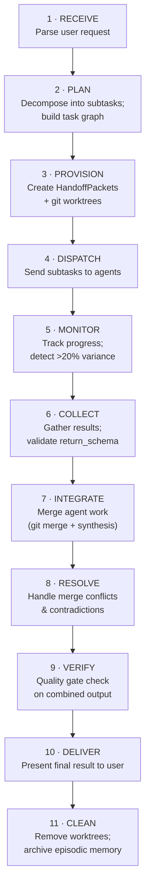

# Multi-Agent Engineering — Quick Reference

> Rapid lookup tables and decision matrices for multi-agent system design. Keep this open during implementation.

---

## Topology Selector

| I need to...                                        | Use Topology          | Pattern File                               |
| --------------------------------------------------- | --------------------- | ------------------------------------------ |
| Run a sequential pipeline with quality gates        | **Pipeline**          | `patterns/orchestration-patterns.md` §1    |
| Execute independent subtasks concurrently           | **Fork-Join**         | `patterns/orchestration-patterns.md` §2    |
| Route diverse input types to specialists            | **Router**            | `patterns/orchestration-patterns.md` §3    |
| Coordinate a team with oversight                    | **Supervisor-Worker** | `patterns/orchestration-patterns.md` §4    |
| Make a high-stakes decision with adversarial review | **Debate**            | `patterns/orchestration-patterns.md` §5    |
| Handle all of the above dynamically                 | **Hybrid**            | `fundamentals/swarm-topologies.md` §Hybrid |

---

## Handoff Tier Cheat Sheet

| Question                                                           | If Yes →                | If No →                        |
| ------------------------------------------------------------------ | ----------------------- | ------------------------------ |
| Does the subagent continue the same task?                          | **Full** handoff        | Next question ↓                |
| Does the subagent need architectural decisions or project context? | **Scoped** handoff      | Next question ↓                |
| Is the subagent a pure tool or independent specialist?             | **Minimal** handoff     | Re-evaluate task decomposition |
| Is the subagent third-party or untrusted?                          | **Minimal + sanitised** | Use appropriate tier above     |

### Token Budget by Tier

| Tier    | Orchestrator Budget Used | Subagent Budget Consumed |
| ------- | ------------------------ | ------------------------ |
| Full    | ~100% forwarded          | Near-full                |
| Scoped  | 20–40% extracted         | Moderate                 |
| Minimal | <10% forwarded           | Minimal                  |

---

## Agent Count Guidelines

| Task Complexity       | Recommended Agents | Topology                |
| --------------------- | ------------------ | ----------------------- |
| Simple query          | 1 (no swarm)       | Single agent            |
| Bounded sub-task      | 2–3                | Flat / Router           |
| Multi-domain project  | 5–10               | Hierarchical            |
| Full product pipeline | 10–20+             | Pipeline + Hierarchical |
| Enterprise-scale      | 20–80+             | Hybrid                  |

**Rule of thumb:** If two agents share >70% of their skill set, **consolidate them**.

---

## Git Worktree Commands

| Action              | Command                                                      |
| ------------------- | ------------------------------------------------------------ |
| Create worktree     | `git worktree add ../agent-<name> -b agent/<name>/task-<id>` |
| List worktrees      | `git worktree list`                                          |
| Remove worktree     | `git worktree remove ../agent-<name>`                        |
| Prune stale entries | `git worktree prune`                                         |
| Merge agent work    | `git checkout main && git merge agent/<name>/task-<id>`      |
| View agent diff     | `git diff main..agent/<name>/task-<id>`                      |
| Revert agent work   | `git revert <commit-hash>`                                   |
| Delete agent branch | `git branch -d agent/<name>/task-<id>`                       |

### Branch Naming Quick Reference

```
agent/<agent-name>/task-<id>       # Standard agent branch
stage<N>/agent/<name>/<feature>    # Pipeline-stage-scoped branch
swarm/<feature-name>               # Swarm grouping branch
integration/<sprint-or-release>    # Integration target branch
```

---

## Orchestration Pattern Selection Matrix

| Scenario                                     | Pattern           | Parallelism        | Quality Control      | Latency           |
| -------------------------------------------- | ----------------- | ------------------ | -------------------- | ----------------- |
| Requirements → Design → Code → Test          | Pipeline          | None               | Gate per stage       | High (sequential) |
| Security + Architecture + Performance review | Fork-Join         | Full               | Synthesis step       | Low (parallel)    |
| Bug report vs. feature request vs. question  | Router            | Per-request        | Specialist quality   | Low               |
| CTO supervises Backend + Frontend + DevOps   | Supervisor-Worker | Worker-level       | Supervisor oversight | Medium            |
| Security architecture decision               | Debate            | None (adversarial) | Disagreement-driven  | High              |

---

## Anti-Pattern Detection Checklist

| Symptom                                        | Likely Anti-Pattern        | Remedy                                   |
| ---------------------------------------------- | -------------------------- | ---------------------------------------- |
| One agent handling everything                  | **God Agent**              | Decompose into specialists               |
| Many agents with overlapping skills            | **Agent Sprawl**           | Consolidate (>70% overlap → merge)       |
| Subagents receiving full orchestrator context  | **Context Dumping**        | Apply Handoff Protocol tiers             |
| Conflicting agent decisions with no resolution | **Flat Hierarchy**         | Add supervisor with escalation path      |
| All tasks sequential when some are independent | **Synchronous Everything** | Identify independent tasks; fork-join    |
| Same mistakes repeated across executions       | **Missing Feedback Loop**  | Record episodic memory; post-mortem      |
| Tests passing because features were removed    | **Trim-to-Pass**           | Forbid in agent identity; verify at gate |

---

## Swarm Execution Lifecycle



---

## Key Metrics

| Metric                      | Target                                          | Alert Threshold |
| --------------------------- | ----------------------------------------------- | --------------- |
| Swarm execution time        | <5min for standard tasks                        | >15min          |
| Agent utilisation           | >70% of dispatched agents produce useful output | <50%            |
| Context handoff accuracy    | >95% correct tier selection                     | <80%            |
| Merge conflict rate         | <10% of agent branches                          | >25%            |
| Result validation pass rate | >95% match return_schema                        | <90%            |
| Feedback loop coverage      | 100% of executions logged                       | <80%            |

---

**Version:** 1.0
**Last Updated:** 2026-04-29
**See also:** [CONCEPTS.md](./CONCEPTS.md) · [Orchestration Patterns](./patterns/orchestration-patterns.md) · [Swarm Topologies](./fundamentals/swarm-topologies.md)
