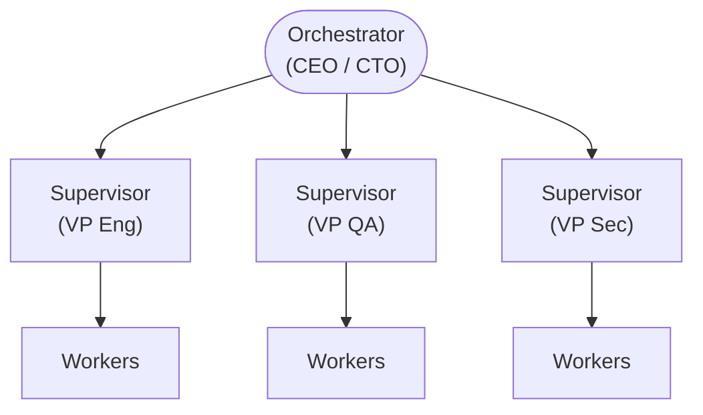
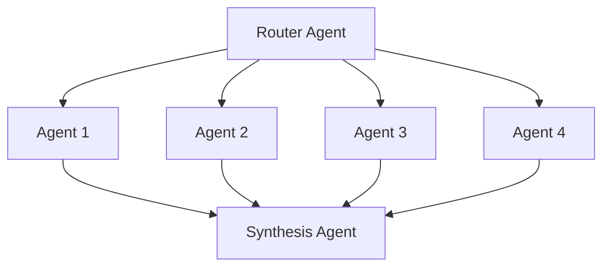
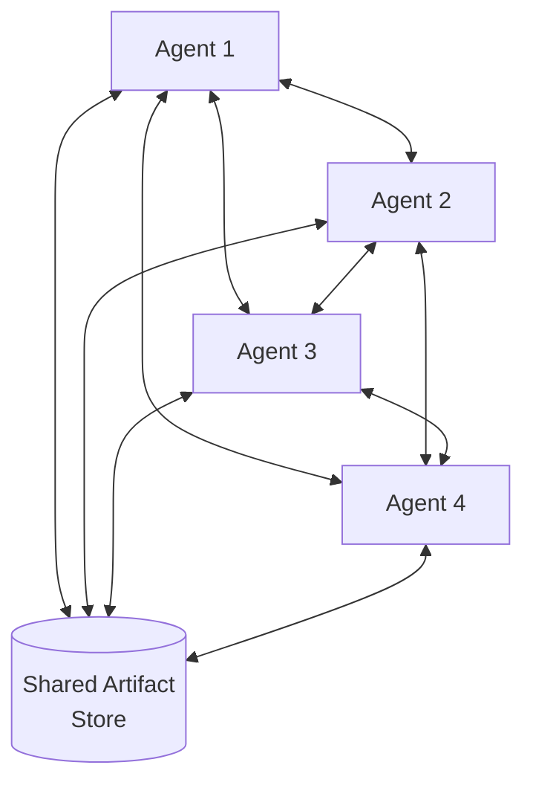
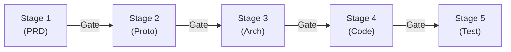
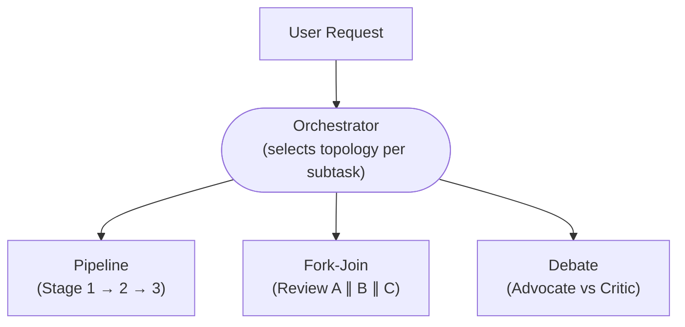
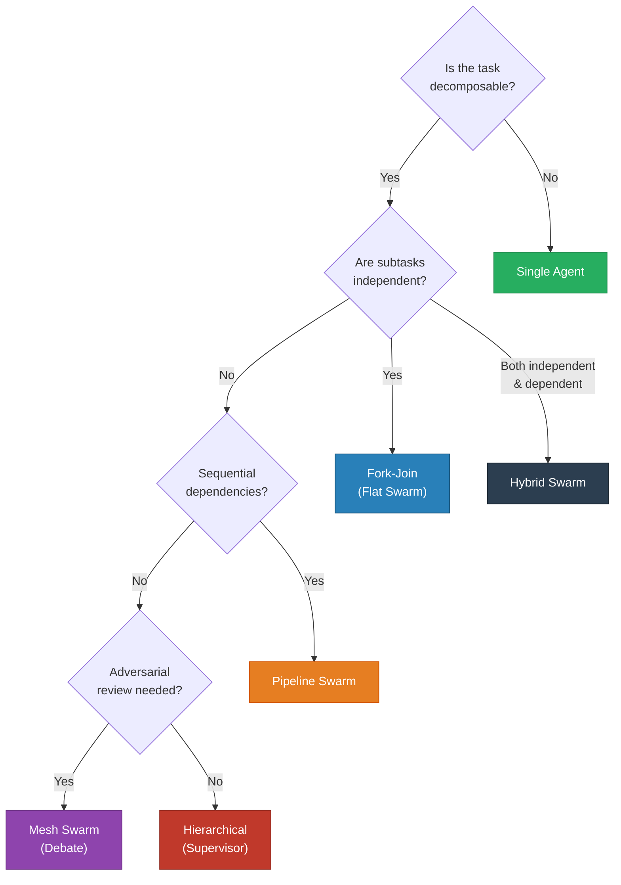

# Swarm Topologies

> The five canonical patterns for organising multiple agents into a coordinated system.

---

## Overview

A swarm topology defines **how agents are arranged, how they communicate, and who has authority** in a multi-agent system. The choice of topology determines the system's throughput, latency, quality ceiling, and coordination overhead.

| Topology     | Structure                   | Communication                            | Authority                           |
| ------------ | --------------------------- | ---------------------------------------- | ----------------------------------- |
| Hierarchical | Tree (supervisor → workers) | Top-down delegation, bottom-up reporting | Supervisors decide                  |
| Flat         | Star (router → peers)       | Hub-and-spoke via router                 | Router dispatches; agents are equal |
| Mesh         | Fully connected             | Peer-to-peer via shared store            | No single authority; consensus      |
| Pipeline     | Linear chain                | Sequential handoff                       | Previous stage gates next stage     |
| Hybrid       | Dynamic combination         | Mixed                                    | Context-dependent                   |

---

## Topology 1: Hierarchical Swarm

### Structure

### Properties

| Property              | Value                                              |
| --------------------- | -------------------------------------------------- |
| **Agent count**       | 10–80+                                             |
| **Coordination cost** | Medium (scales with tree depth)                    |
| **Quality ceiling**   | Very High (supervisor oversight)                   |
| **Parallelism**       | Within each supervisor's worker pool               |
| **Best for**          | Complex projects with clear domain boundaries      |
| **Example**           | Full product pipeline: CPO → CDO → CTO → Dev teams |

### Context Flow

- Orchestrator uses **Scoped handoff** to each supervisor
- Supervisors use **Scoped handoff** to workers (further filtered)
- Workers use **Minimal handoff** for tool calls
- Results flow bottom-up through the same chain

### Strengths and Weaknesses

| Strengths                             | Weaknesses                              |
| ------------------------------------- | --------------------------------------- |
| Clear chain of command                | Supervisor is a bottleneck              |
| Quality gates at each level           | Deep trees increase latency             |
| Natural domain boundaries             | Information loss at each handoff level  |
| Mirrors real organisational structure | Requires high-quality supervisor agents |

---

## Topology 2: Flat Swarm (Fork-Join)

### Structure

### Properties

| Property              | Value                                              |
| --------------------- | -------------------------------------------------- |
| **Agent count**       | 3–10                                               |
| **Coordination cost** | Low                                                |
| **Quality ceiling**   | Medium (no deep oversight)                         |
| **Parallelism**       | Full (all agents run concurrently)                 |
| **Best for**          | Independent subtasks of similar complexity         |
| **Example**           | Translating an app into 5 languages simultaneously |

### Context Flow

- Router uses **Minimal or Scoped handoff** to each worker
- All workers execute in parallel
- Synthesis agent receives all results and produces combined output

---

## Topology 3: Mesh Swarm

### Structure

### Properties

| Property              | Value                                                         |
| --------------------- | ------------------------------------------------------------- |
| **Agent count**       | 3–6 (beyond 6, coordination explodes)                         |
| **Coordination cost** | High (O(n²) communication paths)                              |
| **Quality ceiling**   | High for creative/research tasks                              |
| **Parallelism**       | Full (but with synchronisation points)                        |
| **Best for**          | Research exploration, brainstorming, adversarial review       |
| **Example**           | Architecture proposal where each agent critiques others' work |

### Context Flow

- Agents read from and write to a shared artifact store
- No central orchestrator — agents self-coordinate
- Requires strong convergence criteria to terminate

---

## Topology 4: Pipeline Swarm

### Structure

### Properties

| Property              | Value                                               |
| --------------------- | --------------------------------------------------- |
| **Agent count**       | 5–12                                                |
| **Coordination cost** | Very Low (linear; each stage has one predecessor)   |
| **Quality ceiling**   | High (gate criteria prevent defect propagation)     |
| **Parallelism**       | None (strictly sequential)                          |
| **Best for**          | Well-defined workflows with sequential dependencies |
| **Example**           | 10-stage development pipeline                       |

### Context Flow

- Each stage agent receives the output of the previous stage via **Scoped handoff**
- Gate criteria must be satisfied before advancing
- Hierarchical summarisation prevents context growth across stages

---

## Topology 5: Hybrid Swarm

### Structure

The Hybrid Swarm dynamically combines multiple topologies based on the task:

### Properties

| Property              | Value                                                                                                |
| --------------------- | ---------------------------------------------------------------------------------------------------- |
| **Agent count**       | 10–80+                                                                                               |
| **Coordination cost** | Medium-High (orchestrator must manage multiple topologies)                                           |
| **Quality ceiling**   | Very High (best-fit topology per subtask)                                                            |
| **Parallelism**       | Selective (parallelise where possible, sequence where required)                                      |
| **Best for**          | Production-grade systems handling diverse task types                                                 |
| **Example**           | Full-stack application: pipeline for core flow, fork-join for reviews, debate for security decisions |

### Context Flow

- Orchestrator maintains a task graph with topology annotations
- Each subtask inherits the appropriate context flow from its topology
- Results are synthesised at join points

---

## Topology Selection Decision Tree

---

**Version:** 1.0
**Last Updated:** 2026-04-29
**See also:** [CONCEPTS.md](../CONCEPTS.md) · [Orchestration Patterns](../patterns/orchestration-patterns.md) · [Quick Reference](../quick_reference.md)
