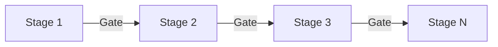
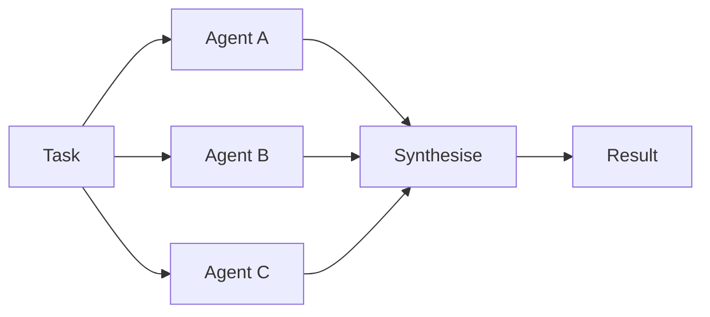
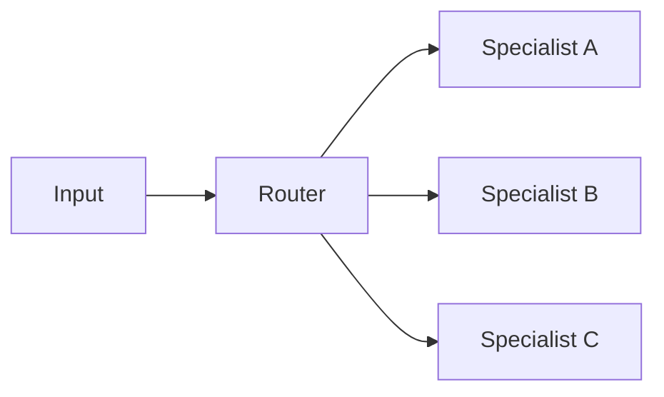
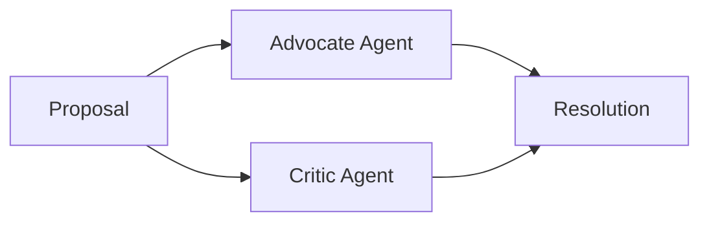

# Orchestration Patterns

> The five core patterns for coordinating agent execution in a multi-agent system.

---

## Pattern 1: Pipeline (Sequential State Machine)

### When to Use

- Tasks with natural sequential dependencies
- Workflows where each stage's output is the next stage's input
- Quality-gated processes where defects must be caught early

### Structure



### Properties

| Property          | Value             |
| ----------------- | ----------------- |
| Parallelism       | None              |
| Latency           | High (sequential) |
| Quality control   | Gate per stage    |
| Coordination cost | Very Low          |
| Error propagation | Blocked at gates  |

### Implementation

```python
async def pipeline(stages: list[Agent], task: Task) -> Result:
    current_output = task.initial_input
    for stage in stages:
        handoff = build_handoff(tier="scoped", input=current_output)
        result = await stage.execute(handoff)
        if not gate_check(result, stage.gate_criteria):
            return GateFailure(stage=stage, result=result)
        current_output = result.output
    return current_output
```

### Context Flow

- Each stage receives the **previous stage's output** via Scoped handoff
- Sacred context (decisions) propagates forward through the chain
- Hierarchical summarisation prevents context growth across stages

---

## Pattern 2: Fork-Join (Parallel Execution with Synchronisation)

### When to Use

- Independent subtasks that can run concurrently
- Multi-dimensional analysis (security + performance + architecture)
- Tasks where wall-clock time matters more than compute cost

### Structure



### Properties

| Property          | Value                                                  |
| ----------------- | ------------------------------------------------------ |
| Parallelism       | Full                                                   |
| Latency           | Low (limited by slowest agent)                         |
| Quality control   | Synthesis step                                         |
| Coordination cost | Low                                                    |
| Error propagation | Independent; one agent's failure doesn't affect others |

### Implementation

```python
async def fork_join(agents: list[Agent], task: Task) -> Result:
    subtasks = decompose(task)
    handoffs = [build_handoff(tier="scoped", input=st) for st in subtasks]

    # Fork: all agents execute in parallel
    results = await asyncio.gather(
        *[agent.execute(handoff) for agent, handoff in zip(agents, handoffs)]
    )

    # Join: synthesise results
    return synthesise(results)
```

### Context Flow

- Each agent receives a **Scoped or Minimal handoff** with only its subtask
- No inter-agent communication during execution
- Synthesis agent receives all results for integration

---

## Pattern 3: Router (Dynamic Dispatch)

### When to Use

- Diverse input types requiring different specialist agents
- Customer support (billing vs. technical vs. account)
- Task classification before execution

### Structure



### Properties

| Property          | Value                                                |
| ----------------- | ---------------------------------------------------- |
| Parallelism       | Per-request                                          |
| Latency           | Low (single routing decision + specialist execution) |
| Quality control   | Specialist expertise                                 |
| Coordination cost | Minimal                                              |
| Error propagation | Router accuracy is a single point of failure         |

### Implementation

```python
async def router(input: str, specialists: dict[str, Agent]) -> Result:
    # Router classifies the input
    classification = await router_agent.classify(input)

    # Dispatch to the appropriate specialist
    agent = specialists[classification.category]
    handoff = build_handoff(
        tier="minimal" if classification.is_simple else "scoped",
        input=input,
    )
    return await agent.execute(handoff)
```

### Context Flow

- Router receives full user input
- Specialist receives **Minimal or Scoped handoff** based on task complexity
- No context shared between different requests

---

## Pattern 4: Supervisor-Worker (Hierarchical Delegation)

### When to Use

- Complex tasks requiring coordination and quality control
- Organisational structures with clear chains of command
- Tasks where a supervisor needs to synthesise and quality-check worker output

### Structure


### Properties

| Property          | Value                                       |
| ----------------- | ------------------------------------------- |
| Parallelism       | Worker-level                                |
| Latency           | Medium (delegation + execution + synthesis) |
| Quality control   | Supervisor oversight                        |
| Coordination cost | Medium                                      |
| Error propagation | Supervisor catches worker errors            |

### Implementation

```python
async def supervisor_worker(
    supervisor: Agent, workers: list[Agent], task: Task
) -> Result:
    # Supervisor decomposes the task
    plan = await supervisor.plan(task)

    # Workers execute subtasks
    results = await asyncio.gather(
        *[worker.execute(build_handoff(tier="scoped", input=subtask))
          for worker, subtask in zip(workers, plan.subtasks)]
    )

    # Supervisor reviews and synthesises
    return await supervisor.synthesise(results)
```

### Context Flow

- Supervisor receives full task context
- Workers receive **Scoped handoff** with only their subtask + relevant decisions
- Results flow back to supervisor for synthesis

---

## Pattern 5: Debate / Adversarial (Quality through Disagreement)

### When to Use

- High-stakes decisions where correctness matters more than speed
- Security reviews, architectural decisions, compliance checks
- Situations where blind spots must be surfaced

### Structure



### Properties

| Property          | Value                                   |
| ----------------- | --------------------------------------- |
| Parallelism       | None (adversarial; sequential exchange) |
| Latency           | High (multiple rounds of debate)        |
| Quality control   | Disagreement-driven                     |
| Coordination cost | Medium                                  |
| Error propagation | False disagreements can waste time      |

### Implementation

```python
async def debate(
    advocate: Agent, critic: Agent, proposal: str, max_rounds: int = 3
) -> Result:
    current = proposal
    for round_num in range(max_rounds):
        # Advocate presents/defends
        defence = await advocate.execute(
            build_handoff(tier="scoped", input=current)
        )

        # Critic challenges
        critique = await critic.execute(
            build_handoff(tier="scoped", input=defence.output)
        )

        if critique.severity == "none":
            return defence  # Consensus reached

        # Advocate responds to critique
        current = critique.output

    # Max rounds reached — escalate to human
    return EscalationRequired(last_defence=defence, last_critique=critique)
```

### Context Flow

- Both agents receive the proposal via **Scoped handoff**
- Each round's output becomes the next round's input
- Resolution agent (or human) receives both sides' final positions

---

## Pattern Composition

Production systems combine patterns:

| Composite                  | Description                                                    | Example                                                           |
| -------------------------- | -------------------------------------------------------------- | ----------------------------------------------------------------- |
| Pipeline + Fork-Join       | Sequential stages where some stages fork internally            | Stage 5 (Development) forks into Backend ∥ Frontend ∥ DevOps      |
| Router + Supervisor-Worker | Router selects the supervisor; supervisor delegates to workers | Customer request → Domain Router → Team Lead → Engineers          |
| Pipeline + Debate          | Pipeline stage includes adversarial review before gate         | Stage 6 (Code Review) uses Advocate + Critic before passing gate  |
| Fork-Join + Debate         | Parallel specialists, with adversarial synthesis               | Security ∥ Performance review, then Advocate vs. Critic synthesis |

---

**Version:** 1.0
**Last Updated:** 2026-04-29
**See also:** [Swarm Topologies](../fundamentals/swarm-topologies.md) · [Anti-Patterns](./anti-patterns.md) · [Swarm Orchestrator](../implementations/swarm_orchestrator.py)
