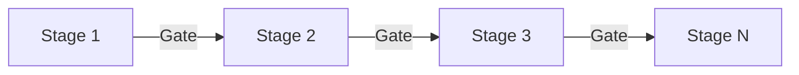
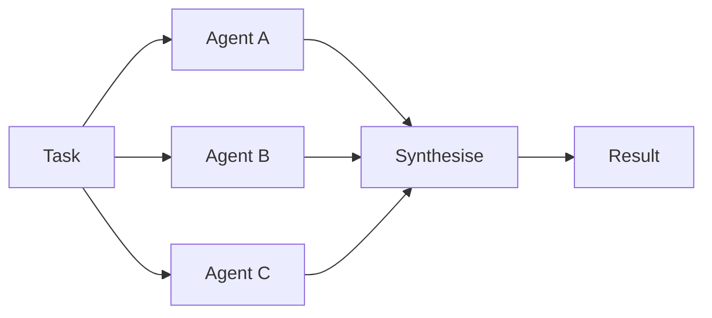
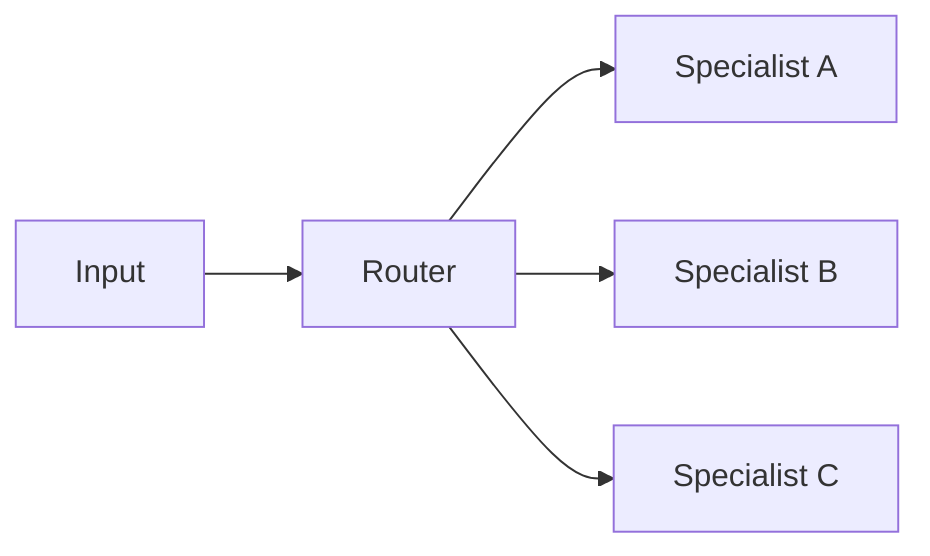
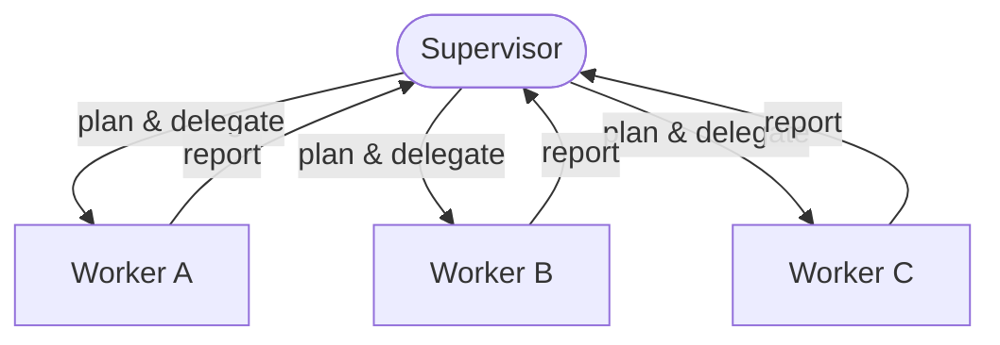
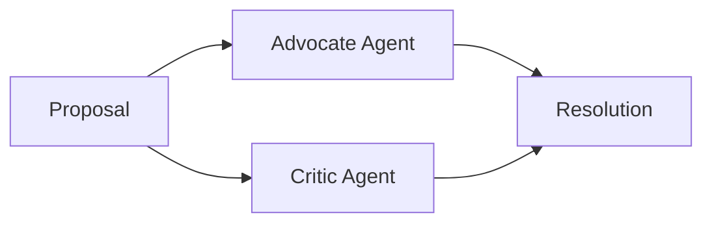

# Orchestration Patterns

> The five core patterns for coordinating agent execution in a multi-agent system.

---

## Pattern 1: Pipeline (Sequential State Machine)

### When to Use

| Condition                                                     | Why this pattern fits                                            |
| ------------------------------------------------------------- | ---------------------------------------------------------------- |
| Tasks with natural sequential dependencies                    | Each stage cannot begin until the previous one completes         |
| Workflows where each stage's output is the next stage's input | Linear data flow maps directly to linear agent execution         |
| Quality-gated processes where defects must be caught early    | Gates prevent defects from propagating to later, costlier stages |

### Structure



### Properties

| Property          | Value             |
| ----------------- | ----------------- |
| Parallelism       | None              |
| Latency           | High (sequential) |
| Quality control   | Gate per stage    |
| Coordination cost | Very Low          |
| Error propagation | Blocked at gates  |

### Implementation

```python
async def pipeline(stages: list[Agent], task: Task) -> Result:
    current_output = task.initial_input
    for stage in stages:
        handoff = build_handoff(tier="scoped", input=current_output)
        result = await stage.execute(handoff)
        if not gate_check(result, stage.gate_criteria):
            return GateFailure(stage=stage, result=result)
        current_output = result.output
    return current_output
```

### Context Flow

| Element         | Behaviour                                                              |
| --------------- | ---------------------------------------------------------------------- |
| Per-stage input | Each stage receives the previous stage's output via **Scoped handoff** |
| Sacred context  | Decisions propagate forward verbatim through the chain                 |
| Context size    | Hierarchical summarisation prevents accumulation across stages         |

---

## Pattern 2: Fork-Join (Parallel Execution with Synchronisation)

### When to Use

| Condition                                                          | Why this pattern fits                                              |
| ------------------------------------------------------------------ | ------------------------------------------------------------------ |
| Independent subtasks that can run concurrently                     | No inter-agent dependencies allow full parallelism                 |
| Multi-dimensional analysis (security + performance + architecture) | Each dimension is assessed by a specialist without blocking others |
| Wall-clock time matters more than compute cost                     | Parallel execution compresses latency at the cost of compute       |

### Structure



### Properties

| Property          | Value                                                  |
| ----------------- | ------------------------------------------------------ |
| Parallelism       | Full                                                   |
| Latency           | Low (limited by slowest agent)                         |
| Quality control   | Synthesis step                                         |
| Coordination cost | Low                                                    |
| Error propagation | Independent; one agent's failure doesn't affect others |

### Implementation

```python
async def fork_join(agents: list[Agent], task: Task) -> Result:
    subtasks = decompose(task)
    handoffs = [build_handoff(tier="scoped", input=st) for st in subtasks]

    # Fork: all agents execute in parallel
    results = await asyncio.gather(
        *[agent.execute(handoff) for agent, handoff in zip(agents, handoffs)]
    )

    # Join: synthesise results
    return synthesise(results)
```

### Context Flow

| Element                   | Behaviour                                                                       |
| ------------------------- | ------------------------------------------------------------------------------- |
| Per-agent input           | Each agent receives a **Scoped or Minimal handoff** containing only its subtask |
| Inter-agent communication | None during parallel execution                                                  |
| Synthesis                 | Synthesis agent receives all results and produces the combined output           |

---

## Pattern 3: Router (Dynamic Dispatch)

### When to Use

| Condition                                                 | Why this pattern fits                                                       |
| --------------------------------------------------------- | --------------------------------------------------------------------------- |
| Diverse input types requiring different specialist agents | Routing ensures each input reaches the agent best equipped to handle it     |
| Customer support (billing vs. technical vs. account)      | Avoids burdening a single agent with multi-domain expertise requirements    |
| Task classification before execution                      | Classification cost is low relative to the quality gain from specialisation |

### Structure



### Properties

| Property          | Value                                                |
| ----------------- | ---------------------------------------------------- |
| Parallelism       | Per-request                                          |
| Latency           | Low (single routing decision + specialist execution) |
| Quality control   | Specialist expertise                                 |
| Coordination cost | Minimal                                              |
| Error propagation | Router accuracy is a single point of failure         |

### Implementation

```python
async def router(input: str, specialists: dict[str, Agent]) -> Result:
    # Router classifies the input
    classification = await router_agent.classify(input)

    # Dispatch to the appropriate specialist
    agent = specialists[classification.category]
    handoff = build_handoff(
        tier="minimal" if classification.is_simple else "scoped",
        input=input,
    )
    return await agent.execute(handoff)
```

### Context Flow

| Element               | Behaviour                                              |
| --------------------- | ------------------------------------------------------ |
| Router input          | Full user input — needed to classify correctly         |
| Specialist input      | **Minimal or Scoped handoff** based on task complexity |
| Cross-request context | None — each request is independent                     |

---

## Pattern 4: Supervisor-Worker (Hierarchical Delegation)

### When to Use

| Condition                                                             | Why this pattern fits                                                    |
| --------------------------------------------------------------------- | ------------------------------------------------------------------------ |
| Complex tasks requiring coordination and quality control              | Supervisor maintains oversight and catches errors before they propagate  |
| Organisational structures with clear chains of command                | Mirrors the authority structure the humans expect                        |
| Tasks where a supervisor synthesises and quality-checks worker output | Synthesis quality is higher when done by an agent with full task context |

### Structure



### Properties

| Property          | Value                                       |
| ----------------- | ------------------------------------------- |
| Parallelism       | Worker-level                                |
| Latency           | Medium (delegation + execution + synthesis) |
| Quality control   | Supervisor oversight                        |
| Coordination cost | Medium                                      |
| Error propagation | Supervisor catches worker errors            |

### Implementation

```python
async def supervisor_worker(
    supervisor: Agent, workers: list[Agent], task: Task
) -> Result:
    # Supervisor decomposes the task
    plan = await supervisor.plan(task)

    # Workers execute subtasks
    results = await asyncio.gather(
        *[worker.execute(build_handoff(tier="scoped", input=subtask))
          for worker, subtask in zip(workers, plan.subtasks)]
    )

    # Supervisor reviews and synthesises
    return await supervisor.synthesise(results)
```

### Context Flow

| Element          | Behaviour                                                                |
| ---------------- | ------------------------------------------------------------------------ |
| Supervisor input | Full task context                                                        |
| Worker input     | **Scoped handoff** with only the worker's subtask + relevant decisions   |
| Result flow      | Bottom-up: workers report to supervisor for synthesis and quality review |

---

## Pattern 5: Debate / Adversarial (Quality through Disagreement)

### When to Use

| Condition                                                       | Why this pattern fits                                                        |
| --------------------------------------------------------------- | ---------------------------------------------------------------------------- |
| High-stakes decisions where correctness matters more than speed | Adversarial review surfaces blind spots that a single agent would miss       |
| Security reviews, architectural decisions, compliance checks    | The cost of a missed flaw exceeds the cost of additional debate rounds       |
| Situations where blind spots must be surfaced                   | Two agents with opposed roles are structurally incentivised to find problems |

### Structure



### Properties

| Property          | Value                                   |
| ----------------- | --------------------------------------- |
| Parallelism       | None (adversarial; sequential exchange) |
| Latency           | High (multiple rounds of debate)        |
| Quality control   | Disagreement-driven                     |
| Coordination cost | Medium                                  |
| Error propagation | False disagreements can waste time      |

### Implementation

```python
async def debate(
    advocate: Agent, critic: Agent, proposal: str, max_rounds: int = 3
) -> Result:
    current = proposal
    for round_num in range(max_rounds):
        # Advocate presents/defends
        defence = await advocate.execute(
            build_handoff(tier="scoped", input=current)
        )

        # Critic challenges
        critique = await critic.execute(
            build_handoff(tier="scoped", input=defence.output)
        )

        if critique.severity == "none":
            return defence  # Consensus reached

        # Advocate responds to critique
        current = critique.output

    # Max rounds reached — escalate to human
    return EscalationRequired(last_defence=defence, last_critique=critique)
```

### Context Flow

| Element             | Behaviour                                                                   |
| ------------------- | --------------------------------------------------------------------------- |
| Initial input       | Both agents receive the proposal via **Scoped handoff**                     |
| Round-by-round flow | Each round's output becomes the next round's input                          |
| Resolution          | Resolution agent (or human escalation) receives both sides' final positions |

---

## Pattern Composition

Production systems combine patterns:

| Composite                  | Description                                                    | Example                                                           |
| -------------------------- | -------------------------------------------------------------- | ----------------------------------------------------------------- |
| Pipeline + Fork-Join       | Sequential stages where some stages fork internally            | Stage 5 (Development) forks into Backend ∥ Frontend ∥ DevOps      |
| Router + Supervisor-Worker | Router selects the supervisor; supervisor delegates to workers | Customer request → Domain Router → Team Lead → Engineers          |
| Pipeline + Debate          | Pipeline stage includes adversarial review before gate         | Stage 6 (Code Review) uses Advocate + Critic before passing gate  |
| Fork-Join + Debate         | Parallel specialists, with adversarial synthesis               | Security ∥ Performance review, then Advocate vs. Critic synthesis |

---

**Version:** 1.0
**Last Updated:** 2026-04-29
**See also:** [Swarm Topologies](core-component-00/multi-agent-engineering/fundamentals/swarm-topologies.md) · [Anti-Patterns](./anti-patterns.md) · [Swarm Orchestrator](core-component-00/multi-agent-engineering/implementations/swarm_orchestrator.py)
