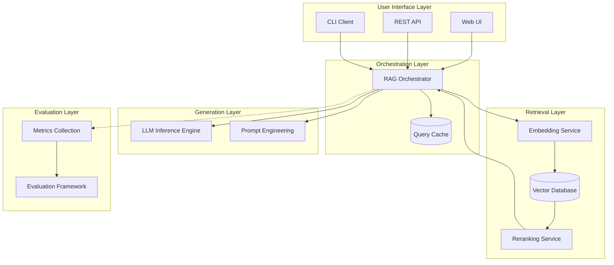

# Enterprise Retrieval Augmented Generation (RAG) System

> A comprehensive, production-ready RAG architecture for enterprise documentation and knowledge management systems.

## Overview

This repository contains best practices, templates, and implementation guides for building enterprise-grade RAG systems that integrate large language models with external knowledge bases.

## Table of Contents

| Section                         | Description                                                         |
| ------------------------------- | ------------------------------------------------------------------- |
| [Architecture](./architecture/) | System architecture diagrams and component design patterns          |
| [Components](./components/)     | Individual module implementations (embedding, retrieval, reranking) |
| [Deployment](./deployment/)     | Production deployment guides and hardware-specific configurations   |
| [Evaluation](./evaluation/)     | Metrics, benchmarks, and automated testing frameworks               |
| [Integrations](./integrations/) | Connectors for common data sources (PDF, Markdown, Wiki, API)       |
| [Security](./security/)         | Access control, PII handling, audit logging implementations         |
| [Templates](./templates/)       | Pre-configured deployment templates and configuration schemas       |
| [Tools](./tools/)               | Utility scripts and monitoring dashboards                           |

## Quick Reference

| Concept                    | Location                                                                                                                             |
| -------------------------- | ------------------------------------------------------------------------------------------------------------------------------------ |
| Core Architecture Patterns | `[architecture/overview.md](./architecture/overview.md)`                                                                             |
| Component Specifications   | `[components/reference-table.md](./components/reference-table.md)`                                                                   |
| **Deployment Guides**      | **`[deployment/README.md](./deployment/README.md)`**                                                                                 |
| **LM Studio Setup**        | **`[deployment/full-stack/guides/lm-studio-optimization-guide.md](./deployment/full-stack/guides/lm-studio-optimization-guide.md)`** |
| **Quick Start**            | **`[deployment/full-stack/guides/quick-start-guide.md](./deployment/full-stack/guides/quick-start-guide.md)`**                       |
| Edge Cases & Handling      | `[evaluation/edge-cases.md](./evaluation/edge-cases.md)`                                                                             |
| Security Best Practices    | `[security/guide.md](./security/guide.md)`                                                                                           |

## Installation Quickstart

For detailed deployment instructions, see **[deployment/README.md](./deployment/README.md)**.

```bash
# Navigate to RAG folder
cd retrieval-augmented-generation

# Create conda environment
conda create -n rag-system python=3.11 -y
conda activate rag-system

# Install dependencies
pip install -r requirements.txt

# Initialize the system
python tools/initialize.py
```

**Hardware-Specific Deployment:**

- **ASUS Zenbook Pro 14 Duo OLED (RTX 4060):** See [deployment/full-stack/guides/lm-studio-optimization-guide.md](./deployment/full-stack/guides/lm-studio-optimization-guide.md)
- **General Setup:** See [deployment/full-stack/guides/quick-start-guide.md](./deployment/full-stack/guides/quick-start-guide.md)

## Architecture Overview



## Key Features

| Feature                   | Description                                                        | Reference                                                                                  |
| ------------------------- | ------------------------------------------------------------------ | ------------------------------------------------------------------------------------------ |
| **Hybrid Search**         | Combines vector similarity with keyword matching for best accuracy | `[components/reference-table.md](./components/reference-table.md)` — Hybrid Search section |
| **Multi-Stage Reranking** | Applies coarse-to-fine filtering for optimal retrieval quality     | `[components/reference-table.md](./components/reference-table.md)` — Reranking section     |
| **Context Compression**   | Summarizes and compresses retrieved context within token limits    | `[architecture/overview.md](./architecture/overview.md)` — Generation Layer                |
| **Query Rewriting**       | Expands queries with synonyms, questions, and clarifying questions | `[components/quick-reference.md](./components/quick-reference.md)`                         |
| **Access Control**        | Per-document permission enforcement at retrieval time              | `[security/guide.md](./security/guide.md)` — Access Control section                        |
| **PII Masking**           | Redacts sensitive information before embedding/generation          | `[security/guide.md](./security/guide.md)` — PII Masking section                           |

## Best Practices Reference

| Area                | Recommendation                                                                                                                                                                                                                                                              | Rationale                                                                                                                                                                                   |
| ------------------- | --------------------------------------------------------------------------------------------------------------------------------------------------------------------------------------------------------------------------------------------------------------------------- | ------------------------------------------------------------------------------------------------------------------------------------------------------------------------------------------- |
| Chunking            | Use 500-800 token chunks with 100-200 token overlap                                                                                                                                                                                                                         | Balances context preservation vs. retrieval precision                                                                                                                                       |
| Embedding Model     | Start with `all-MiniLM-L6-v2` (250M params), upgrade to domain-specific models as needed                                                                                                                                                                                    | Good quality/latency tradeoff; easily swappable                                                                                                                                             |
| Vector DB (mode)    | Use Qdrant Docker standalone (`QdrantClient(url=...)`) for local deployment, Pinecone for managed cloud. Never use Qdrant embedded mode (`QdrantClient(path=...)`) — its data format is incompatible with Docker/server mode, requiring a full collection reseed to upgrade | Docker mode preserves the upgrade path to managed cloud; embedded mode is a deployment dead end (see `deployment/lightweight-rag-deployment.md` §Vector Database Deployment Mode Selection) |
| Vector DB (pinning) | Pin `qdrant-client>=1.7.0,<2.0.0` in `pyproject.toml`                                                                                                                                                                                                                       | The `1.x` API surface is stable; `2.0.0` may introduce breaking changes and requires re-validation before upgrading                                                                         |
| Reranking           | Always use a cross-encoder reranker (bge-reranker) with top-K=10 before context assembly                                                                                                                                                                                    | Improves MRR by 20-30% over vector-only ranking                                                                                                                                             |
| Caching             | Cache queries with hit rate >70% for 5-15 minutes                                                                                                                                                                                                                           | Reduces LLM calls by 40-60% for repetitive questions                                                                                                                                        |
| Index freshness     | Deploy a post-write hook to detect document writes and dispatch the appropriate index-update tool. Use a shared state file — not an environment variable — for backend selection across process boundaries                                                                  | Environment variables are process-scoped and invisible to hook processes; the state file is the correct inter-process communication channel (see `patterns/index-sync-hooks.md`)            |
| Corpus primacy      | Treat all search indexes (vector, BM25, keyword) as derived, rebuildable artifacts. Store no information in an index that cannot be derived from the document corpus                                                                                                        | Enables zero-risk backend migration and guarantees rollback availability at any migration phase (see `architecture/overview.md` §10)                                                        |
| Degradation stack   | Define an explicit multi-tier fallback stack. Retain in-process search tiers permanently, even after migrating to an external vector store                                                                                                                                  | Guarantees availability on machines where Docker or external services are unavailable (see `architecture/overview.md` §11)                                                                  |
| Evaluation          | Commit an MRR baseline query set before switching retrieval backends; run automated regression tests after any index rebuild                                                                                                                                                | Prevents baseline retrofitting; catches quality regressions before they reach production (see `evaluation/reference-table.md` §Incremental Upsert Decision Framework)                       |

## Security Checklist

Before deploying to production:

| Check                                                | Security Risk Mitigated                                                             |
| ---------------------------------------------------- | ----------------------------------------------------------------------------------- |
| Implement per-document access controls               | Unauthorised users retrieving documents outside their permission scope              |
| Enable PII masking for sensitive fields              | Personal data injected into the model's context and potentially surfaced in outputs |
| Configure audit logging for all retrieval operations | Inability to trace which documents were retrieved for a given query in an incident  |
| Set up data loss prevention (DLP) rules              | Sensitive content exfiltration through retrieval responses                          |
| Define retention and deletion policies               | Stale or legally expired documents remaining in the knowledge base                  |
| Establish incident response procedures               | Uncontrolled propagation of a retrieval failure or data breach                      |

## Monitoring & Observability

| Metric              | Target           | Tooling                    |
| ------------------- | ---------------- | -------------------------- |
| Query latency (p95) | < 500ms          | Prometheus + Grafana       |
| Retrieval hit rate  | > 70%            | Custom evaluation pipeline |
| Context utilization | 60-80% of window | Logging analysis           |
| Error rate          | < 1%             | Sentry/OpenTelemetry       |
| Cache hit ratio     | > 40%            | Redis/Memcached metrics    |

## Document Status

| Document                                                  | Version | Last Updated |
| --------------------------------------------------------- | ------- | ------------ |
| README.md                                                 | 1.3     | 2026-06-27   |
| deployment/README.md                                      | 1.0     | 2026-05-05   |
| architecture/overview.md                                  | 1.1     | 2026-04-28   |
| architecture/diagrams.md                                  | 1.0     | 2026-04-24   |
| security/guide.md                                         | 1.0     | 2026-04-24   |
| evaluation/edge-cases.md                                  | 1.0     | 2026-04-24   |
| evaluation/reference-table.md                             | 1.0     | 2026-06-27   |
| requirements.txt                                          | 1.1     | 2026-04-28   |
| patterns/index-sync-hooks.md                              | 1.0     | 2026-06-27   |
| deployment/lightweight-rag-deployment.md                  | 1.0     | 2026-06-27   |
| deployment/lightweight/guides/hook-configuration.md       | 1.0     | 2026-06-27   |
| deployment/lightweight/guides/mcp-server-setup.md         | 1.0     | 2026-06-27   |
| deployment/lightweight/reference/rag-sync-state-schema.md | 1.0     | 2026-06-27   |

## Related Modules

| Module                                                                    | Relationship                                                                                                                                            |
| ------------------------------------------------------------------------- | ------------------------------------------------------------------------------------------------------------------------------------------------------- |
| [`context-engineering/`](core-component-00/engineering/context-engineering/README.md) | Consumes RAG-retrieved documents via `ContextAssembler.add_retrieved()`. Context slot budgets and priority ordering are defined in context-engineering. |
| [`harness-engineering/`](core-component-00/engineering/harness-engineering/README.md) | Executes the assembled context window safely. Token budget enforcement for retrieved content is handled at the harness layer.                           |

---

## License

Apache 2.0
