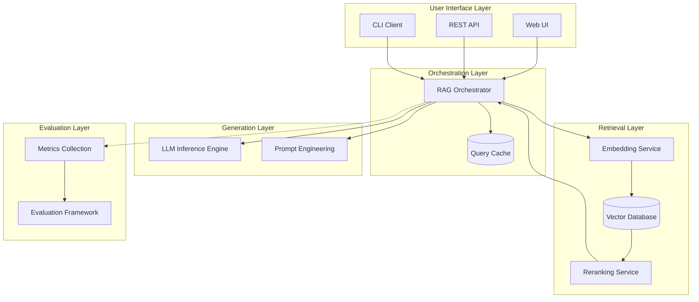

# Enterprise Retrieval Augmented Generation (RAG) System

> A comprehensive, production-ready RAG architecture for enterprise documentation and knowledge management systems.

## Overview

This repository contains best practices, templates, and implementation guides for building enterprise-grade RAG systems that integrate large language models with external knowledge bases.

## Table of Contents

| Section                         | Description                                                         |
| ------------------------------- | ------------------------------------------------------------------- |
| [Architecture](./architecture/) | System architecture diagrams and component design patterns          |
| [Components](./components/)     | Individual module implementations (embedding, retrieval, reranking) |
| [Evaluation](./evaluation/)     | Metrics, benchmarks, and automated testing frameworks               |
| [Integrations](./integrations/) | Connectors for common data sources (PDF, Markdown, Wiki, API)       |
| [Security](./security/)         | Access control, PII handling, audit logging implementations         |
| [Templates](./templates/)       | Pre-configured deployment templates and configuration schemas       |
| [Tools](./tools/)               | Utility scripts and monitoring dashboards                           |

## Quick Reference

| Concept                    | Location                                                           |
| -------------------------- | ------------------------------------------------------------------ |
| Core Architecture Patterns | `[architecture/overview.md](./architecture/overview.md)`           |
| Component Specifications   | `[components/reference_table.md](./components/reference_table.md)` |
| Edge Cases & Handling      | `[evaluation/edge_cases.md](./evaluation/edge_cases.md)`           |
| Security Best Practices    | `[security/guide.md](./security/guide.md)`                         |

## Installation Quickstart

```bash
# Navigate to RAG folder
cd retrieval-augmented-generation

# Create conda environment
conda create -n rag-system python=3.11 -y
conda activate rag-system

# Install dependencies
pip install -r requirements.txt

# Initialize the system
python tools/initialize.py
```

## Architecture Overview



## Key Features

| Feature                   | Description                                                        | Reference                                                                                  |
| ------------------------- | ------------------------------------------------------------------ | ------------------------------------------------------------------------------------------ |
| **Hybrid Search**         | Combines vector similarity with keyword matching for best accuracy | `[components/reference_table.md](./components/reference_table.md)` — Hybrid Search section |
| **Multi-Stage Reranking** | Applies coarse-to-fine filtering for optimal retrieval quality     | `[components/reference_table.md](./components/reference_table.md)` — Reranking section     |
| **Context Compression**   | Summarizes and compresses retrieved context within token limits    | `[architecture/overview.md](./architecture/overview.md)` — Generation Layer                |
| **Query Rewriting**       | Expands queries with synonyms, questions, and clarifying questions | `[components/quick-reference.md](./components/quick-reference.md)`                         |
| **Access Control**        | Per-document permission enforcement at retrieval time              | `[security/guide.md](./security/guide.md)` — Access Control section                        |
| **PII Masking**           | Redacts sensitive information before embedding/generation          | `[security/guide.md](./security/guide.md)` — PII Masking section                           |

## Best Practices Reference

| Area            | Recommendation                                                                           | Rationale                                             |
| --------------- | ---------------------------------------------------------------------------------------- | ----------------------------------------------------- |
| Chunking        | Use 500-800 token chunks with 100-200 token overlap                                      | Balances context preservation vs. retrieval precision |
| Embedding Model | Start with `all-MiniLM-L6-v2` (250M params), upgrade to domain-specific models as needed | Good quality/latency tradeoff; easily swappable       |
| Vector DB       | Use Weaviate/Qdrant for local deployment, Pinecone for managed cloud                     | Local options reduce dependency on third-party APIs   |
| Reranking       | Always use cross-encoder reranker (bge-reranker) with top-K=10 before generation         | Improves MRR by 20-30% over vector-only ranking       |
| Caching         | Cache queries with hit rate >70% for 5-15 minutes                                        | Reduces LLM calls by 40-60% for repetitive questions  |
| Evaluation      | Run automated tests daily, human review weekly                                           | Prevents drift and catches edge cases early           |

## Security Checklist

Before deploying to production:

- Implement per-document access controls
- Enable PII masking for sensitive fields
- Configure audit logging for all retrieval operations
- Set up data loss prevention (DLP) rules
- Define retention and deletion policies
- Establish incident response procedures

## Monitoring & Observability

| Metric              | Target           | Tooling                    |
| ------------------- | ---------------- | -------------------------- |
| Query latency (p95) | < 500ms          | Prometheus + Grafana       |
| Retrieval hit rate  | > 70%            | Custom evaluation pipeline |
| Context utilization | 60-80% of window | Logging analysis           |
| Error rate          | < 1%             | Sentry/OpenTelemetry       |
| Cache hit ratio     | > 40%            | Redis/Memcached metrics    |

## Document Status

| Document                 | Version | Last Updated |
| ------------------------ | ------- | ------------ |
| README.md                | 1.1     | 2026-04-28   |
| architecture/overview.md | 1.1     | 2026-04-28   |
| architecture/diagrams.md | 1.0     | 2026-04-24   |
| security/guide.md        | 1.0     | 2026-04-24   |
| evaluation/edge_cases.md | 1.0     | 2026-04-24   |
| requirements.txt         | 1.1     | 2026-04-28   |

## Related Modules

| Module                                                     | Relationship                                                                                                                                            |
| ---------------------------------------------------------- | ------------------------------------------------------------------------------------------------------------------------------------------------------- |
| [`context-engineering/`](../context-engineering/README.md) | Consumes RAG-retrieved documents via `ContextAssembler.add_retrieved()`. Context slot budgets and priority ordering are defined in context-engineering. |
| [`harness-engineering/`](../harness-engineering/README.md) | Executes the assembled context window safely. Token budget enforcement for retrieved content is handled at the harness layer.                           |

---

## License

Apache 2.0
