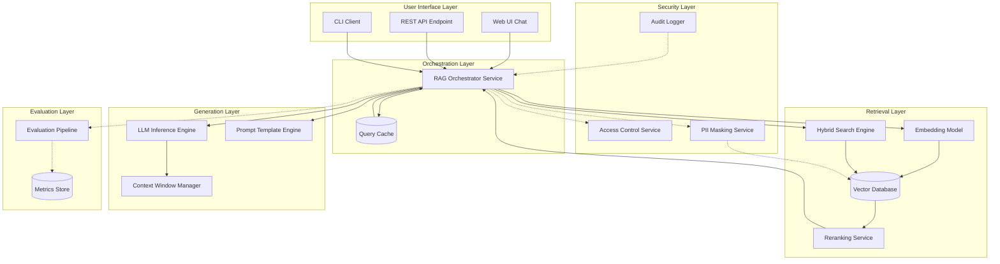
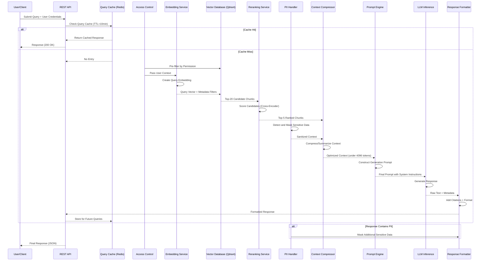
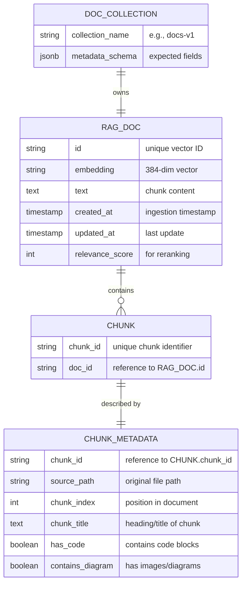
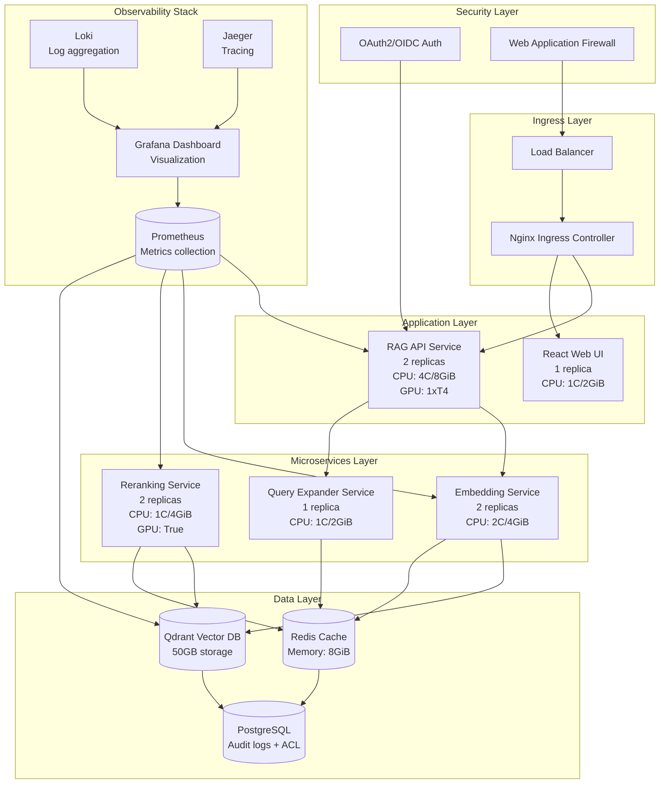
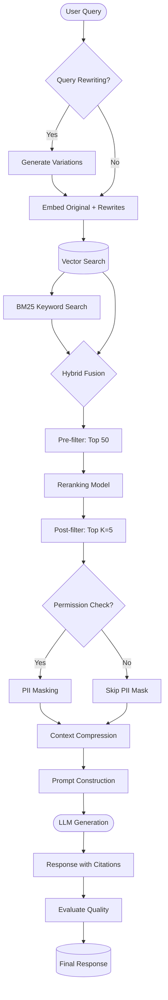
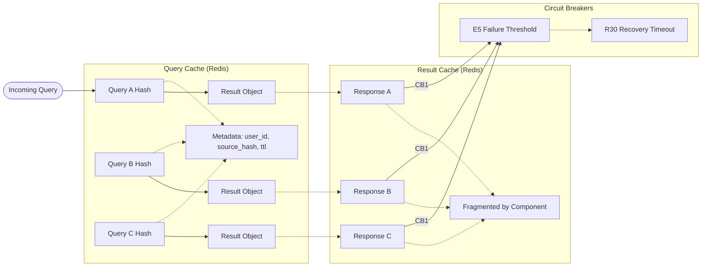
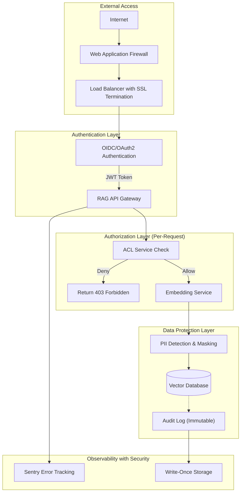
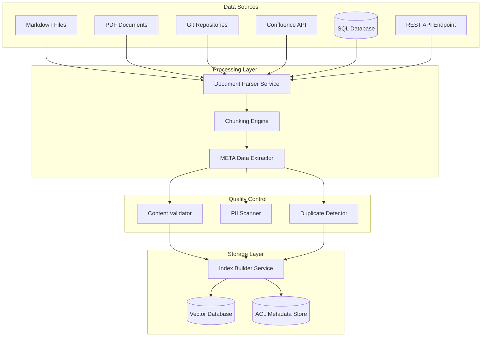
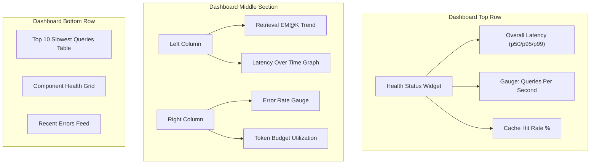

# RAG System Architecture Diagrams

## Complete Visual Reference for Enterprise RAG Implementation

This document provides comprehensive architectural diagrams for designing and implementing an enterprise-level RAG system.

---

## 1. High-Level System Architecture

---

## 2. Data Flow Diagram - End-to-End Query Processing

---

## 3. Vector Database Schema Design

---

## 4. Component Deployment Architecture (Kubernetes)

---

## 5. Retrieval Pipeline with Multiple Strategies

---

## 6. Caching Layer Architecture

---

## 7. Security Architecture Overview

---

## 8. Evaluation Pipeline Architecture

```mermaid
graph TB
    GoldQA[(Golden QA Dataset)] --> Evaluate[Evaluation Orchestrator]

    subgraph "Retrieval Metrics"
        EMCalculator["EM@K Calculator"]
        F1Calculator[F1 Score Calculator]
        NDCGCalculator["NDCG@K Calculator"]
        MRRCalculator[MRR Calculator]
    end

    subgraph "Generation Metrics"
        BLEUCalculator[BLEU Scorer]
        ROUGEScorer[ROUGE-L Scorer]
        BERTScorer[BERTScore Calculator]
        PerplexityCal[Perplexity Calculator]
    end

    subgraph "Quality Metrics"
        HallucinationChecker[Hallucination Detector]
        CitationValidator[Citation Accuracy Checker]
        FaithfulnessChecker[Faithfulness Scorer]
    end

    subgraph "System Metrics"
        LatencyAnalyzer[Latency Analyzer]
        CacheAnalyzer[Cache Hit Rate Calculator]
        TokenAnalyzer[Token Usage Analyzer]
    end

    Evaluate --> EMCalculator
    Evaluate --> F1Calculator
    Evaluate --> NDCGCalculator
    Evaluate --> MRRCalculator

    Evaluate --> BLEUCalculator
    Evaluate --> ROUGEScorer
    Evaluate --> BERTScorer
    Evaluate --> PerplexityCal

    Evaluate --> HallucinationChecker
    Evaluate --> CitationValidator
    Evaluate --> FaithfulnessChecker

    Evaluate --> LatencyAnalyzer
    Evaluate --> CacheAnalyzer
    Evaluate --> TokenAnalyzer

    EMCalculator --> Dashboard[Grafana Dashboard]
    F1Calculator --> Dashboard
    BLEUCalculator --> Dashboard
    LatencyAnalyzer --> Dashboard

    HallucinationChecker --> Alert["Alert if >5%"]
    LatencyAnalyzer -->|p95 > 800ms| Alert
```

---

## 9. Ingestion Pipeline Architecture

---

## 10. Monitoring Dashboard Layout

---

## Diagram Usage Guide

| Use Case                        | Recommended Diagram        | Location in Docs |
| ------------------------------- | -------------------------- | ---------------- |
| System overview to stakeholders | #1 High-Level Architecture | This document    |
| Debugging query failures        | #2 Data Flow Sequence      | This document    |
| Database optimization           | #3 Vector Schema           | This document    |
| Infrastructure planning         | #4 Kubernetes Deployment   | This document    |
| Retrieval strategy tuning       | #5 Multi-Strategy Pipeline | This document    |
| Caching performance analysis    | #6 Caching Layer           | This document    |
| Security audit documentation    | #7 Security Architecture   | This document    |
| ML evaluation setup             | #8 Evaluation Pipeline     | This document    |
| Data ingestion planning         | #9 Ingestion Pipeline      | This document    |
| Dashboard creation              | #10 Monitoring Layout      | This document    |
