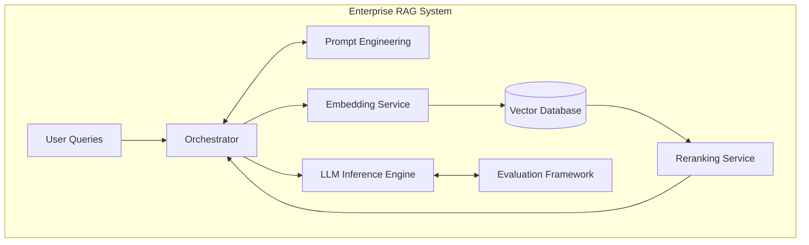
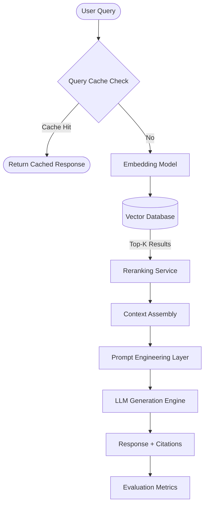
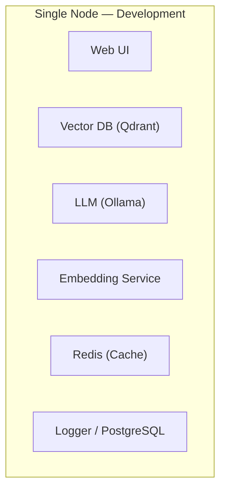
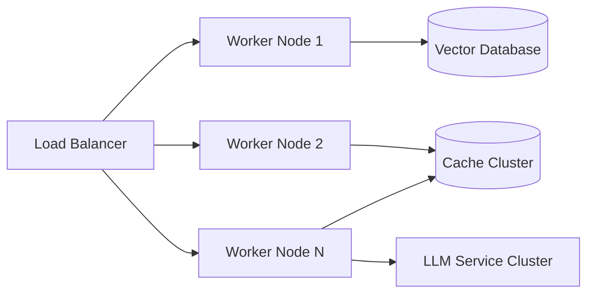
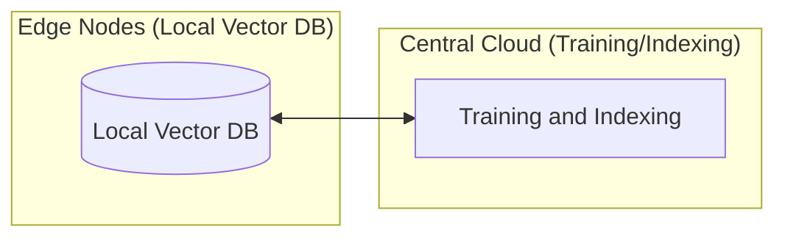

# RAG System Architecture Overview

## 1. High-Level Architecture

### 1.1 Component Architecture Diagram

### 1.2 Data Flow Architecture

## 2. Architecture Layers

### 2.1 Presentation Layer

| Component  | Responsibility                                    | Technologies          |
| ---------- | ------------------------------------------------- | --------------------- |
| Web UI     | Interactive chat interface with document explorer | React, Tailwind CSS   |
| REST API   | HTTP/JSON endpoints for programmatic access       | FastAPI, OpenAPI spec |
| CLI Client | Command-line tool for batch operations            | Python click/typer    |

### 2.2 Orchestration Layer

| Component        | Responsibility                 | Technologies          |
| ---------------- | ------------------------------ | --------------------- |
| RAG Orchestrator | Main workflow coordination     | LangChain/LlamaIndex  |
| Query Cache      | LRU cache for frequent queries | Redis/Memcached       |
| Session Manager  | Maintains conversation context | Redis + timestamp TTL |

### 2.3 Retrieval Layer

| Component            | Responsibility               | Technologies               |
| -------------------- | ---------------------------- | -------------------------- |
| Embedding Service    | Text → vector transformation | sentence-transformers      |
| Vector Database      | Persistent vector storage    | Qdrant/Weaviate/pgvector   |
| Reranking Service    | Cross-encoder refinement     | bge-reranker/cross-encoder |
| Hybrid Search Engine | BM25 + vector fusion         | Elasticsearch/Whoosh       |

### 2.4 Generation Layer

| Component              | Responsibility              | Technologies         |
| ---------------------- | --------------------------- | -------------------- |
| LLM Inference          | Text generation API         | vLLM/TGI/Ollama      |
| Prompt Template Engine | Dynamic prompt construction | Jinja2/Mustache      |
| Context Window Manager | Token budget allocation     | Custom token counter |

### 2.5 Evaluation Layer

| Component           | Responsibility                 | Technologies             |
| ------------------- | ------------------------------ | ------------------------ |
| Test Suite          | Automated evaluation framework | pytest + LLM graders     |
| Metrics Collector   | Aggregates and reports metrics | Prometheus/InfluxDB      |
| Human Eval Platform | Interface for human judgment   | React + annotation tools |

### 2.6 Security Layer

| Component      | Responsibility             | Technologies            |
| -------------- | -------------------------- | ----------------------- |
| Access Control | Per-document permissions   | OAuth2 + JWT + ACL      |
| PII Handler    | Sensitive data masking     | spaCy + regex patterns  |
| Audit Logger   | Immutable operation logs   | PostgreSQL + encryption |
| DLP Rules      | Content filtering policies | Custom rules engine     |

## 3. Deployment Topologies

### 3.1 Single-Node (Development)

> **Use Case:** Development, prototyping, testing
> **Latency:** ~800–1500ms end-to-end
> **Capacity:** ~10–50 concurrent users

### 3.2 Multi-Node (Production)

> **Use Case:** Production enterprise deployment
> **Latency:** ~300–600ms end-to-end
> **Capacity:** ~500–2000 concurrent users (scaling)

### 3.3 Hybrid Cloud-Edge

> **Use Case:** Multi-region deployment, data residency requirements
> **Latency:** ~100–300ms local, ~50–200ms cloud
> **Capacity:** Scales with edge node count

## 4. Technology Stack Reference

| Layer         | Component       | Recommended Options                    | Alternatives                    |
| ------------- | --------------- | -------------------------------------- | ------------------------------- |
| **Vector DB** | Primary storage | Qdrant (preferred), Weaviate, Pinecone | Milvus, Chroma, pgvector        |
| **Embedding** | Model           | bge-small-en-v1.5, all-MiniLM-L6-v2    | E5-small, sentence-transformers |
| **Reranker**  | Cross-encoder   | bge-reranker-large, Cohere Rerank      | UCSD/reranker-large             |
| **LLM**       | Inference       | vLLM (preferred), TGI, Ollama          | TextGenWebUI, llama-cpp-python  |
| **Cache**     | Query/results   | Redis (preferred), Memcached           | Cassandra, ScyllaDB             |
| **Logging**   | Metrics/audit   | PostgreSQL, ClickHouse                 | TimescaleDB, InfluxDB           |

## 5. Performance Targets

| Metric                      | Development | Production Goal | SLA Target |
| --------------------------- | ----------- | --------------- | ---------- |
| Query latency (p50)         | 300ms       | 250ms           | <400ms     |
| Query latency (p95)         | 800ms       | 600ms           | <1000ms    |
| Retrieval accuracy (EM)     | 0.65        | 0.75            | ≥0.70      |
| Reranking improvement (MRR) | +0.30       | +0.35           | ≥+0.30     |
| Cache hit rate              | 20%         | 50%             | ≥40%       |
| Context utilization         | 60-80%      | 70-85%          | 60-90%     |

## 6. Scalability Guidelines

### Horizontal Scaling Patterns

| Component         | Scale Factor             | Bottleneck Mitigation                    |
| ----------------- | ------------------------ | ---------------------------------------- |
| Embedding Service | ×N (load balanced)       | Batch processing, async queues           |
| Vector DB         | Sharding by collection   | Consistent hashing, range queries        |
| Reranking         | ×N (parallel candidates) | Two-stage filtering (coarse→fine)        |
| LLM Inference     | Multi-GPU batching       | vLLM PagedAttention, continuous batching |

### Data Volume Guidelines

| Document Count | Vector DB Choice  | Index Strategy       | Expected Latency |
| -------------- | ----------------- | -------------------- | ---------------- |
| <100K          | Any (Chroma)      | Full index           | ~100ms           |
| 100K-1M        | Qdrant/Weaviate   | HNSW index           | ~200-300ms       |
| 1M-10M         | Weaviate/Pinecone | IVF_PQ + HNSW        | ~300-500ms       |
| >10M           | Pinecone/Weaviate | Multi-stage indexing | ~500-800ms       |

## 7. Cost Optimization Strategies

| Strategy               | Implementation                  | Expected Savings                     |
| ---------------------- | ------------------------------- | ------------------------------------ |
| Query caching          | Redis with TTL-based eviction   | 40-60% LLM calls reduced             |
| Model quantization     | INT4/INT8 weights via vLLM      | 50-75% inference cost reduction      |
| Batch embedding        | Async processing pipeline       | 60-80% embedding cost reduction      |
| Hybrid search fallback | BM25 for quick retrieval        | Reduces expensive reranking calls    |
| Tiered vector DB       | Hot/warm/cold data partitioning | Low-cost storage for historical data |

## 8. Monitoring Dashboards

### Key Dashboard Metrics

| Metric Category | Specific Metrics                  | Alerts                    |
| --------------- | --------------------------------- | ------------------------- |
| **Latency**     | Query latency (p50, p95, p99)     | >1s → Page, >500ms → Warn |
| **Accuracy**    | Retrieval EM@K, Rerank MRR        | Drop >0.05 → Page         |
| **Throughput**  | Queries/second, requests/GPU-hour | <50% capacity utilization |
| **Quality**     | Context utilization rate          | <50% or >90% → Review     |
| **Cost**        | Tokens per query, embedding calls | >$100/hour → Optimize     |

## 9. Failure Mode Analysis

| Failure Scenario          | Mitigation Strategy                      | Recovery Time                  |
| ------------------------- | ---------------------------------------- | ------------------------------ |
| Embedding service down    | Failover to backup instance              | 5-10 min (cold start: 2-3 min) |
| Vector DB connection loss | Circuit breaker + retry                  | 1-2 min reconnection           |
| LLM quota exhausted       | Graceful degradation to cached responses | N/A (preventive limits)        |
| Cache memory pressure     | LRU eviction policy                      | Auto-handled (<100ms)          |
| Context window overflow   | Truncate least-relevant chunks first     | <50ms                          |
