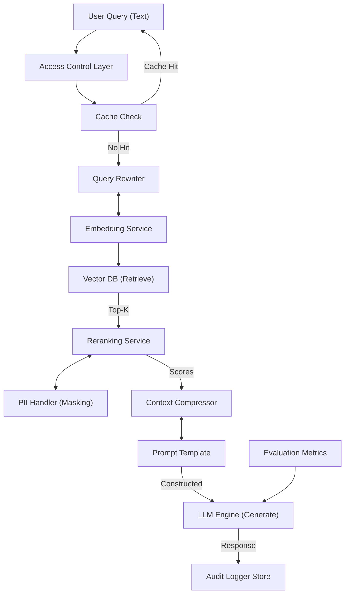

# RAG System Components Reference Table

## Complete Component Specification Matrix

| #      | Component              | Type             | Primary Function                                | Input Format                                    | Output Format                                     | Key Parameters                                   | Best Practice                                               |
| ------ | ---------------------- | ---------------- | ----------------------------------------------- | ----------------------------------------------- | ------------------------------------------------- | ------------------------------------------------ | ----------------------------------------------------------- |
| **1**  | Embedding Service      | Microservice/API | Converts text to dense vector representations   | Text (50-8k tokens)                             | Float32 vector (384/768/1024 dim)                 | `batch_size=32`, `device='auto'`                 | Use quantized models (INT4) for production; enable batching |
| **2**  | Vector Database        | Persistent Store | Stores and retrieves vectors by similarity      | Collection + Embeddings + Metadata              | List of vector objects with metadata              | `hnsw_ef=64`, `m=16`, `index_type='HNSW'`        | Use composite indices for metadata filtering                |
| **3**  | Reranking Service      | Microservice/API | Cross-encoder fine-ranking of candidate chunks  | Query + Top-K documents (500 tokens)            | Relevance scores [0,1] or [-2,+2]                 | `top_k=10`, `device='cuda'`                      | Always rerank before generation; use two-stage filtering    |
| **4**  | Hybrid Search Engine   | Library/Service  | Combines vector + keyword search results        | Query text + index                              | Fused ranked list (BM25 score × λ + Vector score) | `lambda_vec=0.7`, `lambda_txt=0.3`               | Tune lambda based on query type distribution                |
| **5**  | Query Rewriter         | NLP Pipeline     | Expands user queries with synonyms/questions    | Original query string                           | 3-5 reformulated queries                          | `max_rewrites=3`, `diversity_threshold=0.5`      | Use for open-domain QA; skip for specific document lookup   |
| **6**  | Context Compressor     | Text Processing  | Summarizes/reduces retrieved context            | Top-K document chunks                           | Compressed text (< token budget)                  | `max_tokens=4096`, `strategy='hybrid'`           | Combine with reranking; avoid aggressive summarization      |
| **7**  | Prompt Template Engine | Library          | Constructs dynamic prompts from templates       | Query + Retrieved context + System instructions | Formatted prompt string                           | `template='reasoning_sandwich'`, `max_context=5` | Use structured output schemas for JSON responses            |
| **8**  | Access Control Module  | Security Layer   | Enforces per-document permission checks         | User identity + Document IDs                    | Boolean access mask or filtered list              | `permission_model='ACL'`, `inheritance=True`     | Evaluate permissions BEFORE embedding lookup                |
| **9**  | PII Handler            | Security Layer   | Redacts sensitive information from content      | Text with potential PII                         | Masked text (tokens replaced)                     | `entities=['PII', 'EMAIL', 'PHONE']`             | Run on ingestion AND retrieval outputs                      |
| **10** | Audit Logger           | Observability    | Records all retrieval operations for compliance | Operation request/response                      | Log entry with timestamps                         | `retention_days=365`, `encrypt=True`             | Use append-only storage; include request hashes             |
| **11** | Query Cache            | In-Memory Store  | Stores and retrieves cached query results       | Query string + metadata                         | Cached response object                            | `max_memory_mb=4GB`, `eviction='lru'`            | TTL-based expiration: 5-15 min for frequent queries         |
| **12** | Session Manager        | State Management | Maintains conversation history/context          | Message sequence ID                             | Session state with context window                 | `history_limit=6`, `context_window=4096`         | Clear old sessions proactively; monitor memory usage        |

## Component Interaction Diagram

## 1. Core Retrieval Pipeline Components

### Embedding Service

| Aspect         | Specification                                                                     |
| -------------- | --------------------------------------------------------------------------------- |
| **Function**   | Converts arbitrary text input into fixed-dimensional dense vector representations |
| **Input**      | Raw text strings (UTF-8), can be single or batch                                  |
| **Output**     | Float32 vectors (e.g., 768-dimensional for all-MiniLM)                            |
| **Latency**    | ~50ms per batch on GPU; ~200ms per query without batching                         |
| **Memory**     | ~300-500MB RAM (INT8 quantized) or ~1GB FP16                                      |
| **Throughput** | 100-500 queries/sec per GPU instance                                              |

### Vector Database Interface

| Aspect            | Specification                                                      |
| ----------------- | ------------------------------------------------------------------ |
| **Function**      | Persistent storage with nearest-neighbor search capabilities       |
| **Supported Ops** | `insert()`, `query()`, `delete()`, `update()`, `metadata_filter()` |
| **Vector Format** | List[float], np.ndarray, or binary packed                          |
| **Index Types**   | HNSW (default), IVF_PQ, ANN (configurable)                         |
| **Query Types**   | Dense vector search, hybrid (BM25+vector), metadata-filtered       |

### Reranking Service

| Aspect          | Specification                                               |
| --------------- | ----------------------------------------------------------- |
| **Function**    | Cross-encoder model for fine-grained relevance scoring      |
| **Input**       | Query text + list of document chunks (paired input)         |
| **Output**      | Ranked list with scores: [(doc, score), ...]                |
| **Score Range** | Model-dependent: [0,1], [-2,+2], or logits                  |
| **Throughput**  | ~5-20 queries/sec per GPU (computationally expensive)       |
| **Best Use**    | Top-K filtering: retrieve 50 chunks → rerank → select top-5 |

## 2. Advanced Processing Components

### Query Rewriter

| Aspect              | Specification                                                  |
| ------------------- | -------------------------------------------------------------- |
| **Function**        | Generates multiple query variations to improve retrieval       |
| **Variation Types** | Synonym expansion, question rewriting, clarification questions |
| **Output Size**     | Configurable: 1-5 reformulated queries                         |
| **When to Use**     | Open-domain QA; less critical for specific lookup tasks        |
| **Overhead**        | +200-400ms per query (LLM-based)                               |

### Context Compressor

| Aspect            | Specification                                                  |
| ----------------- | -------------------------------------------------------------- |
| **Function**      | Reduces token usage while preserving key information           |
| **Strategies**    | `hybrid` (summary + keywords), `abstract`, `truncate`          |
| **Input Budget**  | Top-K chunks from retrieval step                               |
| **Output Budget** | User-configurable token limit (typically 2048-4096)            |
| **Caution**       | Don't compress already-concise content; avoid information loss |

## 3. Security & Governance Components

### Access Control Module

| Aspect                  | Specification                                                    |
| ----------------------- | ---------------------------------------------------------------- |
| **Function**            | Enforces document-level permissions during retrieval             |
| **Evaluation Strategy** | Pre-filter (before embedding) or post-filter (after retrieval)   |
| **Supported Models**    | ACL (Access Control List), RBAC (Role-Based)                     |
| **Performance Impact**  | Minimal with pre-filtering; significant with per-document checks |
| **Implementation**      | Pass user context in metadata filter; use Redis for caching ACLs |

### PII Handler

| Aspect                | Specification                                           |
| --------------------- | ------------------------------------------------------- |
| **Function**          | Detects and redacts personally identifiable information |
| **Detection Methods** | Named entity recognition (NER) + regex patterns         |
| **PII Categories**    | Email, phone, SSN, credit card, names, addresses        |
| **Action Options**    | Mask (`***`), hash, or exclude from embedding           |
| **When to Apply**     | BOTH on ingestion AND before retrieval to vector DB     |

### Audit Logger

| Aspect              | Specification                                                    |
| ------------------- | ---------------------------------------------------------------- |
| **Function**        | Records all RAG operations for compliance and debugging          |
| **Recorded Fields** | Timestamp, query_hash, user_id (optional), document_ids, latency |
| **Storage Format**  | JSON or Parquet; encrypted at rest recommended                   |
| **Retention**       | Configurable; typically 90-365 days depending on regulation      |
| **Privacy Impact**  | Must not store queries in plaintext if PII present               |

## 4. Optimization & Observability Components

### Query Cache

| Aspect              | Specification                                                  |
| ------------------- | -------------------------------------------------------------- |
| **Function**        | Stores query→response mappings for instant retrieval           |
| **Key Format**      | Query string (normalized, lowercased) + optional metadata hash |
| **Value Format**    | Full response object (text + citations + metadata)             |
| **Eviction Policy** | LRU (Least Recently Used) with configurable size limit         |
| **TTL Strategy**    | Fixed expiration (5-15 min) or count-based (max N hits)        |

### Session Manager

| Aspect             | Specification                                            |
| ------------------ | -------------------------------------------------------- |
| **Function**       | Maintains conversation context for multi-turn dialogues  |
| **State Storage**  | Redis (in-memory preferred), PostgreSQL (persistence)    |
| **Context Window** | Limited by LLM max input; typically 4096 tokens          |
| **History Limit**  | Configurable: keep last N messages or fixed token budget |
| **Clear Strategy** | Automatic on timeout OR manual clear by user             |

## Component Selection Guide

| Scenario                  | Recommended Components                          | Rationale                                   |
| ------------------------- | ----------------------------------------------- | ------------------------------------------- |
| **Basic RAG**             | Embedding + Vector DB + LLM                     | Minimal setup; adequate for simple Q&A      |
| **High Accuracy**         | Add Reranking + Hybrid Search                   | Improves recall and precision significantly |
| **Multi-turn Chat**       | Add Session Manager + Query Cache               | Handles context and reduces latency         |
| **Enterprise Compliance** | Add Access Control + PII Handler + Audit Logger | Meets regulatory requirements               |
| **Open-domain QA**        | Add Query Rewriter + Context Compressor         | Handles diverse query formulations          |

## Performance Benchmarks (Typical)

| Component           | p50 Latency | p95 Latency | Throughput        | Memory Footprint |
| ------------------- | ----------- | ----------- | ----------------- | ---------------- |
| Embedding Service   | 40ms        | 120ms       | 300 q/s/GPU       | 450MB (INT8)     |
| Vector Search       | 5ms         | 25ms        | ∞ (depends on DB) | N/A              |
| Reranking           | 150ms       | 600ms       | 10 q/s/GPU        | 3GB              |
| Query Rewriting     | 300ms       | 800ms       | 2 q/s             | 1.5GB            |
| Context Compression | 100ms       | 400ms       | 25 q/s            | 500MB            |

> **Note**: All benchmarks measured on NVIDIA A10G GPU with batch optimizations enabled. Actual performance varies by workload and hardware.

## Maintenance & Operations

| Component         | Typical Maintenance                                  | Warning Signs                  |
| ----------------- | ---------------------------------------------------- | ------------------------------ |
| Embedding Service | Model updates every 3-6 months; monitoring for drift | Latency spikes, OOM errors     |
| Vector DB         | Index rebuilds quarterly; schema updates             | Query latency increasing >20%  |
| Reranking Service | Model retraining as needed; cache warmup             | Score distribution shifts      |
| Query Cache       | Capacity expansion at 80% usage; periodic flush      | Hit rate <30%, memory pressure |
| Session Manager   | TTL cleanup; orphan session removal                  | Memory growth without bounds   |
