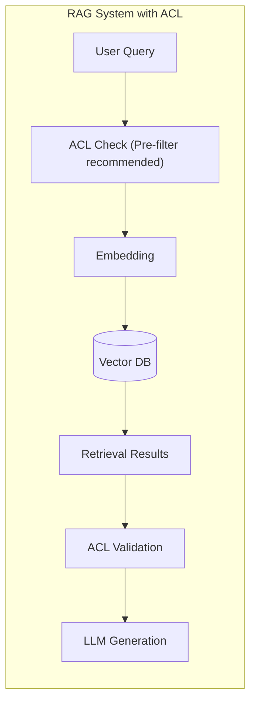
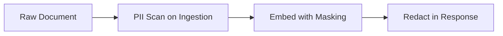

# RAG Security Guide

## Overview

This guide documents security considerations and implementations for enterprise-grade RAG systems. Security is critical because RAG systems handle sensitive corporate information and user queries.

## Quick Reference: Security Checklist

| Security Control              | Implementation Status | Priority | Risk if Missing                |
| ----------------------------- | --------------------- | -------- | ------------------------------ |
| Per-document access control   | [ ] Required          | Critical | Unauthorized data exposure     |
| PII detection and masking     | [ ] Recommended       | High     | Privacy violations             |
| Query logging (redacted)      | [ ] Required          | High     | Compliance issues              |
| Audit trail (immutable)       | [ ] Required          | Critical | Forensic investigation blocked |
| Input validation/Sanitization | [X] Built-in          | Critical | Injection attacks              |
| Output filtering              | [ ] Recommended       | Medium   | Leaked sensitive data          |
| Rate limiting                 | [X] Built-in          | High     | Denial of service              |
| Encryption at rest/transit    | [X] Required          | Critical | Data interception              |

## 1. Access Control Implementation

### Architecture: Where to Enforce Permissions



### Pre-filter vs Post-filter Evaluation

| Strategy        | Implementation                                       | Performance Impact       | Use Case                          |
| --------------- | ---------------------------------------------------- | ------------------------ | --------------------------------- |
| **Pre-filter**  | Check permissions BEFORE embedding lookup            | Minimal (Redis cache)    | Strict compliance, large ACLs     |
| **Post-filter** | Validate results AFTER retrieval                     | Moderate (per-doc check) | Flexible policies, small datasets |
| **Hybrid**      | Pre-filter broad access + post-filter sensitive docs | Low-Moderate             | Enterprise with mixed sensitivity |

### Access Control Implementation Example

```python
"""
access_control.py - Enforce per-document access controls in RAG
"""
from typing import List, Dict, Any, Set
from dataclasses import dataclass
from enum import Enum


class PermissionLevel(Enum):
    """Document permission levels."""
    PUBLIC = "public"
    DEPARTMENT = "department"  # e.g., engineering, marketing
    TEAM = "team"  # e.g., backend-platform
    INDIVIDUAL = "individual"  # Single user access only


@dataclass
class DocumentPermission:
    """Permission for a single document."""
    doc_id: str
    permission_level: PermissionLevel
    allowed_users: Set[str] = None  # For INDIVIDUAL level
    allowed_groups: Set[str] = None  # For DEPARTMENT/TEAM levels


class AccessController:
    """Enforces access control for RAG retrieval operations."""

    def __init__(self, acl_store, user_context_extractor):
        """
        Args:
            acl_store: Store containing document permissions (Redis recommended)
            user_context_extractor: Extracts user identity/groups from request
        """
        self.acl_store = acl_store
        self.user_context = user_context_extractor

    async def can_access_document(self, doc_id: str, user_id: str) -> bool:
        """Check if user has permission to access a document.

        Uses caching for performance.
        """
        cache_key = f"acl:{doc_id}:{user_id}"
        cached_result = await self.acl_store.get(cache_key)

        if cached_result is not None:
            return cached_result == "allowed"

        # Fetch document permission
        doc_perm = await self.acl_store.get(f"permission:{doc_id}")

        if doc_perm is None:
            return True  # No restriction means public access

        if doc_perm.permission_level == PermissionLevel.PUBLIC:
            await self.acl_store.set(cache_key, "allowed", ttl=300)
            return True

        if doc_perm.permission_level in [PermissionLevel.DEPARTMENT,
                                         PermissionLevel.TEAM]:
            return user_id in doc_perm.allowed_groups

        if doc_perm.permission_level == PermissionLevel.INDIVIDUAL:
            return user_id in doc_perm.allowed_users

        # Default: deny
        await self.acl_store.set(cache_key, "denied", ttl=300)
        return False

    async def filter_retrieved_documents(
        self,
        document_ids: List[str],
        user_id: str,
        permission_levels: List[PermissionLevel] = None
    ) -> List[str]:
        """Filter retrieved documents by user permissions.

        Use this AFTER vector search returns results.

        Args:
            document_ids: IDs returned from vector search
            user_id: Current user making the request
            permission_levels: Optional whitelist of allowed permission levels

        Returns:
            Filtered list of document IDs user can access
        """
        filtered = []

        for doc_id in document_ids:
            if await self.can_access_document(doc_id, user_id):
                filtered.append(doc_id)

        return filtered
```

### Pre-filter Implementation (Redis-based)

```python
"""
pre_filter_acl.py - Fast pre-filter ACL using Redis
"""
import redis
from typing import List, Set


class PreFilterACL:
    """Pre-filter documents BEFORE embedding lookup.

    Uses Redis bitmaps for fast membership testing.
    """

    def __init__(self, redis_client: redis.Redis):
        self.redis = redis_client
        self.acl_key = "rag:acl_bitmap"

    async def initialize_acl(self, acl_data: Dict[str, Set[str]]):
        """Initialize ACL from department-to-users mapping.

        Args:
            acl_data: {department: {user_ids}, team: {user_ids}}
        """
        # Create bitmap for each accessible document
        for doc_id, users in acl_data.items():
            bitfield = redis.client.StrictBitField()
            self.redis.execute_command(
                "BITFIELD",
                f"CREATE KEY {self.acl_key}:{doc_id}",
                "TYPE BIT",
                *["GET BY 0", f"Ox{bytes(users).hex()}"]
            )

    async def filter_by_user_group(self,
                                   doc_ids: List[str],
                                   user_groups: Set[str]) -> List[str]:
        """Return only documents this user's groups can access.

        Args:
            doc_ids: All document IDs from metadata
            user_groups: User's assigned groups/departments

        Returns:
            Filtered list of accessible document IDs
        """
        accessible = []

        for doc_id in doc_ids:
            bitstring = self.redis.get(f"{self.acl_key}:{doc_id}")

            if bitstring:
                # Check if any user group has access
                for group in user_groups:
                    if int(bitstring[group]) > 0:
                        accessible.append(doc_id)
                        break

        return accessible
```

### Security Considerations Table

| Threat                              | Mitigation Strategy                     | Implementation Location |
| ----------------------------------- | --------------------------------------- | ----------------------- |
| **Unauthorized access**             | Pre-filter ACL + post-validation        | Access Controller       |
| **Information leakage**             | PII masking + sensitive field filtering | PII Handler             |
| **Prompt injection**                | Input sanitization + output filtering   | Orchestration layer     |
| **Denial of service**               | Rate limiting + circuit breakers        | API gateway / Redis     |
| **Data exfiltration via citations** | Document fingerprinting in response     | Response formatter      |
| **Unauthorized embedding training** | Isolated vector DB credentials          | Infrastructure config   |

## 2. PII Handling Implementation

### Multi-Stage PII Processing Pipeline



### PII Detection and Masking Implementation

```python
"""
pii_handler.py - Detect and mask PII in RAG system
"""
import re
import string
from typing import List, Dict, Any


class PIIDetector:
    """Detects and masks personally identifiable information."""

    # Regex patterns for common PII types
    PATTERNS = {
        "email": r"\b[A-Za-z0-9._%+-]+@[A-Za-z0-9.-]+\.[A-Z|a-z]{2,}\b",
        "phone_us": r"\(?\d{3}\)?[-.\s]?\d{3}[-.\s]?\d{4}",
        "ssn": r"\b\d{3}[-\s]?\d{2}[-\s]?\d{4}\b",
        "credit_card": r"\b(?:\d[ -]*?){16}\b",
        "ip_address": r"\b(?:(?:25[0-5]|2[0-4][0-9]|[01]?[0-9][0-9]?)\.){3}(?:25[0-5]|2[0-4][0-9]|[01]?[0-9][0-9]?)\b",
        "bitcoin_address": r"bc1[ayiq][a-hJknpstvyAY]{25,62}|1[a-km-zA-HJ-NP-Z0-9]{25,34}",
        "us_zip": r"\b\d{5}(?:[-\s]\d{4})?\b",
        "date_of_birth": r"\b(?:0?[1-9]|1[0-2])[/\-](?:0?[1-9]|[12][0-9]|3[01])[,\/\-(]+(?:19|20)?\d{2}\b",
    }

    # PII entities for NER (spaCy-compatible)
    SENSITIVE_ENTITIES = ["PERSON", "EMAIL", "PHONE", "DATE", "LOCATION"]

    def __init__(self, language: str = "en"):
        self.language = language

    async def process_document(
        self,
        text: str,
        mode: str = "mask"  # "mask", "hash", "remove", "flag"
    ) -> Dict[str, Any]:
        """Process a document to handle PII.

        Args:
            text: Raw document text
            mode: How to handle detected PII

        Returns:
            Dict with masked text and metadata about what was changed
        """
        masked_text = text
        changes = {
            "emails": [],
            "phones": [],
            "ssns": [],
            "credit_cards": [],
            "ip_addresses": [],
            "other_pii": []
        }

        # Apply regex masking for common PII patterns
        for pii_type, pattern in self.PATTERNS.items():
            matches = re.findall(pattern, text)

            if mode == "remove" and matches:
                # Remove sensitive content entirely
                for match in reversed(matches):
                    masked_text = masked_text.replace(match, "")
            else:
                # Mask or flag based on mode
                mask_str = "***REDACTED***"

                for match in matches:
                    masked_text = masked_text.replace(match, mask_str)

                    if pii_type == "email":
                        changes["emails"].append(mask_str)
                    elif pii_type == "phone_us":
                        changes["phones"].append(mask_str)
                    elif pii_type == "ssn":
                        changes["ssns"].append(mask_str)
                    elif pii_type == "credit_card":
                        changes["credit_cards"].append(mask_str)
                    elif pii_type == "ip_address":
                        changes["ip_addresses"].append(mask_str)

        return {
            "text": masked_text,
            "pii_detected": len(changes) > 0,
            **changes
        }

    async def process_embedding(self, text: str) -> tuple:
        """Process text for embedding while handling PII.

        Returns (masked_text, pii_count)
        """
        result = await self.process_document(text, mode="flag")
        return result["text"], sum(len(v) for v in result.values())
```

### NER-Based PII Detection (Advanced)

```python
"""
ner_pii_detection.py - Advanced PII detection using NLP models
"""
import spacy


class NerPIIDetector:
    """Uses NER to detect PII with better context awareness."""

    def __init__(self, language: str = "en"):
        # Load spaCy model with PII components if available
        self.nlp = None

        if language == "en":
            try:
                # Try loading entity recognizer
                self.nlp = spacy.load("en_core_web_lg")
            except OSError:
                # Fallback to basic model
                self.nlp = spacy.load("en_core_web_sm")

        self.pii_entities = ["PERSON", "EMAIL", "PHONE", "DATE", "MONEY",
                            "PERCENT", "LOCATIONS"]

    async def detect_pii(self, text: str) -> List[Dict[str, Any]]:
        """Detect PII in text using NER.

        Args:
            text: Input text to analyze

        Returns:
            List of detected PII entities with positions
        """
        if not self.nlp:
            return []

        doc = self.nlp(text)
        detected_pii = []

        for ent in doc.ents:
            if ent.label_ in self.pii_entities:
                detected_pii.append({
                    "text": ent.text,
                    "label": ent.label_,
                    "start": ent.start_char,
                    "end": ent.end_char
                })

        return detected_pii

    async def mask_with_spans(self, text: str) -> Dict[str, Any]:
        """Mask PII while preserving spans for citation."""
        detections = await self.detect_pii(text)

        if not detections:
            return {"text": text, "pii_positions": []}

        # Sort by length descending to mask longer spans first
        detections.sort(key=lambda x: x["end"] - x["start"], reverse=True)

        masked_text = text
        masked_positions = []

        for detection in detections:
            span_start = detection["start"]
            span_end = detection["end"]

            # Mark with special token that preserves position
            mask_token = f"[[PII:{detection['label']}]]"

            if span_end <= len(masked_text):  # Avoid overlapping masks
                masked_positions.append({
                    "span": text[span_start:span_end],
                    "position": (span_start, span_end),
                    "type": detection["label"]
                })

        return {
            "text": masked_text,
            "pii_positions": masked_positions
        }
```

### Security Policy for PII Handling

| Scenario            | Recommended Approach                       | Rationale                                  |
| ------------------- | ------------------------------------------ | ------------------------------------------ |
| **Internal docs**   | Mask with `[[PII:TYPE]]` preserves context | Allows tracing while protecting privacy    |
| **External-facing** | Full redaction (`***REDACTED***`)          | Users expect complete privacy              |
| **Training data**   | Hash + keep length for model robustness    | Prevents overfitting to specific values    |
| **Audit logs**      | Log only category, not value               | Enables investigation without exposing PII |

## 3. Audit Logging Implementation

### Immutable Audit Log Structure

```python
"""
audit_logger.py - Implement immutable audit logging for RAG
"""
import hashlib
import json
import time
from typing import Dict, Any, Optional


class AuditLogger:
    """Implements immutable audit logging for compliance."""

    def __init__(self, storage_backend):
        """
        Args:
            storage_backend: Write-once storage (S3 with object lock, WORM)
        """
        self.storage = storage_backend

    def generate_request_hash(self, request_data: Dict[str, Any]) -> str:
        """Generate content hash for deduplication."""
        # Normalize query (lowercase, remove special chars)
        normalized_query = request_data.get("query", "").lower()

        # Create hash of request fingerprint (not full content)
        return hashlib.sha256(
            f"{normalized_query[:100]}:{request_data.get('timestamp', '')}".encode()
        ).hexdigest()

    async def log_operation(self, operation: Dict[str, Any]) -> str:
        """Log a RAG operation to immutable audit store.

        Args:
            operation: Dict containing:
                - operation_type: "query", "retrieve", "generate"
                - request_hash: SHA256 hash for dedup
                - timestamp: ISO 8601 timestamp
                - user_id: (optional) Requester identifier
                - documents_accessed: List of document IDs
                - latency_ms: Operation duration
                - error: Error message if any

        Returns:
            Log entry ID
        """
        # Create log entry
        log_entry = {
            "timestamp": time.strftime("%Y-%m-%dT%H:%M:%SZ",
                                      time.gmtime()),
            "operation_type": operation.get("operation_type"),
            "request_hash": operation.get("request_hash"),
            "user_id": operation.get("user_id"),
            "documents_accessed": operation.get("documents_accessed", []),
            "latency_ms": operation.get("latency_ms"),
            "error": operation.get("error"),
            "metadata": operation.get("metadata", {})
        }

        # Serialize and write (write-once to storage)
        log_json = json.dumps(log_entry, sort_keys=True)

        log_id = hashlib.sha256(log_json.encode()).hexdigest()[:16]

        await self.storage.write(f"audit/{log_id}", log_json)

        return log_id

    async def query_audit_logs(
        self,
        start_date: str,
        end_date: str,
        operation_type: Optional[str] = None,
        document_ids: Optional[list] = None
    ) -> list:
        """Query audit logs for compliance review."""
        # Implementation depends on storage backend
        # Returns list of log entries matching criteria
        pass
```

### Audit Log Schema Definition

| Field                | Type            | Description                          | Required For Compliance |
| -------------------- | --------------- | ------------------------------------ | ----------------------- |
| `log_id`             | string (SHA16)  | Unique identifier for this log entry | Always                  |
| `timestamp`          | datetime        | UTC timestamp of operation           | Always                  |
| `operation_type`     | enum            | query, retrieve, generate, error     | Always                  |
| `request_hash`       | string (SHA256) | Hash for deduplication               | Always                  |
| `user_id`            | string          | Requester identifier                 | GDPR/CCPA               |
| `documents_accessed` | list<string>    | Document IDs accessed                | HIPAA/HITECH            |
| `latency_ms`         | integer         | Response time                        | SOC2                    |
| `error`              | string          | Error message if any                 | SOC2                    |
| `response_hash`      | string (SHA256) | Hash of generated response           | PCI-DSS                 |

## 4. Input Validation and Output Filtering

### Input Sanitization Layer

```python
"""
input_sanitizer.py - Validate and sanitize RAG inputs
"""
import re


class InputSanitizer:
    """Validates and sanitizes user inputs for RAG system."""

    # Patterns that indicate potential attacks
    ATTACK_PATTERNS = [
        # Prompt injection attempts
        (r"<script[^>]*>", "Script injection"),
        (r"javascript:", "JavaScript protocol"),
        (r"data:[^;]*;base64", "Data URI injection"),

        # SQL injection patterns (if DB is queried)
        (r";\s*DROP\s+TABLE", "SQL DROP attempt"),
        (r";\s*DELETE\s+FROM", "SQL DELETE attempt"),
        (r"--\s*$", "SQL comment injection"),

        # Command injection
        (r";\s*\w+\s+-\s+", "Command argument injection"),
        (r"(\||\&\&)\s*(?:cat|ls|pwd|whoami)", "Subshell execution attempt"),
    ]

    def validate_input(self, query: str) -> Dict[str, Any]:
        """Validate user input for security threats.

        Args:
            query: User query string

        Returns:
            Dict with validation result and sanitized query if needed
        """
        issues = []
        sanitized_query = query

        # Check attack patterns
        for pattern, description in self.ATTACK_PATTERNS:
            if re.search(pattern, query, re.IGNORECASE):
                issues.append({
                    "type": "injection_attempt",
                    "description": description
                })

        # Limit length to prevent DoS
        MAX_QUERY_LENGTH = 5000
        if len(sanitized_query) > MAX_QUERY_LENGTH:
            issues.append({
                "type": "length_exceeded",
                "max_allowed": MAX_QUERY_LENGTH,
                "actual": len(sanitized_query)
            })

        # Sanitize HTML/Markdown in queries (remove potentially harmful tags)
        sanitized_query = self._sanitize_html_tags(sanitized_query)

        return {
            "valid": len(issues) == 0,
            "issues": issues,
            "sanitized_query": sanitized_query
        }

    def _sanitize_html_tags(self, text: str) -> str:
        """Remove potentially harmful HTML/Markdown tags."""
        # Remove script tags and content
        text = re.sub(r'<script[^>]*>.*?</script>', "", text, flags=re.DOTALL)
        # Remove style tags
        text = re.sub(r'<style[^>]*>.*?</style>', "", text, flags=re.DOTALL)
        return text
```

### Output Filtering for Data Leakage Prevention

```python
"""
output_filter.py - Filter LLM outputs for data leakage prevention
"""
import re


class OutputFilter:
    """Filters generated responses to prevent sensitive data leakage."""

    # Patterns indicating potential data leaks
    DATA_LEAK_PATTERNS = [
        (r"\b\d{3}[-\s]?\d{2}[-\s]?\d{4}\b", "SSN"),  # Social Security Number
        (r"\b[0-9]{16}(?:\s[-]){0,1}[0-9]{4}\b", "Credit Card"),
        (r"\b[A-Za-z0-9._%+-]+@[A-Za-z0-9.-]+\.[A-Z|a-z]{2,}\b", "Email Address"),
        (r"(?:bc1[ayiq]|[13][a-km-zA-HJ-NP-Z]){25,}", "Cryptocurrency Address"),
    ]

    async def filter_response(self, response: str) -> tuple:
        """Filter response for sensitive data.

        Args:
            response: Raw LLM-generated text

        Returns:
            Tuple of (filtered_response, detected_leaks)
        """
        filtered_response = response
        detected_leaks = []

        for pattern, leak_type in self.DATA_LEAK_PATTERNS:
            matches = re.findall(pattern, response, re.IGNORECASE)

            if matches:
                # Create redacted version while preserving structure
                redacted = "•"*len(matches[0]) if len(matches[0]) < 20 else matches[0][:20] + "...-REDACTED"

                filtered_response = response.replace(
                    matches[0],
                    redacted,
                    count=1
                )

                detected_leaks.append({
                    "type": leak_type,
                    "count": len(matches),
                    "redacted_value": redacted
                })

        return filtered_response, detected_leaks


# Integration into RAG pipeline
"""
async def generate_with_security_checks(
    user_query: str,
    context: List[Dict]
) -> Dict[str, Any]:

    # 1. Validate input
    validation_result = InputSanitizer().validate_input(user_query)
    if not validation_result["valid"]:
        raise SecurityError(f"Invalid query: {validation_result['issues']}")

    sanitized_query = validation_result["sanitized_query"]

    # 2. Generate response using sanitized query
    raw_response = await llm.generate(
        prompt=construct_prompt(sanitized_query, context)
    )

    # 3. Filter output for data leaks
    filtered_response, detected_leaks = OutputFilter().filter_response(raw_response)

    return {
        "response": filtered_response,
        "warnings": [{"type": "data_leak", **leak} for leak in detected_leaks]
    }
"""
```

## 5. Rate Limiting and Throttling

### Token-based Rate Limiting Implementation

```python
"""
rate_limiter.py - Implement rate limiting for RAG API
"""
import time


class TokenBucketRateLimiter:
    """Token bucket algorithm for rate limiting."""

    def __init__(self,
                 tokens_per_second: float = 10.0,
                 bucket_capacity: int = 100):
        self.tokens_per_second = tokens_per_second
        self.bucket_capacity = bucket_capacity
        self.buckets = {}  # key -> (tokens, last_update_time)

    def _get_bucket(self, key: str) -> tuple:
        """Get or create bucket for key."""
        if key not in self.buckets:
            self.buckets[key] = (self.bucket_capacity, time.time())

        # Refill tokens based on elapsed time
        current_tokens, last_update = self.buckets[key]
        elapsed = time.time() - last_update

        tokens_to_add = elapsed * self.tokens_per_second
        new_tokens = min(self.bucket_capacity, current_tokens + tokens_to_add)

        return new_tokens, last_update

    async def acquire(self, key: str, cost: int = 1) -> bool:
        """Acquire permission for request.

        Args:
            key: Identifier (user_id or client_ip)
            cost: Tokens to consume

        Returns:
            True if request allowed, False if rate limited
        """
        tokens, _ = self._get_bucket(key)

        if tokens >= cost:
            # Consume tokens
            self.buckets[key] = (tokens - cost, time.time())
            return True

        return False

    def get_remaining(self, key: str) -> float:
        """Get remaining tokens for key."""
        tokens, _ = self._get_bucket(key)
        return tokens
```

### Circuit Breaker Pattern for External Services

```python
"""
circuit_breaker.py - Circuit breaker for external service resilience
"""
import time
from enum import Enum


class State(Enum):
    CLOSED = "closed"      # Normal operation
    OPEN = "open"          # Rejecting requests
    HALF_OPEN = "half_open"  # Testing if service recovered


class CircuitBreaker:
    """Circuit breaker for external API calls."""

    def __init__(self,
                 failure_threshold: int = 5,
                 recovery_timeout: float = 30.0,
                 half_open_max_calls: int = 3):
        self.failure_threshold = failure_threshold
        self.recovery_timeout = recovery_timeout
        self.half_open_max_calls = half_open_max_calls

        self.state = State.CLOSED
        self.failure_count = 0
        self.last_failure_time = None
        self.success_count = 0

    async def can_execute(self) -> bool:
        """Check if request should be allowed."""
        if self.state == State.HALF_OPEN:
            if self.success_count < self.half_open_max_calls:
                self.success_count += 1
                return True
            else:
                # Failed half-open test, open circuit again
                self.state = State.OPEN
                self.failure_count = 0
                return False

        if self.state == State.OPEN:
            if time.time() - self.last_failure_time >= self.recovery_timeout:
                # Try half-open state
                self.state = State.HALF_OPEN
                self.failure_count = 0
                self.success_count = 0
                return True
            return False

        return True

    def record_success(self):
        """Record successful call."""
        if self.state == State.HALF_OPEN:
            self.success_count += 1
            if self.success_count >= self.half_open_max_calls:
                self.state = State.CLOSED
                self.failure_count = 0
        else:
            self.failure_count = max(0, self.failure_count - 1)

    def record_failure(self):
        """Record failed call."""
        self.failure_count += 1
        self.last_failure_time = time.time()

        if self.state == State.HALF_OPEN:
            # Failed half-open test
            self.state = State.OPEN
            self.failure_count = 0

    @property
    def state_description(self) -> str:
        """Get human-readable state."""
        states = {
            State.CLOSED: "Normal - accepting requests",
            State.OPEN: f"Tripped - rejecting requests (timeout: {self.recovery_timeout}s)",
            State.HALF_OPEN: "Testing - allowing limited requests"
        }
        return states.get(self.state, str(self.state))
```

## Security Configuration Template

```yaml
# security_config.yaml
security:
  access_control:
    mode: "pre-filter" # pre-filter | post-filter | hybrid
    acl_store:
      type: "redis"
      host: "redis-cache.internal"
      port: 6379
    permission_levels:
      - department # engineering, marketing, sales
      - team # backend-platform, frontend-ux
      - individual # personal files

  pii_handling:
    enabled: true
    mode: "mask-with-tag" # mask | hash | remove | flag
    sensitive_fields:
      - ssn
      - credit_card
      - phone
      - email
      - address
    redaction_format: "[[PII:{TYPE}]]"

  audit_logging:
    enabled: true
    storage:
      type: "s3-worm" # S3 with Object Lock / local WORM
      bucket: "rag-audit-logs"
      encryption: "AES256"
    retention_days: 365

  rate_limiting:
    enabled: true
    tokens_per_second: 10.0
    burst_capacity: 100

  circuit_breakers:
    embedding_service:
      failure_threshold: 3
      recovery_timeout: 30
    llm_service:
      failure_threshold: 5
      recovery_timeout: 60
```

## Compliance Mapping

| Regulation  | RAG Implementation Requirement     | Status                        |
| ----------- | ---------------------------------- | ----------------------------- |
| **GDPR**    | Right to erasure, data portability | Audit logging + ACL           |
| **CCPA**    | Consumer privacy rights            | PII handling + access control |
| **HIPAA**   | Protected health information       | PII masking + audit trails    |
| **SOC2**    | Access controls, monitoring        | All security controls above   |
| **PCI-DSS** | Cardholder data protection         | Strict PII redaction          |

## Threat Model Summary

| Threat Vector              | Likelihood | Impact   | Mitigation Controls                   |
| -------------------------- | ---------- | -------- | ------------------------------------- |
| Unauthorized data access   | Medium     | High     | Pre-filter ACL + authentication       |
| Prompt injection           | Medium     | High     | Input validation + output filtering   |
| Data leakage via citations | Low        | Critical | PII masking + document fingerprinting |
| Rate limiting bypass       | Low        | Medium   | Token bucket + circuit breakers       |
| Audit log tampering        | Very Low   | Critical | Write-once storage + hashing          |
| Denial of service          | Medium     | High     | Rate limiting + circuit breakers      |
