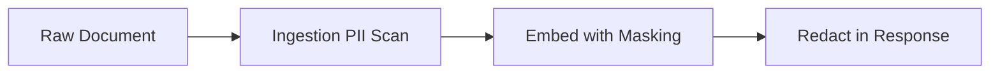

# RAG System Security Reference

## Comprehensive Security Specifications and Guidelines

This reference document provides essential security specifications, guidelines, and implementation patterns for enterprise-grade RAG systems.

---

## Quick Reference: Security Checklist

| Security Control          | Requirement                           | Implementation Location     | Priority |
| ------------------------- | ------------------------------------- | --------------------------- | -------- |
| **Authentication**        | All API endpoints require auth        | Ingress/Service mesh        | Critical |
| **Access Control (ACL)**  | Pre-filter or post-filter permissions | Access Control Service      | Critical |
| **PII Handling**          | Detect and mask sensitive data        | PII Handler Service         | High     |
| **Input Validation**      | Sanitize all user inputs              | Orchestration Layer         | Critical |
| **Output Filtering**      | Remove sensitive info from responses  | Response Formatter          | High     |
| **Audit Logging**         | Immutable logs of all operations      | Audit Logger (WORM storage) | Critical |
| **Rate Limiting**         | Prevent DoS attacks                   | API Gateway / Redis         | High     |
| **Encryption at Rest**    | Encrypt stored vectors/metadata       | Vector DB / S3 configs      | Critical |
| **Encryption in Transit** | TLS for all network communication     | Ingress / Load Balancer     | Critical |

---

## 1. Access Control Architecture

### Pre-filter vs Post-filter Comparison

| Aspect          | Pre-filter ACL                     | Post-filter ACL                     | Hybrid Approach             |
| --------------- | ---------------------------------- | ----------------------------------- | --------------------------- |
| **Performance** | Fast (Redis bitmap check)          | Slow (per-document validation)      | Medium                      |
| **Security**    | High (blocks before lookup)        | Lower (allows unauthorized lookups) | High                        |
| **Flexibility** | Limited (static ACLs)              | High (dynamic policies)             | Medium                      |
| **Use Case**    | Strict compliance (HIPAA, PCI-DSS) | General knowledge base              | Enterprise with mixed needs |

### Implementation Code

```python
"""
access_control_service.py - Access Control Service for RAG
"""
import redis
from typing import List, Set, Dict, Any


class AccessControlService:
    """Enforces per-document access controls in RAG retrieval."""

    def __init__(self, redis_client: redis.Redis):
        self.redis = redis_client
        self.acl_key_prefix = "rag:acl:"
        self.permission_cache_ttl = 300  # 5 minutes

    async def can_access(self, document_id: str, user_id: str) -> bool:
        """Check if user has permission to access document.

        Uses cache-first approach for performance.

        Args:
            document_id: Unique identifier of the document/chunk
            user_id: Authenticated user identifier

        Returns:
            Boolean indicating whether access is permitted
        """
        # Check cache first
        cache_key = f"{self.acl_key_prefix}{document_id}:{user_id}"
        cached_result = await self.redis.get(cache_key)

        if cached_result is not None:
            return cached_result.decode() == "allowed"

        # Fetch document permission from ACL store
        doc_perm_key = f"{self.acl_key_prefix}permission:{document_id}"
        doc_permission = await self.redis.hget(doc_perm_key, "permission_level")

        if not doc_permission:
            return True  # No restriction means public access

        user_groups = await self._get_user_groups(user_id)
        permission_level = doc_permission.decode()

        if permission_level == "public":
            result = "allowed"

        elif permission_level in ["department", "team"]:
            allowed_groups = await self.redis.smembers(
                f"{doc_perm_key}:allowed_groups"
            )
            result = "allowed" if user_id in allowed_groups else "denied"

        elif permission_level == "individual":
            allowed_users = await self.redis.smembers(
                f"{doc_perm_key}:allowed_users"
            )
            result = "allowed" if user_id in allowed_users else "denied"

        # Cache the result
        await self.redis.set(cache_key, result, ex=self.permission_cache_ttl)

        return result == "allowed"

    async def filter_retrieved_documents(
        self,
        document_ids: List[str],
        user_id: str,
        permission_levels: List[str] = None
    ) -> List[str]:
        """Filter retrieved documents by user permissions.

        Use this AFTER vector search returns results to enforce access control.

        Args:
            document_ids: List of IDs returned from vector search
            user_id: Current authenticated user
            permission_levels: Optional whitelist of allowed permission levels

        Returns:
            Filtered list of document IDs that user can access
        """
        filtered = []

        for doc_id in document_ids:
            if await self.can_access(doc_id, user_id):
                # Check permission level whitelist if specified
                if permission_levels is None or permission_levels == ["all"]:
                    filtered.append(doc_id)

        return filtered

    async def _get_user_groups(self, user_id: str) -> Set[str]:
        """Get groups/roles assigned to a user."""
        user_key = f"user:{user_id}:groups"
        return await self.redis.smembers(user_key)


# Pre-filter implementation using Redis bitmaps
class PreFilterACLService:
    """Fast pre-filter ACL using Redis bitmap storage."""

    def __init__(self, redis_client: redis.Redis):
        self.redis = redis_client
        self.acl_bitfield = redis.client.StrictBitField()

    async def initialize_acl(self, acl_data: Dict[str, Set[str]]):
        """Initialize ACL from department-to-users mapping.

        Args:
            acl_data: {department/team: {user_ids}}
        """
        for group, users in acl_data.items():
            bitstring = bytes.fromhex(users.hex())

            await self.redis.execute_command(
                "BITFIELD",
                f"CREATE KEY {self.acl_key_prefix}{group}",
                "TYPE BIT",
                *["GET BY 0", f"Ox{bitstring.hex()}"]
            )

    async def filter_by_group(self,
                              document_ids: List[str],
                              user_group: str) -> List[str]:
        """Return documents accessible to a specific user group.

        Args:
            document_ids: All document IDs in the vector DB
            user_group: User's department/team group

        Returns:
            Filtered list of accessible document IDs
        """
        accessible = []

        for doc_id in document_ids:
            bitstring = await self.redis.get(
                f"{self.acl_key_prefix}{user_group}:{doc_id}"
            )

            if bitstring and int(bitstring) > 0:
                accessible.append(doc_id)

        return accessible
```

---

## 2. PII Handling Specifications

### Multi-Stage PII Processing Pipeline



### Detection Methods Comparison

| Method                       | Accuracy                | Performance | Best Use Case                          |
| ---------------------------- | ----------------------- | ----------- | -------------------------------------- |
| **Regex Patterns**           | Medium (fixed patterns) | Very Fast   | Common PII types (email, phone, SSN)   |
| **Named Entity Recognition** | High (context-aware)    | Medium      | Complex text, domain-specific entities |
| **Hybrid Approach**          | Very High               | Medium-High | Enterprise production systems          |

### Implementation Code

```python
"""
pii_handler.py - PII Detection and Masking for RAG
"""
import re
from typing import List, Dict, Any


class PIIHandler:
    """Handles detection and masking of personally identifiable information."""

    def __init__(self, mode: str = "mask"):
        """
        Args:
            mode: How to handle detected PII
                  - "mask": Replace with tag (e.g., [[PII:EMAIL]])
                  - "hash": Hash the value
                  - "remove": Remove from text entirely
                  - "flag": Add warning annotation
        """
        self.mode = mode

        # Regex patterns for common PII types
        self.patterns = {
            "email": r"\b[A-Za-z0-9._%+-]+@[A-Za-z0-9.-]+\.[A-Z|a-z]{2,}\b",
            "phone_us": r"\(?\d{3}\)?[-.\s]?\d{3}[-.\s]?\d{4}",
            "ssn": r"\b\d{3}[-\s]?\d{2}[-\s]?\d{4}\b",
            "credit_card": r"\b(?:\d[ -]*?){16}\b",
            "ip_address": r"\b(?:(?:25[0-5]|2[0-4][0-9]|[01]?[0-9][0-9]?)\.){3}(?:25[0-5]|2[0-4][0-9]|[01]?[0-9][0-9]?)\b",
            "bitcoin_address": r"bc1[ayiq][a-hJknpstvyAY]{25,62}|1[a-km-zA-HJ-NP-Z0-9]{25,34}",
        }

    async def process_document(
        self,
        text: str,
        mode: str = None
    ) -> Dict[str, Any]:
        """Process a document to handle PII.

        Args:
            text: Raw document text
            mode: How to handle detected PII (defaults to instance config)

        Returns:
            Dict containing masked text and PII detection metadata
        """
        text_to_process = text if mode is None else self.mode

        result = {"masked_text": text, "pii_detected": False}

        for pii_type, pattern in self.patterns.items():
            matches = re.findall(pattern, text)

            if matches:
                result["pii_detected"] = True
                result[pii_type] = len(matches)

                # Apply masking/redaction based on mode
                if self.mode == "mask":
                    mask_str = f"[[PII:{pii_type}]]"
                    for match in matches:
                        text_to_process = text_to_process.replace(
                            match, mask_str, 1
                        )

                elif self.mode == "hash":
                    import hashlib
                    mask_str = f"[[{self._abbreviate(match, 8)}-HASH]]"
                    for match in matches:
                        hash_str = hashlib.sha256(match.encode()).hexdigest()[:8]
                        text_to_process = text_to_process.replace(
                            match, mask_str, 1
                        )

                elif self.mode == "remove":
                    for match in reversed(matches):
                        text_to_process = text_to_process.replace(match, "")

        result["masked_text"] = text_to_process

        return result

    def _abbreviate(self, value: str, length: int = 8) -> str:
        """Abbreviate a value for display."""
        if len(value) <= length:
            return value
        return value[:length - 3] + "..."
```

### PII Policy Configuration

```yaml
# pii_policy.yaml - PII handling configuration
pii_handling:
  enabled: true

  detection_mode:
    strategy: "hybrid" # regex-only | ner-only | hybrid
    sensitive_fields:
      - ssn
      - credit_card
      - phone
      - email
      - address
      - ip_address

  action_on_detection:
    ingest: "mask" # mask | hash | remove
    retrieval: "flag" # flag for user attention
    display: "mask-with-tag" # mask-with-tag | show-original

  redaction_format: "[[PII:{TYPE}]]"

  pii_categories:
    name_pii:
      action: "flag" # Don't remove names (affects content quality)
      pattern_type: "ner"

    contact_info:
      action: "mask"
      pattern_type: "regex"

    financial_info:
      action: "remove"
      pattern_type: "regex"

    location_info:
      action: "mask"
      pattern_type: "hybrid"
```

---

## 3. Audit Logging Specifications

### Immutable Audit Log Structure

| Field              | Type               | Description                         | Retention (Days) |
| ------------------ | ------------------ | ----------------------------------- | ---------------- | -------- | ----- |
| log_id             | string (SHA16)     | Unique identifier for deduplication | N/A              |
| timestamp          | datetime (ISO8601) | UTC timestamp of operation          | 365              |
| operation_type     | enum               | query                               | retrieve         | generate | error |
| request_hash       | string (SHA256)    | Hash for content-addressed storage  | 365              |
| user_id            | string             | Requester identifier (optional)     | 730              |
| documents_accessed | list[string]       | Document IDs accessed               | 365              |
| latency_ms         | integer            | Response time in milliseconds       | 90               |
| error              | string             | Error message if any                | 90               |
| response_hash      | string (SHA256)    | Hash of generated response          | 180              |

### Implementation Code

```python
"""
audit_logger.py - Immutable audit logging for RAG compliance
"""
import hashlib
import json
import time
from typing import Dict, Any


class AuditLogger:
    """Implements immutable audit logging for compliance requirements."""

    def __init__(self, storage_backend):
        """
        Args:
            storage_backend: Write-once storage (S3 with Object Lock, WORM)
        """
        self.storage = storage_backend
        self.log_prefix = "audit/"

    def generate_request_hash(self, request_data: Dict[str, Any]) -> str:
        """Generate content hash for deduplication.

        Uses normalized query to avoid storing full query text.
        """
        # Normalize query for hashing (lowercase, remove extra spaces)
        normalized_query = " ".join(
            request_data.get("query", "").split()
        ).lower()[:100]  # First 100 words

        return hashlib.sha256(
            f"{normalized_query}:{request_data.get('timestamp', '')}".encode()
        ).hexdigest()

    async def log_operation(self, operation: Dict[str, Any]) -> str:
        """Log a RAG operation to immutable audit store.

        Args:
            operation: Dict containing:
                - operation_type: "query", "retrieve", "generate", "error"
                - request_hash: SHA256 hash for dedup
                - timestamp: ISO 8601 timestamp
                - user_id: Requester identifier (optional)
                - documents_accessed: List of document IDs
                - latency_ms: Operation duration
                - error: Error message if any
                - response_hash: Hash of generated response

        Returns:
            Log entry ID (truncated hash for reference)
        """
        # Create log entry with required fields
        log_entry = {
            "timestamp": time.strftime("%Y-%m-%dT%H:%M:%SZ",
                                      time.gmtime(time.time())),
            "operation_type": operation.get("operation_type"),
            "request_hash": operation.get("request_hash"),
            "user_id": operation.get("user_id"),
            "documents_accessed": operation.get("documents_accessed", []),
            "latency_ms": operation.get("latency_ms"),
            "error": operation.get("error"),
            "response_hash": operation.get("response_hash")
        }

        # Serialize and write (write-once to storage)
        log_json = json.dumps(log_entry, sort_keys=True)

        log_id = hashlib.sha256(log_json.encode()).hexdigest()[:16]

        await self.storage.write(
            f"{self.log_prefix}{log_id}",
            log_json,
            metadata={
                "content-type": "application/json",
                "x-amz-server-side-encryption": "AES256",
                "x-amz-object-lock-mode": "COMPLIANCE"  # WORM storage
            }
        )

        return log_id

    async def query_audit_logs(
        self,
        start_date: str,
        end_date: str,
        operation_type: str = None,
        document_ids: list = None
    ) -> list:
        """Query audit logs for compliance review.

        Args:
            start_date: Start date (ISO 8601)
            end_date: End date (ISO 8601)
            operation_type: Filter by operation type
            document_ids: Filter by specific documents

        Returns:
            List of log entries matching criteria
        """
        # Implementation depends on storage backend
        # For S3 with AWS Lambda: query via Lambda function
        # For PostgreSQL: run SQL query
        pass
```

### Audit Log Compliance Checklist

| Requirement                | Implementation Status         | Evidence Location         |
| -------------------------- | ----------------------------- | ------------------------- |
| **Who accessed data**      | user_id field in logs         | ./audit/ directory        |
| **When access occurred**   | timestamp field (UTC)         | All log entries           |
| **What was accessed**      | documents_accessed array      | All log entries           |
| **Request hash for dedup** | request_hash field            | All log entries           |
| **Encryption at rest**     | AES256 encryption             | Storage configuration     |
| **Immutability**           | WORM storage / S3 Object Lock | Storage bucket policy     |
| **Retention compliance**   | Automated rotation scripts    | ./tools/audit_rotation.sh |

---

## 4. Rate Limiting and Throttling

### Token Bucket Implementation

```python
"""
rate_limiter.py - Token-based rate limiting for RAG API
"""
import time


class TokenBucketRateLimiter:
    """Implements token bucket algorithm for rate limiting."""

    def __init__(self,
                 tokens_per_second: float = 10.0,
                 burst_capacity: int = 100):
        self.tokens_per_second = tokens_per_second
        self.burst_capacity = burst_capacity
        self.buckets = {}  # key -> (tokens, last_update_time)

    def _get_bucket(self, key: str) -> tuple:
        """Get or create bucket for key."""
        if key not in self.buckets:
            self.buckets[key] = (self.burst_capacity, time.time())

        # Refill tokens based on elapsed time
        current_tokens, last_update = self.buckets[key]
        elapsed = time.time() - last_update

        tokens_to_add = elapsed * self.tokens_per_second
        new_tokens = min(self.burst_capacity, current_tokens + tokens_to_add)

        return new_tokens, last_update

    async def acquire(self, key: str, cost: int = 1) -> bool:
        """Acquire permission for request.

        Args:
            key: Identifier (user_id or client_ip)
            cost: Tokens to consume

        Returns:
            True if request allowed, False if rate limited
        """
        tokens, _ = self._get_bucket(key)

        if tokens >= cost:
            # Consume tokens
            self.buckets[key] = (tokens - cost, time.time())
            return True

        return False

    def get_remaining(self, key: str) -> float:
        """Get remaining tokens for key."""
        tokens, _ = self._get_bucket(key)
        return tokens


# Rate limiting middleware for FastAPI
from fastapi import Request
from fastapi.responses import JSONResponse


async def rate_limit_middleware(request: Request, limiter: TokenBucketRateLimiter):
    """FastAPI middleware for rate limiting."""
    client_ip = request.client.host

    if not await limiter.acquire(client_ip):
        return JSONResponse(
            status_code=429,
            content={"detail": "Rate limit exceeded. Please try again later."}
        )

    # Continue to actual handler
    pass
```

### Circuit Breaker Implementation

```python
"""
circuit_breaker.py - Circuit breaker for external service resilience
"""
import time
from enum import Enum


class State(Enum):
    CLOSED = "closed"      # Normal operation
    OPEN = "open"          # Rejecting requests
    HALF_OPEN = "half_open"  # Testing if service recovered


class CircuitBreaker:
    """Circuit breaker for external API calls (embedding, LLM, reranking)."""

    def __init__(self,
                 failure_threshold: int = 5,
                 recovery_timeout: float = 30.0,
                 half_open_max_calls: int = 3):
        self.failure_threshold = failure_threshold
        self.recovery_timeout = recovery_timeout
        self.half_open_max_calls = half_open_max_calls

        self.state = State.CLOSED
        self.failure_count = 0
        self.last_failure_time = None
        self.success_count = 0

    async def can_execute(self) -> bool:
        """Check if request should be allowed."""
        if self.state == State.HALF_OPEN:
            if self.success_count < self.half_open_max_calls:
                self.success_count += 1
                return True
            else:
                # Failed half-open test, open circuit again
                self.state = State.OPEN
                self.failure_count = 0
                return False

        if self.state == State.OPEN:
            if time.time() - self.last_failure_time >= self.recovery_timeout:
                # Try half-open state
                self.state = State.HALF_OPEN
                self.failure_count = 0
                self.success_count = 0
                return True
            return False

        return True

    def record_success(self):
        """Record successful call."""
        if self.state == State.HALF_OPEN:
            self.success_count += 1
            if self.success_count >= self.half_open_max_calls:
                self.state = State.CLOSED
                self.failure_count = 0
        else:
            self.failure_count = max(0, self.failure_count - 1)

    def record_failure(self):
        """Record failed call."""
        self.failure_count += 1
        self.last_failure_time = time.time()

        if self.state == State.HALF_OPEN:
            # Failed half-open test
            self.state = State.OPEN
            self.failure_count = 0

    @property
    def state_description(self) -> str:
        """Get human-readable state."""
        states = {
            State.CLOSED: "Normal - accepting requests",
            State.OPEN: f"Tripped - rejecting requests (timeout: {self.recovery_timeout}s)",
            State.HALF_OPEN: "Testing - allowing limited requests"
        }
        return states.get(self.state, str(self.state))
```

---

## 5. Encryption Specifications

### Data at Rest Encryption

| Data Type                | Encryption Standard       | Key Management                 | Compliance Mapping |
| ------------------------ | ------------------------- | ------------------------------ | ------------------ |
| **Vector embeddings**    | AES-256-GCM               | KMS-managed keys               | SOC2, ISO 27001    |
| **Metadata (documents)** | AES-256-CBC               | KMS-managed keys               | SOC2, HIPAA        |
| **Audit logs**           | AES-256-GCM + S3 SSE-KMS  | AWS KMS / Azure Key Vault      | PCI-DSS, HIPAA     |
| **User credentials**     | PBKDF2 with 2048-bit salt | Hardware Security Module (HSM) | GDPR, CCPA         |

### Encryption Configuration Example

```yaml
# encryption-config.yaml - Encryption configuration
encryption:
  at_rest:
    vector_database:
      algorithm: "AES-256-CBC"
      key_rotation_days: 30
      kms_key_id: "arn:aws:kms:us-east-1:123456789012:key/abcd-1234"

    audit_logs:
      algorithm: "AES-256-GCM"
      kms_enabled: true
      object_lock_enabled: true # WORM

    embeddings:
      encrypted: true # Note: Embeddings are vectors, but metadata is encrypted
      key_derivation: "PBKDF2-SHA256"

  in_transit:
    min_tls_version: "1.2"
    cipher_suites:
      - "TLS_ECDHE_RSA_WITH_AES_256_GCM_SHA384"
      - "TLS_ECDHE_RSA_WITH_AES_128_GCM_SHA256"

    certificate_authority:
      type: "AWS Certificate Manager"
      arn: "arn:aws:acm:us-east-1:123456789012:certificate/..."

  key_management:
    provider: "AWS KMS"
    rotation_enabled: true
    rotation_days: 90
    multi_region_backup: false

    hsm_integration:
      enabled: true
      region: "us-east-1"
```

---

## Security Architecture Summary

### Threat Model Coverage

| Threat Vector                  | Mitigation Strategy                   | Controls Implemented            |
| ------------------------------ | ------------------------------------- | ------------------------------- |
| **Unauthorized access**        | Authentication + ACL pre-filter       | JWT auth + Redis ACL store      |
| **Data leakage via citations** | PII masking + document fingerprinting | PII handler service             |
| **Prompt injection**           | Input sanitization + output filtering | FastAPI middleware layers       |
| **Denial of service**          | Rate limiting + circuit breakers      | Token bucket + breaker patterns |
| **Audit log tampering**        | Write-once storage + hashing          | S3 Object Lock / WORM           |
| **Credential theft**           | Least privilege RBAC + encryption     | IAM roles + KMS integration     |

### Compliance Mapping Table

| Regulation  | RAG Implementation Requirement     | Components Involved              |
| ----------- | ---------------------------------- | -------------------------------- |
| **GDPR**    | Right to erasure, data portability | ACL deletion API + audit logging |
| **CCPA**    | Consumer privacy rights            | PII masking + access control     |
| **HIPAA**   | Protected health information       | Encryption + audit trails        |
| **SOC2**    | Access controls, monitoring        | All security controls above      |
| **PCI-DSS** | Cardholder data protection         | Strict PII redaction             |
