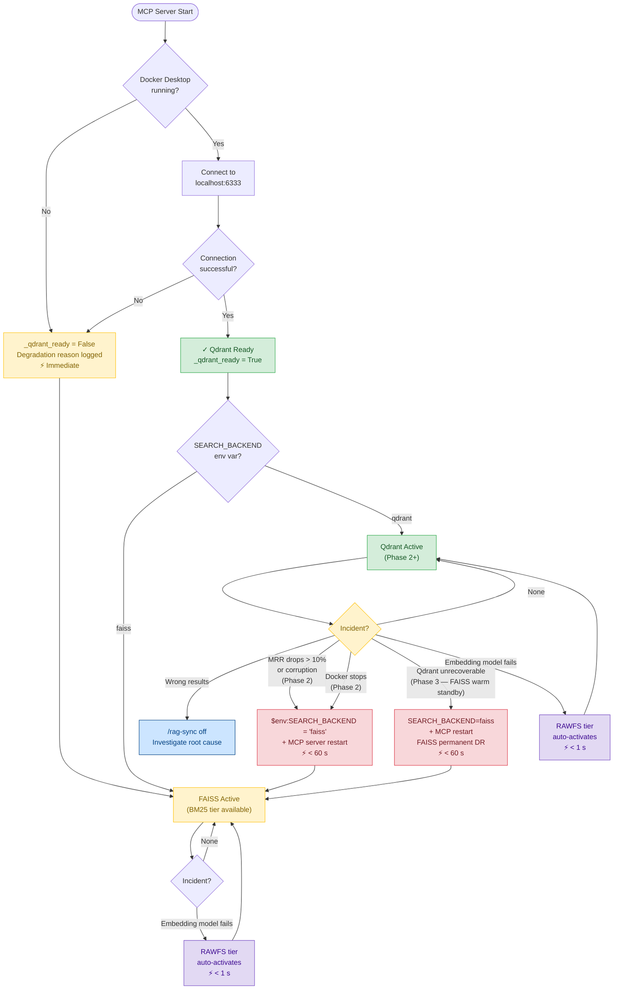

# RAG Disaster Recovery System — UML Flowchart

**Document Type:** Architecture Diagram
**Investigation:** `2026-06-25-qdrant-migration-plan`
**Author:** Dr. Elias Vance — CC-00 Laboratory Director
**Date:** 2026-06-25
**Status:** Active

---

## Overview

This diagram captures the full DR decision tree for the `workspace-knowledge` MCP server RAG
layer across all four migration phases. Two entry axes are modelled:

1. **Startup path** — what happens when the MCP server initialises and Docker is (or is not)
   running
2. **Runtime incident path** — which DR action applies for each failure scenario, keyed by
   migration phase

---

## Flowchart

---

## Node Legend

| Node                         | Description                                                                                                 |
| ---------------------------- | ----------------------------------------------------------------------------------------------------------- |
| `BOOT`                       | MCP server process starts (Claude Code session or manual restart)                                           |
| `D1 — Docker running?`       | Checked by `_init_qdrant()` try/except at startup                                                           |
| `FB — _qdrant_ready = False` | Graceful fallback; `_degradation_reason` set; no crash                                                      |
| `D3 — SEARCH_BACKEND`        | Env var read at startup from `.mcp.json` or `$env:SEARCH_BACKEND`                                           |
| `FM — FAISS Active`          | FAISS + BM25 hybrid; self-heals from corpus via mtime detection                                             |
| `QM — Qdrant Active`         | Qdrant Docker + BM25 hybrid; Phase 2+                                                                       |
| `RB12 — Phase 2 rollback`    | Single env var change + MCP restart; FAISS primary restored in < 60 s                                       |
| `RB3 — Phase 3 rollback`     | FAISS permanently retained as warm DR standby; `SEARCH_BACKEND=faiss` + restart; FAISS self-heals via mtime |
| `RFS1/RFS2 — RAWFS`          | Existing three-tier degradation fallback; keyword search over raw files                                     |
| `INV — Investigate`          | `/rag-sync off` halts H-RAG02 auto-updates; manual root-cause analysis                                      |

---

## Recovery Time Summary

| Scenario                      | Phase | Recovery action                                            | Time                                      |
| ----------------------------- | ----- | ---------------------------------------------------------- | ----------------------------------------- |
| Docker not running at startup | Any   | `_init_qdrant` fallback → FAISS                            | Immediate                                 |
| Qdrant wrong results          | 2     | `/rag-sync off` + investigate                              | < 1 min                                   |
| MRR drops > 10%               | 2     | `SEARCH_BACKEND=faiss` + restart                           | < 60 s                                    |
| Qdrant collection corrupted   | 2     | `SEARCH_BACKEND=faiss` + restart                           | < 60 s                                    |
| Docker container stops        | 2     | `SEARCH_BACKEND=faiss` + restart                           | < 60 s                                    |
| Qdrant unrecoverable          | 3     | `SEARCH_BACKEND=faiss` + restart (FAISS permanent standby) | < 60 s (index on disk); 2–5 min (rebuild) |
| Embedding model fails         | Any   | RAWFS tier auto-activates                                  | < 1 s                                     |

---

**Cross-reference:** `01-migration-strategy.md` §5 — Disaster Recovery and Rollback Procedure
**Cross-reference:** `02-deployment-guide.md` §8 — MCP Server Restart Procedure
