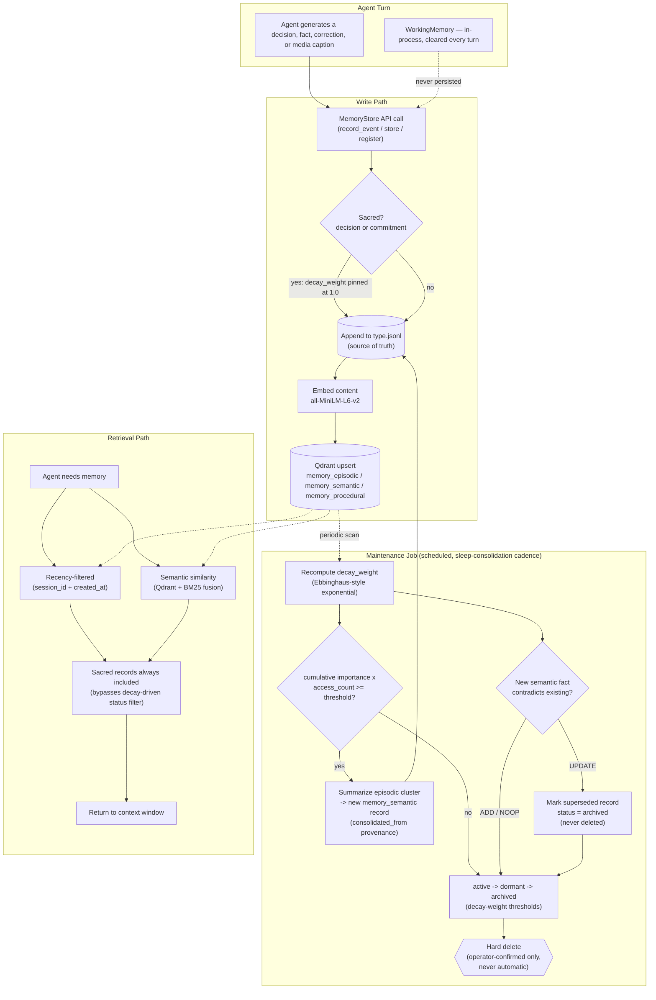
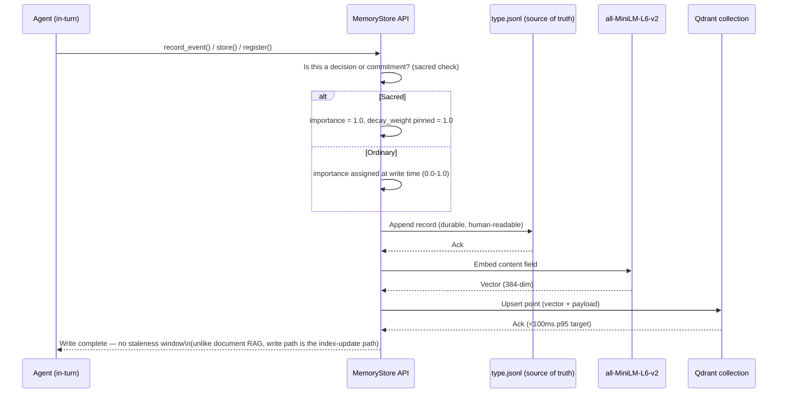
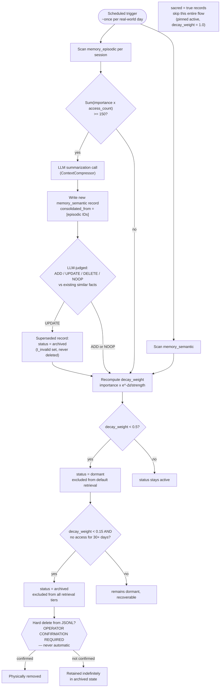

# Workflow Diagrams — Persistent Agent Memory System

> **Core Component 00 — Cross-Module Programme (Context Engineering × Retrieval-Augmented Generation)**
> **Parent Report:** `../research-report.md`
> **Audience:** Visual reference for the CEO and implementing engineers — read after
> `06-self-review-and-evaluation.md`, or first if a visual overview is wanted before the prose.
> **Last Updated:** 2026-07-10
> **Convention:** Follows the Mermaid diagram style established in
> `retrieval-augmented-generation/architecture/diagrams.md` — no new diagramming convention
> introduced.

---

## 1. End-to-End Memory Workflow (Overview)

---

## 2. Write Path Detail (Sequence)

---

## 3. Maintenance Job Detail (Decay, Consolidation, Forgetting)

---

## Diagram Usage Guide

| Use Case                                                        | Recommended Diagram       |
| --------------------------------------------------------------- | ------------------------- |
| Presenting the system to the CEO / non-implementing stakeholder | #1 End-to-End Overview    |
| Implementing the `MemoryStore` write-through integration        | #2 Write Path Detail      |
| Implementing the scheduled maintenance/decay job                | #3 Maintenance Job Detail |

These diagrams are a visual complement to the prose specification — they do not introduce any
mechanism not already documented in `01-technical-options.md`, `02-deployment-guidelines.md`, and
`03-forgetting-strategy.md`. Where a diagram and the prose ever appear to disagree after a future
edit, the prose documents remain authoritative, consistent with this workspace's general
precedence rule that visual/summary artifacts may lag their canonical source
(`CLAUDE.md` §5, Document precedence when sources conflict).

---

**Maintained by:** Core Component 00 Laboratory
**Laboratory Director:** Dr. Elias Vance
**Executing Engineers:** Mei-Ling Zhao (Context Engineering), Sofia Almeida & Diego Fontán (RAG)
