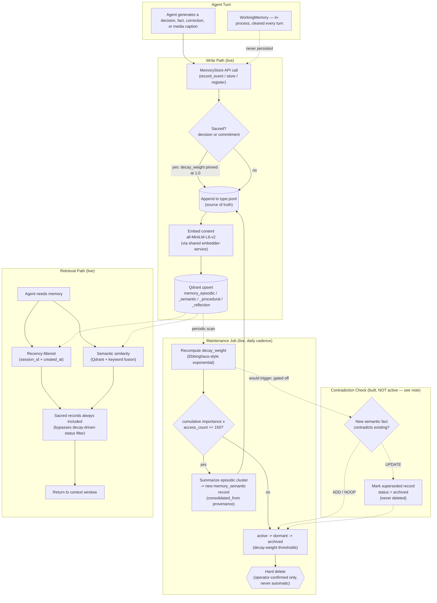
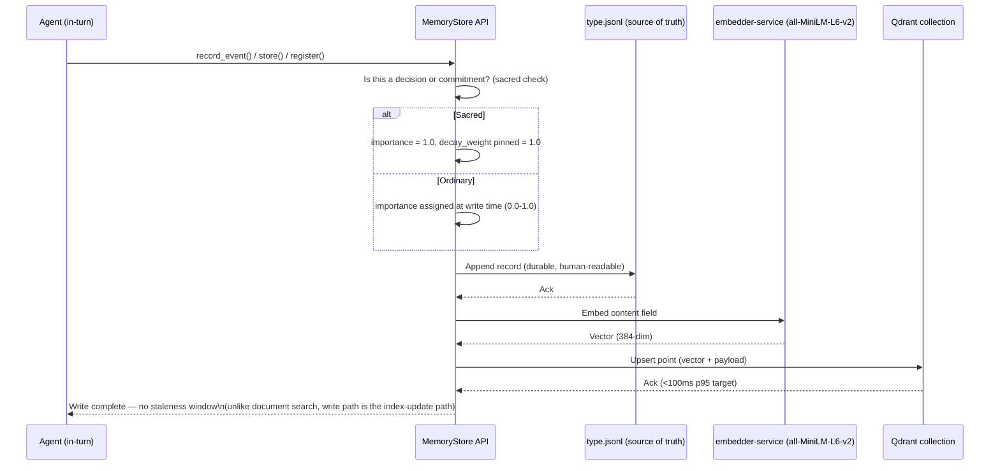
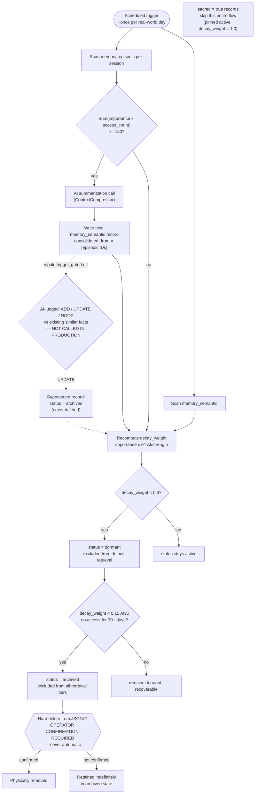
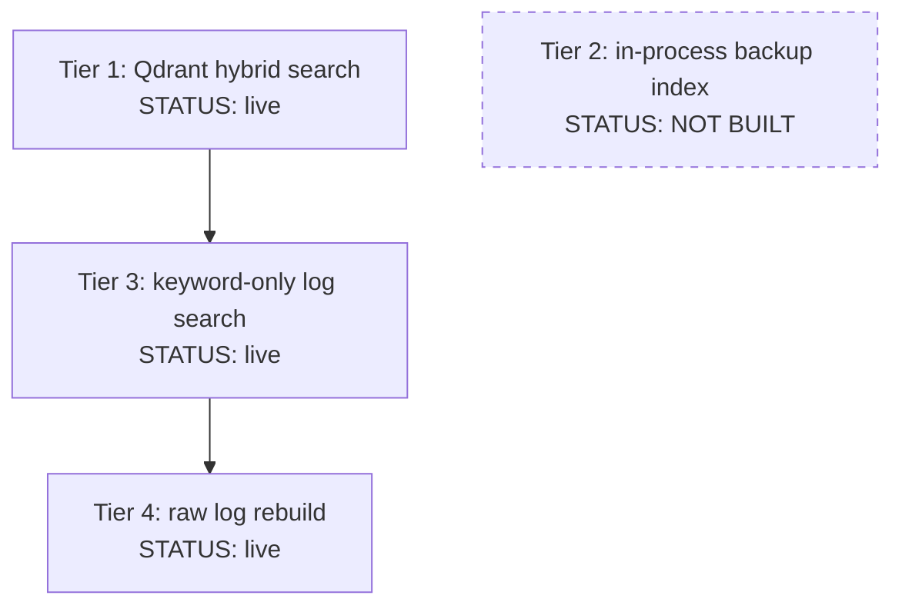

# Workflow Diagrams — Persistent Agent Memory System

> **Core Component 00 — Cross-Module Programme (Context Engineering × Retrieval-Augmented Generation)**
> **Parent Report:** [research-report.md](core-component-00/telescope/2026-07-10-agent-memory-architecture/research-report.md)
> **Audience:** A visual reference for anyone — technical or not — who wants to see the shape of
> the system before reading the prose specs.
> **Last Updated:** 2026-08-10
> **Convention:** Follows the diagram style already used elsewhere in the RAG module — no new
> diagramming convention introduced.

---

## 1. End-to-End Memory Workflow (Overview)

```mermaid
graph TB
    subgraph "Agent Turn"
        AgentAction[Agent generates a decision, fact, correction, or media caption]
        WorkingMem[WorkingMemory — in-process, cleared every turn]
    end

    subgraph "Write Path (live)"
        MemStoreCall["MemoryStore API call\n(record_event / store / register)"]
        SacredCheck{Sacred?\ndecision or commitment}
        JSONLAppend[("Append to type.jsonl\n(source of truth)")]
        Embed["Embed content\nall-MiniLM-L6-v2\n(via shared embedder-service)"]
        QdrantUpsert[("Qdrant upsert\nmemory_episodic / _semantic / _procedural / _reflection")]
    end

    subgraph "Maintenance Job (live, daily cadence)"
        DecayRecompute["Recompute decay_weight\n(Ebbinghaus-style exponential)"]
        ConsolidationCheck{"cumulative importance x\naccess_count >= 150?"}
        Consolidate["Summarize episodic cluster\n-> new memory_semantic record\n(consolidated_from provenance)"]
        StatusTransition["active -> dormant -> archived\n(decay-weight thresholds)"]
        ManualGC{{"Hard delete\n(operator-confirmed only,\nnever automatic)"}}
    end

    subgraph "Contradiction Check (built, NOT active — see note)"
        ContradictionCheck{"New semantic fact\ncontradicts existing?"}
        Invalidate["Mark superseded record\nstatus = archived\n(never deleted)"]
    end

    subgraph "Retrieval Path (live)"
        Query[Agent needs memory]
        RecencyFilter["Recency-filtered\n(session_id + created_at)"]
        SemanticSearch["Semantic similarity\n(Qdrant + keyword fusion)"]
        SacredMerge["Sacred records always included\n(bypasses decay-driven status filter)"]
        Return[Return to context window]
    end

    AgentAction --> MemStoreCall
    WorkingMem -.never persisted.-> MemStoreCall
    MemStoreCall --> SacredCheck
    SacredCheck -->|yes: decay_weight pinned at 1.0| JSONLAppend
    SacredCheck -->|no| JSONLAppend
    JSONLAppend --> Embed
    Embed --> QdrantUpsert

    QdrantUpsert -.periodic scan.-> DecayRecompute
    DecayRecompute --> ConsolidationCheck
    ConsolidationCheck -->|yes| Consolidate
    Consolidate --> JSONLAppend
    ConsolidationCheck -->|no| StatusTransition
    DecayRecompute -.would trigger, gated off.-> ContradictionCheck
    ContradictionCheck -.UPDATE.-> Invalidate
    ContradictionCheck -.ADD / NOOP.-> StatusTransition
    Invalidate -.-> StatusTransition
    StatusTransition --> ManualGC

    Query --> RecencyFilter
    Query --> SemanticSearch
    RecencyFilter --> SacredMerge
    SemanticSearch --> SacredMerge
    QdrantUpsert -.-> RecencyFilter
    QdrantUpsert -.-> SemanticSearch
    SacredMerge --> Return
```

**Reading the dashed lines:** every solid path in this diagram runs in production today. The
dashed "Contradiction Check" subgraph is real, tested code — it's just never called, because a
2026-07-12 safety test found it flagged new, unrelated facts as conflicts 100% of the time. See
[03-forgetting-strategy.md](03-forgetting-strategy.md) § 5.1 for the full story and what has to happen before it's switched
on.

---

## 2. Write Path Detail (Sequence)

```mermaid
sequenceDiagram
    participant Agent as Agent (in-turn)
    participant MS as MemoryStore API
    participant Log as type.jsonl (source of truth)
    participant Embedder as embedder-service (all-MiniLM-L6-v2)
    participant Qdrant as Qdrant collection

    Agent->>MS: record_event() / store() / register()
    MS->>MS: Is this a decision or commitment? (sacred check)
    alt Sacred
        MS->>MS: importance = 1.0, decay_weight pinned = 1.0
    else Ordinary
        MS->>MS: importance assigned at write time (0.0-1.0)
    end
    MS->>Log: Append record (durable, human-readable)
    Log-->>MS: Ack
    MS->>Embedder: Embed content field
    Embedder-->>MS: Vector (384-dim)
    MS->>Qdrant: Upsert point (vector + payload)
    Qdrant-->>MS: Ack (<100ms p95 target)
    MS-->>Agent: Write complete — no staleness window\n(unlike document search, write path is the index-update path)
```

This diagram is unchanged from the original design — the write path was confirmed to work exactly
as specified during the 2026-08-10 audit, aside from embedding now routing through the shared
`embedder-service` process rather than loading the model directly (a performance detail, not a
behavior change — see [01-technical-options.md](01-technical-options.md) § 4).

---

## 3. Maintenance Job Detail (Decay, Consolidation, Forgetting)

```mermaid
graph TD
    Trigger([Scheduled trigger\n~once per real-world day]) --> ScanEpisodic[Scan memory_episodic per session]
    Trigger --> ScanSemantic[Scan memory_semantic]

    ScanEpisodic --> ImportanceSum{"Sum(importance x access_count)\n>= 150?"}
    ImportanceSum -->|yes| LLMSummarize["AI summarization call\n(ContextCompressor)"]
    LLMSummarize --> NewSemantic["Write new memory_semantic record\nconsolidated_from = [episodic IDs]"]
    ImportanceSum -->|no| DecayStep

    NewSemantic -.would trigger, gated off.-> ContradictionJudge{"AI-judged: ADD / UPDATE / NOOP\nvs existing similar facts\n— NOT CALLED IN PRODUCTION"}
    ContradictionJudge -.UPDATE.-> InvalidateOld["Superseded record:\nstatus = archived\n(never deleted)"]
    NewSemantic --> DecayStep

    ScanSemantic --> DecayStep[Recompute decay_weight\nimportance x e^-Δt/strength]
    InvalidateOld -.-> DecayStep

    DecayStep --> DormantCheck{decay_weight < 0.5?}
    DormantCheck -->|yes| MarkDormant[status = dormant\nexcluded from default retrieval]
    DormantCheck -->|no| StayActive[status stays active]

    MarkDormant --> ArchiveCheck{"decay_weight < 0.15 AND\nno access for 30+ days?"}
    ArchiveCheck -->|yes| MarkArchived[status = archived\nexcluded from all retrieval tiers]
    ArchiveCheck -->|no| StayDormant[remains dormant, recoverable]

    MarkArchived --> GCGate{{"Hard delete from JSONL?\nOPERATOR CONFIRMATION REQUIRED\n— never automatic"}}
    GCGate -->|confirmed| Purge[Physically removed]
    GCGate -->|not confirmed| Retained[Retained indefinitely\nin archived state]

    SacredNote["sacred = true records\nskip this entire flow\n(pinned active, decay_weight = 1.0)"]
```

**What actually runs today:** the decay recompute, consolidation, and status-transition steps
(solid lines) run on the daily maintenance cadence exactly as designed. The contradiction-judgment
step (dashed) exists in code but is gated behind a confirmation flag that has deliberately not been
set — see § 1 above and [03-forgetting-strategy.md](03-forgetting-strategy.md) § 5.1.

---

## 4. Disaster-Recovery Fallback Stack — What's Actually Built

```mermaid
graph TD
    Primary["Tier 1: Qdrant hybrid search\nSTATUS: live"] --> Tier3["Tier 3: keyword-only log search\nSTATUS: live"]
    Tier3 --> LastResort["Tier 4: raw log rebuild\nSTATUS: live"]

    NotBuilt1["Tier 2: in-process backup index\nSTATUS: NOT BUILT"]

    style NotBuilt1 stroke-dasharray: 5 5
```

See [05-disaster-recovery-and-resilience.md](05-disaster-recovery-and-resilience.md) § 3 for the full narrative.

---

## Diagram Usage Guide

| Use Case                                                              | Recommended Diagram                  |
| --------------------------------------------------------------------- | ------------------------------------ |
| Presenting the system to the CEO or another non-implementing reader   | # 1 End-to-End Overview              |
| Implementing or reviewing the `MemoryStore` write-through integration | # 2 Write Path Detail                |
| Implementing or reviewing the scheduled maintenance/decay job         | # 3 Maintenance Job Detail           |
| Understanding what actually happens if Qdrant becomes unreachable     | # 4 Disaster-Recovery Fallback Stack |

These diagrams are a visual companion to the prose specs — they don't introduce any mechanism not
already documented in [01-technical-options.md](01-technical-options.md), [02-deployment-guidelines.md](02-deployment-guidelines.md),
[03-forgetting-strategy.md](03-forgetting-strategy.md), and [05-disaster-recovery-and-resilience.md](05-disaster-recovery-and-resilience.md). Where a diagram and the
prose ever seem to disagree after a future edit, the prose remains authoritative, per this
workspace's general rule that visual/summary artifacts may lag their canonical source.

---

**Maintained by:** Core Component 00 Laboratory
**Laboratory Director:** Dr. Elias Vance
**Executing Engineers:** Mei-Ling Zhao (Context Engineering), Sofia Almeida & Diego Fontán (RAG)
