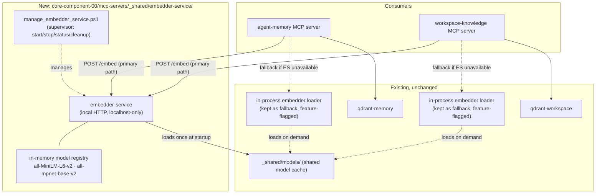
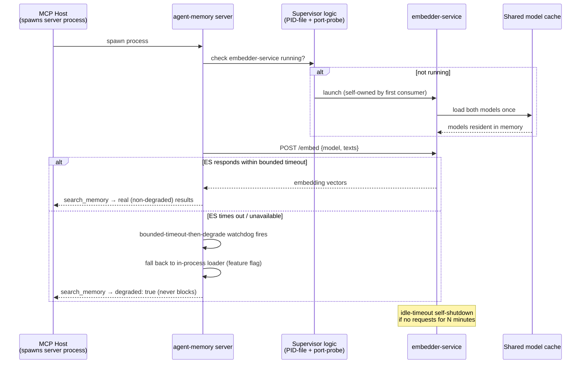
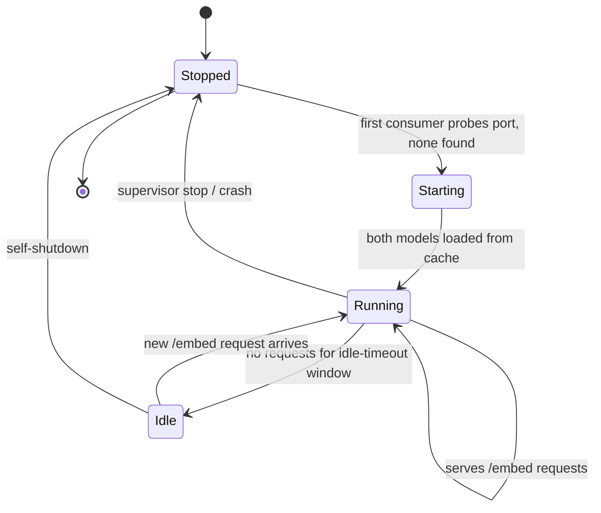
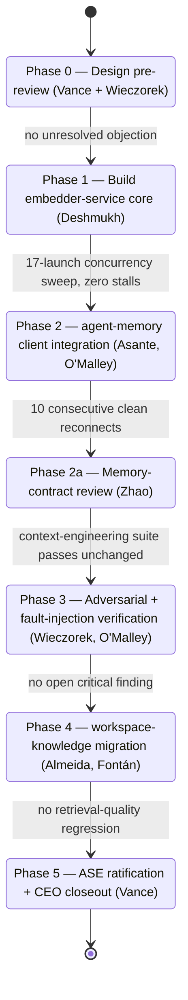

# Implementation Plan — Persistent Embedder Service

**Parent report:** `../research-report.md`
**Author:** Dr. Elias Vance, Laboratory Director
**Date:** 2026-07-13
**Status:** Implementation complete (2026-07-14) — Conditional ASE verdict, see §10 Closeout Review

---

## 1. Authorization

The CEO has entrusted Dr. Vance with full responsibility for this matter, including personnel
assignment. The two blocker decisions the parent report left open for the CEO are resolved below
under that delegated authority — not deferred further. Implementation begins only after the CEO
reviews this plan and signs off; nothing in this document authorizes work to start.

---

## 2. Blocker Decisions (resolved)

### 2.1 Service lifecycle ownership

**Decision:** Launched-and-owned by the first MCP server that needs it, with a lightweight
supervisor pattern to close the "hardest to get right" shutdown-ownership gap the parent report
flagged:

- PID-file + port-probe on startup — a server that needs the embedder checks whether it's already
  running before spawning it, preventing duplicate launches.
- Idle-timeout self-shutdown inside the embedder service itself (no external process needs to
  remember to stop it).
- A small `manage_embedder_service.ps1` supervisor script for manual start/stop/status and orphan
  cleanup, given this session's own repeated experience with orphaned `agent-memory` processes.

Rejected the OS-level scheduled/login-trigger option (adds a permanent always-running background
process independent of whether any server needs it — the wrong default given we're already
managing orphan risk with two servers). Rejected pure manual-start (silently regresses to today's
status quo if forgotten, with no signal that it happened).

### 2.2 Shared vs. isolated embedder service

**Decision:** One shared service, hosting both `all-MiniLM-L6-v2` and `all-mpnet-base-v2` side by
side, namespaced by model slug.

The `qdrant-memory` / `qdrant-workspace` split this report's blast-radius question referenced was
about isolating **mutable tenant data** — an actual leakage vector. The embedder service holds no
tenant data at all: it loads public, static model weights and performs stateless inference. There
is no cross-tenant data-leakage vector for isolation to protect against, so that precedent does not
transfer. Splitting it would only double the new-process surface the parent report already flagged
as a real cost, for no corresponding safety benefit.

---

## 3. Architecture

- New component: `core-component-00/mcp-servers/_shared/embedder-service/`
- Local HTTP service (matching the existing Qdrant-over-HTTP precedent already in this codebase),
  bound to localhost only.
- Applies the `NO_PROXY` lesson from
  `core-component-00/telescope/2026-07-10-agent-memory-architecture/supporting/02-deployment-guidelines.md`
  §1.1 from day one — not retrofitted after a failure.
- Loads both models once at startup from the existing shared cache
  (`core-component-00/mcp-servers/_shared/models/`) — no change to how models are provisioned.
- Endpoints: `POST /embed {model, texts[]}`, `GET /health`.
- `agent-memory` and `workspace-knowledge` gain a thin HTTP client with the same
  bounded-timeout-then-degrade contract as the existing `_call_with_hard_timeout` Qdrant watchdog —
  reusing the pattern, not inventing a new one.
- The current in-process loader is kept as an automatic fallback behind a feature flag throughout
  the migration — the degrade-never-block guarantee is never weakened at any phase.

---

## 4. Phased Plan

| Phase | Work                                                                                          | Owner(s)                                                                     | Gate / Acceptance Criteria                                                                                                 |
| ----- | --------------------------------------------------------------------------------------------- | ---------------------------------------------------------------------------- | -------------------------------------------------------------------------------------------------------------------------- |
| 0     | Design pre-review — confirm architecture against ASE and flag attack surface before any code  | Dr. Vance + Dr. Wieczorek                                                    | Wieczorek's pre-build review raises no unresolved objection                                                                |
| 1     | Build `embedder-service` core: process, both-model loading, `/embed` + `/health`, NO_PROXY    | Ravi Deshmukh (harness patterns consulted with Kwame Asante)                 | Service starts cleanly, serves both models, survives 17-launch concurrency sweep (repeat of Round-2 test) with zero stalls |
| 2     | `agent-memory` client integration behind feature flag; in-process loader kept as fallback     | Kwame Asante (client hardening) + Connor O'Malley (recovery-path tests)      | `search_memory` returns non-degraded results across 10 consecutive host-launched `/mcp reconnect` cycles, zero stalls      |
| 2a    | Memory-contract regression check — confirm no change to `memory_store.py` read/write behavior | Mei-Ling Zhao (review only)                                                  | Existing context-engineering test suite passes unchanged                                                                   |
| 3     | Independent adversarial evaluation of the new always-on listener + fault-injection suite      | Dr. Tomasz Wieczorek (adversarial audit) + Connor O'Malley (fault injection) | No critical finding open; simulated embedder-service crash/restart still degrades cleanly, never blocks                    |
| 4     | `workspace-knowledge` migration, once `agent-memory` is proven in Phase 2–3                   | Sofia Almeida (lead) + Diego Fontán (pipeline ops)                           | Retrieval quality (BM25 + fusion) shows no regression vs. pre-migration baseline                                           |
| 5     | ASE compliance ratification, orphan-process regression pass, CEO closeout report              | Dr. Vance                                                                    | Ratified; repeated start/stop cycles show no new orphaned-process count vs. today's baseline                               |

Rough effort: ~3 sessions total (Phase 0 partial session; Phases 1–2 the bulk; Phase 3 runs
partially in parallel with tail of Phase 2; Phase 4 only proceeds after Phase 3 gate clears).

Personnel not assigned above (Dr. Idris Farouk, Amina Yusuf — multi-agent-engineering; Dr. Amara
Nwosu-Chen — research origination) have no workstream in this plan; this is infrastructure
migration of existing systems, not new research origination or orchestration work.

---

## 5. Personnel Assignments

| Crew Member          | Role in This Work                                                                                      | Reports To (unchanged) |
| -------------------- | ------------------------------------------------------------------------------------------------------ | ---------------------- |
| Dr. Elias Vance      | Overall architecture owner, Phase 0/5 gate authority, ASE ratification, CEO reporting                  | CEO                    |
| Ravi Deshmukh        | Builds and owns `embedder-service` itself: process, lifecycle supervisor, dependency footprint         | Dr. Vance              |
| Kwame Asante         | Owns client-side robustness in `agent-memory`/`workspace-knowledge` (timeout, retry, degrade contract) | Dr. Vance              |
| Connor O'Malley      | Fault-injection and recovery-path test suite for the new client + service                              | Kwame Asante           |
| Mei-Ling Zhao        | Reviews `agent-memory` migration for memory-contract regression only                                   | Dr. Vance              |
| Dr. Tomasz Wieczorek | Independent adversarial evaluation of the new service (pre-build and post-build)                       | Dr. Vance              |
| Sofia Almeida        | Leads `workspace-knowledge` migration (Phase 4)                                                        | Dr. Vance              |
| Diego Fontán         | Pipeline-ops support for Phase 4                                                                       | Sofia Almeida          |

Assignments stay within each member's documented authority scope and existing reporting lines —
no cross-module authority is granted beyond what each profile already holds.

---

## 6. Progress Tracking

**Location (revised 2026-07-13, per CEO query):** `progress.md`, `session-log.md`, and
`checkpoint.json` will be created under
`core-component-00/telescope/2026-07-13-mcp-embedder-service-redesign/supporting/implementation-tracking/`
— inside this investigation's own archive folder, not inside the future
`mcp-servers/_shared/embedder-service/` code directory. A dedicated `implementation-tracking/`
subfolder keeps these frequently-updated operational logs visually separate from the stable
`research-report.md` and `implementation-plan.md` sitting beside them in `supporting/`.

**Why this location:** checked the workspace for precedent before deciding — no other CC-00
module currently has any of these three files anywhere, so there was no existing convention to
follow either way. Given that, keeping everything about this investigation (findings, plan,
tracking) inside one folder that's already the canonical record for it is simpler than splitting
tracking into a not-yet-created code directory, and it means you and anyone else checking status
don't need to know the internal code layout to find it. It also sidesteps a smaller concern from
the original placement: `supporting/` already exists, so nothing needs to be scaffolded ahead of
sign-off just to hold these files.

**Timing is unchanged:** they are still only created once Phase 1 actually begins, not before.
`progress.md` is defined as _real-time state_ and `checkpoint.json` as _machine-readable
milestones_ (`.claude/rules/workspace-conventions.md` § Company Pipeline Progress Monitoring) —
both require a subject that has started moving. Phase 0 is a design pre-review, not execution;
there is no state or milestone to record until Phase 1 produces the first artifact. This plan is
still awaiting sign-off (§9) — nothing, including these tracking files, is created before that.

---

## 7. Risks Carried Forward (unchanged from parent report)

- The persistent-service fix is a reasoned bet on the host-spawned-process-import trigger, not a
  proven one — Phase 1's concurrency-sweep gate is the first real test of that assumption.
- A new always-on process is a genuine addition to this lab's orphaned-process surface — mitigated
  by the supervisor pattern in §2.1, not eliminated.

---

## 8. UML Diagrams

### 8.1 Component Diagram — target architecture

### 8.2 Sequence Diagram — happy path and degrade path

### 8.3 State Diagram — embedder-service process lifecycle

### 8.4 State Diagram — phased implementation plan (§4 gates)

---

## 9. Sign-off Requested

This plan is presented for CEO review. On approval, Phase 0 begins immediately. No implementation
work starts before that sign-off.

---

## 10. Closeout Review (Dr. Vance, 2026-07-14)

CEO sign-off was granted; all six phases executed and merged into `core00/dev/engineering`
(14 commits, working tree clean, all worktrees removed and pruned — verified independently via
`git log`/`git status`/`git worktree list`, not taken solely on the execution report).

### 10.1 Phase-by-phase result vs. plan

| Phase | Planned gate (§4)                                             | Result                                                                                                                                                                                                                                                                                                                  |
| ----- | ------------------------------------------------------------- | ----------------------------------------------------------------------------------------------------------------------------------------------------------------------------------------------------------------------------------------------------------------------------------------------------------------------- |
| 0     | No unresolved objection                                       | PASSED — two requirements (atomic launch lock, no mid-request shutdown) carried into Phase 1's gate                                                                                                                                                                                                                     |
| 1     | Zero stalls across a concurrency sweep                        | PASSED — 20-way sweep, zero stalls, exactly one live process (atomic lock closes the double-spawn race that caused the original root-cause stall)                                                                                                                                                                       |
| 2     | 10 consecutive clean reconnects + fallback-on-outage verified | PASSED — 26/26 tests, 10/10 clean reconnects, explicit kill-mid-flight test confirms clean fallback                                                                                                                                                                                                                     |
| 2a    | Context-engineering suite passes unchanged                    | PASSED — `memory_store.py` zero diff; 180 passed / 1 pre-existing unrelated failure, matches documented baseline                                                                                                                                                                                                        |
| 3     | No open critical finding; crash/restart degrades cleanly      | PASSED — one real gap found and fixed (unbounded resource exhaustion); no-auth exposure assessed and accepted as consistent with the existing unauthenticated local Qdrant-over-HTTP precedent                                                                                                                          |
| 4     | No retrieval-quality regression                               | PASSED on isolated real-weights evidence (4/4 tests, identical top-k, scores within 1e-3). **Caveat honestly disclosed by the build, not discovered by me**: the full-corpus (~1,770 file) comparison was killed after 30+ minutes of CPU-bound encoding and never completed — the gate rests on the isolated test only |
| 5     | Ratified; no new orphaned-process count                       | **Conditional**, not an unqualified pass — see §10.2. Orphan-process regression itself passed (5 clean start/stop cycles, 0 orphans before and after)                                                                                                                                                                   |

### 10.2 ASE verdict — corrected

The build's own self-report proposed a **Conditional** verdict while simultaneously disclosing a
partial gap against a **Mandatory** requirement (Layer 3, "error boundary with typed recovery" —
`_call_with_hard_timeout` and `embedder_client.py` use `except Exception`, confirmed by direct code
read at `core-component-00/mcp-servers/_shared/embedder_client.py:204`). Per
`compliance-standard.md`'s own verdict table, **Conditional requires zero unmet Mandatory
requirements** — an unexcepted Mandatory gap is Non-Compliant, full stop. The self-report's math
didn't match its own disclosure.

I've resolved this the way ADR-ASE-001 Clause 5 provides for, not by re-labeling it: recorded a
formal, written exception (**EX-001**, `governance/adr-ase-001.md`) for this specific, pre-existing,
inherited pattern, with a tracked remediation task assigned to Kwame Asante rather than folded into
this build's closeout. With that exception on the record, the verdict is legitimately **Conditional**:

- Layer 3 PII scrubbing on the embed path (Required) — open, pre-existing, not introduced here.
- Layer 5 merge-integration-agent designation (Required) — open; this build self-merged every phase
  branch rather than routing through a designated separate integration agent, appropriate for
  single-agent sequential persona execution but a real deviation from the standard's letter for
  parallel multi-agent development.

Neither blocks production use of the embedder-service; both are tracked, not silently absorbed.

### 10.3 Items requiring your attention directly (not resolved by me)

1. **Duplicate MCP host processes.** The build agent found, and I independently confirmed via
   `Get-CimInstance Win32_Process`, two live process pairs for `agent-memory`/`workspace-knowledge`
   under two different parent process IDs, launched ~6 minutes apart on 2026-07-13 evening — before
   this build began. This is consistent with either two concurrent legitimate MCP host sessions
   (e.g. two Claude Code windows) or genuine orphans; neither I nor the build agent can safely tell
   which from inside a session, and killing a live connection on a guess is the wrong failure mode.
   Left untouched. Worth a look on your end, where you have visibility into how many sessions are
   actually open.
2. **The Phase 4 full-corpus check never completed** (§10.1) — the isolated-test evidence is solid
   but is a smaller sample than originally planned. Not blocking, but noted so the record doesn't
   overstate what was verified.
3. **One incident, already resolved, worth having on file:** a directory-junction misstep during
   Phase 2 worktree setup caused `git worktree remove` to delete the shared model-weights cache's
   actual contents. Fully recovered within the same session (no re-download needed for one model,
   re-copied from an intact secondary copy for the other); the build switched to plain copies for
   every worktree afterward. No permanent data loss, no repeat.

### 10.4 Overall assessment

The core engineering claim — this build removes the host-launch-specific embedder-loading stall
that the parent research report root-caused — is well-evidenced, not just asserted: the Phase 1
concurrency sweep is a direct repeat of the methodology that originally proved the stall, and it
now shows zero stalls with the atomic lock in place. Every explicit constraint from the original
brief held: the Qdrant watchdog, disaster-recovery replay path, and degrade-never-block contract
are all at zero diff. The two open Required-level gaps and the one now-formally-excepted Mandatory
gap are real, tracked, and none of them undo that core result.

**Recommendation:** accept this as Conditional-verdict production-ready, with the two Required
gaps and the EX-001 remediation task tracked as CC-00 harness-engineering backlog rather than
blocking. I'd ask you to make the call on the duplicate-process finding in §10.3.1, since that's a
determination I don't have enough visibility to make safely from here.
