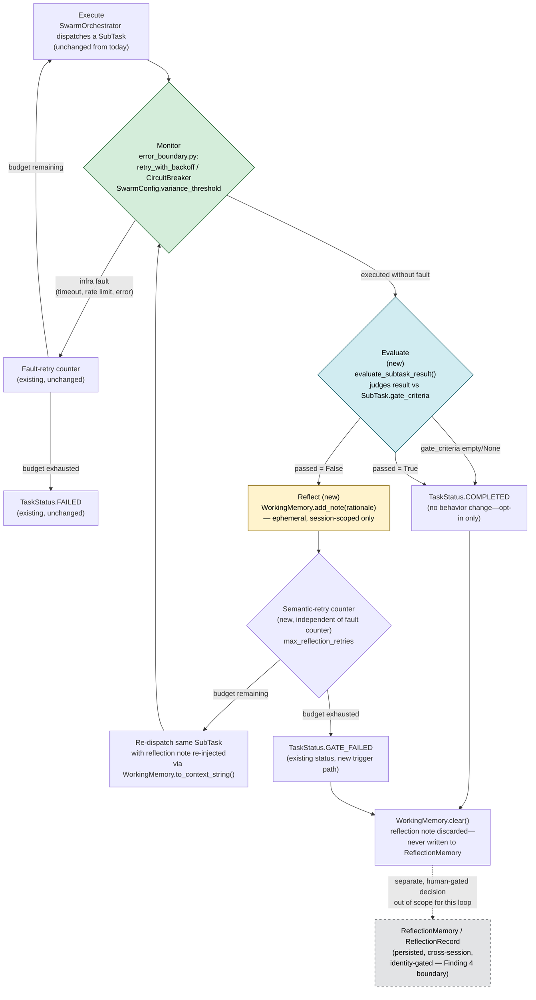

# Supporting Document 03 — Reflexion System Overview: How the Persisted and Ephemeral Mechanisms Work Together

**Programme:** `2026-07-28-reflexion-execute-monitor-evaluate-loop`
**Purpose:** A single-diagram, whole-system explanation of this workspace's Reflexion system —
both the persisted, investigator-gated `ReflectionMemory` mechanism (from the parent
`2026-07-14-reflexion-memory-system` Programme) and this Programme's ephemeral
Execute-Monitor-Evaluate-Reflect cycle — how each works, why both exist, and how they compose. For
the ephemeral cycle's own internal mechanism, see `02-technical-specification.md`. No production
code has been written for either mechanism's ephemeral half — this is a design document, not a
status report.

---

## 1. The Reflexion System in One Diagram

The solid path (Execute → Monitor → Evaluate → Reflect → retry or exit) is the **ephemeral cycle**
this Programme specifies — it lives entirely within one task, one session. The dashed arrow into
`ReflectionMemory` is deliberately **not** a code path either mechanism implements automatically —
it represents the only sanctioned way a within-task lesson can ever become durable: a named human
investigator separately deciding, after the fact, to author a `ReflectionRecord` through
`reflection_authoring.py`. That box, and everything behind it, is the **persisted mechanism** from
the parent Programme.

---

## 2. Two Mechanisms, One System

The workspace's Reflexion system is not one thing — it is two structurally distinct mechanisms,
built in two separate Programmes, deliberately kept apart rather than unified into one:

| Mechanism                                            | `ReflectionMemory` (persisted)                                                                       | Execute-Monitor-Evaluate-Reflect cycle (ephemeral)                       |
| ---------------------------------------------------- | ---------------------------------------------------------------------------------------------------- | ------------------------------------------------------------------------ |
| Origin Programme                                     | `2026-07-14-reflexion-memory-system` (parent)                                                        | `2026-07-28-reflexion-execute-monitor-evaluate-loop` (this one)          |
| Scope                                                | Cross-session, cross-agent                                                                           | Single task, single session                                              |
| Written by                                           | Named human investigator (identity-gated)                                                            | The executing agent, autonomously                                        |
| Storage                                              | Qdrant `memory_reflection` collection + JSONL log                                                    | `WorkingMemory` only, in-process                                         |
| Survives task end?                                   | Yes — permanent until decay/archival                                                                 | No — cleared at cycle exit (`WorkingMemory.clear()`)                     |
| Retrieved by other agents?                           | Yes, at orchestrator-brief time                                                                      | Never                                                                    |
| Threat model                                         | Prompt-injected write = permanent, cross-agent-visible poisoned memory (rejected surface, Finding 4) | Prompt-injected note = bounded to this task's own remaining retries only |
| What it recovers from Reflexion (Shinn et al., 2023) | Cross-trial durability for lessons significant enough to warrant a human judgment call               | The original tight, autonomous, within-task retry loop                   |

**Why two mechanisms, not one:** the parent Programme's Finding 4 established that a persisted,
agent-writable reflection store reopens a threat model this workspace's `agent-memory` server had
already and deliberately declined — a prompt-injected write becomes a permanent, cross-agent-visible
poisoned memory. That constraint is correct for anything durable, but it also meant the parent
Programme's design, by its own admission (Director Alignment Review, Open Question 4), did not
recover Reflexion's original tight within-task retry loop — the CEO's own later observation that
the "Execute-Monitor-Evaluate" loop was not fully realized. This Programme closes exactly that gap,
without reopening Finding 4's threat model, by keeping the retry loop's own reflection strictly
ephemeral: scoped to `WorkingMemory`, cleared at cycle exit, never embedded, never retrieved by
another agent.

They compose, rather than compete, and neither subsumes the other:

- The **ephemeral cycle** handles the common case — a task attempt that misses its own stated
  requirements gets one to a few chances to self-correct, with the cost and risk bounded to that
  single task.
- The **persisted mechanism** handles the rarer, more significant case — a lesson judged by a human
  investigator to be worth remembering across sessions and agents, gated by real identity
  verification precisely because its blast radius is workspace-wide, not task-local.
- **No automatic bridge exists between them.** A task that exhausts its ephemeral retries and lands
  on `GATE_FAILED` does not automatically become a `ReflectionRecord` — that promotion is always a
  separate, voluntary, human-initiated act, exactly as the parent Programme's Finding 4 specifies.

---

## 3. Scaling to Multi-Operator, Multi-Regulator Collaboration

Everything above is defined per `SubTask`. That stays true inside a large `SwarmPlan`: each
operator agent's own Execute-Monitor-Evaluate-Reflect cycle runs against its own `WorkingMemory`
instance, independently of every other operator's. The cycle is deliberately **not** promoted to a
swarm-wide loop — doing so would reopen exactly the threat model § 2 draws the line against. A
poisoned reflection note stays bounded to its own `SubTask`'s own retries regardless of how many
operators the swarm has.

**Operators** are the swarm's existing `SubTask`-to-`AgentProfile` assignments.
`SwarmOrchestrator._execute_fork_join`/`_execute_hybrid` (`swarm_orchestrator.py`) already dispatch
many independent `SubTask`s to many agents concurrently — nothing about multi-operator scale
changes how a `SubTask` is assigned or dispatched. What changes is what happens after: a complex
problem worked by many operators needs the _pattern_ across their outcomes to be visible, not just
each operator's own pass/fail.

**Aggregation, not a new per-task mechanism.** `SwarmResult.feedback` already carries a
`GATE_FAILED` `SubTask`'s per-attempt rationale (`02-technical-specification.md` § 4.1). At the
`SwarmPlan` level, that same field is extended to carry a `GATE_FAILED` count alongside the
`completed`/`failed` counts `_gen_feedback()` already computes — so three operators failing the
same gate criterion reads as one correlated signal, not three unrelated messages.

**Regulators** are human reviewers or gatekeepers — the role Dr. Wieczorek's Phase 3 adversarial
review already occupies for this Programme (`01-deployment-and-implementation-plan.md`). At swarm
scale, a regulator reviews the aggregate `GATE_FAILED` signal on the `SwarmResult`, not each
operator's output individually. This is the same recipient `02-technical-specification.md` § 4.3
already names ("whoever is running or watching that task"), applied to a `SwarmPlan`'s aggregate
outcome rather than one `SubTask`'s — no new supervisory role.

**For genuinely large-scale collaboration** — many operators, high stakes, possibly more than one
regulator with distinct domains of authority (e.g. a security reviewer and a content reviewer,
each gating different `SubTask`s in the same plan) — the correct existing primitive is
`SwarmTopology.SUPERVISOR_WORKER`, already defined alongside `PIPELINE`/`FORK_JOIN`/`ROUTER`/
`HYBRID`. A supervisor-role agent, or a designated human regulator above it, is the one who
receives the aggregated `GATE_FAILED` signal and decides whether affected `SubTask`s retry,
escalate, or need a new-angle attempt (`02-technical-specification.md` § 4.5). No new topology,
orchestration primitive, or persistence surface — this composes the existing pieces.

**Known gap, not closed by this Programme:** `SwarmOrchestrator.execute()`'s dispatch table
(`swarm_orchestrator.py`, `dispatch = {PIPELINE: ..., FORK_JOIN: ..., HYBRID: ...}`) routes
`ROUTER` and `SUPERVISOR_WORKER` through the `HYBRID` executor by default — `SUPERVISOR_WORKER`
has no distinct execution path today, so the supervisory routing described above is not yet
runnable. Closing it isn't required for this Programme's own scope, but it is a precondition for
using `SUPERVISOR_WORKER` to route a multi-operator `GATE_FAILED` aggregate as designed here.
Tracked as an open question in `research-report.md` (owner: Dr. Farouk).

This still creates no automatic path into `ReflectionMemory`. An aggregate, swarm-level
`GATE_FAILED` pattern is exactly the kind of lesson § 2 already describes as "significant enough
to warrant a human judgment call" — if a regulator judges it worth persisting, the same voluntary,
identity-gated `ReflectionRecord` authoring path applies, now informed by a swarm-wide pattern
rather than a single task's.

---

## 4. Where to Go Next

- **How the ephemeral cycle itself works** — the Execute/Monitor/Evaluate/Reflect steps, the
  dynamic-Monitor-allocation recommendation, user-facing feedback wording, and the `GATE_FAILED`
  handoff: `supporting/02-technical-specification.md`.
- **How and when it gets built** — phased rollout, ownership, gates, rollback:
  `supporting/01-deployment-and-implementation-plan.md`.
- **How it scales to many operators and regulators** — activation criteria, `SwarmResult`
  aggregation, and the `SUPERVISOR_WORKER` routing question: § 3 of this document.
- **Every state and decision point in one place** — the `SubTask` state model, the full decision
  map, and the exact pass/fail criteria: `supporting/04-state-based-decision-logic.md`.
- **Why this design was chosen** — the full research findings, benchmarked precedent, and
  Analysis/Trade-offs behind both mechanisms: `research-report.md`.
- **The persisted mechanism's own full design** — schema, storage specification, identity
  enforcement: `core-component-00/telescope/2026-07-14-reflexion-memory-system/research-report.md`
  and its `supporting/` documents.

---

**Maintained By:** Core Component 00 Laboratory
**Programme:** `2026-07-28-reflexion-execute-monitor-evaluate-loop`
