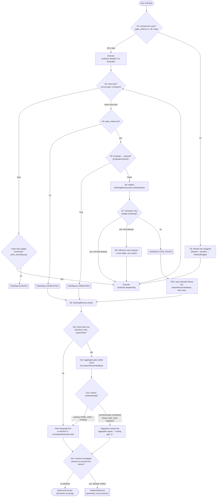

# Supporting Document 04 — State-Based Decision Logic and Pass/Fail Criteria

**Programme:** `2026-07-28-reflexion-execute-monitor-evaluate-loop`
**Purpose:** A single consolidated reference for every state a `SubTask` can be in and every
decision point that moves it between states — activation, monitoring, evaluation, retry, exit,
aggregation, and regulator routing — gathered from across `research-report.md` and
`supporting/01-03` into one place, with the pass/fail criteria stated explicitly rather than left
implicit in each document's own section. This document introduces one new specification (§ 5's
pass/fail aggregation rule, not yet stated anywhere else) and otherwise restates existing decisions
without changing them. At authoring, no production code had been written; Phases 1-2, D2, and D8
have since been implemented in `swarm_orchestrator.py` — see § 7 for what's actually shipped.

---

## 1. The `SubTask` State Model

`swarm_orchestrator.py`'s `TaskStatus` enum defines five states. Every decision in this document
either keeps a `SubTask` in its current state or moves it to one of these:

| State         | Meaning                                             | Set by                                             |
| ------------- | --------------------------------------------------- | -------------------------------------------------- |
| `PENDING`     | Not yet dispatched                                  | `SwarmPlan` construction                           |
| `DISPATCHED`  | Currently executing                                 | `SwarmOrchestrator._dispatch()`, on entry          |
| `COMPLETED`   | Finished; either ungated or passed its gate         | § 4 (D4/D5 below)                                  |
| `FAILED`      | Infrastructure fault, retries exhausted             | § 4 (D3 below) — unchanged by this Programme       |
| `GATE_FAILED` | Executed cleanly but never passed its gate criteria | § 4 (D7 below) — this Programme's new trigger path |

Two states — `PENDING`, `DISPATCHED` — are unchanged by this Programme entirely. `FAILED` is
unchanged in meaning but gains no new trigger path. `COMPLETED` and `GATE_FAILED` are where this
Programme's decisions actually act.

---

## 2. The Full Decision Map

Every diamond in this diagram is a named decision (D1–D14), catalogued in § 3 with its exact
rule, and every terminal box is a `TaskStatus` value or a downstream artifact
(`SwarmResult.feedback`, a `ReflectionRecord`). Nothing in this diagram introduces a code path
beyond what `research-report.md` and `supporting/01-03` already specify — it is a consolidated
view of decisions stated individually in those documents, plus § 5's one new specification.

---

## 3. Decision Catalogue

| ID  | Question It Answers                             | Inputs                                                                     | Rule                                                                                                                                                                                                                                                                                                                                                                                                                                                   | Outcome(s)                                           | Owner                                       | Reference                                        |
| --- | ----------------------------------------------- | -------------------------------------------------------------------------- | ------------------------------------------------------------------------------------------------------------------------------------------------------------------------------------------------------------------------------------------------------------------------------------------------------------------------------------------------------------------------------------------------------------------------------------------------------ | ---------------------------------------------------- | ------------------------------------------- | ------------------------------------------------ |
| D1  | Should this `SubTask` even run the cycle?       | `SubTask.domain`, whether a checkable output exists                        | On by default for checkable-output work and high-blast-radius domains (`"backend"`, `"security"`, `"release"`); off for open-ended/exploratory work; skipped for deterministic, infra-only tasks                                                                                                                                                                                                                                                       | `gate_criteria` set, or left empty/`None`            | Dr. Farouk (mapping), Kwame Asante (review) | `02-technical-specification.md` § 5              |
| D2  | How much Monitor budget does this task get?     | `SubTask.domain`, `estimated_duration`, `gate_criteria`                    | Tiered by duration only (short/standard/long-running), implemented 2026-07-30 as `default_monitor_budget()`; breaker-sensitivity tiering is a separate, cross-module item (the circuit breaker is caller-injected, outside this module's control) — see Open Question 6. Dr. Wieczorek's 2026-07-30 review found the long-running tier's multiplier was uncapped (a runaway-timeout risk); fixed same-day with `_LONG_RUNNING_TIMEOUT_CEILING_SECONDS` | `MonitorBudget` (timeout only)                       | Dr. Farouk                                  | `02-technical-specification.md` § 2              |
| D3  | Did execution fail at the infrastructure level? | Exception from `_execute_fn`, `CircuitBreaker.is_open()`                   | Circuit open → immediate `FAILED`, no dispatch attempted. Exception during dispatch → fault-retry counter checked (existing `error_boundary.py` default, not restated here). Clean return → proceed to D4                                                                                                                                                                                                                                              | `FAILED`, or proceed                                 | Kwame Asante (harness owner)                | `02-technical-specification.md` § 1.2; § 7 below |
| D4  | Does this task have anything to evaluate?       | `SubTask.gate_criteria`                                                    | Empty/`None` → skip Evaluate entirely (this is what keeps the cycle opt-in)                                                                                                                                                                                                                                                                                                                                                                            | `COMPLETED` (no Evaluate run), or proceed to D5      | —                                           | `02-technical-specification.md` § 1.3            |
| D5  | Did the result satisfy its gate criteria?       | `SubTask.gate_criteria`, task result                                       | `evaluate_subtask_result()` returns `EvaluationVerdict(passed, rationale)` — see § 5 below for the pass/fail aggregation rule                                                                                                                                                                                                                                                                                                                          | `COMPLETED`, or proceed to D6                        | Dr. Farouk                                  | `02-technical-specification.md` § 1.3, § 4.4     |
| D6  | What does the agent do with a failing verdict?  | `EvaluationVerdict.rationale`                                              | Written into the task's own `WorkingMemory` via `add_note()`, re-injected into the retry via `to_context_string()`                                                                                                                                                                                                                                                                                                                                     | Reflection note added                                | —                                           | `02-technical-specification.md` § 1.4            |
| D7  | Is there budget left to retry?                  | `max_reflection_retries`, tracked independently of the fault-retry counter | Budget remaining → re-dispatch; exhausted → `GATE_FAILED`. Never shares a counter with D3's fault-retry budget                                                                                                                                                                                                                                                                                                                                         | Re-dispatch, or `GATE_FAILED`                        | Dr. Farouk                                  | `02-technical-specification.md` § 1.5            |
| D8  | Same approach again, or a new one?              | Which retry attempt this is                                                | Every retry but the last repeats the same approach plus the critique; the final retry's reflection note explicitly asks for a different approach — implemented 2026-07-30 as `_reflection_note_for_attempt()`, now the default behavior. Benchmarking (Dr. Nwosu-Chen) will confirm whether it measurably helps                                                                                                                                        | Retried attempt's prompt content                     | Dr. Nwosu-Chen (validates via benchmarking) | `02-technical-specification.md` § 4.5            |
| D9  | Does the reflection note outlive the task?      | Cycle exit (`COMPLETED` or `GATE_FAILED`)                                  | Always cleared — `WorkingMemory.clear()` runs on every exit, no exception                                                                                                                                                                                                                                                                                                                                                                              | Note discarded from `WorkingMemory`                  | —                                           | `02-technical-specification.md` § 1.6            |
| D10 | What survives a `GATE_FAILED` exit?             | The task's accumulated rationale history                                   | Copied into `SwarmResult.feedback` **before** `WorkingMemory.clear()` runs, specifically on `GATE_FAILED`                                                                                                                                                                                                                                                                                                                                              | `SwarmResult.feedback` populated                     | —                                           | `02-technical-specification.md` § 4.1            |
| D11 | Is this task part of a larger swarm?            | `SwarmPlan.subtasks` count                                                 | More than one `SubTask` → aggregation applies (D12); a lone task → skip straight to the plain-language line                                                                                                                                                                                                                                                                                                                                            | Branch to D12, or to the feedback line               | —                                           | `03-reflexion-system-overview.md` § 3            |
| D12 | Is a `GATE_FAILED` pattern correlated?          | `GATE_FAILED` count across the plan's `SubTask`s                           | `_gen_feedback()`'s existing completed/failed tally gets a `gate_failed` count added                                                                                                                                                                                                                                                                                                                                                                   | Aggregate count on `SwarmResult`                     | —                                           | `03-reflexion-system-overview.md` § 3            |
| D13 | Who reviews the aggregate — and how?            | `SwarmPlan.topology`, stakes/scale                                         | Ordinary `FORK_JOIN`/`HYBRID` → same recipient as `TaskStatus.FAILED` already gets. Large-scale, multi-regulator → routes through `SUPERVISOR_WORKER` (routing gap noted, § 7)                                                                                                                                                                                                                                                                         | Plain-language line, or regulator review             | —                                           | `03-reflexion-system-overview.md` § 3            |
| D14 | Does this lesson become permanent?              | Human investigator's own judgment                                          | Never automatic. A named, identity-verified investigator separately chooses to author a `ReflectionRecord`                                                                                                                                                                                                                                                                                                                                             | Nothing persists, or a `ReflectionRecord` is created | Named human investigator                    | `03-reflexion-system-overview.md` § 2            |

---

## 4. Retry Budgets Are Two Separate Counters — Never One

D3's fault-retry budget and D7's semantic-retry budget (`max_reflection_retries`) are tracked
completely independently, by design (`02-technical-specification.md` § 1.5). A task that hits one
infra timeout does not lose semantic-retry room because of it, and a task burning all its semantic
retries chasing a gate criterion has no effect on its separate fault-tolerance budget. Nothing in
this document changes that; it is restated here because it is the single most important invariant
for reading the decision map in § 2 correctly — D3B and D7 look similar in the diagram and must
not be conflated.

---

## 5. Pass/Fail Criteria — The One Gap This Document Closes

`EvaluationVerdict` is `passed: bool` plus `rationale`, and § 4.4 of
`02-technical-specification.md` already specifies that `rationale` is structured as a per-criterion
checklist — which individual `gate_criteria` items passed and which failed — rather than one
free-text paragraph. **What no existing Programme document states is how that checklist rolls up
into the single `passed` boolean** — whether every listed criterion must check out, or whether a
partial pass (a majority, or a weighted subset) is enough.

**Default position, recorded here:** `passed = True` requires every item in `gate_criteria` to
check out — an AND across the checklist, not a threshold. A gate that only partially checks isn't
functioning as a gate. This is a reasonable default, not a validated one: `gate_criteria` is
currently an unstructured `list[str]` (`research-report.md` Finding 2), so nothing today enforces
that its items are independent, equally weighted, or even mutually consistent, and a genuinely
partial-credit case (four of five criteria clearly met, the fifth debatable) is plausible once
real `gate_criteria` lists exist. Recorded as **Open Question 5** in `research-report.md`, owned by
Dr. Farouk, to be confirmed — not silently assumed — when `evaluate_subtask_result()` is actually
implemented in Phase 1.

---

## 6. Explicit Non-Decisions

Stated plainly, since a document cataloguing decisions can otherwise read as if everything in the
system is dynamic. It isn't:

- **`WorkingMemory.clear()` is unconditional at cycle exit** (D9) — there is no branch that
  preserves it further; `SwarmResult.feedback` (D10) is populated _before_ the clear, not instead
  of it.
- **There is no numeric evaluation score** — `EvaluationVerdict` is boolean plus a rationale
  checklist, not a calibrated score, deliberately (`02-technical-specification.md` § 4.4). A score
  is a separate, harder problem, not part of this design.
- **Promotion to `ReflectionMemory` is never automatic** (D14) — every path in § 2 that reaches a
  human-reviewed outcome terminates in a voluntary choice, never a rule that writes a
  `ReflectionRecord` on the system's own initiative.
- **The Monitor tiers (D2) are fixed buckets, not a learned model** — `02-technical-specification.md`
  § 2 explicitly rejects building an adaptive allocator before real usage data exists.

---

## 7. Where Each Decision Is Implemented

| Decision(s) | File                                         | Symbol                                                                                                                                                                                                                                                                                                                                                               |
| ----------- | -------------------------------------------- | -------------------------------------------------------------------------------------------------------------------------------------------------------------------------------------------------------------------------------------------------------------------------------------------------------------------------------------------------------------------- |
| D1          | `swarm_orchestrator.py`                      | `SubTask.domain`/`gate_criteria` (existing fields, new consumer)                                                                                                                                                                                                                                                                                                     |
| D2          | `swarm_orchestrator.py`                      | New `MonitorBudget` dataclass, new `default_monitor_budget()` function, wired into `_dispatch()`'s `asyncio.wait_for(timeout=...)`                                                                                                                                                                                                                                   |
| D3          | `swarm_orchestrator.py`, `error_boundary.py` | `SwarmOrchestrator._dispatch()`, `CircuitBreaker.is_open()` (checked directly); `retry_with_backoff`/`SafeModelCall.execute()` apply inside the caller-supplied `_execute_fn`, not inside `_dispatch()` itself — worth stating precisely, since it's easy to assume the fault-retry loop lives in the orchestrator when it actually lives at the execution call site |
| D4, D5      | `swarm_orchestrator.py`                      | New `EvaluationVerdict` dataclass, new `evaluate_subtask_result()` function                                                                                                                                                                                                                                                                                          |
| D6          | `memory_store.py`                            | `WorkingMemory.add_note()`, `to_context_string()` (both existing, unmodified)                                                                                                                                                                                                                                                                                        |
| D7          | `swarm_orchestrator.py`                      | New `SwarmConfig.max_reflection_retries` field                                                                                                                                                                                                                                                                                                                       |
| D8          | `swarm_orchestrator.py`                      | New `_reflection_note_for_attempt()` function                                                                                                                                                                                                                                                                                                                        |
| D9          | `memory_store.py`                            | `WorkingMemory.clear()` (existing, unmodified)                                                                                                                                                                                                                                                                                                                       |
| D10, D12    | `swarm_orchestrator.py`                      | `SwarmResult.feedback` (existing field, currently unused), `_gen_feedback()` (existing, extended)                                                                                                                                                                                                                                                                    |
| D11, D13    | `swarm_orchestrator.py`                      | `SwarmPlan.subtasks`, `SwarmTopology.SUPERVISOR_WORKER` — **routing gap:** `SwarmOrchestrator.execute()`'s dispatch table currently falls `SUPERVISOR_WORKER` through to the `HYBRID` executor with no distinct path (`research-report.md` Open Question 4)                                                                                                          |
| D14         | `reflection_authoring.py`, `memory_store.py` | `verify_authorized_identity()`, `ReflectionMemory.record_reflection()` (both existing, unmodified, identity-gated)                                                                                                                                                                                                                                                   |

---

## 8. Scope Note

This document catalogues decision logic; it does not add new phases to
`supporting/01-deployment-and-implementation-plan.md`, and § 5's pass/fail aggregation default is
implemented as part of that plan's existing Phase 1 (Evaluate step), not a new one. For the
mechanism each decision belongs to, see `02-technical-specification.md`; for how decisions compose
across a multi-operator swarm, see `03-reflexion-system-overview.md` § 3; for phased rollout and
ownership, see `01-deployment-and-implementation-plan.md`. At authoring, no production code had
been written; see § 7 for the current implementation state.

---

**Maintained By:** Core Component 00 Laboratory
**Programme:** `2026-07-28-reflexion-execute-monitor-evaluate-loop`
