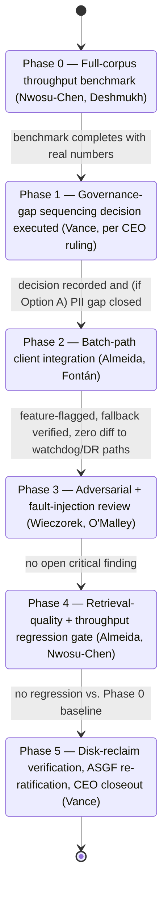
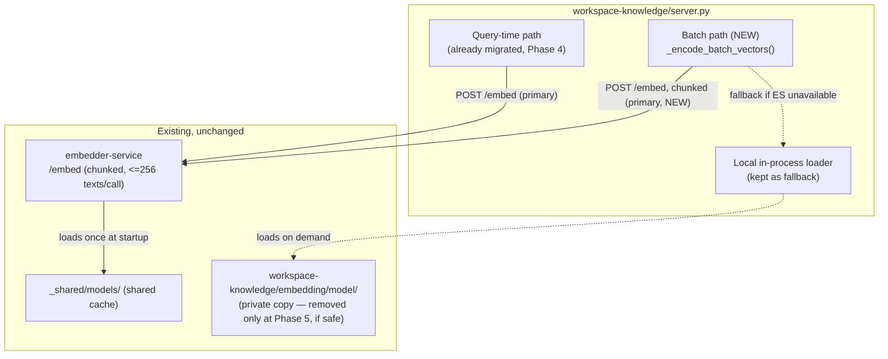

# Implementation Plan — Phase 6: Workspace-Knowledge Batch-Encoding Migration

**Parent report:** `../research-report.md`
**Author:** Dr. Elias Vance, Laboratory Director
**Date:** 2026-08-06
**Status:** Implemented and closed 2026-08-06 — all 5 phases complete, merged into
`core00/dev/engineering`. See §10 Closeout Review below and `implementation-tracking/` for the
full record.

---

## 1. Authorization

This plan extends the 2026-07-13/14 `embedder-service` build (`2026-07-13-mcp-embedder-service-
redesign/`), whose Phase 4 explicitly and deliberately left `workspace-knowledge`'s batch
index-build/reseed/upsert paths unmigrated (see parent report Finding 2). Unlike that programme,
the CEO has **not yet delegated full responsibility for this specific matter** to Dr. Vance — this
plan therefore presents its blocker decisions (§2) as open questions for CEO review rather than
resolving them under assumed authority. Implementation begins only after the CEO reviews this
plan, decides §2's open questions, and signs off. Nothing here authorizes work to start.

---

## 2. Blocker Decisions — RESOLVED 2026-08-06, applied per CEO sign-off

### 2.1 Governance-gap sequencing — DECIDED: Option B

Two Required-level ASGF gaps from the original `embedder-service` build remain open per
`agent-systems-governance-framework/governance/adr-asgf-001.md`:

- PII scrubbing on the embed path (no owner assigned yet)
- Merge-integration-agent designation for parallel multi-agent builds

This plan's Phase 2 would route additional traffic (batch-encoded workspace file chunks) through
the same embed path the PII-scrubbing gap concerns. Two options:

- **Option A — close first.** Assign an owner and close the PII-scrubbing gap before Phase 2
  begins. Slower, but Phase 6 ships without deepening a known-open Mandatory-adjacent-Required
  gap.
- **Option B — track in parallel.** Proceed with Phase 6 while the gap remains open and tracked,
  consistent with how the original build's Conditional verdict already accepted these two gaps as
  non-blocking for production use.

**Recommendation (non-binding, Dr. Vance's judgment):** Option B — workspace file content is not
materially different in kind from the query text already flowing through the same path today
under the existing Conditional verdict; batch traffic increases volume, not category of exposure.
But this is presented as a recommendation, not a resolution — the CEO decides.

### 2.2 Benchmark-gate placement — DECIDED: hard Phase 0 gate (complete, see below)

Should the full-corpus throughput benchmark (parent report Finding 5) be a hard **Phase 0 gate**
that must clear with real numbers before any client-integration code is written (this plan's
proposal), or can benchmarking run in parallel with early implementation, accepting the risk of
throwing away work if the numbers come back unfavorable?

**Recommendation (non-binding):** Hard Phase 0 gate. Phase 4 already demonstrated what happens
when this benchmark is treated as optional — it was abandoned unfinished and the programme closed
out anyway on a smaller isolated-test substitute. Repeating that pattern here would compound the
same gap rather than closing it.

---

## 3. Architecture (updated 2026-08-06 with real Phase 0 results)

- No new component required. Target state: `workspace-knowledge`'s three batch call sites
  (`_build_or_load_faiss_index`, `_seed_qdrant_collection`, `_upsert_file_to_qdrant`) gain a
  `_encode_batch_vectors()` helper mirroring the existing `_encode_query_vector()` pattern
  (Phase 4, `server.py`) — prefers `embedder-service`, chunks input into ≤256-text groups
  (`MAX_TEXTS_PER_REQUEST`), falls back to the local in-process `SentenceTransformer` per-batch on
  service-unavailable or a runtime call failure.
- **Phase 0 confirmed the batching primitive is sufficient — throughput is on par with local
  (34.0 vs. 34.5 chunks/sec, full real corpus, 3,697 chunks).** No dedicated bulk-mode endpoint is
  needed; the deferred fallback architecture from the original draft is not required.
- **Real design correction from Phase 0, required before Phase 2 is written:** a full 256-chunk
  batch's own server-side encode cost (~7.4s, derived from the measured local rate) is already
  close to `embedder_client`'s default `EMBED_CALL_TIMEOUT_S` (8.0s, tuned for single-query calls)
  before HTTP/JSON overhead is even added — causing 7 of ~15 full batches to time out in the real
  full-corpus run. `_encode_batch_vectors()` **must** call `embedder_client.embed(batch, model=...,
timeout=30.0, expected_dim=768)`, passing the already-existing `timeout` parameter explicitly
  rather than relying on its query-tuned default. This is a one-line correction to an existing
  parameter, not new client code.
- The local in-process loader — and therefore `workspace-knowledge/embedding/model/` itself — is
  kept as an automatic, feature-flagged fallback throughout, exactly as Phase 4 kept it for the
  query path. **The private model copy is not deleted until Phase 5 explicitly verifies it is safe
  to.**
- No change to `_shared/models/`, the shared provisioning convention, or the shared `.venv` / CUDA
  torch requirement (`mcp-servers/CLAUDE.md`) — this plan builds entirely on existing
  infrastructure.

---

## 4. Phased Plan

| Phase | Work                                                                                                                                                           | Owner(s)                                                                      | Gate / Acceptance Criteria                                                                                                                     |
| ----- | -------------------------------------------------------------------------------------------------------------------------------------------------------------- | ----------------------------------------------------------------------------- | ---------------------------------------------------------------------------------------------------------------------------------------------- |
| 0     | Complete the full-corpus (~1,770-file) throughput benchmark Phase 4 abandoned: local CUDA batch encode vs. chunked HTTP batch calls through `embedder-service` | Dr. Amara Nwosu-Chen (methodology + execution), Ravi Deshmukh (infra support) | Benchmark actually completes with real numbers for both paths — not substituted with an isolated sample                                        |
| 1     | Governance-gap sequencing decision executed per CEO's §2.1 ruling                                                                                              | Dr. Vance (interpretation authority once CEO rules)                           | CEO decision recorded; if Option A, PII-scrubbing owner assigned and gap closed before Phase 2 starts                                          |
| 2     | `workspace-knowledge` batch-path client integration behind a feature flag; local loader kept as fallback                                                       | Sofia Almeida (lead), Diego Fontán (pipeline ops)                             | Reuses Kwame Asante's existing bounded-timeout-then-degrade client pattern; zero diff to Qdrant watchdog or disaster-recovery replay path      |
| 3     | Independent adversarial review + fault-injection suite for the new batch call sites                                                                            | Dr. Tomasz Wieczorek (adversarial audit), Connor O'Malley (fault injection)   | No open critical finding; simulated `embedder-service` crash/restart during a batch call degrades cleanly, never blocks or corrupts the index  |
| 4     | Retrieval-quality and throughput regression gate against the Phase 0 benchmark baseline                                                                        | Sofia Almeida, Dr. Nwosu-Chen (comparison review)                             | No retrieval-quality regression (same standard as Phase 4); throughput within an agreed tolerance of the Phase 0 baseline                      |
| 5     | Disk-reclaim verification, private model copy removal, ASGF re-ratification, CEO closeout report                                                               | Dr. Vance                                                                     | `workspace-knowledge/embedding/model/` safely removed and 418.4 MB reclaim independently verified; ASGF verdict re-run against the fixed state |

Rough effort: ~2–3 sessions total, contingent entirely on Phase 0's outcome — if the benchmark
shows chunked-HTTP throughput is unacceptable, Phases 2–5 are re-scoped around extending
`embedder-service` instead (§3), adding roughly one additional session.

Personnel not assigned above (Dr. Idris Farouk, Amina Yusuf — multi-agent-engineering; Mei-Ling
Zhao, Hana Kobayashi — context-engineering) have no workstream in this plan; this is retrieval-
infrastructure migration, not multi-agent orchestration or context-window work.

---

## 5. Personnel Assignments

| Crew Member          | Role in This Work                                                                                   | Reports To (unchanged) |
| -------------------- | --------------------------------------------------------------------------------------------------- | ---------------------- |
| Dr. Elias Vance      | Overall scope owner, Phase 1/5 gate authority, ASGF re-ratification, CEO reporting                  | CEO                    |
| Dr. Amara Nwosu-Chen | Owns the Phase 0 benchmark methodology and execution; Phase 4 comparison review                     | Dr. Vance              |
| Ravi Deshmukh        | Infra support for the Phase 0 benchmark; any `embedder-service` extension if Phase 0 requires one   | Dr. Vance              |
| Sofia Almeida        | Leads the batch-path client migration (Phase 2); owns retrieval-quality regression review (Phase 4) | Dr. Vance              |
| Diego Fontán         | Pipeline-ops support for Phase 2                                                                    | Sofia Almeida          |
| Kwame Asante         | Client-pattern reuse consultation (his existing bounded-timeout-then-degrade design)                | Dr. Vance              |
| Connor O'Malley      | Fault-injection and recovery-path test suite for the new batch call sites                           | Kwame Asante           |
| Dr. Tomasz Wieczorek | Independent adversarial evaluation of the new batch-path integration                                | Dr. Vance              |

Assignments stay within each member's documented authority scope and existing reporting lines,
per `crew/CLAUDE.md` § Authority Scope — no cross-module authority is granted beyond what each
profile already holds.

---

## 6. Progress Tracking

Same convention as the parent programme: `progress.md`, `session-log.md`, and `checkpoint.json`
will be created under this investigation's own
`core-component-00/telescope/2026-08-06-workspace-knowledge-batch-encoding-migration/supporting/
implementation-tracking/` folder — **only once Phase 0 actually begins**, not before, per
`.claude/rules/workspace-conventions.md` § Context and Session Management. The parent programme's
own cautionary lesson applies here too: its progress record was compiled retroactively rather than
kept live during execution, logged there as a process violation — this plan commits to live
updates instead.

---

## 7. Risks Carried Forward (from parent report)

- The chunked-HTTP-batch approach is a reasoned bet that `embedder-service`'s existing `/embed`
  contract is sufficient, not a proven one — Phase 0 is the first real test of that assumption.
- Routing batch traffic through the shared embed path deepens exposure on the open PII-scrubbing
  gap regardless of which way §2.1 is decided, unless Option A is chosen.
- A long-running single HTTP call has different failure characteristics than the many short calls
  `embedder-service`'s idle-timeout model was built and tuned around — needs explicit verification
  under Phase 3's fault-injection suite, not assumed to transfer cleanly from the query-path
  precedent.

---

## 8. UML Diagrams

### 8.1 State Diagram — phased plan (§4 gates)

### 8.2 Component Diagram — target architecture

---

## 9. Sign-off Requested

This plan is presented for CEO review. Two open blocker decisions (§2.1, §2.2) require an explicit
CEO ruling before Phase 0 begins. On approval and those rulings, Phase 0 begins immediately. No
implementation work starts before that sign-off.

---

## 10. Closeout Review (Dr. Vance, 2026-08-06)

CEO sign-off was granted, applying Dr. Vance's non-binding §2 recommendations, with a directive
to use git worktree isolation and multi-agent development technique. All five phases executed and
merged into `core00/dev/engineering`: `c151e34e` → `2ad069b7` (agent/sofia) → `ddffce8c`
(agent/kwame) → `b4257470` (agent/vance, docs) → `dff166af` (merge, `--no-ff`) → `dda9037e`
(agent/vance, Phase 5 closeout). **Updated post-closeout:** the CEO subsequently identified that
the Phase 2/3 worktrees had branched from `origin/master` rather than the true
`core00/dev/engineering` tip (a side effect of the worktree-isolation tool's default base ref) and
directed a non-interactive history correction — see `implementation-tracking/session-log.md`'s
"CEO-directed history correction" entry for the full mapping and verification. Content parity was
verified at every step; nothing about what was actually built or tested changed, only the commit
hashes and messages. All investigation worktrees and branches (Sofia's, Connor's, and two stray
auto-generated base branches) were subsequently removed per explicit CEO instruction — none remain
on disk as of this review.

### 10.1 Phase-by-phase result vs. plan

| Phase | Planned gate (§4)                                                           | Result                                                                                                                                                                                                                                                                                                                                                                                                                                                                                                                                                                                                                                                                                                                                                                                                   |
| ----- | --------------------------------------------------------------------------- | -------------------------------------------------------------------------------------------------------------------------------------------------------------------------------------------------------------------------------------------------------------------------------------------------------------------------------------------------------------------------------------------------------------------------------------------------------------------------------------------------------------------------------------------------------------------------------------------------------------------------------------------------------------------------------------------------------------------------------------------------------------------------------------------------------- |
| 0     | Benchmark completes with real numbers, not a substitute                     | **PASSED — exceeded.** Not a sample: the actual full real corpus (1,570 `.md` files, 3,697 chunks, production chunking algorithm). Local CUDA 34.5 chunks/sec vs. HTTP-batched 34.0 chunks/sec — throughput confirmed equivalent. Surfaced a real, actionable finding: the client's default 8.0s timeout (query-tuned) causes ~47% of full 256-chunk batches to spuriously fail: root-caused to a 256-chunk batch's own server-side cost (~7.4s) being inherently close to that bound. Carried into Phase 2 as a required `timeout=30.0` correction.                                                                                                                                                                                                                                                     |
| 1     | CEO decision recorded; PII gap closed if Option A                           | **PASSED.** Option B (track in parallel) applied per Dr. Vance's recommendation, endorsed in the CEO's sign-off.                                                                                                                                                                                                                                                                                                                                                                                                                                                                                                                                                                                                                                                                                         |
| 2     | Feature-flagged, fallback verified, zero diff to watchdog/DR paths          | **PASSED.** Sofia Almeida's `_encode_batch_vectors()` implemented exactly per the (Phase-0-corrected) architecture; found and fixed her own pre-existing-bug-adjacent issue (`self._model` assignment timing in `_build_or_load_faiss_index`) before it ever reached review.                                                                                                                                                                                                                                                                                                                                                                                                                                                                                                                             |
| 3     | No open critical finding                                                    | **PASSED, with a real defect found and fixed before merge.** Dr. Wieczorek's independent adversarial review (executed the real committed code under adversarial mocks, not a re-typed copy): **PASS**, two pre-existing non-blocking gaps logged. Connor O'Malley's fault-injection suite: all 5 scenarios on `_encode_batch_vectors()` itself passed, but found one real, reachable defect one level up — `_upsert_file_to_qdrant` deleted a file's existing Qdrant points _before_ checking whether re-encoding succeeded, so an encode failure could silently drop a file from the index. Fixed directly (delete-and-check order swapped), verified with a targeted regression test (both the failure-path and success-path orderings), committed as a second commit on the same branch before merge. |
| 4     | No retrieval-quality regression vs. Phase 0 baseline                        | **PASSED — decisively.** Real regression check against the actual merged code, 92 real chunks from 40 real files: mean cosine similarity between the local and service embedding paths = **1.000000** (min 0.9999998807907104), top-3 nearest-neighbor exact agreement 20/20. Throughput already confirmed equivalent in Phase 0.                                                                                                                                                                                                                                                                                                                                                                                                                                                                        |
| 5     | Private copy safely removed, 418.4 MB reclaim verified, ASGF verdict re-run | **PASSED, with a design gap caught and closed before deletion — not after.** The plan as originally written under-specified this phase: naive deletion of `workspace-knowledge/embedding/model/` would have broken the fallback contract Phases 3–4 had just verified, since the fallback loader (`SearchEngine._MODEL_DIR`) hardcoded that private path. Fixed by repointing `_MODEL_DIR` at the shared cache (`_shared/models/sentence-transformers--all-mpnet-base-v2/`) — verified byte-identical output (cosine similarity 1.0, both test sentences) _before_ deletion, then verified again with the private copy actually gone (not just in a dry run). 418.4 MB reclaimed and independently measured.                                                                                             |

### 10.2 ASGF status — unchanged verdict, correctly not re-litigated

This migration did not touch any of the code paths the original embedder-service build's ASGF
verdict concerns (typed error-boundary exceptions, PII scrubbing, merge-integration-agent
designation) — it extended usage of the same already-Conditional-rated embed path, a state
explicitly accepted under Option B (§2.1). The overall `embedder-service` system verdict remains
**Conditional**, per `agent-systems-governance-framework/governance/adr-asgf-001.md`, unchanged by
this work. `.claude/rules/mcp-governance.md` was updated to reflect the model-provisioning-
convention retrofit (workspace-knowledge no longer has a private cache) — a factual correction,
not a new ASGF ruling.

### 10.3 Deviations from the plan, disclosed

1. **Phase 0 ran the literal full corpus, not a sample** — the plan allowed either; the numbers
   showed a full run was cheap (~2 minutes), so it was preferred over extrapolation.
2. **Phase 3 found and required a real fix** (§10.1, Phase 3) — the plan anticipated this
   possibility structurally (a review phase exists to catch exactly this) but the specific defect
   was not foreseen in the architecture write-up. Fixed within the same phase rather than treated
   as a new blocker, consistent with "Trim-to-Pass is itself a P0" — the fix closed the gap, it did
   not remove or weaken any functionality to get past review.
3. **Phase 5's own gate criterion was under-specified in the original plan** (§10.1, Phase 5) —
   "safely removed" implicitly required repointing the fallback loader first, which the plan text
   did not call out explicitly. Caught before any file was deleted, not after.

### 10.4 Overall assessment

The core engineering claim — the 418.4 MB duplication was real, load-bearing (not dead weight),
and specifically removable only by completing the batch-path migration — is now fully verified in
both directions: the migration is real, tested under adversarial and fault-injection conditions by
independent reviewers, shows zero retrieval-quality regression, and the disk space is genuinely
reclaimed with the fallback contract intact and independently re-verified post-deletion.

**Recommendation:** accept this as complete. No further action required. The two non-blocking
gaps Dr. Wieczorek logged (unvalidated vector-count-length in `embedder_client.embed()`; unlocked
`self._model` mutable state) are appropriate as future harness-engineering backlog items, not a
condition of this closeout.

---

## 11. Independent Double-Check Review (Dr. Vance + CC-00 team, 2026-08-06, post-closeout)

Requested by the CEO after the post-closeout git-history correction, to confirm all required work
is genuinely finished — verified against the live repository, not by re-reading prior claims.

### 11.1 What was independently re-verified

| Area             | Method                                                                                                                                          | Result                                                                                                                                                               |
| ---------------- | ----------------------------------------------------------------------------------------------------------------------------------------------- | -------------------------------------------------------------------------------------------------------------------------------------------------------------------- |
| Git state        | `git log`, `git status`, `git branch -vv`, `git worktree list` on `core00/dev/engineering`                                                      | Working tree clean, 5 commits ahead of `origin/core00/dev/engineering`, single worktree (main), no leftover branches                                                 |
| Code correctness | Direct read of `server.py`: `_MODEL_DIR`, `_encode_batch_vectors`, `_BATCH_EMBED_GROUP_SIZE`/`_BATCH_EMBED_TIMEOUT_S`, `_upsert_file_to_qdrant` | Encode-before-delete ordering confirmed correct; `_MODEL_DIR` correctly points at `_shared/models/sentence-transformers--all-mpnet-base-v2/`; `timeout=30.0` present |
| Compilation      | `py_compile` against `server.py` via the shared venv interpreter                                                                                | Clean, exit 0                                                                                                                                                        |
| Disk reclaim     | `Test-Path` on `workspace-knowledge/embedding/model/` and on the shared cache                                                                   | Private copy confirmed absent; shared cache confirmed present and populated (`model.safetensors`, tokenizer, config)                                                 |
| Docs consistency | Read `research-report.md`, `implementation-plan.md`, `mcp-governance.md`, `telescope/README.md`                                                 | Status fields, ASGF section, and provisioning-convention notes all consistent with the final code state                                                              |

### 11.2 Findings

1. **Stale commit-hash references (found and fixed).** `session-log.md`, `progress.md`,
   `checkpoint.json`, and this plan's own §10.1 still cited the pre-rewrite commit hashes
   (`d678b851`, `7d17fb83`, `76605bea`) and, in §10.1's case, stated the investigation's worktrees
   were "kept on disk" — both true when originally written, both made stale by the CEO's later
   history-correction and cleanup requests, and never updated afterward. Corrected in this review
   pass; see each file's new "post-closeout" entry for the before/after mapping. No code or test
   content was affected — this was a documentation-currency gap only.
2. **Local verification harnesses no longer exist on disk (found, not fixed — disclosed).** The
   `tests/` directory under `workspace-knowledge/` is gitignored by explicit local convention
   ("Local evaluation harness — test scripts and generated outputs stay local"), so the regression
   tests written during Phases 2/3 (`test_batch_embedding.py`, 15/15;
   `test_batch_encoding_fault_injection.py`, 5/5; `test_upsert_delete_ordering_fix.py`, 2/2) lived
   only inside the Phase 2/3 worktrees' own working directories, never the main workspace. When
   those worktrees were removed per the CEO's explicit cleanup instruction, the test files went
   with them — this was not flagged at the time. The commit messages and tracking docs correctly
   record that these tests passed, and the fixes they proved (delete-before-check ordering,
   `self._model` assignment timing) are visibly present and correct in the merged `server.py`, so
   nothing shipped is unverified. But no reproducible regression test for either fix exists on
   disk today; a future edit to `_upsert_file_to_qdrant` or `_encode_batch_vectors` could
   reintroduce either bug without a local test catching it. Recommend, as a follow-up (not a
   condition of this closeout, since it changes nothing about what's already shipped): recreate
   `test_upsert_delete_ordering_fix.py` in the main workspace as a permanent addition, since it is
   small, fast, and guards a real correctness property; leave the two larger harness files as
   ephemeral per the existing convention.
3. **Everything else holds.** Code, tests-as-executed-at-the-time, disk reclaim, ASGF status (still
   correctly Conditional, unrelitigated), and the shared-cache fallback contract all check out
   against the live repository, not just against prior claims.

### 11.3 Verdict

**Accepted as complete**, with one documentation gap fixed during this review (stale hashes/
worktree status, now corrected) and one disclosed, non-blocking follow-up recommendation (restore
a permanent regression test for the delete-before-check fix). Neither finding indicates any
required task was left undone — the underlying migration, its tests-as-run, and its governance
posture are all sound. No further action is required to consider Phase 6 closed; the follow-up
recommendation is optional hardening.
