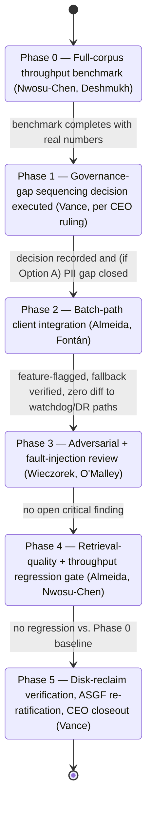
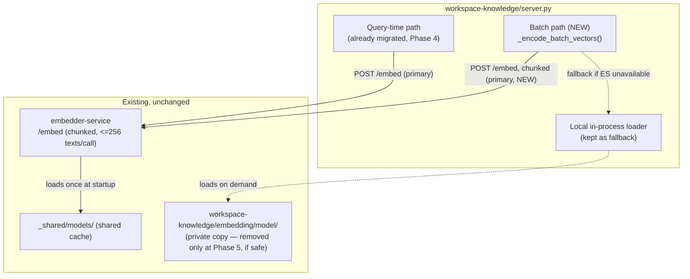

# Implementation Plan — Phase 6: Workspace-Knowledge Batch-Encoding Migration

**Parent report:** `../research-report.md`
**Author:** Dr. Elias Vance, Laboratory Director
**Date:** 2026-08-06
**Status:** Approved 2026-08-06 — CEO delegated full responsibility for this migration to Dr.
Vance and the relevant CC-00 team, applying Dr. Vance's non-binding recommendations on both §2
blocker decisions, and directed use of git worktree isolation and multi-agent development
technique for the implementation phases. Phase 0 complete (real, full-corpus benchmark); Phase 1
in progress. See `implementation-tracking/` for live status.

---

## 1. Authorization

This plan extends the 2026-07-13/14 `embedder-service` build (`2026-07-13-mcp-embedder-service-
redesign/`), whose Phase 4 explicitly and deliberately left `workspace-knowledge`'s batch
index-build/reseed/upsert paths unmigrated (see parent report Finding 2). Unlike that programme,
the CEO has **not yet delegated full responsibility for this specific matter** to Dr. Vance — this
plan therefore presents its blocker decisions (§2) as open questions for CEO review rather than
resolving them under assumed authority. Implementation begins only after the CEO reviews this
plan, decides §2's open questions, and signs off. Nothing here authorizes work to start.

---

## 2. Blocker Decisions — RESOLVED 2026-08-06, applied per CEO sign-off

### 2.1 Governance-gap sequencing — DECIDED: Option B

Two Required-level ASGF gaps from the original `embedder-service` build remain open per
`agent-systems-governance-framework/governance/adr-asgf-001.md`:

- PII scrubbing on the embed path (no owner assigned yet)
- Merge-integration-agent designation for parallel multi-agent builds

This plan's Phase 2 would route additional traffic (batch-encoded workspace file chunks) through
the same embed path the PII-scrubbing gap concerns. Two options:

- **Option A — close first.** Assign an owner and close the PII-scrubbing gap before Phase 2
  begins. Slower, but Phase 6 ships without deepening a known-open Mandatory-adjacent-Required
  gap.
- **Option B — track in parallel.** Proceed with Phase 6 while the gap remains open and tracked,
  consistent with how the original build's Conditional verdict already accepted these two gaps as
  non-blocking for production use.

**Recommendation (non-binding, Dr. Vance's judgment):** Option B — workspace file content is not
materially different in kind from the query text already flowing through the same path today
under the existing Conditional verdict; batch traffic increases volume, not category of exposure.
But this is presented as a recommendation, not a resolution — the CEO decides.

### 2.2 Benchmark-gate placement — DECIDED: hard Phase 0 gate (complete, see below)

Should the full-corpus throughput benchmark (parent report Finding 5) be a hard **Phase 0 gate**
that must clear with real numbers before any client-integration code is written (this plan's
proposal), or can benchmarking run in parallel with early implementation, accepting the risk of
throwing away work if the numbers come back unfavorable?

**Recommendation (non-binding):** Hard Phase 0 gate. Phase 4 already demonstrated what happens
when this benchmark is treated as optional — it was abandoned unfinished and the programme closed
out anyway on a smaller isolated-test substitute. Repeating that pattern here would compound the
same gap rather than closing it.

---

## 3. Architecture (updated 2026-08-06 with real Phase 0 results)

- No new component required. Target state: `workspace-knowledge`'s three batch call sites
  (`_build_or_load_faiss_index`, `_seed_qdrant_collection`, `_upsert_file_to_qdrant`) gain a
  `_encode_batch_vectors()` helper mirroring the existing `_encode_query_vector()` pattern
  (Phase 4, `server.py`) — prefers `embedder-service`, chunks input into ≤256-text groups
  (`MAX_TEXTS_PER_REQUEST`), falls back to the local in-process `SentenceTransformer` per-batch on
  service-unavailable or a runtime call failure.
- **Phase 0 confirmed the batching primitive is sufficient — throughput is on par with local
  (34.0 vs. 34.5 chunks/sec, full real corpus, 3,697 chunks).** No dedicated bulk-mode endpoint is
  needed; the deferred fallback architecture from the original draft is not required.
- **Real design correction from Phase 0, required before Phase 2 is written:** a full 256-chunk
  batch's own server-side encode cost (~7.4s, derived from the measured local rate) is already
  close to `embedder_client`'s default `EMBED_CALL_TIMEOUT_S` (8.0s, tuned for single-query calls)
  before HTTP/JSON overhead is even added — causing 7 of ~15 full batches to time out in the real
  full-corpus run. `_encode_batch_vectors()` **must** call `embedder_client.embed(batch, model=...,
timeout=30.0, expected_dim=768)`, passing the already-existing `timeout` parameter explicitly
  rather than relying on its query-tuned default. This is a one-line correction to an existing
  parameter, not new client code.
- The local in-process loader — and therefore `workspace-knowledge/embedding/model/` itself — is
  kept as an automatic, feature-flagged fallback throughout, exactly as Phase 4 kept it for the
  query path. **The private model copy is not deleted until Phase 5 explicitly verifies it is safe
  to.**
- No change to `_shared/models/`, the shared provisioning convention, or the shared `.venv` / CUDA
  torch requirement (`mcp-servers/CLAUDE.md`) — this plan builds entirely on existing
  infrastructure.

---

## 4. Phased Plan

| Phase | Work                                                                                                                                                           | Owner(s)                                                                      | Gate / Acceptance Criteria                                                                                                                     |
| ----- | -------------------------------------------------------------------------------------------------------------------------------------------------------------- | ----------------------------------------------------------------------------- | ---------------------------------------------------------------------------------------------------------------------------------------------- |
| 0     | Complete the full-corpus (~1,770-file) throughput benchmark Phase 4 abandoned: local CUDA batch encode vs. chunked HTTP batch calls through `embedder-service` | Dr. Amara Nwosu-Chen (methodology + execution), Ravi Deshmukh (infra support) | Benchmark actually completes with real numbers for both paths — not substituted with an isolated sample                                        |
| 1     | Governance-gap sequencing decision executed per CEO's §2.1 ruling                                                                                              | Dr. Vance (interpretation authority once CEO rules)                           | CEO decision recorded; if Option A, PII-scrubbing owner assigned and gap closed before Phase 2 starts                                          |
| 2     | `workspace-knowledge` batch-path client integration behind a feature flag; local loader kept as fallback                                                       | Sofia Almeida (lead), Diego Fontán (pipeline ops)                             | Reuses Kwame Asante's existing bounded-timeout-then-degrade client pattern; zero diff to Qdrant watchdog or disaster-recovery replay path      |
| 3     | Independent adversarial review + fault-injection suite for the new batch call sites                                                                            | Dr. Tomasz Wieczorek (adversarial audit), Connor O'Malley (fault injection)   | No open critical finding; simulated `embedder-service` crash/restart during a batch call degrades cleanly, never blocks or corrupts the index  |
| 4     | Retrieval-quality and throughput regression gate against the Phase 0 benchmark baseline                                                                        | Sofia Almeida, Dr. Nwosu-Chen (comparison review)                             | No retrieval-quality regression (same standard as Phase 4); throughput within an agreed tolerance of the Phase 0 baseline                      |
| 5     | Disk-reclaim verification, private model copy removal, ASGF re-ratification, CEO closeout report                                                               | Dr. Vance                                                                     | `workspace-knowledge/embedding/model/` safely removed and 418.4 MB reclaim independently verified; ASGF verdict re-run against the fixed state |

Rough effort: ~2–3 sessions total, contingent entirely on Phase 0's outcome — if the benchmark
shows chunked-HTTP throughput is unacceptable, Phases 2–5 are re-scoped around extending
`embedder-service` instead (§3), adding roughly one additional session.

Personnel not assigned above (Dr. Idris Farouk, Amina Yusuf — multi-agent-engineering; Mei-Ling
Zhao, Hana Kobayashi — context-engineering) have no workstream in this plan; this is retrieval-
infrastructure migration, not multi-agent orchestration or context-window work.

---

## 5. Personnel Assignments

| Crew Member          | Role in This Work                                                                                   | Reports To (unchanged) |
| -------------------- | --------------------------------------------------------------------------------------------------- | ---------------------- |
| Dr. Elias Vance      | Overall scope owner, Phase 1/5 gate authority, ASGF re-ratification, CEO reporting                  | CEO                    |
| Dr. Amara Nwosu-Chen | Owns the Phase 0 benchmark methodology and execution; Phase 4 comparison review                     | Dr. Vance              |
| Ravi Deshmukh        | Infra support for the Phase 0 benchmark; any `embedder-service` extension if Phase 0 requires one   | Dr. Vance              |
| Sofia Almeida        | Leads the batch-path client migration (Phase 2); owns retrieval-quality regression review (Phase 4) | Dr. Vance              |
| Diego Fontán         | Pipeline-ops support for Phase 2                                                                    | Sofia Almeida          |
| Kwame Asante         | Client-pattern reuse consultation (his existing bounded-timeout-then-degrade design)                | Dr. Vance              |
| Connor O'Malley      | Fault-injection and recovery-path test suite for the new batch call sites                           | Kwame Asante           |
| Dr. Tomasz Wieczorek | Independent adversarial evaluation of the new batch-path integration                                | Dr. Vance              |

Assignments stay within each member's documented authority scope and existing reporting lines,
per `crew/CLAUDE.md` § Authority Scope — no cross-module authority is granted beyond what each
profile already holds.

---

## 6. Progress Tracking

Same convention as the parent programme: `progress.md`, `session-log.md`, and `checkpoint.json`
will be created under this investigation's own
`core-component-00/telescope/2026-08-06-workspace-knowledge-batch-encoding-migration/supporting/
implementation-tracking/` folder — **only once Phase 0 actually begins**, not before, per
`.claude/rules/workspace-conventions.md` § Context and Session Management. The parent programme's
own cautionary lesson applies here too: its progress record was compiled retroactively rather than
kept live during execution, logged there as a process violation — this plan commits to live
updates instead.

---

## 7. Risks Carried Forward (from parent report)

- The chunked-HTTP-batch approach is a reasoned bet that `embedder-service`'s existing `/embed`
  contract is sufficient, not a proven one — Phase 0 is the first real test of that assumption.
- Routing batch traffic through the shared embed path deepens exposure on the open PII-scrubbing
  gap regardless of which way §2.1 is decided, unless Option A is chosen.
- A long-running single HTTP call has different failure characteristics than the many short calls
  `embedder-service`'s idle-timeout model was built and tuned around — needs explicit verification
  under Phase 3's fault-injection suite, not assumed to transfer cleanly from the query-path
  precedent.

---

## 8. UML Diagrams

### 8.1 State Diagram — phased plan (§4 gates)

### 8.2 Component Diagram — target architecture

---

## 9. Sign-off Requested

This plan is presented for CEO review. Two open blocker decisions (§2.1, §2.2) require an explicit
CEO ruling before Phase 0 begins. On approval and those rulings, Phase 0 begins immediately. No
implementation work starts before that sign-off.
