# Casual Games Studio

Dedicated mobile game studio within the organization — focused on casual mini-games using the Unity game engine.

## Structure

```
casual-games/
├── library/                    # Reference documentation
│   ├── overview/               # Studio charter, strategic brief, C-suite assessments
│   ├── topics/                 # Cross-cutting strategies (assets, security, etc.)
│   └── reference/              # External resources and link collections (Unity, architecture, testing, etc.)
├── pipeline/                   # Game studio development workflow
│   ├── casual-games-pipeline.md  # 11-stage pipeline (Stage 0–10)
│   └── templates/              # Stage and monitoring templates
│       ├── agent-behavioral-constraints.md   # ASE L1: forbidden behaviours binding on all studio agents
│       ├── monitoring/         # ASE compliance monitoring suite
│       │   ├── progress.md                   # Real-time stage state
│       │   ├── session-log.md                # Audit trail
│       │   ├── checkpoint.json               # Machine-readable milestones
│       │   ├── stage-transition-summary.md   # CC-00 handoff-tier-aware gate summary
│       │   ├── kill-gate-report.md           # Kill gate decision package for User
│       │   ├── mvc-context-profile.md        # ASE L2: four-slot token budget per stage
│       │   ├── harness-config.md             # ASE L3: timeout, retry, PII, tool registry
│       │   ├── adr-ase-001.md                # ASE governance adoption (L4 exception documented)
│       │   ├── stage-transition-schemas.md   # ASE L5: JSON schema contracts for all kill gates
│       │   ├── inter-agent-communication-protocol.md  # ASE L5: message formats, routing, git worktree
│       │   ├── knowledge-transfer-protocol.md         # ASE L2/L4: 3-tier knowledge model
│       │   ├── schema-validation-spec.md     # ASE L3: automated gate validation rules
│       │   └── rag-integration-blueprint.md  # ASE L4: intentional-absence rationale + trigger conditions
│       ├── stage-1-concept/    # GDD-TEMPLATE · PRD-TEMPLATE · SRD-TEMPLATE
│       ├── stage-2-prototype/  # PROTOTYPE-BUILD-CHECKLIST · GDS-TEMPLATE
│       ├── stage-3-vertical-slice/  # ADR-GAME-ARCHITECTURE · TSD · VERTICAL-SLICE-CRITERIA
│       ├── stage-4-production-planning/  # PRODUCTION-PLAN · GANTT-TEMPLATE · RISK-REGISTER
│       ├── stage-6-testing/    # TEST-PLAN · TEST-RESULTS-REPORT
│       ├── stage-7-soft-launch-prep/  # SOFT-LAUNCH-CHECKLIST
│       ├── stage-8-soft-launch/  # SOFT-LAUNCH-REPORT · MARKET-TIER-CRITERIA
│       ├── stage-9-global-launch/  # GLOBAL-LAUNCH-READINESS-CHECKLIST
│       └── stage-10-live-ops/  # QBR-REPORT.md
├── team/                       # Personnel and crew profiles
│   └── crew/                   # All 38 FTEs + 1 Contract — profiles, skills, pipeline artifacts
└── projects/                   # Individual game projects
```

## Key Documents

| Document            | Location                                                         | Description                                                                                                                                                                                                                                                                                                                                                                 |
| ------------------- | ---------------------------------------------------------------- | --------------------------------------------------------------------------------------------------------------------------------------------------------------------------------------------------------------------------------------------------------------------------------------------------------------------------------------------------------------------------- |
| **Strategic Brief** | `library/overview/casual-games-studio.md`                        | C-suite assessment — product, technical, design, security, and organizational perspectives                                                                                                                                                                                                                                                                                  |
| **Asset Strategy**  | `library/topics/game-asset-strategy.md`                          | Free, commercially-licensed asset sourcing framework — SBOM, security review, visual coherence                                                                                                                                                                                                                                                                              |
| **Pipeline**        | `pipeline/casual-games-pipeline.md`                              | Complete game studio workflow — 11 stages from art direction through live ops                                                                                                                                                                                                                                                                                               |
| **Monitoring**      | `pipeline/templates/monitoring/`                                 | Full ASE compliance suite: `progress.md`, `session-log.md`, `checkpoint.json`, `stage-transition-summary.md`, `kill-gate-report.md`, `mvc-context-profile.md`, `harness-config.md`, `adr-ase-001.md`, `stage-transition-schemas.md`, `inter-agent-communication-protocol.md`, `knowledge-transfer-protocol.md`, `schema-validation-spec.md`, `rag-integration-blueprint.md` |
| **Stage Templates** | `pipeline/templates/stage-1-concept/` → `stage-9-global-launch/` | 17 artifact templates covering all pipeline stages before Live Ops                                                                                                                                                                                                                                                                                                          |
| **Live Ops**        | `pipeline/templates/stage-10-live-ops/`                          | `QBR-REPORT.md` — quarterly business review with sunset/maintenance/full-investment routing                                                                                                                                                                                                                                                                                 |

## Crew Hierarchy

The diagram below shows all 39 crew members (38 FTE + 1 Contract) organised by division and reporting line.

```mermaid
flowchart TD
    SD["Dr. Marcus Vogel\nStudio Director"]

    SD --> CD["Sakura Ishimori\nCreative Director"]
    SD --> EP["James Okonkwo\nExecutive Producer"]
    SD --> AD["Renaud Leclercq\nArt Director"]
    SD --> SDir["Hiroshi Nakamura\nComposer · Sound Director"]
    SD --> LQA["Amara Osei\nLead QA Engineer"]
    SD --> LOL["Aisha Nkemelu\nLive Ops Lead"]

    subgraph CreativeDesign["🎮 Creative-Design Division"]
        CD --> LGD["Mei Watanabe\nLead Game Designer"]
        CD --> SGD["Lisa Henderson\nSenior Game Designer"]
        CD --> LD["Marcus Thompson\nLevel Designer"]
        CD --> ED["Kwame Asante\nEconomy Designer"]
        CD --> UXW["Sarah Chen\nUX Writer"]
    end

    subgraph Production["📋 Production Division"]
        EP --> PR["James Mitchell\nProducer"]
        PR --> AP["Lena Müller\nAssociate Producer"]
    end

    subgraph Art["🎨 Art Division"]
        AD --> A1["Anya Petrova\n3D Artist"]
        AD --> A2["Tomasz Kowalski\n3D Artist"]
        AD --> A3["Elena Morozova\nUI Visual Artist"]
        AD --> A4["Marco Bellini\nMotion UI Animator"]
        AD --> A5["Javier Moreno\nVFX Artist"]
        AD --> A6["Lena Kovac\nTechnical Artist"]
    end

    subgraph Audio["🎵 Audio Division"]
        SDir --> Aud["Kenji Takahashi\nAudio Designer"]
    end

    subgraph Engineering["⚙️ Engineering Division"]
        LQA --> SGE["Dmitri Volkov\nSenior Game Engineer"]
        LQA --> SGPE1["Amara Okafor\nSenior Gameplay Engineer"]
        LQA --> SGPE2["Kaelen Reeves\nSenior Gameplay Engineer"]
        LQA --> GPE1["Ryu Tanaka\nGameplay Engineer"]
        LQA --> GPE2["Sofia Martinez\nGameplay Engineer"]
        LQA --> SDET1["Amir Hassan\nSDET Gameplay"]
        LQA --> SDET2["Lin Zhang\nSDET Gameplay"]
        LQA --> SDET3["Priya Subramanian\nSDET Performance"]
        LQA --> EngGrp(["Backend · Senior Backend\nEngine · Senior Engine\nRendering Engineers"])
    end

    subgraph LiveOps["📊 Live Ops Division"]
        LOL --> LOE1["David Okafor\nLive Ops Engineer"]
        LOL --> LOE2["Sofia Reyes\nLive Ops Engineer"]
        LOL --> DA["Yuki Tanaka\nData Analyst"]
        LOL --> UA["Rafael Santos\nUA Specialist"]
    end
```



> Full crew profiles and skill files: [`team/crew/`](team/crew/)

---

## Pipeline Quick Reference

| Stage | Name                        | User Approval? |
| ----- | --------------------------- | -------------- |
| 0     | Art Direction + Style Guide | ❌             |
| 1     | Concept (GDD + PRD + SRD)   | ✅             |
| 2     | Prototype (Playable + GDS)  | ✅             |
| 3     | Vertical Slice              | ✅             |
| 4     | Production Planning         | ✅             |
| 5     | Full Production             | ❌             |
| 6     | **Automated Testing**       | ✅             |
| 7     | Soft Launch Prep            | ✅             |
| 8     | Soft Launch                 | ✅             |
| 9     | Global Launch Readiness     | ✅             |
| 10    | Live Ops (continuous)       | QBR review     |

## Recruitment Status

**All 38 FTEs + 1 Contract hired. Full 9-stage pipeline compliance across all phases. Studio is ready to begin Stage 0 (Art Direction).**
